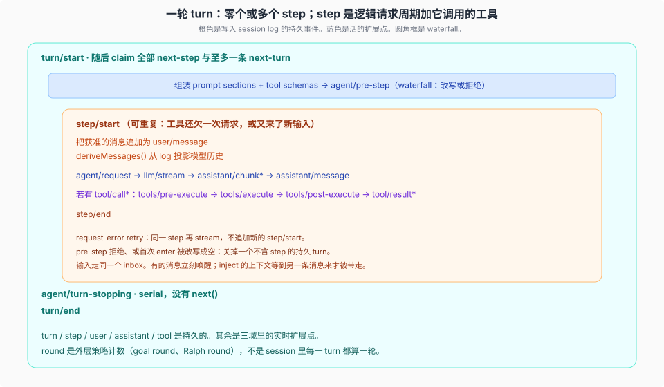
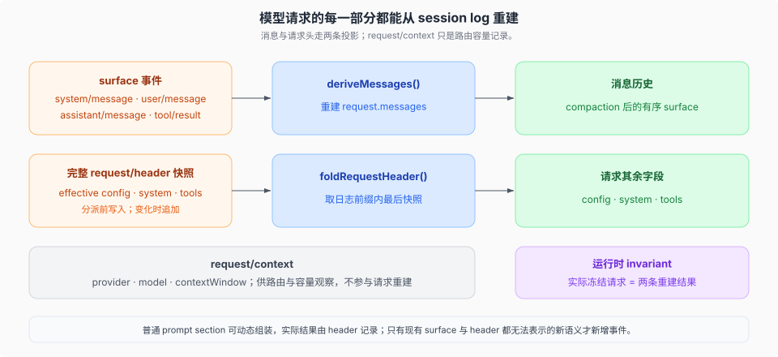
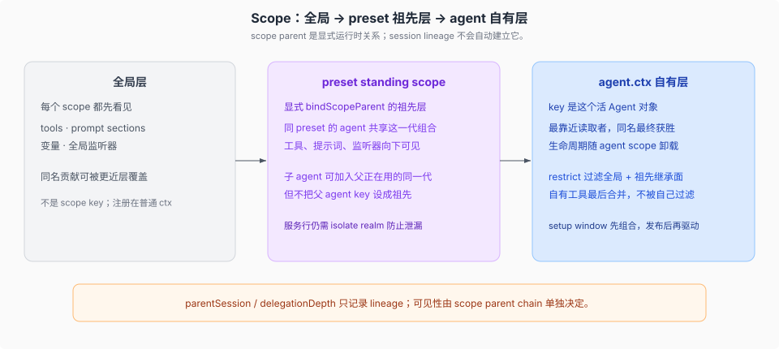

# Session and loop · 会话与驱动

产品源码基线：`fb2c4b9e69`（`dsh-v0.1.5-rc.2`）；本专题结论与该 commit 的项目树一致，跨度对照的 OLD 侧为 `a66e470204`（`0.1.2-rc.1`），`rc.1` → `rc.2` 的增量见 [`_change_log/0007`](../_change_log/0007-0.1.5-rc.1-to-0.1.5-rc.2.md)。

## 一句话

**session log 是模型请求的可重建来源。** `agent-loop` 只是默认驱动，实现 `Agent` 接口。UI、hook、工具插件依赖 `dsh-agent`，不依赖具体 loop。

**模型可见 ⟺ 已记录。** 消息从 surface 事件投影；生效的模型配置、system 和 tools 在分派前写入完整的 `request/header` 快照。

## 一轮对话长什么样

词汇先分开（正式定义在 [`docs/glossary.md`](../../docs/glossary.md)）：

| 词 | 含义 |
|----|------|
| **turn** | 一次把获准输入抽干。模型与工具都停了，或策略终止，这一轮结束。 |
| **step** | 一次逻辑模型请求周期，加上它调用的工具。`agent/request-error` 重试可在同一 step 内再次流式请求。一个 turn 里可以有 0 个或多个 step。 |
| **round** | 外层策略计数，例如 goal round、Ralph round。不是 session 里每一 turn 都算。 |

读这张图时抓住三件事：

1. **橙色是持久的。** `turn/*`、`step/*`、`system/message`、`user/message`、`assistant/*`、`tool/*` 写入 log，reload / fork / 回放都靠它们。
2. **蓝色是活的扩展点。** `agent/pre-step`、`agent/request`、`llm/stream`、三条 `tools/*` 是 waterfall；`next()` 委托下游，拥有最终决定的监听器可以直接返回并短路。`agent/turn-stopping` 是 serial，没有 `next()`；需要继续时由监听器 `agent.steer()`。
3. **拒绝也记一笔。** `pre-step` 拒绝、或首次 enter 被改写成空，仍关掉一个不含 step 的持久 turn。日志记录这次尝试。

输入走**同一个 inbox**。有的消息立刻唤醒驱动器；`agent.inject()` 放进去的上下文会等，直到另一条消息把它带走。

## 模型可见即已记录

这条不变量决定了模型请求各部分如何落日志：

- 对话内容用 `agent.inject()` 或其它消息入口；获准后写成 surface `user/message`。
- prompt section、tool schema 和模型配置可以在请求前动态组装；loop 把 system prompt 写成 `system/message` 节点，把 config、adapterDefaults 与 tools 写入 `request/header`，然后才分派。
- 只有现有 surface 与 `request/header` 都无法表达的新语义，才需要扩展 `SessionEventMap` 并补上对应的重建规则。

`deriveMessages()` 只从当前有序 surface 投影消息历史；`request/header` 单独重建 config、adapterDefaults 与 tools，system prompt 是 surface 节点 `system/message`。`request/context` 只记录 provider、model、context window 与 `systemPromptUpdate` 能力，不参与请求重建。完整记录不等于全部发送：compaction 在仅追加日志中保留旧事件，只让 replacement 在后续消息投影中遮蔽旧 surface。每次模型尝试的逐 chunk 时序作为内嵌 `stream` 留在它的结算事件里（`assistant/message` 或 `assistant/attempt`），当前格式不再有顶层 chunk 事件。精确折叠规则见 [`01-session-event-map.md`](./01-session-event-map.md#完整记录不等于完整发送)。

fork、resume、transcript、遥测、持久化（JSONL-only）都从这一条流派生；持久化按格式世代寻址，更旧的 log 在打开时经相邻链迁移到当前写者版本，机制见 [`04-格式世代与迁移.md`](./04-格式世代与迁移.md)。所以 loop 可以换：只要新驱动仍往同一条 log 写、仍发同一类 `session/event`，渲染面可以不动。

> **持久化后端与格式世代**：SQLite 后端已由 **#3339**（`4553c9d957`）删除，session 持久化只剩 JSONL：`session-persistence-sqlite` 不再存在，`session-persistence-jsonl` 承担全部持久化职责（注意 #2698 是格式迁移 PR，当时仍在改 SQLite，不要把它记成删除者）。zstd 后端拥有拼接多帧容器，以支持追加与批量恢复（`packages/session/session-persistence-jsonl/src/zstd.ts:2-3`）。格式侧不再是一道拒收闸：`SESSION_FORMAT_VERSION` 是唯一手维护的写者权威（当前为 3），`packages/session/session-format*` 的 build-static catalog 提供从最早支持世代到 current 的完整相邻链；只对**更新**版本拒收并给出「升级 harness」的方向，**更旧**版本走迁移，跨历史格式边时未知事件比同版本读更严。世代、权威与读准备/写发布时序见 [`04-格式世代与迁移.md`](./04-格式世代与迁移.md)。

> **ToolCallId 重命名**：上游 #2731 将 `CallId` 统一重命名为 `ToolCallId`（`llm`、`session` 及相关包）。事件字段和类型名已更新，不影响语义。

## Projection 必须化

上游 #2774 和 #2742 将 session projection 从可选机制变为强制要求：

- 每个 projection 定义必须实现 `init(header: SessionHeader, inheritedEventCount: SessionLogOffset)` 方法（`packages/session/session-projection/src/index.ts:62,143`；`header` 仍是 session 的不可变元数据），不再允许无参 `init()`。`inheritedEventCount` 决定 fork/resume 时投影从哪条 seq 起算自有事件（与 `ownEvents()` 的种子前缀切分一致）
- 视图发布使用 `Object.is` 比较：两次 fold 结果若引用相同则跳过发布，避免无效 UI 更新（`packages/session/session-projection/src/index.ts:66,78,96,186`）
- projection 不是夹在 `session` 与 `session-persistence` 之间的一层：`session-projection` 与 `session-persistence` 之间没有依赖边（前者 peer 只有 `cordis` + `dsh-session`，后者 peer 是 `cordis` + `dsh-brand` + `dsh-session` + `dsh-timeout`），`packages/session/README.md` 的包序也是 persistence 在前、projection 在后。它是**可选注册表**：host 侧插件声明 projection unit，读方（host behavior / subagent catalog）必须自己拒绝缺失的注册表或键，否则「读投影状态却不激活该状态」就会静默发生（[`2026-08-19-session-projection-mandatory-seam`](../../.agents/notes/implemented/architecture/2026-08-19-session-projection-mandatory-seam.md)）；强制点因此在消费者一侧，不在包依赖上

## 每个 agent 的 scope chain

- 注册表先读**全局层**，再按 scope parent chain 从最远祖先读到当前 agent；离 agent 最近的同名注册获胜。
- Agent preset 是显式祖先层：standing composition 的工具、提示词和监听器对加入它的 agent 可见。子 agent 可以加入父 agent 正在使用的同一 preset generation，但不会因此继承父 agent 自有层的注册。
- `parentSession` / `delegationDepth` 是持久 lineage 数据，不会自动建立 scope parent；可见性只由 `bindScopeParent` 的运行时关系决定。
- **restrict**：沿 chain 的 restriction 取交集，过滤全局与祖先贡献；当前 agent 自有层的注册最后合并，不受自己的继承面过滤。被过滤的工具在提示词和执行中都表现为不存在。
- **setup window**：agent 对象已经有了、但还没发布、还没 `agent/session-start`。这里只注册，不驱动。preset 给**一个 session** 另一套能力，其中的服务行需要 `isolate` realm。

## 源码入口

| 路径 | `ctx` key | 角色 |
|------|-----------|------|
| `packages/core/session/` | `ctx.sessions` | 仅追加的 log + 内存 store |
| `packages/core/agent/` | `ctx.agents` | `Agent` 接口、活注册表、`agent/*` |
| `packages/core/agent-loop/` | `ctx.agentLoop` | 默认驱动 |
| `packages/core/scope/` | （库） | per-agent 注册原语 |
| `packages/preset/` | | 从 preset `cordis.yml` 组合 |
| `packages/session/` | 持久化 seam | JSONL、projection、title、格式包组与世代迁移 |
| [`docs/agent-lifecycle.md`](../../docs/agent-lifecycle.md) | | 官方时序图 |
| [`docs/subsystems/session.md`](../../docs/subsystems/session.md) | | session 语义 |
| [`docs/subsystems/scope.md`](../../docs/subsystems/scope.md) | | scope 语义 |
| [`docs/subsystems/core.md`](../../docs/subsystems/core.md) | | Agent handle、取消与恢复 |

## 机制级正文

| 文件 | 内容 |
|------|------|
| [`01-session-event-map.md`](./01-session-event-map.md) | 信封、surface 四类、required-on-read 与 ignorable |
| [`02-inbox-与turn-时序.md`](./02-inbox-与turn-时序.md) | followup / steer / inject；claim；拒绝仍关 turn；settlement 与 `system/message` |
| [`03-换loop的半径.md`](./03-换loop的半径.md) | `AgentFactory`、日志与事件义务、默认组合替换点 |
| [`04-格式世代与迁移.md`](./04-格式世代与迁移.md) | 四个世代、相邻迁移链、权威与门禁、读方向与读准备/写发布 |

下一专题：[`../capability-seams/00-map.md`](../capability-seams/00-map.md) 或 [`../tools-prompt-llm/00-map.md`](../tools-prompt-llm/00-map.md)。
