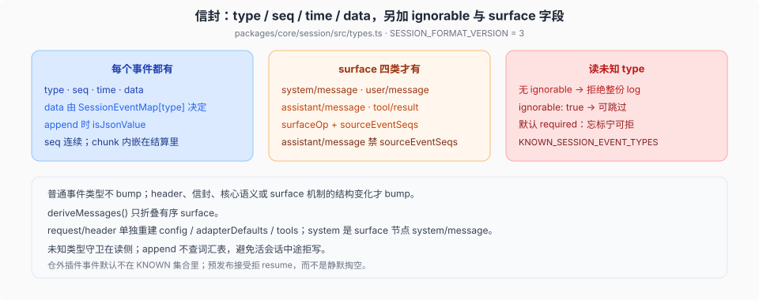

# SessionEventMap、required-on-read 与版本

源码核验入口：`packages/core/session/src/types.ts`、`known-event-types.ts`、`packages/session/session-format`、`session-format-catalog`、`session-format-v0-to-v1`/`-v1-to-v2`/`-v2-to-v3`、`docs/session-format-status.md`、`.agents/notes/implemented/architecture/2026-08-31-released-session-format-migrations.md`。

本篇说明事件信封、四种 surface 事件、未知类型的读时拒绝，以及 `SESSION_FORMAT_VERSION` 的递增条件。

## 一份 log 是什么

`SessionEventMap` 是可合并的、仅追加的交互源。消息历史从它投影，不另存一份 `messages[]`。每个事件是无损 JSON；`seq` 连续。`assistant/message` 与 `assistant/attempt` 内嵌其精确 compact 原始流（`stream`），持久化每个尝试存一份耐久 settlement。

> **事件 seq 与日志 offset 分型**：`SessionSeq` 命名一条已存在的事件，`SessionLogOffset` 命名空隙/前缀长/读切。信封 `seq`、surface 替换端点与 `sourceEventSeqs` 用 `SessionSeq`；`Session.seq`、`firstLiveSeq` 与正文读偏移用 `SessionLogOffset`（[`2026-08-31-session-sequence-and-log-offset-brands`](../../.agents/notes/archived/architecture/2026-08-31-session-sequence-and-log-offset-brands.md)）。digest 里「seq 连续」指事件身份，与日志物理偏移无关。

核心地图（插件用 `declare module '@deepseek-ai/dsh-session/types'` 往里加键）里，loop 自己写的是（标注了写者的两行除外）：

| type | 进 `deriveMessages`？ |
|------|------------------------|
| `turn/start` · `turn/end` | 否（边界） |
| `step/start` · `step/end` | 否 |
| `system/message` | 是（surface；system prompt 节点 0，空 head 记录「无 system prompt」） |
| `user/message` | 是（surface） |
| `assistant/message` | 是（surface；内嵌 `stream` 与 `usage`；空 content 派生为 null；可带 `interrupted: true`） |
| `assistant/attempt` | 否（未落 surface 的失败/重试/取消/流错误尝试，内嵌 `stream`） |
| `tool/call` | 否 |
| `tool/result` | 是（surface） |
| `request/header` | 否（单独重建 config 与 tools） |
| `request/context` | 否（只记录 provider、model 与 context window） |
| `todo/write` | 否（log-only UI；非 loop 写——`packages/todo/tool-todo/src/index.ts:210`） |
| `session/end-seed` | 否（种子与 live 的分界；非 loop 写——Session 构造器是唯一合法写者，`packages/core/session/src/types.ts:389-391`） |
| `deliverables/presented` | 否（记录该 turn 声明为交付物的 workspace 文件；非 loop 写——`packages/fs/tool-present/src/index.ts:99-107`） |

`SurfaceEventType` 有四种：`system/message`、`user/message`、`assistant/message`、`tool/result`。只有它们可以带 `surfaceOp` / `sourceEventSeqs`。编译器在 `Session.append` 调用点强制：log-only 事件不许带 surface 字段。

`surfaceOp`：`'append'` 接到尾巴；`{ op: 'replace', startSeq, endSeq }` 换掉一段有序 surface（compaction 用）。replace 节点的 `sourceEventSeqs` 必须覆盖被挡住的每一个 surface 节点。

## required-on-read

信封上的 `ignorable?: true`。缺省 = **required**。读者碰到不认识的 `type`：

- 没有标记 → 拒绝重建整份会话。未识别的 required 事件可能改变其余 log 怎么读（`session/end-seed` 是现成例子）。
- `ignorable: true` → 可以跳过。写者只给「丢了也不影响重建」的信息性记录打这个标。

默认 required：忘了标记会**过度拒绝**（不方便）；默认 ignorable 会**静默掏空**再 resume（安全事故）。模型请求的消息由四个 surface 类型投影（含 system prompt），config 与 tools 由 `request/header` 折叠；`request/context` 不参与请求重建。真正危险的未知量是那些改变怎么读其余 log 的非 surface 事件。

已知集合是生成的 `KNOWN_SESSION_EVENT_TYPES`（`gen-persistence-catalog` 扫本仓库每一次 `SessionEventMap` 合并）。同一版本、不同插件组合，读规则仍一致。仓外插件事件按构造不在表里；预发布接受「第一方读者拒 resume」，且拒绝是大声的。

守卫在**读**侧。`append` 不查词汇表：活会话中途拒写，比下次加载时大声拒绝代价更大。

## 持久化与格式迁移

当前持久化使用 JSONL-only。`session-persistence-jsonl` 使用 zstd 拼接多帧容器压缩，以支持追加与批量恢复（`packages/session/session-persistence-jsonl/src/zstd.ts:2-3`）。`session-persistence-sqlite` 不存在。

`SESSION_FORMAT_VERSION = 3`（`packages/core/session/src/types.ts:88`）。历史版本走完整的相邻流式迁移框架：`packages/session/session-format` 定义类型，`session-format-catalog` 提供构建期物理 codec 与迁移链调度，`session-format-v0-to-v1`、`session-format-v1-to-v2`、`session-format-v2-to-v3` 各实现一个不可变迁移。header-only 读取只分类（`current` / `migration-required` / `unsupported` / `malformed`）；event-body 读取组合相邻链，并只发布当前代后才构造 `Session`。权威文档 [`docs/session-format-status.md`](../../docs/session-format-status.md)，cookbook [`docs/cookbook/adding-a-session-format-version.md`](../../docs/cookbook/adding-a-session-format-version.md)。

## `SESSION_FORMAT_VERSION` 的递增条件

一个单调整数，没有 major/minor。**写者决定 bump**，不是「新读者能吞什么」。只有旧运行时无法对**新** log 做语义正确的读时才 bump。「解析不报错」不够：静默跳过会塑造重建的内容，就是错读。够格的是结构变化：header 形状、信封、核心事件语义、surface 机制（`SurfaceEventType` 集合、`SurfaceOp` 变体）。**加一个普通事件类型不 bump**——那是 `ignorable` 的工作。拿不准就 bump。

当前后端只把 `SESSION_FORMAT_VERSION = 3` 当作写代。版本更高的 log 在 header 分类时抛 `SessionFormatUnsupportedError`，提示该 log 由更新的 harness 写入；受支持的历史 v0/v1/v2 header 走迁移而非拒载。带 `seedLength` 的 v0/v1 物理 header 在 codec 中翻译为 `isSeeded` + 继承事件数；逻辑 `SessionHeader` 仍拒绝 `seedLength`（`packages/core/session/src/index.ts:97-98`），`assertNoRetiredHeaderFields`（`packages/session/session-persistence-jsonl/src/format.ts:104-109`）拒绝已退休的 policy 字段。原始历史 log 保留在磁盘上供检查。

## 完整记录不等于完整发送

原始 session log 仅追加，记录完整的耐久事实；下一次模型请求使用的消息则是当前有序 surface 的投影。compaction 会追加 summary 和 replacement 事件，`surfaceOp: replace` 只让被覆盖的 surface 节点退出后续 `deriveMessages()` 结果，不会从 raw log 删除旧事件。持久化、审计和精确回放因而仍能读取完整历史，模型则只接收当前投影。

`Session.deriveMessages()` 只折叠有序 surface 节点。返回的数组每次是新的；里面的 `Message` 对象共享且深冻结。`assistant/message` 内嵌其精确 provider 流（`stream`），不引用顶层 source 事件；投影本身不用原始流。

人看的 transcript 不是同一份投影：UI 常用 **append-origin** 的 surface 事件；`deriveMessages()` 走 compaction `replace` 之后的有序 surface。像素级回放读 `assistant/message` 内嵌的 stream；模型下一请求读 assembled message。

两套「source」不要混：`sourceEventSeqs` 是 log 里更早事件的 seq；`UserMessage.source` 是语义来源（`user` / `plugin` / …），不参与 surface fold。

对话内容必须成为 surface；`inject` 和 runtime-context 快照最终都写成 `user/message`。system prompt 写成 surface 的 `system/message`（节点 0）；tool schema 与模型配置在分派前进入完整的 `request/header`，无需为每个 section 新增事件类型。只有现有 surface 与 header 都无法表达的新语义，才扩展 `SessionEventMap` 和相应的重建规则。
