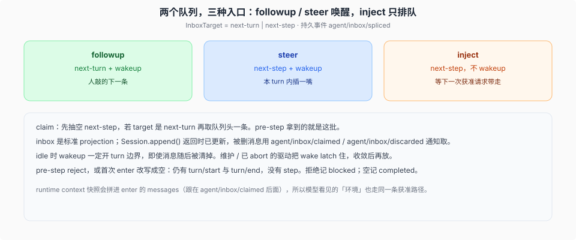

# Inbox、唤醒与 turn 时序

> 基线 `47f943859bef60e4160492346772ded9b24f765a`。`packages/core/agent/src/inbox.ts`、`packages/core/agent/src/runtime-types.ts`、`packages/core/agent-loop/src/agent.ts` `ReactLoopAgent`。

介绍篇的 turn 骨架图在 architecture 里。这篇对到默认驱动里的队列、claim、`pre-step` 拒绝仍关 turn。



## 两个列表，一份持久 splice

`InboxTarget`：`'next-turn'` | `'next-step'`。内存投影从 log 里 `session.header.seedLength` 之后的 `agent/inbox/spliced` 重放。种子里的 splice 不算进这个 agent 生命周期的队列。

`splice` **先** `session.append('agent/inbox/spliced', …)`，再改投影。同步的 `session/event` 观察者看到的是 splice **前**的列表，可以用归一化坐标找回被删的消息。

`claim(target, turn)`：抽空 `next-step`；若 `target === 'next-turn'` 再取 `next-turn` 的头一条。返回值按这个顺序。loop 的 step 边界操作，不是插件扩展点。

## 三个公开入口

`ReactLoopAgent.send(message, target, wakeup)`：

| 方法 | target | wakeup | 典型用途 |
|------|--------|--------|----------|
| `followup` | `next-turn` | true | 人的下一条，开新 turn |
| `steer` | `next-step` | true | 本 turn 内插话，下一步带走 |
| `inject` | `next-step` | false | 文件变更、AGENTS.md、skill……等下一次获准请求 |

唤醒输入不能加入已经 abort 的活动：若 `wakeup &&` 当前非 idle 且 abort 已触发，target 改成 `next-turn`。这个分类在插入**之前**拍板，以免 splice 观察者里的可重入 cancel 把它改类。

idle 时 wakeup **一定**开 turn 边界，即使消息随后被清掉。只有 latch 住的重放会在队列不再持有 wake 时被抑制。维护中或已 abort 的驱动把 `wakeRequested` latch 住，收敛后再 `wakeDriver`。`disposed` 原因不 latch，teardown 不等模型 turn。

`cancel({ keepInbox })`：默认 `inbox.clear()`（先 next-step 再 next-turn）。`keepInbox` 只 abort 活动，不记 canceled splice。

## `turn()` 里实际发生的事

1. `session.append('turn/start', { turn })` —— 在 claim 和 pre-step **之前**。所以拒绝也有打开的 turn。
2. `preStep`：`claim` → `systemPrompt.assemble` → 把 runtime context 快照拼进消息 → `waterfall('agent/pre-step')`。inner 默认 `{ kind: 'enter', messages: claimed + context? }`。
3. `reject` → `turnEnds = { kind: 'blocked' }`，没有 step。
4. 首次 step 且 `messages.length === 0`（唤醒消息被拿掉，或 enter 被改写成空）→ `completed`，仍无 step。
5. 否则 `step/start`，逐条 `user/message`（`surfaceOp: 'append'`），再 `step()`。
6. 工具还欠一次请求，或 `next-step` 又有货 → 下一 step 的 target 是 `next-step`。
7. 该停时 `serial('agent/turn-stopping')`（没有 `next()`）。
8. `finally` 里 `turn/end`。loop **不等** turn 边界上的 flush；checkpoint 策略另挂。

`turn/end` 的 `interrupted` 只给持久化后端关崩溃孤儿 turn；loop 从不发这个标记。

## `step()` 与历史

`buildRequest(..., this.session.deriveMessages(), ...)`。流：

```text
llm.stream / preparedCall.stream
  每个 chunk → append assistant/chunk，记下 seq
  BlockAssembler.push
assembler.finish
  error/aborted → waterfall agent/request-error；retry 则同一 step 再来，不新开 step
  否则 createAssistantMessage → assistant/message（surfaceOp append，sourceEventSeqs = chunk seqs）
  max-tokens → 该 step 结束，turn 上 sticky
  无 tool-call → completed
  有 → executeToolCalls；可往 next-step splice 上下文
```

请求头：`request/header` 在 dispatch 前写入。最新一份重建 config / system / tools。`request/context` 只在路由或容量变时写，不参与 header 相等。

## 和介绍图的一处对齐

architecture 写「claim next-step 加上一条排队消息」。源码是：第一步 `target = 'next-turn'`（抽空 next-step **并且**取一条 next-turn）；后续 step 只 claim next-step。inject 的材料若在第一步之前就已经在 next-step 里，会和这条 followup **同一 step** 进入模型。
