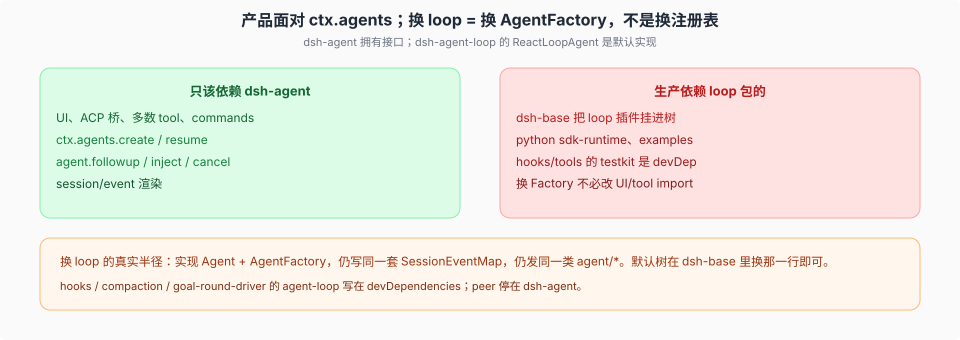

# `dsh-agent` 与 `dsh-agent-loop`：换 loop 的半径

> 基线 `47f943859bef60e4160492346772ded9b24f765a`。`packages/core/agent/src/index.ts` `AgentRegistry` / `AgentFactory`、`packages/core/agent/src/runtime-types.ts` `Agent`、`packages/core/agent-loop/src/agent.ts` `ReactLoopAgent`、`packages/core/agent-loop/src/index.ts` `AgentLoop`。

介绍篇写 UI / hook / 工具依赖 `dsh-agent`，不依赖具体 loop。对照 `package.json` 之后，这条作为**运行时合同**成立：那些包的 peer 停在 `dsh-agent`，`dsh-agent-loop` 多半只在测试里。

## 接口在 agent，驱动在 loop

`ctx.agents` 是 `AgentRegistry`（`dsh-agent`）。它跟踪活着的 agent，做 process-local initiator（`AsyncLocalStorage`），**不**实现 turn。创建委托给 `AgentFactory`：

- `createAgent(ownerCtx, options)` — 调用方提供 `sessionId`；setup 窗口 → commit → 登记 session 与 agent → `agent/session-start` → 才启动驱动。
- `resume(ownerCtx, options)` — 先 `sessionPersistence.prepare`。

loop 插件（`AgentLoop`）构造时 `setFactory(this)`。没有 factory：`no agent factory registered (load an agent-loop plugin)`。ACP 等消费者对着 `ctx.agents` 编程，package 依赖写 `dsh-agent`。

`Agent` 句柄（loop 必须实现）包括：`id` / `options` / `session` / `inbox` / `status` / `ctx`，以及 `followup` / `steer` / `inject` / `cancel` / `runMaintenance` / `whenIdle`。`agent.ctx` 是 `createScope(loopCtx, this)` 之后 `extend({ agent: this })`。scope key 就是这个活对象；没有树状继承。

## setup 窗口

`CreateAgentOptions.setup` 在 agent **未发布**时跑。这里只注册（preset 的 isolate 服务行、scoped 工具），不 `followup`。失败则回滚：已经发出去的 `agent` / `session` 创建通知，会有配对的 `agent/disposed` / `session/disposed`。

`ownerCtx` 是 `create()` 调用方的 fiber，不是 factory 自己的注册 ctx。所有权跟调用方走。

## 换 loop 要保住什么

新驱动只要：

1. 实现 `Agent` + `AgentFactory`，`setFactory`。
2. 仍往同一条 session log 写（同一套 `SessionEventMap` 核心键，同一 surface 规则）。
3. 仍发同一类活扩展点：`agent/pre-step`（waterfall）、`agent/turn-stopping`（serial）、`agent/request`、`agent/status`、inbox 通知。
4. `deriveMessages()` 仍是请求历史的唯一来源。

渲染面、多数 tool、`ctx.commands` 可以不动。`ReactLoopAgent` 私有的 `kick` / `turn` / `step` 不必出现在公开 `Agent` 上。

## 今天谁真的依赖 loop 包

`dsh-base` 把 `@deepseek-ai/dsh-agent-loop` 写进 **dependencies** 并挂进默认树——换 loop 至少要 patch 掉这一行。`python/sdk-runtime` 和若干 `examples/` 同样生产依赖它。

hooks、compaction、`goal-round-driver`、多数 tool 的 **`dsh-agent-loop` / testkit 在 `devDependencies`**。peer 停在 `dsh-agent`。UI（`client/ui-*`）、`dsh-commands` 同理。换 Factory 不必改这些包的 import。

`ReactLoopAgent.scope` 不在公开 `Agent` 接口上；消费者用 `agent.ctx` 和 `scopeOf()`。scope 原语支持 `bindScopeParent`，默认 agent **不**绑父链。

半径 = 实现 Factory + 同一套 log / `agent/*` 语义 + 换掉 bundle 里的 loop 行。介绍句作为产品合同是对的；别把测试依赖当成运行时耦合。
