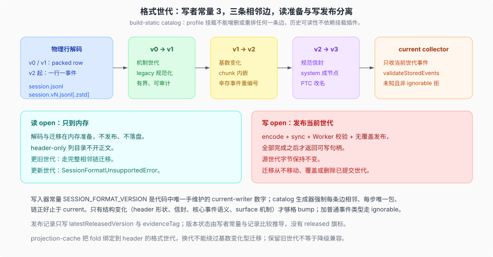

# Session 格式世代与迁移

源码核验入口：`packages/core/session/src/types.ts`、`packages/session/session-format/src/`、`packages/session/session-format-catalog/src/generated.ts`、`packages/session/session-persistence-jsonl/src/{format,generation}.ts`、`scripts/gen-session-format-catalog.ts`、[`docs/session-format-status.md`](../../docs/session-format-status.md)、[`2026-08-31-released-session-format-migrations`](../../.agents/notes/implemented/architecture/2026-08-31-released-session-format-migrations.md)、[`2026-09-05-read-only-session-migration-preparation`](../../.agents/notes/implemented/architecture/2026-09-05-read-only-session-migration-preparation.md)。

`SESSION_FORMAT_VERSION` 是代码里唯一手维护的写者版本权威；由它生成的 build-static catalog 把「从最早支持世代到当前写者版本」的完整相邻迁移链固化进构建产物，profile 挂载既不能增删也不能重排任何一条边。

本篇只讲格式世代与迁移机制：代际之间为什么不同、读方向如何分类、读准备与写发布如何分离。事件信封、surface 与 required-on-read 见 [`01-session-event-map.md`](./01-session-event-map.md)；inbox 与 turn 时序见 [`02-inbox-与turn-时序.md`](./02-inbox-与turn-时序.md)。

## 五个世代各自解决了什么

写者常量是单调整数，没有 major/minor；**写者决定 bump**，不是「新读者能吞什么」。够格的是结构变化：header 形状、`SessionEvent` 信封、核心事件语义、surface 机制；**加一个普通事件类型不 bump**，那是 `ignorable` 的工作（`packages/core/session/src/types.ts:75-89`）。

| 世代 | 该代解决的问题 | 物理布局与文件名 | 该代边的准入与拒绝策略 |
|---|---|---|---|
| v0 | alpha 已发布的原始世代：packed row；system 写在 `request/header.data.header.system`；**每个 surface 事件已必须携带放置标记**（v0 冻结边的 `applySurface` 在缺 `surfaceOp` 时抛 `… requires a surfaceOp marker`，`packages/session/session-format-v0-to-v1/src/relationships.ts:69,405-406`；已发布 v0 日志的每个 surface 事件都带 marker，见 `snapshots/session/{text-turn,packed-chunks}/session.jsonl`） | `session.jsonl[.zstd]`（`packages/session/session-format/src/filename.ts:5,16`） | v0→v1 自称 identity format edge（`packages/session/session-format-v0-to-v1/src/migration.ts:25-35`），但承接一批有界 legacy 规范化：`steering/message`→`user/message`、`compact/*`→`compaction/*`、去掉 `turn/start.trigger`、为 legacy message/retry 链/compaction 组补确定性 id、去掉 `request/header.header.messagePrefix`；`request/header-delta`、`mode/set` 与 `request/header` 的 `fallback` reason 直接拒迁（`packages/session/session-format-v0-to-v1/README.md` 的 Use this package 段） |
| v1 | 机制世代：静态相邻 catalog、header-only 描述符、精确世代 JSONL 发布、current-only 还原；同时定义「已发布世代」本身的义务 | 仍是 packed row 解码 | v1→v2 是**基数变化**：顶层 token 级 `assistant/chunk` 消失，改为 attempt 结算内嵌 stream（`packages/session/session-format-v1-to-v2/src/migration.ts:42-50`）；因为基数变了，幸存事件密集重编号，所有**已声明的**同会话引用（envelope provenance、surface 替换端点、command source events、compaction range/shadowed 列表、title message 列表）必须重映射；指向被消费 chunk 的引用一律拒迁，跨切一次 attempt 的 inherited cut 也拒迁 |
| v2 | 把每个 chunk 一个顶层事件的信封重复压回一条结算：`assistant/message` 内嵌 `stream`，log-only `assistant/attempt` 保存未产生 surface message 的尝试 | 一行一事件；header 要求 `isSeeded`、不存数值 cut，cut 由最后一个 `session/end-seed { inherited: true }` 推导 | v2 读侧沿用「一行一事件」布局直接解码，没有额外的 legacy 规范化；v2→v3 这条 outgoing 边的准入与拒绝策略见下行（唯一规格 `packages/session/session-format-v2-to-v3/README.md:53-136`） |
| v3 | 同一事件在内存、持久文件、浏览器三个读者面前只有一种拼写：四类 surface 事件必须带 `surfaceOp`，system prompt 从 header 提升为受保护的 surface 节点，PTC 词表与 plugin 归因改名 | 一行一事件 + `session.vN.jsonl` 世代文件名 | 唯一规格是 `packages/session/session-format-v2-to-v3/README.md:53-136`（system head、sequence references、PTC vocabulary、canonical envelopes、delivery guards、source audit）；header 迁移顺带把 `agentPreset === 'code'` 改名为 `ptc`（`packages/session/session-format-v2-to-v3/src/migration.ts:12-19`） |
| v4（当前写者） | **真实内容迁移**：tool/result 从 user-message 的 wrapper block 提升为一等 tool-role message（`toolCallId` 到 message 层、扁平 content、error 可带 `reason`）；message source 的 `plugin` 属性改名为 `kind`；新增第五类 surface 事件 `developer/message`；turn/end 新增 `forked` reason（fork seed 专写）；`request/header.header.system` 退役 | 同前 | 唯一规格是 `packages/session/session-format-v3-to-v4/README.md:66-289`；两条硬性前置——**child evidence 绑定**（裸 `createStage()` 抛错，body 迁移必须经 `createSessionFormatV3ToV4(children)` 绑定 direct-child 证据，`src/migration.ts:23-39`；JSONL 读 child 日志收集 facts、单 child 失败隔离为 unavailable fact，`session-persistence-jsonl/src/catalog-migration.ts:47-77`）与 **generation-aware delivery validation**（`delivery-accepted` marker 只有等于当前代才是 active watermark，宣称目标代的 source marker 拒迁，`src/migration.ts:84-86`、`src/validation.ts:89-100`）；未知 ignorable 事件 namespacing 为 `plugin:<type>`，未知 required 拒迁（`migration.ts:89-101`） |

### 权威与门禁

| 权威 | 位置 | 内容 |
|---|---|---|
| 写入器常量 | `packages/core/session/src/types.ts:89` | `SESSION_FORMAT_VERSION = 4`，代码中唯一手维护的 current-writer 数字（`docs/session-format-status.md:22`）。包版本、codec 导出名、fixture 文件名、projection-cache 版本都不是权威 |
| 生成器 | `scripts/gen-session-format-catalog.ts:50-54` 读常量；`:84` 要求 `to === from + 1`；`:91,110` 要求目录名/包名匹配且每个 step 恰好一个包；`:115` 要求 inventory 正好止于 current | 拒绝 gap、重复边、多余边、未知元数据成员、缺 peer+dev 依赖 |
| 静态 catalog | `packages/session/session-format-catalog/src/generated.ts:17-35` | `currentVersion: 4`、5 个 codec（v0–v4）、4 条相邻边、currentEncoder = v4 codec；生成头（`:1-4`）写明 do not edit by hand，且直接 import 各历史包 |
| 链的自我校验 | `packages/session/session-format/src/chain.ts:65-72`（模块初始化拒绝缺失边）、`packages/session/session-format/src/catalog.ts:29-43`（codec 缺失/重复/超前） | 与挂载无关：catalog 是 build-static 的，profile 不能增删或重排一条边（`packages/session/session-format-catalog/README.md:47`） |
| 定型记录 | `docs/session-format-status.md:28-35` | `latestFinalizedVersion: 4`（0112eaf3a8 定版，checkpoint `docs/persistence-changes/finalized/v4.json`） |
| 发布记录 | `docs/session-format-status.md:41-49` | `latestReleasedVersion: 3`、`evidenceTag: dsh-v0.1.5-alpha.1`——**V4 已定型但发布记录未推进**，两个记录要分开读 |
| 发布记录门禁 | `scripts/doc-standard.spec.ts:166-198,212-299` | 只允许 record 两字段、双语相等、证据链接一致、`latestReleasedVersion` 不超过 writer；**不做网络查询**，不证明记录是最新的 |
| 各代 frozen inventory | 各 edge 包的 `src/dispositions.ts` / `src/validation.ts`；V2→V3 以 `packages/session/session-format-v2-to-v3/README.md:53-136`、V3→V4 以 `packages/session/session-format-v3-to-v4/README.md:66-289` 为唯一规格 | 每一代自己的准入清单与转换规则；单一规格归属见 [`2026-08-31-released-session-format-migrations`](../../.agents/notes/implemented/architecture/2026-08-31-released-session-format-migrations.md) |

**版本状态是推导出来的，不是旗标**：`docs/session-format-status.md:22` 明确没有独立的 released 布尔，状态由「写者常量」与「release record」比较得出；发布独立于源码开发，alpha/beta/rc 发布同样建立已发布格式义务，GitHub 的 prerelease 旗标不使持久化用户数据变成一次性（`docs/session-format-status.md:23`）。

文档措辞按 `docs/session-format-status.md:58` 的规则：通用行为写「当前格式」「下一个相邻版本」，只有固定迁移输入输出、wire schema、历史证据和测试才写死数字。因此本页与 `01-session-event-map.md` 只在迁移表、历史规格和源码锚点上出现具体版本号。

## 读方向：四条语义

**同版本（stored === current）**：正常读。catalog 的 `createRestore` 走 `CurrentSessionFormatRestore`（`packages/session/session-format/src/catalog.ts:124-138`）；`validation: 'current'` 时再跑 `restoreCurrent`，JSONL 生产路径用 `validation: 'transformed'`，此时 current 输入只过 codec 校验。

**更新版本（stored > current）**：拒绝，方向明确。catalog 层返回 `status: 'unsupported'`，reason 为 `stored Session uses newer format vN; this build writes vM`（`packages/session/session-format/src/catalog.ts:52-59`）；JSONL 层抛 `SessionFormatUnsupportedError`，文案由 `sessionFormatVersionRefusal()` 生成——「the log was written by a newer harness — upgrade the harness to open it」，并附 raw log 路径（`packages/session/session-persistence/src/errors.ts:133-136`；抛出点 `packages/session/session-persistence-jsonl/src/index.ts:528-542`）。分类发生在**解析当前 header 形状与任何事件行之前**（`packages/session/session-persistence-jsonl/src/format.ts:340-347` 的 `refuseForeignFormatVersion`），因为未来格式未必满足本 build 的结构检查——用户必须看到「升级 harness」，永远不是「corrupt」。`resolveCurrentLog()` 回答的是「当前世代文件是否存在」：对更新世代抛错，对更旧世代返回 `undefined`（`packages/session/session-persistence-jsonl/src/index.ts:786-798`）。

**更旧版本（stored < current）**：**迁移**。catalog 建一条 `MigratingSessionFormatRestore`，按 source→target 顺序创建每个 artifact 的 stage，用 context 反向连接（`packages/session/session-format/src/catalog.ts:139-157`）。管线是 JSONL 记录 → 该世代的物理行解码器 → v0-to-v1 stage → v1-to-v2 stage → v2-to-v3 stage → v3-to-v4 stage（该边需 child evidence 绑定，见世代表）→ current 事件收集器（[`2026-08-31-released-session-format-migrations`](../../.agents/notes/implemented/architecture/2026-08-31-released-session-format-migrations.md) 的 pipeline 段）。迁移 stage 或 transformed-target 校验失败 → `SessionFormatUnsupportedMigrationError`（`packages/session/session-format/src/error.ts:7-9`；抛出点 `packages/session/session-format/src/catalog.ts:238-249`），JSONL 层转成 `SessionFormatUnsupportedError` 并注明 source artifact 不变；物理解码失败仍是 corruption。**旧世代不是 fallback、不是降级承诺**：保留的世代只供 operator 检查。

**未知事件类型**分两种情况。同版本读时，`validateStoredEvents` 只在 `!KNOWN_SESSION_EVENT_TYPES.has(type) && ignorable !== true` 时拒（`packages/session/session-persistence/src/storage-contract.ts:74-80`）——缺省 = required，`ignorable: true` 才可跳过。跨历史边时更严：v0→v1 的 frozen inventory 拒绝一切未知历史事件类型，**包括带 `ignorable: true` 的**，已知 payload 的未审计成员也拒（[`2026-08-31-alpha-historical-unknown-event-refusal`](../../.agents/notes/implemented/architecture/2026-08-31-alpha-historical-unknown-event-refusal.md)）。理由：基数保持型迁移必须证明每个被保留 payload 在目标世代仍语义有效。守卫留在读侧：`append` 不查词表。

## 三类错误与它们的界线

`SessionFormatUnsupportedError` 与 `SessionPersistenceCorruptionError` 刻意分开：前者表示「没有任何东西损坏」，raw log 原样可读（`packages/session/session-persistence/src/errors.ts:105-121`）；后者表示物理行本身无法解码。迁移层的 `SessionFormatUnsupportedMigrationError` 继承 `SessionFormatError`（`packages/session/session-format/src/error.ts:1-9`），表示「可读的 artifact，但该来源策略没有受支持的转换」，由 JSONL 后端转译成对用户可见的 unsupported 错误。

## 读准备与写发布

读 open 只在内存准备，不落盘：`requireStoredLog` 对 `< SESSION_FORMAT_VERSION` 走迁移准备，用单飞表 + `AbortController` + waiters 共享一次解码（`packages/session/session-persistence-jsonl/src/index.ts:495-505`、`:561-597`），`prepareStoredMigration` 只解码与迁移（`:599-641`）。写 open 才发布：`publishStoredMigration` 在返回可写句柄**之前**完成 encode + sync + Worker 校验 + 无覆盖发布（`:643-660`；[`2026-09-05-read-only-session-migration-preparation`](../../.agents/notes/implemented/architecture/2026-09-05-read-only-session-migration-preparation.md)）。

迁移**从不移动、覆盖或删除**已提交世代，只写最终 current 目标；中间版本只作为 stage 状态存在（[`2026-08-31-released-session-format-migrations`](../../.agents/notes/implemented/architecture/2026-08-31-released-session-format-migrations.md)）。JSONL 后端构造时断言 `sessionFormatCatalog.currentVersion === SESSION_FORMAT_VERSION`，不等即抛（`packages/session/session-persistence-jsonl/src/index.ts:262-268`）。世代寻址同时解决了 projection-cache 的绕过问题：cache 记录把 fold 绑定到 header 的格式世代，换代不能绕过基数变化型迁移。

## 源码入口

| 路径 | 角色 |
|---|---|
| `packages/core/session/src/types.ts` | 写者常量、`SessionHeader.version`、`SessionEventMap`、`SurfaceEventType` |
| `packages/session/session-format/src/` | Stage / chain / catalog 协议、`SessionFormatError` 家族、世代文件名规则 |
| `packages/session/session-format-catalog/src/generated.ts` | 生成式 build-static catalog（codec 调度 + 完整相邻链） |
| `packages/session/session-format-v0-to-v1/`、`-v1-to-v2/`、`-v2-to-v3/`、`-v3-to-v4/` | 四条相邻边各自的历史词表、转换与拒绝策略 |
| `packages/session/session-persistence-jsonl/src/format.ts`、`generation.ts`、`index.ts` | 物理行解码、外来版本分类、读准备 / 写发布 |
| `scripts/gen-session-format-catalog.ts` | catalog 生成器与相邻性门禁 |
| [`docs/session-format-status.md`](../../docs/session-format-status.md) | 写者 / 已发布格式 / 发布状态的唯一权威页 |
