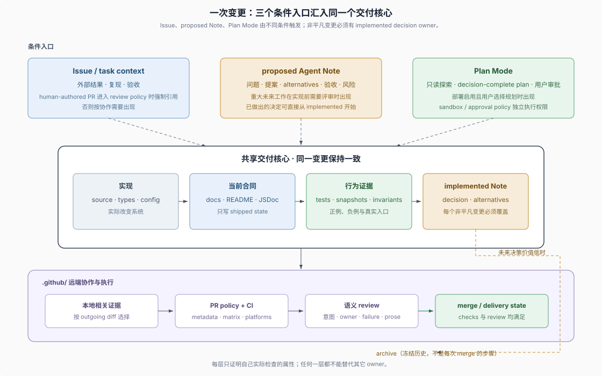

# Spec-driven development · DSH 如何约束一次变更

## 一句话

DSH 没有自称采用一套名为 Spec-driven Development 的方法；从仓库可以重建出一套**分布式规格系统**：Issue 固定外部意图，Agent Note 保存决定及放弃方案，Plan Mode 可选地承载待审批计划，代码与当前文档定义交付状态，tests/snapshots/invariants 提供行为证据，`.github/` 把协作状态和远端检查变成可执行规则。

## 不是一条固定流水线

一次变更不必依次经过 “Issue → proposed Note → Plan → implementation”。这些入口受不同条件控制，最后汇入同一个交付核心。

| 机制 | 何时出现 | 不是 |
|---|---|---|
| Issue | 需要跟踪外部结果，或人类作者的 PR 进入 review policy 强制范围 | 每次修改的强制起点 |
| `proposed/` Agent Note | 重大未来工作在实现前需要评审 | 所有 Agent Note 的必经状态 |
| `implemented/` Agent Note | 每个非平凡变更都要新增或更新；决定已经做出时可直接创建 | 实现后的状态标签修改仪式 |
| Plan Mode | 部署启用且用户选择先计划后实施 | 写权限隔离或每次变更的持久 spec 文件 |
| archive | implemented Note 的未来决策价值已经很低 | 每次合并后的收尾步骤 |

无条件的核心约束只有一个：**每个非平凡变更在同一 PR 新增或更新至少一个 Agent Note**。实现、当前文档和相关行为证据也随同一变更保持一致；本地检查、远端 CI 和语义 review 分别验证自己能够建立的属性。

## 六类规格各有一个 home

| 问题 | home | 保留的事实 |
|---|---|---|
| 为什么做、怎样算完成 | [Issue 模板](../../.github/ISSUE_TEMPLATE/)或任务上下文 | 外部结果、复现、验收、用户或模型可见变化 |
| 为什么这样决定 | [Agent Notes](../../.agents/notes/README.md) | 问题、决定或提案、替代方案、代价与收益 |
| 这一次准备怎样实现 | [Plan Mode](../../docs/subsystems/plan.md) 会话 | decision-complete 计划和用户反馈；可选 |
| 交付后系统是什么 | 源码、types、package README、JSDoc、`docs/` | 当前 API、行为、失败、所有权与限制 |
| 什么证据约束行为 | tests、snapshots、invariants、focused smokes | 可复现的正例、反例和真实入口结果 |
| PR 当前能否推进 | [`.github/`](../../.github/) 与 GitHub 状态 | policy、Project lifecycle、checks、review、stack 和 merge 状态 |

这里没有一个文件能替代其它五类。Agent Note 不应复制当前 API，Issue 不应提前锁定内部函数，Plan 不应冒充 sandbox，测试通过也不证明文档语义正确。

## `.github/` 是远端执行面

`.github/` 不只是托管配置，它把本地约束接到协作事件上：

- `ISSUE_TEMPLATE/` 和 `pull_request_template.md` 定义人类填写入口；
- `issue-management/policy.mjs` 是 Issue/PR metadata 与 Project 状态的共同实现；
- `issue-policy.yml` 从默认分支检出 trusted policy，再校验进入 review 范围的 PR；
- `issue-lifecycle.yml` 把 Issue、PR 和 review 事件投影到 Project 状态；
- `ci.yml` 在 pull request 上执行仓库脚本拥有的静态、coverage、snapshot、artifact 和兼容性检查；
- secret-backed e2e、文档部署和 release workflows 属于相邻交付流程，不是每个功能变更都走的主链。

因此，本地 `dsh-pre-push-checks` 回答“这个 diff 推送前需要哪些相关证据”，`.github/workflows/ci.yml` 回答“pull request 上哪些远端检查必须运行”，GitHub review/stack 状态再决定能否合并。

## 章节

| 文件 | 回答的问题 |
|---|---|
| [`01-agent-note-lifecycle.md`](./01-agent-note-lifecycle.md) | Note 应从 proposed 还是 implemented 开始，怎样移动、取代、拒绝和归档 |
| [`02-issue-pr-lifecycle.md`](./02-issue-pr-lifecycle.md) | `.github/` 怎样把 Issue、PR、Project、CI 和自动依赖更新连成远端协作状态 |
| [`03-plan-and-sandbox.md`](./03-plan-and-sandbox.md) | Plan Mode 保存什么、怎样审批，以及为什么它不执行写权限 |
| [`04-gates-and-local-checks.md`](./04-gates-and-local-checks.md) | outgoing diff、本地相关证据、PR CI 和真实入口检查怎样分工 |
| [`05-prose-doc-standards.md`](./05-prose-doc-standards.md) | 当前文档、理由、翻译和站点投影分别由谁拥有 |
| [`06-review-and-human-role.md`](./06-review-and-human-role.md) | 自动检查、语义 review 与 human-review policy 各能证明什么 |
| [`07-push-merge-stacked-prs.md`](./07-push-merge-stacked-prs.md) | 普通 push、历史改写和官方 GitHub stack 怎样安全落地 |
| [`08-example-web-seam.md`](./08-example-web-seam.md) | Web seam 历史能证明主链的哪一段，又缺少哪些证据 |

`00` 是概念导读；`01` 至 `07` 是按问题查找的机制参考；`08` 是有明确证据边界的历史案例。

## 综合判断

- **规格是分布式的。** 意图、决定、一次性计划、当前行为、行为证据和交付状态分别有 owner；把它们压成单一 spec 文件会丢失更新时机和执行机制。
- **Agent Note 是决定的 owner，不是全部规格的主键。** 它强制保存代码和当前文档无法表达的 rationale 与 alternatives，但不拥有 Issue 验收、API 参考或测试结果。
- **`.github/` 是流程的一部分。** 仓库脚本拥有检查逻辑，GitHub workflows 拥有远端触发、权限、并发和结果聚合；两边缺一边都不能解释实际 PR 流程。
- **人的独占动作少于“所有语义判断”。** 用户审批 Plan、授权受限操作并作最终产品选择；人或 agent 都可以执行语义 review，自动化门禁本身则不能证明语义质量。

## 证据入口

- [Agent Note 规则](../../.agents/notes/README.md)
- [根 `AGENTS.md`](../../AGENTS.md)
- [`.github/AGENTS.md`](../../.github/AGENTS.md)
- [Issue/PR policy](../../.github/issue-management/policy.mjs)
- [PR CI workflow](../../.github/workflows/ci.yml)
- [Plan subsystem](../../docs/subsystems/plan.md)
- [测试策略](../../docs/testing.md)
