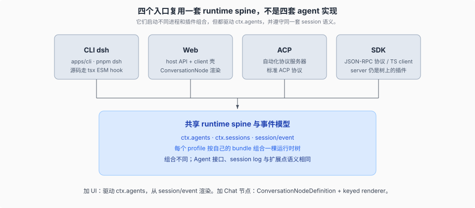
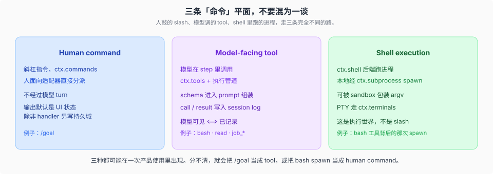

# Surfaces · 人对机器的入口

## 一句话

CLI、Web、ACP、JSON-RPC 复用同一套 runtime spine、`Agent` 接口和 session 事件模型，不是四套 agent 实现。不同入口可以启动不同进程和不同插件组合；每棵组合后的树都通过 `ctx.agents` 驱动 agent，并从 `session/event` 渲染或投影。

## 五个入口，一套运行时模型

| 入口 | 它是什么 | 典型组合 |
|------|----------|----------|
| **CLI `dsh`** | 产品 bin。源码启动走 tsx 的 ESM hook；发行物跑 built `lib/`。 | `--profile web` 或 `headless` |
| **Web** | host 半边（API / HTTP）+ browser 半边（壳、wire、slots、`ui-*`） | `dsh-base` + `dsh-web-app` |
| **ACP** | 自动化用的 Agent Client Protocol 服务器 | `dsh --profile acp`（launcher profile） |
| **JSON-RPC SDK** | 进程外协议、TS client、树上的 server 插件 | `dsh --profile sdk` 或 `sdk-minimal` |

> **重要变化**：从 `0.1.2-alpha.1` 起，sdk 和 acp 不再是独立 app 二进制，而是 `dsh --profile` 下的 launcher profile。所有入口统一走 bundle 层叠。详见 [`../runtime-profiles/00-map.md`](../runtime-profiles/00-map.md)。

加 UI 或编辑器集成：驱动 `ctx.agents`，从 `session/event` 渲染。加 Web Chat 节点：注册 `ConversationNodeDefinition` + keyed renderer。加 Web 设置卡：Host `installSettingsSection` + 浏览器 `settings.plugin.item`，见 [`docs/cookbook/adding-a-settings-card.md`](../../docs/cookbook/adding-a-settings-card.md)。不要在入口里再实现一套 loop。

源码启动（`pnpm dsh`）把 workspace 包映射到 TypeScript 源；它碰到的模块必须保持 ESM。built 路径则是普通 Node 解析。两条启动面不要混着假设。

## 三条「命令」平面

产品里有三种看起来都像「命令」的东西，路完全不同。

| 平面 | 走哪 | 过不过模型 |
|------|------|------------|
| **Human command** | `ctx.commands`，人面向适配器直接分派 | 不过模型 turn |
| **Model-facing tool** | `ctx.tools` + 执行管道 | 在 step 里，call/result 入 log |
| **Shell execution** | `ctx.shell` / `ctx.subprocess` / 可选 sandbox | 是 tool 背后的进程执行层；sandbox 可包装 argv |

`/goal` 是 human command。模型调用的 `bash` 是 tool。那次实际 spawn 是 shell execution。分不清，就会把斜杠指令当成 tool schema，或把沙箱策略塞进人命令里。

## 源码入口

| 路径 | 角色 |
|------|------|
| `apps/cli/` | 产品 bin `dsh` |
| `packages/boot/` | 各 profile 共用的 boot 胶水 |
| `packages/host/` | Web-GUI 的 API gateway + HTTP |
| `packages/host/apiproxy/` | 遗留 RPC 代理（已迁移至 Remote） |
| `packages/client/` | 浏览器壳、wire、slots |
| `packages/sdk/` | JSON-RPC protocol / server / TS client |
| `packages/acp/` | ACP 自动化服务器 |
| `packages/interaction/` | 审批、permission、commands、ask-user |
| `packages/api/` | Remote BFF（`api/remotes`）、Typert RPC 网关（`api/gateway`） |
| `packages/api/remotes/` | Remote 控制器声明 + client stub（替代 apiproxy RPC） |
| `packages/typert/` | 类型安全的 Remote 序列化 |
| [`docs/user/guide/index.md`](../../docs/user/guide/index.md) | Web UI 指南 |
| [`docs/cookbook/extension-cookbook.md`](../../docs/cookbook/extension-cookbook.md) | 扩展 cookbook（含 Chat node、settings 卡片等） |
| [`docs/cookbook/adding-a-settings-card.md`](../../docs/cookbook/adding-a-settings-card.md) | 插件自有 settings 卡片 |

## 机制级正文

| 文件 | 内容 |
|------|------|
| [`01-启动面与session流.md`](./01-启动面与session流.md) | tsx ESM vs `lib/bin.js`；host mux 推 `session/event` |
| [`02-acp与jsonrpc.md`](./02-acp与jsonrpc.md) | ACP 只要 committed 文本；SDK 推 Context 内全部耐久事实 |

dump 与 boot 的层差不在入口，在 [`../composition/02-dump-与boot-保真.md`](../composition/02-dump-与boot-保真.md)。
