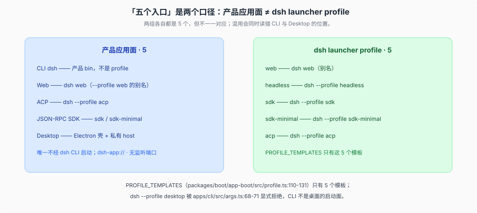

# Surfaces · 人对机器的入口

产品源码基线：`639ed015397290b3745d163aafe02ffee4aa3f84`（`dsh-v0.2.0-rc.2`），本页结论与该 commit 的项目树一致；历史跨度对照的 OLD 侧为 `a66e470204`（`0.1.2-rc.1`）、上一消化基线为 `46a7f68b09`（`dsh-v0.1.7-rc.1`），`rc.1` → `rc.2` 的增量见 [`_change_log/0009`](../_change_log/0009-0.1.7-rc.1-to-0.2.0-rc.2.md)。

## 一句话

CLI、Web、ACP、JSON-RPC 与桌面复用同一套 runtime spine、`Agent` 接口和 session 事件模型，不是五套 agent 实现。不同入口可以启动不同进程和不同插件组合；每棵组合后的树都通过 `ctx.agents` 驱动 agent，并从 `session/event` 渲染或投影。

## 五个入口，一套运行时模型

| 入口 | 它是什么 | 典型组合 |
|------|----------|----------|
| **CLI `dsh`** | 产品 bin。源码启动走 tsx 的 ESM hook；发行物跑 built `lib/`。 | `--profile web` 或 `headless` |
| **Web** | host 半边（API / HTTP）+ browser 半边（壳、wire、slots、`ui-*`） | `dsh-base` + `dsh-web-app` |
| **ACP** | 自动化用的 Agent Client Protocol 服务器 | `dsh --profile acp`（launcher profile） |
| **JSON-RPC SDK** | 进程外协议、TS client、树上的 server 插件 | `dsh --profile sdk` 或 `sdk-minimal` |
| **Desktop** | Electron 壳 + 私有 host 子进程，复用 Web 的 client 产物与完整 web 应用（webserver 监听 `127.0.0.1:19387`，认证 URL 交给窗口） | `dsh-base` + `dsh-web-app`（经 desktop-host 的 `runProfile`；0.1.7 线起，~~私有 `desktop.cordis.patch.yml` 覆盖层~~已退役） |

两个「五个」不能混着用：产品应用面是上表 5 个，`dsh` launcher profile 也是 5 个（`web` / `headless` / `sdk` / `sdk-minimal` / `acp`，`packages/boot/app-boot/src/profile.ts:179-195` 的 `PROFILE_TEMPLATES`），但两组不一一对应 —— CLI 是 bin 不是 profile，桌面是应用面不是 profile。见 [`03-桌面入口.md`](./03-桌面入口.md)。

> **入口形状**：sdk 与 acp 不是独立 app 二进制，而是 `dsh --profile` 下的 launcher profile。所有入口统一走 bundle 层叠。详见 [`../runtime-profiles/00-map.md`](../runtime-profiles/00-map.md)。

桌面是唯一不经 `dsh` CLI 启动的产品面：`dsh --profile desktop` 被 `apps/cli/src/args.ts:83` 的 `rejectElectronProfile()` 显式拒绝（大小写变体一并拦下；boot / dump 入口恒拒，`plugin` 子命令仅 Desktop 自带 carrier 以 `manageDesktopProfile` 放行，见 [`03-桌面入口.md`](./03-桌面入口.md)），上游文档也把它从 `## Application launch`（`docs/architecture.md:43-49`）分到 `## Desktop application`（`:51-55`，其中 :55 明写 Desktop 默认端口 19387）。把桌面算作第 5 个入口是语料的口径选择，不是上游文档的原话。

加 UI 或编辑器集成：驱动 `ctx.agents`，从 `session/event` 渲染。加 Web Chat 节点：注册 `ConversationNodeDefinition` + keyed renderer。加 Web 设置卡：按 0.1.7 线的 live configuration forms 机制——Config schema 声明 live 字段、跨插件贡献走 `plugins.detail.actions`/`badge`/`section` slots、companion 包经 `ctx.configForms.whileServed` 注册（旧 `installSection`/`settings.plugin.item` 已删），见 [`docs/cookbook/adding-a-settings-card.md`](../../docs/cookbook/adding-a-settings-card.md)。加右栏内容类型：声明资源协议 + 注册 provider + keyed `sidebar.right.pane.tab`，见 [`04-客户端资源模型与右栏.md`](./04-客户端资源模型与右栏.md)。不要在入口里再实现一套 loop。

源码启动（`pnpm dsh`）把 workspace 包映射到 TypeScript 源；它碰到的模块必须保持 ESM。built 路径则是普通 Node 解析。两条启动面不要混着假设。

## 三条「命令」平面

产品里有三种看起来都像「命令」的东西，路完全不同。

| 平面 | 走哪 | 过不过模型 |
|------|------|------------|
| **Human command** | `ctx.commands`，人面向适配器直接分派 | 不过模型 turn |
| **Model-facing tool** | `ctx.tools` + 执行管道 | 在 step 里，call/result 入 log |
| **Shell execution** | `ctx.shell` / `ctx.subprocess` / 可选 sandbox | 是 tool 背后的进程执行层；sandbox 可包装 argv |

`/goal` 是 human command。模型调用的 `bash` 是 tool。那次实际 spawn 是 shell execution。分不清，就会把斜杠指令当成 tool schema，或把沙箱策略塞进人命令里。

## 源码入口

| 路径 | 角色 |
|------|------|
| `apps/cli/` | 产品 bin `dsh` |
| `apps/web/` | 浏览器 Vite entry（薄壳，装配逻辑在 `packages/client/`） |
| `apps/desktop/` | Electron 壳；私有包 `@deepseek-ai/dsh-desktop`，无 `bin` |
| `apps/desktop-host/` | 桌面私有 host：载入已安装的 dsh backend 与匹配的 client 产物，同样无 `bin` |
| `packages/boot/` | 各 profile 共用的 boot 胶水 |
| `packages/host/` | webserver / frontend-static / directory-picker / plugin-inventory / open-in-app |
| `packages/api/session-controller/` | Web host 会话流（`session/event` 转发、activity、可 opt-in 的 assistant-stream 帧） |
| `packages/client/` | 浏览器壳、wire、slots、资源模型（`ctx.resources` / `useResource`）、dockkit 布局引擎、右栏三件套、file-upload、open-in-app |
| `packages/sdk/` | JSON-RPC protocol / server / TS client |
| `packages/acp/` | ACP 自动化服务器 |
| `packages/interaction/` | 审批、permission、commands、ask-user |
| `packages/api/` | Remote BFF（`api/remotes`）、Typert RPC 网关（`api/gateway`）、工作区文件服务与 `file` 资源 provider（`api/workspace-files`） |
| `packages/api/remotes/` | Remote 控制器声明 + client stub |
| `packages/typert/` | 类型安全的 Remote 序列化 |
| [`docs/user/guide/index.md`](../../docs/user/guide/index.md) | Web UI 指南 |
| [`docs/cookbook/extension-cookbook.md`](../../docs/cookbook/extension-cookbook.md) | 扩展 cookbook（含 Chat node、settings 卡片等） |
| [`docs/cookbook/adding-a-settings-card.md`](../../docs/cookbook/adding-a-settings-card.md) | 插件自有 settings 卡片 |

## 机制级正文

| 文件 | 内容 |
|------|------|
| [`01-启动面与session流.md`](./01-启动面与session流.md) | tsx ESM vs `lib/bin.js`；session-controller follow 的三类帧；浏览器认证面（process-token URL + `dsh-auth-` cookie） |
| [`02-acp与jsonrpc.md`](./02-acp与jsonrpc.md) | ACP 只把 committed 事实表达成标准语义更新；SDK 推 Context 内全部耐久事实 |
| [`03-桌面入口.md`](./03-桌面入口.md) | Electron 壳 + 私有 host；desktop-host 经 `runProfile` 起完整 web 应用（`127.0.0.1:19387` 认证 URL，0.1.7 线起；~~dsh-app 分帧字节管道~~已退役）；打包与更新 |
| [`04-客户端资源模型与右栏.md`](./04-客户端资源模型与右栏.md) | `dsh-resource://` 地址、provider 契约、holder / pin 生命周期、右栏 tab 类型与 slot |
| [`05-客户端架构与插件纪律.md`](./05-客户端架构与插件纪律.md) | 六层归属与单向依赖链、slot/props 四 share、`/client` export 与 ctx 纪律、`PLATFORM_MODULES` 与 `dsh.client.external`、Conversation Node、包内目录、依赖声明、样式与本地化、测试阶梯、三道 client gate |
| [`06-Typert类型图与Remote生成.md`](./06-Typert类型图与Remote生成.md) | 四个 typert 包与两个 `core` 服务；声明期的 `@Remote` / namespace / 声明合并；build 期的 `TypeGraph` 与 `typert.host.*` / `typert.remote-client.*` 两族产物 + `typert-contracts` 门禁；运行期的 Gateway 派发、`rpcId` / 逻辑流与 `ctx.remote.<namespace>` mount |

上游权威正文：[`docs/subsystems/client-resources.md`](../../docs/subsystems/client-resources.md) 管资源模型的地址语法、provider 与四态；[`docs/subsystems/sidebar-right.md`](../../docs/subsystems/sidebar-right.md) 管右栏的 tab 类型、导航服务、slot 与出货类型。

dump 与 boot 的层差不在入口，在 [`../composition/02-dump-与boot-保真.md`](../composition/02-dump-与boot-保真.md)。
