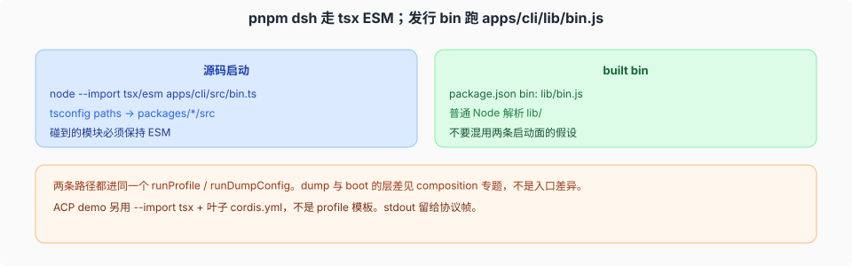
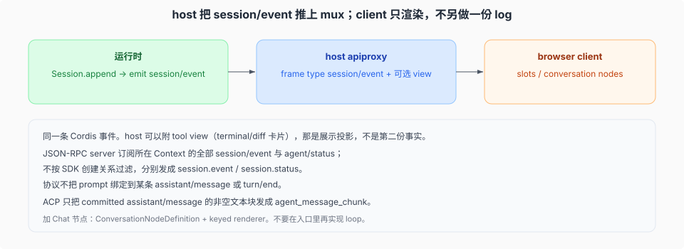

# 源码启动、built bin，以及 host 如何推同一条 session 流

源码核验入口：根 `package.json` 的 `dsh` script、`apps/cli/package.json` `bin`、`apps/cli/src/bin.ts`、`packages/api/session-controller/`（Web host 会话流）、`packages/api/remotes/`（Host 事件转发白名单）。

五个 Launcher Profile 可以 boot 不同的 bundle 或组合，因此不一定共享同一进程或同一棵 Cordis 树；它们复用 `ctx.agents`、session log 和事件语义。桌面应用不在其中：`dsh --profile desktop` 被显式拒绝，它由 Electron 壳启动私有 host，见 [`03-桌面入口.md`](./03-桌面入口.md)。

## 两条启动面

| | 命令 | 解析 |
|--|------|------|
| 源码 | `node --import tsx/esm apps/cli/src/bin.ts`（`pnpm dsh`） | tsconfig `paths` → `packages/*/src`。碰到的模块必须是 ESM |
| 发行 | `apps/cli/lib/bin.js`（`package.json` `"bin": { "dsh": "lib/bin.js" }`） | 普通 Node 解析 built `lib/` |

不要混用：源码启动测到的「能 import 到 src」不代表发行物里裸插件名能解析。profile 的 `healProfilesModuleFallback` 是为任意 profile 目录解析安装闭包，见 composition 专题。

`bin.ts` 分发：普通任务 `runProfile`，`--dump-config` `runDumpConfig`。dump 与 boot 的层差（launcher 派生层、不求值 `!!js`）不是入口差异，见 [`../composition/02-dump-与boot-保真.md`](../composition/02-dump-与boot-保真.md)。

ACP：`dsh --profile acp`。launcher profile，stdout 留给协议帧。

## host / client 共享 `session/event`

运行时：`Session.append` 之后 Cordis `emit('session/event', session, event)`。这不是 log 事件本身——catalog 写明 log 事件经这一次 emit 到达监听器。

同一条 emit 有两条互不相同的出站链路。旧页把它们并成了一条，NEW 下必须分开写：

- **session 事件 → 浏览器**：`packages/api/session-controller/` 的 `follow` Remote stream 在 `packages/api/session-controller/src/history.ts:145` 订阅 `session/event`，把开窗快照与按序事件帧交给客户端。同一包 `packages/api/session-controller/src/index.ts:158` 的同名订阅只做 selection 记账与 `api-session/activity` 派生（`:168-169`），**不转发事件体**。
- **Host 侧非 session 事件 → 浏览器**：`packages/api/remotes/` 的转发循环按白名单 `API_REMOTE_FORWARDED_EVENTS` 转发 `api-session/*`、`approval/request`、`user-questions/request`、`cordis/*`、`settings/document-updated` 等。

白名单里**没有** `session/event`，NEW 与 OLD 皆然——浏览器拿 session 事件从来不靠它。

浏览器半边（`packages/client/`）订阅读这些帧，slots / `ConversationNodeDefinition` 渲染。client **没有**另一份 append-only log。刷新 / 重连从持久化再 hydrate，仍然是同一条 session 的事件。

Host 把每一个已登记的 settings namespace 交给 Web；插件自己登记 Host schema 与浏览器卡片。事件转发白名单集中在 `packages/api/remotes/src/remote-events.ts:16`，NEW 下是 **19 条**，唯一新增项是 `goal/activation-changed`（`:26`，`mode: 'emit'`）；`packages/api/session-controller/src/remote-events.ts` 的同名文件只是 5 个 `api-session/*` 事件的 `TypertRemoteEventSelection` 模块扩充声明，不是白名单。含图的 Web prompt 不再由 session-controller 直接批量准入：它经 `ctx.attachments.admitPromptContent(...)`（`packages/api/session-controller/src/commands.ts:353`）走到 attachment capability 内部（`packages/attachment/attachment/src/index.ts:113` 的 `admitPromptContent`，图像批交给 `packages/attachment/attachment/src/admission.ts:49` 的 `admitEncodedImages`），session-controller 保留图像模态检查与 `session/attachment-invalid` 映射。历史分页仍按 `sourceEventSeqs` 取分组起点，避免大 transcript 上的调用栈溢出。

### Web 会话流的两类帧

客户端 `follow` 读到的帧有三类，`packages/api/session-controller/src/types.ts:513` 的 `SessionFollowFrame` 是它们的并集：

| 帧 | 来源 | 说明 |
|----|------|------|
| 开窗快照 | durable log | 含可选 `assistantStream` 基线（`:468` 的 `SessionAssistantStreamBaseline`） |
| durable event | durable log | 逐条 session 事件，gap-free |
| `assistant-stream` | 进程内 | 仅当请求位 `assistantStream: true`（`:451`）时追加；不是 log 的第二个副本 |

客户端在 `packages/api/session-controller/src/client/transport.ts:181` 显式 opt-in。host 侧累积器是 `packages/api/session-controller/src/assistant-stream.ts`：「Process-local assistant state retained for reconnecting Web followers」。每次接受的 revision 物化一份不可变重连基线（同文件 `:21` 的 `EMPTY_BASELINE`、`:84` 的 `snapshot()`），客户端在 `packages/api/session-controller/src/client/sessions/session.ts:667` 以 `replace(entries, assistantStream)` 合并。它承担的是「重连时把正在流式输出的 assistant attempt 接回来」，不是把 raw chunk 补进 durable log。

客户端对 wire 事件另有一层逐字段白名单：`assertSessionWireEvent()`（`packages/api/session-controller/src/client/session-wire-event.ts:14`）先限定 `type/seq/time/data/ignorable/surfaceOp/sourceEventSeqs`（`:20-33`），再跑 `validateSurfaceMetadata` 与 `validateSessionEventData`（`:44-45`），**不**重写或规范化 wire 字段，也不在这里做范围或来源存在性检查（那需要 durable log，属 Host）。三个调用点都在 `packages/api/session-controller/src/client/transport.ts`：`:185`（history page）、`:217`（live 帧）、`:233`（prepend page）。

### 传输层：Web 用 mux，桌面换掉 mux

Web 用 `/api/remote.mux` 这一条 WebSocket 按 `streamId` 复用任意多条可独立取消的逻辑流（`packages/api/gateway/src/stream-protocol.ts:6`）；多会话就是多条并发的 `session.follow` 流（每 Session 一个，`packages/api/session-controller/src/client/sessions/session.ts:610`），不是一条会话级 channel。

桌面没有监听端口：渲染端走注入的 `__DSH_TRANSPORT__.openStream`（`packages/client/connection/src/client/index.ts:186`、`:188`），POST `/.dsh/remote-stream` 读 NDJSON；Gateway 因 `connection.rpc.open !== undefined` 而不启动 WebSocket mux（`packages/api/gateway/src/client/index.ts:162`、`:227`）。完整差异见 [`03-桌面入口.md`](./03-桌面入口.md)。

Python 捆绑 runtime 的 `minimal` smoke 把组装后的 system prompt、tool schema 和 model-visible messages 钉在 `scripts/snapshots/python-sdk-single-exe/minimal/model-visible.json`。

加 Web Chat 节点：在 **client** 上把 `ConversationNodeDefinition` 经 `ctx.uiConversation.events.register(definition)` 登记（`packages/client/ui-chat/src/client/conversation-nodes/tool.ts:271`、`packages/client/ui-trajectory/src/client/trajectory-assistant-definition.ts:448`），并把 keyed renderer 登记到 `conversation.chat.node` slot。聚合快照视图才走 `ctx.uiConversation.views.register(...)`（`packages/client/ui-chat/src/client/conversation-nodes/chat-snapshot-builder.ts:1077`）；服务键是 `'uiConversation'`（`packages/client/ui-conversation/src/client/conversation/assembly.ts:188`），host 没有这些 client registry。加右栏内容类型走资源协议，见 [`04-客户端资源模型与右栏.md`](./04-客户端资源模型与右栏.md)。不要在入口里再跑一套 loop。

## 三条命令平面（入口侧怎么接）

人敲 `/goal`：`ctx.commands` 适配器直接分派，`command/run` / `command/done` 入 log（通常 log-only）。不过模型 turn。

模型调 `bash`：`ctx.tools` 管道，call/result 入 log，result 在 surface 上。

那次 spawn：`ctx.shell` → subprocess / sandbox。入口代码不该自己 `child_process.spawn`。
