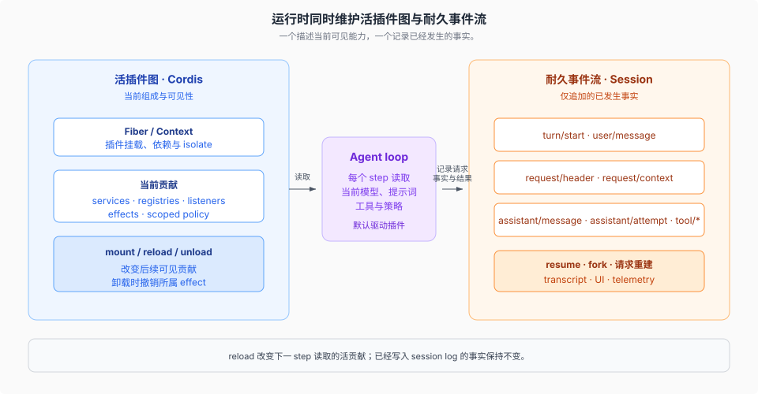

# System · 整机介绍

产品源码基线：`fb2c4b9e69`（`dsh-v0.1.5-rc.2`）；本专题结论与该 commit 的项目树一致，跨度对照的 OLD 侧为 `a66e470204`（`0.1.2-rc.1`），`rc.1` → `rc.2` 的增量见 [`_change_log/0007`](../_change_log/0007-0.1.5-rc.1-to-0.1.5-rc.2.md)。

## 一句话

DeepSeek Harness 不是「一个 agent loop 配一堆 tools」。它是一台用 Cordis 装起来的**插件树**：循环、会话服务、模型适配器和工具注册表本身都是插件，都可以由组合替换。

```text
Cordis 先建立运行时基座；产品能力由插件树组合。
新行为挂到已有扩展点上，而不是去改 agent-loop。
```

本页只建立整机图。Cordis 原语、boot 组合、turn 时序和 seam 三角色分别由后续专题解释。

下面的分层来自 [`docs/architecture.md`](../../docs/architecture.md)。非显然扩展落点和「单一 loop」对照见文末机制参考。

## 先看整机


这六层是**叠加**，不是六选一。

- **profile** 决定这一次进程里树上挂了哪些插件（第 2 层）。
- **seam** 决定某项能力由谁实现（第 4 层）。
- **loop** 只消费已经挂上的服务和事件（第 5 层）。它不是整台机器。

从下往上看，是运行时如何撑起产品；从上往下看，是不同入口如何复用同一套 runtime spine 和事件语义。

「一切皆插件」描述的是产品能力的组织方式，不是无限递归的启动过程。`new Context()` 直接建立 root Fiber、服务反射、插件注册表、事件服务和日志器；`boot()` 随后安装 Loader，再挂载配置中的应用插件树。第 1 层是插件系统的运行时基座，第 2 层以上才是一次进程的可变产品组合。

## 活插件图与耐久事件流



运行中的 harness 同时维护两种状态。Cordis 的 Fiber、服务、监听器与 effect 组成**活插件图**，回答当前挂着什么、某个 `ctx` 能看见哪些贡献以及卸载时撤掉什么；session 的仅追加事件流记录**已经发生的事实**，供 resume、fork、模型请求重建和各类投影读取。

默认 loop 在每个 step 从活插件图读取当时可见的模型、提示词、工具和策略，在有效请求头变化时追加快照，并把随后产生的消息与工具结果写入 session log。reload 可以改变下一 step 读取的贡献，但不会改写已经写入日志的会话事实；两种状态因此分工，而不是互相替代。

## 它不是什么

| 容易带过来的图景 | 更准确的说法 |
|------------------|--------------|
| 一个 loop + `tools: []` | 循环是默认驱动插件，工具来自带 scope 的注册表 |
| 改功能 = 改 loop 源码 | 改功能 = 在 `ctx` 或事件上再挂一个插件 |
| Web / CLI / ACP 各有一套 agent | 它们可以有不同插件组合，但都驱动 `ctx.agents` 并遵守同一套 session 语义 |
| session 是 UI 状态 | session log 是模型上下文的源，UI 从它投影 |
| 远程执行只要换 bash 实现 | 远程组合要让 fs 与 subprocess provider 共享同一 runtime owner；本地 sandbox 只包装 spawn argv |


新行为的完整归属表由 [`docs/architecture.md`](../../docs/architecture.md#where-new-behavior-goes) 维护。只有改变循环合同本身时才修改 `agent-loop`，并同步更新该架构地图。

## 扩展点的第一刀：事件落在哪个域

改动前先问：这件事是必须活过 reload 的事实，还是正在飞的拦截，还是某条能力自己的策略？


三个域的关键区别：

1. `turn/*`、`step/*`、`user/message`、`assistant/*`、`tool/*` 是**持久会话事件**。其余大多是三个域里的实时扩展点。
2. `agent/pre-step`、`agent/request`、`llm/stream`、以及四条 `tools/*` 是 **waterfall**：`next()` 把决定委托给下游；不调用就是由当前监听器短路并拥有结果。
3. `agent/turn-stopping` 是 **serial**，没有 `next()`；监听器可用 `agent.steer()` 增加下一步工作，驱动随后重读 inbox。

## 每层回答什么，细节去哪读

| 层 | 它回答的问题 | 专题 |
|----|--------------|------|
| Cordis runtime | 插件怎么注册、怎么卸、事件怎么传 | [`../cordis-runtime/00-map.md`](../cordis-runtime/00-map.md) |
| Composition | 这一次进程里到底装着哪棵树 | [`../composition/00-map.md`](../composition/00-map.md) |
| Product spine | 会话、提示词、工具、Agent 句柄归谁 | 本篇 + [`../session-and-loop/00-map.md`](../session-and-loop/00-map.md) |
| Capability seams | 换后端时哪些东西必须一起走 | [`../capability-seams/00-map.md`](../capability-seams/00-map.md) |
| Turn loop | 一轮用户输入如何变成模型和工具调用 | [`../session-and-loop/00-map.md`](../session-and-loop/00-map.md) |
| Surfaces | 人 / 自动化客户端怎么接到同一套 runtime spine | [`../surfaces/00-map.md`](../surfaces/00-map.md) |
| 模型看见的请求 | section、schema、adapter、tool 管道 | [`../tools-prompt-llm/00-map.md`](../tools-prompt-llm/00-map.md) |

产品主干使用这些 `ctx` 键：

| 包 | 职责 | `ctx` 键 |
|----|------|----------|
| `core/session` | 仅追加的 `SessionEvent` 日志 | `ctx.sessions` |
| `core/system-prompt` | 提示词片段与工具 schema 组装 | `ctx.systemPrompt` |
| `core/tools` | 作用域工具表 + 带把关的执行管道 | `ctx.tools` |
| `core/agent` | `Agent` 接口、活注册表、`agent/*` | `ctx.agents` |
| `core/agent-loop` | 实现该接口的默认驱动 | `ctx.agentLoop` |
| `core/scope` | 按 agent 划分的注册原语 | 库，无 ctx 键 |
| `llm/llm` | 消息与流式词汇 + adapter seam | `ctx.llm` |
| `webhook/webhook` | 认证投递分发与 Workspace Session 创建 | `ctx.webhookRuntime` |

## 官方文档入口

- [`docs/architecture.md`](../../docs/architecture.md) / [`docs/architecture.zh.md`](../../docs/architecture.zh.md)
- [`docs/cordis-primer.md`](../../docs/cordis-primer.md)
- [`docs/capability-seams.md`](../../docs/capability-seams.md)
- [`docs/glossary.md`](../../docs/glossary.md)
- [`docs/subsystems/webhook.md`](../../docs/subsystems/webhook.md)
- [`packages/README.md`](../../packages/README.md)

## 机制级正文

| 文件 | 内容 |
|------|------|
| [`01-扩展表非显然落点.md`](./01-扩展表非显然落点.md) | architecture 扩展表中不能从 `ctx` 键直接看出的落点 |
| [`02-对照单一loop.md`](./02-对照单一loop.md) | 从「一个 loop + tools 数组」迁过来时落在哪一层 |
| [`03-门禁与性能基准.md`](./03-门禁与性能基准.md) | `run-gates` 聚合器与 leaf 家族；`benchmarks/` 性能门禁树 |

Loader / fiber 如何卸载插件贡献，见 [`../cordis-runtime/04-vendor-本地修改.md`](../cordis-runtime/04-vendor-本地修改.md) 与 [`../cordis-runtime/01-五条原语对照源码.md`](../cordis-runtime/01-五条原语对照源码.md)。
