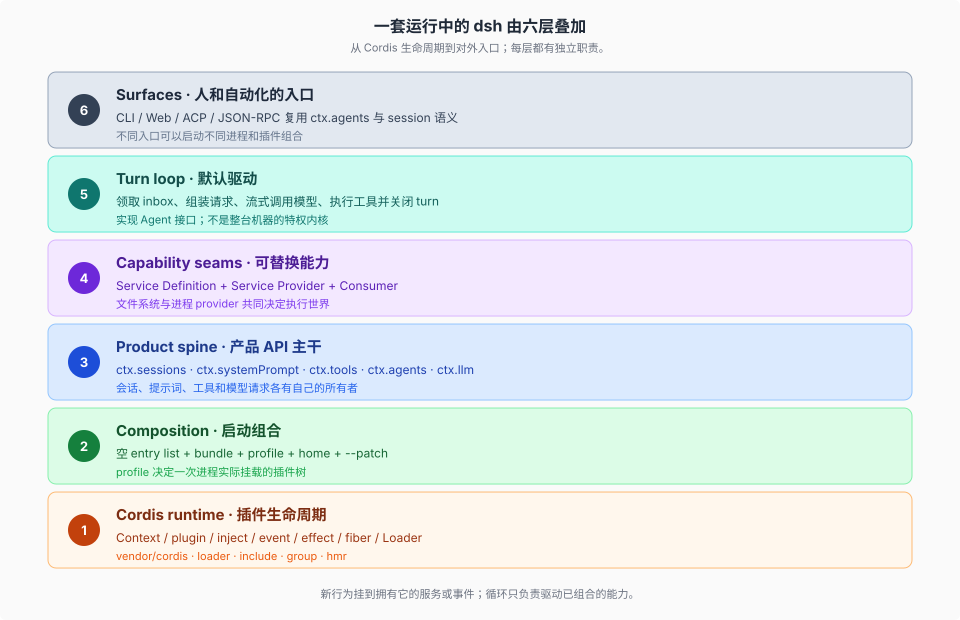
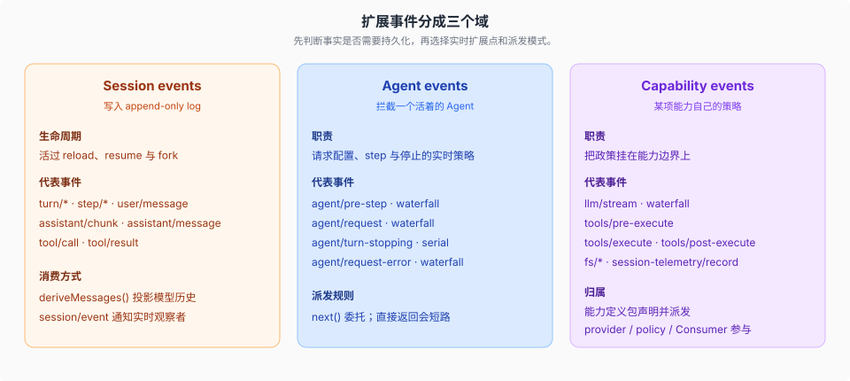

# System · 整机介绍

## 一句话

DeepSeek Harness 不是「一个 agent loop 配一堆 tools」。它是一台用 Cordis 装起来的**插件树**：循环、会话日志、模型适配器、工具注册表本身都是插件，都可以被配置换掉。

```text
没有特权内核可打补丁。
新行为挂到已有扩展点上，而不是去改 agent-loop。
```

本篇只建立整机图。Cordis 原语、boot 组合、turn 时序、seam 三角色，各有自己的专题；读完这里再往下走。

机制级结论仍以源码为准。下面的分层来自 [`docs/architecture.md`](../../docs/architecture.md)，用来建立直觉。扩展表对源码、以及和「单一 loop」的对照见文末机制级正文。

## 先看整机



这六层是**叠加**，不是六选一。

- **profile** 决定这一次进程里树上挂了哪些插件（第 2 层）。
- **seam** 决定某项能力由谁实现（第 4 层）。
- **loop** 只消费已经挂上的服务和事件（第 5 层）。它不是整台机器。

从下往上看，是运行时如何撑起产品；从上往下看，是人通过某个入口如何用到同一棵树。

## 它不是什么

| 容易带过来的图景 | 更准确的说法 |
|------------------|--------------|
| 一个 loop + `tools: []` | 循环是默认驱动插件，工具来自带 scope 的注册表 |
| 改功能 = 改 loop 源码 | 改功能 = 在 `ctx` 或事件上再挂一个插件 |
| Web / CLI / ACP 各有一套 agent | 它们是同一棵树的不同入口，都驱动 `ctx.agents` |
| session 是 UI 状态 | session log 是模型上下文的源，UI 从它投影 |
| 换沙箱只要换 bash 实现 | fs 与 subprocess 共享执行世界，Bash / PTY / LSP 一起走 |


官方那张「新行为的归属位置」表，就是右图的清单：加模型注册到 `ctx.llm`，加工具注册到 `ctx.tools`，拦截一轮对话用 `agent/*` 或 `tools/*`。只有在改循环合同本身时，才去动 `agent-loop`，并且必须同步改 architecture 地图。

## 扩展点的第一刀：事件落在哪个域

改动前先问：这件事是必须活过 reload 的事实，还是正在飞的拦截，还是某条能力自己的策略？



三件立刻有用的细节：

1. `turn/*`、`step/*`、`user/message`、`assistant/*`、`tool/*` 是**持久会话事件**。其余大多是三个域里的实时扩展点。
2. `agent/pre-step`、`agent/request`、`llm/stream`、以及三条 `tools/*` 是 **waterfall**：监听器必须调用 `next()` 才能把链传下去；不调用就是短路。
3. `agent/turn-stopping` 是 **serial**，没有 `next()`。它用来结束一轮，不是用来包装请求。

`agent/pre-step` 决定模型看见什么。监听器可以改写已领取的消息，也可以直接拒绝。首次领取被拒绝或被改写成空，仍然会关掉一个**不含步骤的持久轮次**——日志会记下这次尝试。这就是「模型可见即已记录」在边界情况下的样子：连一次没真正问模型的 turn，也要留下痕迹。

## 每层回答什么，细节去哪读

| 层 | 它回答的问题 | 专题 |
|----|--------------|------|
| Cordis runtime | 插件怎么注册、怎么卸、事件怎么传 | [`../cordis-runtime/00-map.md`](../cordis-runtime/00-map.md) |
| Composition | 这一次进程里到底装着哪棵树 | [`../composition/00-map.md`](../composition/00-map.md) |
| Product spine | 会话、提示词、工具、Agent 句柄归谁 | 本篇 + [`../session-and-loop/00-map.md`](../session-and-loop/00-map.md) |
| Capability seams | 换后端时哪些东西必须一起走 | [`../capability-seams/00-map.md`](../capability-seams/00-map.md) |
| Turn loop | 一轮用户输入如何变成模型和工具调用 | [`../session-and-loop/00-map.md`](../session-and-loop/00-map.md) |
| Surfaces | 人 / 自动化客户端怎么接到同一棵树 | [`../surfaces/00-map.md`](../surfaces/00-map.md) |
| 模型看见的请求 | section、schema、adapter、tool 管道 | [`../tools-prompt-llm/00-map.md`](../tools-prompt-llm/00-map.md) |

脊梁上几个 `ctx` 键，先记住名字：

| 包 | 职责 | `ctx` 键 |
|----|------|----------|
| `core/session` | 仅追加的 `SessionEvent` 日志 | `ctx.sessions` |
| `core/system-prompt` | 提示词片段与工具 schema 组装 | `ctx.systemPrompt` |
| `core/tools` | 作用域工具表 + 带把关的执行管道 | `ctx.tools` |
| `core/agent` | `Agent` 接口、活注册表、`agent/*` | `ctx.agents` |
| `core/agent-loop` | 实现该接口的默认驱动 | `ctx.agentLoop` |
| `core/scope` | 按 agent 划分的注册原语 | 库，无 ctx 键 |
| `llm/llm` | 消息与流式词汇 + adapter seam | `ctx.llm` |

## 官方文档入口

- [`docs/architecture.md`](../../docs/architecture.md) / [`docs/architecture.zh.md`](../../docs/architecture.zh.md)
- [`docs/cordis-primer.md`](../../docs/cordis-primer.md)
- [`docs/capability-seams.md`](../../docs/capability-seams.md)
- [`docs/glossary.md`](../../docs/glossary.md)
- [`packages/README.md`](../../packages/README.md)

## 机制级正文

| 文件 | 内容 |
|------|------|
| [`01-扩展表对源码.md`](./01-扩展表对源码.md) | architecture「Where new behavior goes」逐行登记点 |
| [`02-对照单一loop.md`](./02-对照单一loop.md) | 从「一个 loop + tools 数组」迁过来时落在哪一层 |

「没有特权内核」在 Loader / fiber 卸载上如何兑现，已写在 [`../cordis-runtime/04-vendor-本地修改.md`](../cordis-runtime/04-vendor-本地修改.md) 与 [`../cordis-runtime/01-五条原语对照源码.md`](../cordis-runtime/01-五条原语对照源码.md)。
