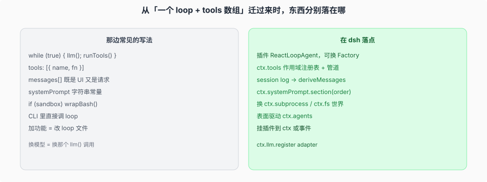

# 对照「单一 loop + tools 数组」

本篇面向熟悉“单一 loop + tools 数组”架构的读者，映射原有职责在 dsh 中的归属。

## 逐项搬家

| 你原来可能写的 | 在 dsh |
|----------------|--------|
| 一个 `while` 里调 llm 再跑 tools | `ReactLoopAgent` 插件。换驱动实现 `AgentFactory`，不要 fork 这份源码来加功能。 |
| `tools: [{ name, parameters, execute }]` | `ctx.tools.register`。可见性沿全局层、显式 scope 祖先层和 agent 自有层解析；`restrict` 过滤继承面，同名项由更近层覆盖。执行有三条 waterfall，审批和 timeout 是别人的插件。 |
| `messages` 数组既给 UI 又给下一请求 | `Session` log。UI 订 `session/event`；模型看 `deriveMessages()`。一次 model attempt 只有一条 settlement，assembled message 与 embedded stream 是同一事件的两半；`expandAssistantStream()` 才能拿回逐 token 事实。 |
| `const system = \`You are…\`` | `ctx.systemPrompt.section({ name, order, text })`。稳定前缀在前，但环境事实（Harness 来源路径、Web URL、cwd）已移到最尾；persona 拆成 prefix/suffix 两段。 |
| `if (useDocker) bash = dockerBash` | 远程组合同时替换 `ctx.subprocess` 与 `ctx.fs` provider，并共享 runtime owner；本地 confinement 则换 `ctx.shell` 的 sandbox 子类。tool-bash 源码不动。 |
| CLI `main()` 里 `await loop.run(prompt)` | 各入口都经 `ctx.agents` → `followup`。CLI / Web / ACP / SDK 可以处于不同进程和插件树，但复用 `Agent` 接口与 session 语义。 |
| 加功能 = 改 `agent.ts` 中间那段 | 对照 [`01-扩展表非显然落点.md`](./01-扩展表非显然落点.md) 找挂点。改 loop 要同步改 architecture.md。 |
| 换模型 = 换那个 `openai.chat.completions` 调用 | `ctx.llm` 登记 adapter。请求词汇在 `dsh-llm`，不在 loop。 |
| 子 agent = 递归调用同一个 loop 函数 | `ctx.subagents` seam：provider 可以运行进程内 child，也可以通过 ACP / JSON-RPC 驱动独立进程。Codex / Claude Code 这类产品 provider 是独立 Profile Bundle，装进 profile 后各自注册一个 dormant 默认 provider；preset 只决定要不要露出对应 tool 行。`backgroundMode` 在一次性 Job 与可续 child 之间选择，见 [`../capability-seams/03-subagent后台与产品provider.md`](../capability-seams/03-subagent后台与产品provider.md)。session header 的 lineage 不会自动建立 scope 父链；进程内 child 可加入父 agent 正在使用的同一 preset generation，但不继承父 agent 自有层。 |
| 配置 = 一大份 JSON | 空 `cordis.yml` + 有序 patch 层（profile / bundle / home / `--patch`）。 |

## 三条最容易带错的不变量

1. **模型看见的必须能从 log 重建。** 对话内容写成 surface；实际 config、adapterDefaults 与 tools 写进 `request/header`，system prompt 是 surface 节点 `system/message`。只有这两种现有表示都容纳不了的新语义，才新增 `SessionEventMap` 成员。
2. **waterfall 用 `next()` 委托。** 只观察或包装的 middleware 必须调用它；拥有 deny、retry、路由或替换结果的监听器可以直接返回并短路。
3. **产品能力不集中在 loop。** 普通功能注册到所属服务、注册表或事件；贡献由 `ctx.effect` 绑定生命周期，插件卸载时一并撤销。

读完对照，具体机制仍回各专题：runtime 原语、composition 叠层、session 世代与信封、seam 三角色、模型可见面、五个入口。
