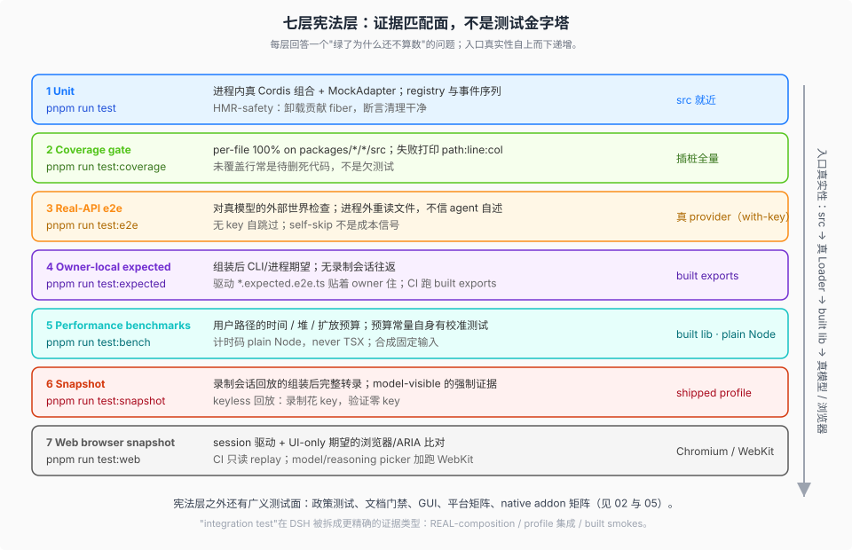

# Test Strategy · 测试思想、分层、快照与门禁

产品源码基线：`639ed015397290b3745d163aafe02ffee4aa3f84`（`dsh-v0.2.0-rc.2`）；本专题结论与该 commit 的项目树一致，规模计数与配置事实按该树实测。上游同步触及测试面时，按 [`_coverage/`](../_coverage/00-index.md) 的口径复核本专题。

## 一句话

DSH 有 1893 个测试文件，测试政策却只有 55 行（`docs/testing.md`）——整份政策的定语是 "the rules that keep a green suite meaningful"（让绿有意义）。围绕这一句话，测试被组织成七层**证据形态**（不按单元/集成/端到端三分）、mock 只放在贵的边界、断言验证世界而非自报、证据取自真实入口、CI 专门设防假绿机制。

## 这个专题回答什么

DSH 怎么测：测试思想与成文政策在哪、有哪些层、立了哪些规矩、快照怎么运转、CI 门禁怎么编排、可靠性纪律是什么、测试基建有哪些。

对象是 harness 本身：一个由模型厂自研自维护、日常研发主力包含 Coding Agent 的仓库，如何系统性地组织测试——测试思想、分层、规矩、快照机制、CI 门禁、可靠性纪律与基建，全部锚定本仓库的产品源码基线。

## 规模基线（硬事实，按基线树实测）

| 资产 | 数字 |
|---|---|
| unit spec | **1893** 个 `*.spec.{ts,tsx}`（packages 1358+265、apps 143+1、scripts 121、website 5），分布在 323 个 `tests/` 目录（packages 313） |
| e2e 车道 | **91** 个 `*.e2e.ts`（`vitest.e2e.config.ts` 实际 include 减去 exclude；另有 161 个归 web 车道） |
| expected 驱动 | 18（apps/cli）+ 8（apps/web，归 web 车道） |
| 快照场景 | **210** 个录制场景（session 122 / sdk 24 / acp 9 / web 55），`snapshots/` 全树 1278 个文件（1271 常规文件 + 7 个跨 profile sidecar 符号链接） |
| 性能门 | 7 个 bench（5 Host + 2 Client）+ 1 个 opt-in stress + 3 个手动 perf |
| vitest 配置 | 8 份运行配置 + 1 份共享门面（`vitest.shared.ts`） |
| 测试决策笔记 | **33 篇**（`.agents/notes/implemented/testing/`，另有 33 份 `.i18n.yaml` 配对）+ **4 篇** postmortem（`docs/postmortem/0001`-`0004`） |
| 测试基建 | `packages/test-support/` 七件套 + `benchmarks/support/` + vitest setup 三件套 |
| 政策测试 | approval-policy（`node --test`）/ issue-management（plain `node`）直跑 `.mjs` |
| Python 侧 | `python/sdk/tests/`（pytest via uv，无 tox）+ `scripts/snapshots/python-sdk-single-exe/` 7 场景 |
| CI 门禁编排 | `scripts/run-gates.ts` 18 个聚合模式；PR 必需 job 9 个 + 1 个观察性 |
| 插件面 | 95 个包以 named export 导出 `inject`、53 个 client `ui-*` 包、641 个 `.client.spec`——插件作者的测试策略见 [08-10](./08-plugin-testing.md) |

## 结构（11 篇机制参考）

| 问题 | 阅读入口 |
|---|---|
| 测试思想是什么、成文政策（宪法）在哪、指导怎么分布 | [`01-doctrine.md`](./01-doctrine.md) |
| 有哪些层、每层测什么、后缀怎么选中层 | [`02-tiers.md`](./02-tiers.md) |
| 立了哪些规矩、谁拥有什么证据 | [`03-rules-ownership.md`](./03-rules-ownership.md) |
| 录制会话快照怎么运转 | [`04-snapshot-machinery.md`](./04-snapshot-machinery.md) |
| CI 门禁怎么编排、平台矩阵怎么铺、防假绿怎么做 | [`05-ci-gates.md`](./05-ci-gates.md) |
| 测试可靠性纪律是什么、flake 怎么归因 | [`06-reliability.md`](./06-reliability.md) |
| 测试基建有哪些、各自职责与已知限制 | [`07-infrastructure.md`](./07-infrastructure.md) |
| 写一个 DSH 插件，测试面怎么摆（政策要求） | [`08-plugin-testing.md`](./08-plugin-testing.md) |
| 真实插件的测试组合长什么样（实战解剖） | [`09-plugin-testing-playbook.md`](./09-plugin-testing-playbook.md) |
| 一个插件 PR 的最小证据集与 CI 行为（检查单） | [`10-plugin-testing-checklist.md`](./10-plugin-testing-checklist.md) |
| 快照机制对插件仓暴露了什么（发布包、夹具双接受、接线语义、git 卫生、postmortem 校准） | [`11-snapshot-external-face.md`](./11-snapshot-external-face.md) |

## 阅读路径

- **10 分钟**：读本文件 + [`01-doctrine.md`](./01-doctrine.md)。`docs/testing.md` 只有 55 行，值得整读；01 逐条消化它并给出测试指导在文档体系里的完整分布图。
- **30 分钟**：加读 [`02-tiers.md`](./02-tiers.md)（分层全景与文件形态普查）与 [`03-rules-ownership.md`](./03-rules-ownership.md)（规矩与所有权）。
- **插件作者专线**：[`08`](./08-plugin-testing.md)（政策对插件的要求）→ [`09`](./09-plugin-testing-playbook.md)（真实插件组合解剖）→ [`10`](./10-plugin-testing-checklist.md)（PR 检查单）→ [`11`](./11-snapshot-external-face.md)（快照机制的对外面）；货架与分类法在 [`plugin-inventory`](../plugin-inventory/00-map.md)。
- **深潜**：按问题进 [`04`](./04-snapshot-machinery.md)（快照机制）、[`05`](./05-ci-gates.md)（CI 门禁与防假绿）、[`06`](./06-reliability.md)（可靠性纪律）、[`07`](./07-infrastructure.md)（基建与 Python 面）。

## 与其他专题的边界

| 对象 | 关系 |
|---|---|
| [`system-overview/03-门禁与性能基准.md`](../system-overview/03-门禁与性能基准.md) | 门禁聚合器与性能基准树的机制概述；本专题 [`05`](./05-ci-gates.md) 不重复其家族图，深入 CI lane 结构、必需性与防假绿 |
| [`harness-idea/`](../harness-idea/00-map.md) | 判断层（dsh 这种 harness 形态做对了什么）；本专题是机制消化层，测试相关的判断在那边 |
| [`_coverage/`](../_coverage/00-index.md) | 本专题的核验登记（承诺回答的问题、最近核验 commit） |
| [`_change_log/`](../_change_log/00-index.md) | 上游同步记录；同步触及测试面时按影响评估复核本专题 |

## 写作定调

- 消化文档，不是搬运：每篇给"它为什么这么定"的解释；硬事实 / 解释 分开标记。
- 事实锚点：仓库相对路径 + 符号/文件名，锚定顶部基线 commit；关键规则保留英文原文短引用。
- 不复述 `docs/testing.md` 全文——读者应直接读原文；本专题的价值在于把散在 policy / skill / Agent Note（33 篇）/ cookbook / 包 README / CI 配置 / 代码惯例里的测试体系拼成一张地图。
