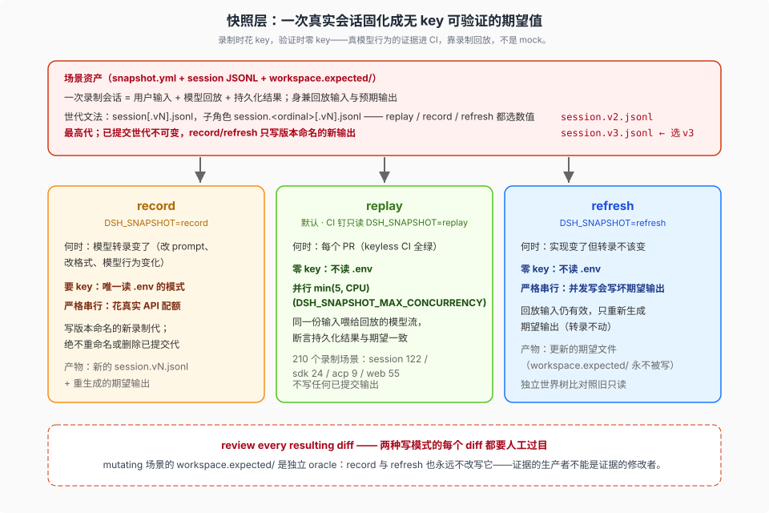
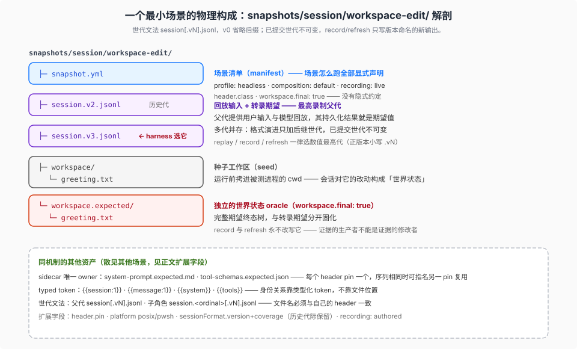

# 04 — 快照机制：录制会话回放怎么做期望值

> 本篇深挖七层里的 Snapshot 层（`pnpm run test:snapshot`）：机制、世代模型、四面分工、录制/刷新语义、夹具格式。政策依据见 [01](./01-doctrine.md) 教义 9，所有权见 [03](./03-rules-ownership.md)，CI 挂载见 [05](./05-ci-gates.md)。

## 现象是什么：把一次真实会话变成无 key 的期望值

Snapshot 层的定义（`docs/testing.md`）是 **keyless recorded-session replay**：录制时用真模型跑一次完整会话，把"用户输入 + 模型回放 + 持久化结果"固化成场景资产；CI 里无 key 回放——同一份输入喂给回放的模型流，断言持久化结果与期望一致。`snapshots/` 树在基线下有 1278 个文件（1271 常规文件 + 7 个跨 profile sidecar 符号链接），分四个面：`snapshots/session/`（headless）、`snapshots/sdk/`、`snapshots/acp/`、`snapshots/web/`。

一句话定位：**with-key e2e 证明"现在还对真模型工作"，快照证明"组装后的完整转录没有意外变化"**。前者是活的，后者是固化的；两者互补，谁也不能替代谁（"package, e2e, mock-only, and rationale evidence does not replace the assembled transcript"）。

## 核心机制（硬事实）

### 1. 父子世代模型

- 顶层场景的**最高录制父代**（highest recorded parent generation）提供用户输入与模型回放，其持久化结果充当期望值。
- 文件名文法：父代 `session[.vN].jsonl`；子角色 `session.<ordinal>[.vN].jsonl`；`v0` 省略后缀，正版本必须小写 `.vN`；**每个文件名必须与自己的 header 一致**。
- replay / record / refresh 三种模式都选每个角色的最高世代。
- 世代模型是相邻迁移（adjacent migration）策略的一部分：格式演进时**只加后继世代、绝不动已提交的世代**——历史期望永远保留，迁移覆盖由显式 `sessionFormat` owner 的场景承担。

### 2. 四面分工

同一个机制按进程入口分四个面，各自拥有一种行为证据：

| 面 | 入口 | 拥有的证据 |
|---|---|---|
| `snapshots/session/` | headless（`dsh` 一次性跑） | 一次性行为 |
| `snapshots/sdk/` | SDK | 持久控制（TypeScript SDK 投影） |
| `snapshots/acp/` | ACP | 自动化协议行为 |
| `snapshots/web/` | Web | 同一 Session 旁的浏览器/ARIA 证据 |

Web 渲染可以显式借用另一个场景的 canonical session（"a Web rendering may explicitly borrow another scenario's canonical session"）——证据与输入解耦，不重复录制。

### 3. 场景清单：snapshot.yml

每个场景一份 `snapshot.yml`，声明：profile、composition/header class、recording policy、例外的 replay/input 元数据、workspace facts。场景怎么跑、录什么、比对什么，全部显式声明——没有隐式约定。

### 4. 身份保持与 sidecar 所有权

- **typed tokens 保留 parent/child 身份关系**——回放时父代会话与子角色的对应关系不靠文件位置，靠带类型的 token。
- **只有 header pins 拥有 prompt/schema sidecars**——哪些 sidecar 属于哪个 pin 是明确的所有权关系，防止比对了不该比对的东西。

### 5. mutating 场景的世界树比对

对会改写工作区的场景：独立比对完整的 `workspace.expected/` 树，并且 **record 与 refresh 永远不改写它**。这是 [01](./01-doctrine.md) 教义 5（verify the world）在快照层的投影——期望的"世界状态"与期望的"转录"分开固化，且前者对录制流程本身也是只读的。

### 6. record vs refresh 的分叉

| 模式 | 什么时候用 | 语义 |
|---|---|---|
| `test:snapshot:record`（`DSH_SNAPSHOT=record`） | **模型转录变了**（改 prompt、改格式、模型行为变化） | 重新录制会话 |
| `test:snapshot:refresh`（`DSH_SNAPSHOT=refresh`） | **回放输入仍有效**（实现变了但转录不该变） | 重新生成期望输出 |
| replay（默认） | CI | 只读回放比对 |

共同纪律："review every resulting diff"——两种写模式产出的每个 diff 都要人工过目。CI 强制只读（`DSH_SNAPSHOT=replay`）。

### 7. 执行形态（来自 `vitest.snapshot.config.ts`）

- include：`scripts/session-snapshot-corpus.corpus.ts` + `snapshots/**/*.snapshot.ts`；`DSH_EXAMPLE_MODE=lib` 时追加 `apps/web/tests/**/*.snapshot.ts`（组装 Web 快照执行生成的 client bundle，需先 build——CI 的 ci-snapshot 门就是这个形态）。
- 并发纪律：**replay 才并行**（`DSH_SNAPSHOT_MAX_CONCURRENCY` 默认 min(5, CPU)）；**record/refresh 严格串行**——record 花 API 配额、refresh 并发写会写坏期望输出。
- keyless 默认：只有 `DSH_SNAPSHOT=record` 才读 `.env`（回放不需要任何 key）。

## 夹具格式（硬事实）

- Session 夹具**保留 headers 与 payloads，省略 body 序列/时间包络；replay 合成它们**——夹具是"语义内容"，不是"字节级录像"；时间与顺序这类非确定因素在回放侧重建。
- 当前夹具用 writer format 命名与 header，一行一事件，内嵌紧凑的 Assistant 流。
- **历史夹具保留它们发布时的表示**——不追着新格式重写旧资产；迁移覆盖由显式 `sessionFormat` owner 的场景承担。
- 新增格式版本走 `docs/cookbook/adding-a-session-format-version.md` 的 snapshot-successors 流程：加后继、不改前驱。

## 为什么这么定（解释）

1. **"assembled transcript" 是不可替代的证据形态。** 单测证明组件行为，e2e 证明现在能跑，但"组装后的完整转录"（模型看到了什么、说了什么、落了什么盘）只有快照能固化。这就是为什么它被定为强制条件（[03](./03-rules-ownership.md) 条令 1）。
2. **世代模型让"期望"与"格式演进"解耦。** 会话格式是有版本的持久化契约；期望资产如果跟着格式重写，迁移覆盖就永远测不到"老会话在新版本下怎么读"。加后继不改前驱，等于给每代格式留了活的回归样本。
3. **keyless 回放 = with-key 立场的 CI 落地。** [01](./01-doctrine.md) 教义 3 说"不限额真 API"；但 PR CI 没有 key。快照层把"真模型行为的证据"做成**可以无 key 验证的固化资产**——录制时花 key（本地/夜间），验证时零 key（每个 PR）。**真模型的证据进 CI，靠的是录制回放，不是 mock。**
4. **mutating 场景的 `workspace.expected/` 是"verify the world"的静态化。** 转录期望与世界状态期望分开，且后者连录制流程都不能碰——证据的生产者不能是证据的修改者。

## 场景解剖（`snapshots/session/workspace-edit/`）

一个最小场景的物理构成（硬事实）：

| 文件 | 是什么 |
|---|---|
| `snapshot.yml` | 场景清单：`version`、`scenario`、`profile: headless`、`composition: default`、`recording: live`、`header.class`、`workspace.final: true` |
| `workspace/greeting.txt` | 种子工作区（运行前拷进被测 cwd） |
| `workspace.expected/greeting.txt` | 完整期望终态树（record/refresh 永不改写） |
| `session.v2.jsonl` + `session.v3.jsonl` | **多代并存**；harness 选数值最高代（v3） |

`snapshot.yml` 的扩展字段散见其他场景：`header.pin` / `childSystemPrompts` / `childToolSchemas`（sdk/subagent-continuable）、`recording: authored`（subagent-parallel）、`sessionFormat.version + coverage`（历史代际保留）、`platform`（posix/pwsh）、`environment`、`input.task`、`workspace.setup/parent`。

session JSONL 一行一事件、首行 header；身份与路径全部用类型化 token——`{{session:1}}`、`{{message:1}}`、`{{system}}`、`"tools":"{{tools}}"`；提示词与工具 schema 各有唯一 sidecar owner（`system-prompt.expected.md` / `tool-schemas.expected.json`）。

### 驱动与模式链（DSH_SNAPSHOT 三值）

- **驱动**：`snapshots/session/headless.snapshot.ts` 按目录枚举 `snapshot.yml` 生成 per-scenario 用例，经 `dsh --profile headless` + `cordis.snapshot.yml`（replay overlay patch）回放比较。场景计数：session **122**、sdk **24**、acp **9**、web **55**，共 **210 个**。
- **模式解析**：每个消费侧 suite 自带 `snapshotMode()`——`undefined|''|'replay'→replay`；`'record'`；`'refresh'`；其余值 throw。
- **env 注入**：`packages/test-support/session-snapshot/src/harness.ts` 向子进程注入 `DSH_SNAPSHOT` / `DSH_SNAPSHOT_FILE` / `DSH_SNAPSHOT_OVERRIDE` / `DSH_SNAPSHOT_CHILD_FILES` 等。
- **消费者**：`@deepseek-ai/dsh-llm-replay` 插件——config 的 `file/overrideFile/childFiles` 缺省取上述 env；嵌套 agent 按 first-call-order 绑定；`assertConsumed()` 把静默 underrun 变成明确诊断。

## 存储规则与工具（`dsh-session-snapshot`）

快照层的 owning 工具是 `packages/test-support/session-snapshot`（9 个源文件：index / harness / launcher / manifest / session-files / normalize / identity / workspace / suite）。职责（README）：封闭 manifest、类型化身份重绘、normalizer、workspace 比较、fixture 守卫、headless/SDK/ACP/Web 四类 owner 的协议适配器；包入口 import vitest，只能在 vitest 内用。所有权规则在 [03](./03-rules-ownership.md)；这里记超出 `docs/testing.md` 概述的机制（硬事实）：

- **normalizer 的边界**：保留完整 header/事件 payload，省略顶层 seq/time envelope，擦系统提示与工具 schema bulk，`{{cwd}}` 替换生成的工作区路径。
- **独立输出 oracle**：保留历史输入的场景里，canonical Session 文件不变、继续被选为回放输入；精确规范化后的 native writer 输出单独记录在 `writer.expected.jsonl` / `writer.<ordinal>.expected.jsonl`——它们是**输出比较基准，不是 replay 代际**。
- **代际不可变**：record/refresh 绝不重命名或删除已完成 generation（含后续 run 不再产生某 child 角色的情况）；受审阅的源树整理只有在同角色有已验证当前替代后才移除前代；选定历史角色 ≤10 且当前代占多数派。
- **收集前提**：会话收集需要 `compression: 'none'` 的原始 JSONL（压缩 JSONL 没有快照收集路径）。
- **sidecar 去重**：每个 header pin 默认拥有 `system-prompt.expected.md` / `tool-schemas.expected.json`；序列相同时可指名另一 pin 为来源，每个不同版本只提交一次。
- **平台变体**：`posixOnly` / `pwshOnly` / `workspaceParent`（工作区父目录移出平台临时区）。
- **fixture 守卫先于比较**：任何比较结果被采信之前，守卫先拒绝畸形/漂移 fixture（遗留目录、缺角色、一 header 类多 pin、重复 sidecar、未擦提示文本、无前置 system/message 的 request/header）。
- **语料测试把三棵树全钉住**：`packages/test-support/llm-replay/tests/session-format-corpus.spec.ts` 经真实 catalog 还原 `snapshots/`、`packages/`、`scripts/snapshots/python-sdk-single-exe/` 下**每个**带版本 `session*.jsonl` 且不改源字节；被有意拒绝的历史转换按路径/代际/错误类型 pin——"拒绝消失或变化都会使测试失败"。**夹具本身也有夹具级的测试。**
- **已知风险被明文记录**：corpus 决策笔记承认——同一录制会话身兼回放输入与预期输出，可能**一致地**复现一个坏模型脚本；所以独立的世界状态断言、协议/UI 预期、真实模型录制仍是必需的互补证据。

## 源码锚点

- `docs/testing.md` Snapshot tier + 夹具段落——机制的官方定义
- `vitest.snapshot.config.ts`——replay 并行 / record-refresh 串行、`DSH_EXAMPLE_MODE=lib`
- `packages/test-support/session-snapshot/`——共享存储规则与 profile 适配器的 owning 包
- `docs/cookbook/adding-a-session-format-version.md`（snapshot-successors 一节）——加后继不改前驱的流程
- `snapshots/{session,sdk,acp,web}/`——四个面的场景树

## 最小例证

1. **世代文法可检索**：`ls snapshots/session/<scenario>/` 看 `session.jsonl` / `session.1.v1.jsonl` 一类文件名——v0 省略、正版本 `.vN` 的文法直接可见。
2. **回放零 key 可验证**：读 `vitest.snapshot.config.ts` 的 `.env` 加载逻辑——只有 record 分支读，replay 分支无任何 key 读取。
3. **refresh 串行的理由写在注释里**：同文件 record/refresh 并发注释——"record 花 API 配额、refresh 并发写会写坏期望输出"，把串行纪律的理由就地留档。
