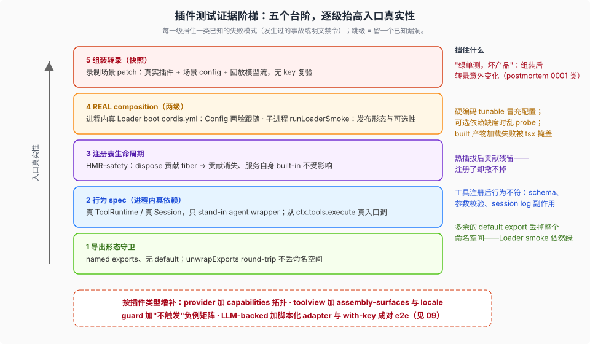

# 08 — 插件测试策略：政策对一个新插件的要求

> 本篇面向**插件作者**：DSH 出厂自带 316 个包、92 个 `ctx` 服务、30 个工具包（[`plugin-inventory`](../plugin-inventory/00-map.md) 口径）；本篇实测另有 95 个包以 named export 形态导出 `inject`、53 个 client `ui-*` 包——它们全部按同一套测试要求受审。[§plugin-inventory](../plugin-inventory/00-map.md) 讲"货架上有什么、九形态 × 四 role 怎么分"；本篇讲"你写一个新插件，测试面怎么摆"。政策教义见 [01](./01-doctrine.md)，分层与车道见 [02](./02-tiers.md)。

## 现象是什么：同一套要求，形态随插件类型变

`docs/testing.md` 的条款是通用的，但落到插件身上有固定形态：**导出形态守卫 → 行为 spec → 注册表生命周期 → REAL composition → 组装转录**，五个台阶逐级抬高入口真实性。跳过任何一级，都有对应的、已经发生过的事故或明文禁令。

**台阶与 [02](./02-tiers.md) 七层的关系**：台阶不是新的层——台阶 1~3 都落在 **Unit 层**内（一个 spec 文件可以同时覆盖三阶）；台阶 4 落在 **Real-API e2e 车道**（`loader-composition.e2e.ts`，keyless、无模型调用）与 built-bin-smoke 门；台阶 5 就是 **Snapshot 层**。



## 台阶一：导出形态守卫（spec 级，成本最低）

function plugin 以 named exports 发布 `name` / `inject` / `Config` / `apply` 且**不得有 default export**；service 类插件 default-export 服务类。守卫写法（全仓 43 个 spec 含此断言）：

```ts
expect('default' in toolLsp).toBe(false)
const unwrapped = loader.unwrapExports(toolLsp)
expect(unwrapped).toBe(toolLsp)          // round-trip：Loader 不会丢命名空间
expect(unwrapped.name).toBe('tool-lsp')  // name/inject 穿过 unwrapExports 仍在
```

样板：`packages/lsp/tool-lsp/tests/load-path.spec.ts:14`。为什么这么严：postmortem 0001 的 bug #1——一个多余的 `export default` 让 Loader 的 `unwrapExports` 解析到裸函数、丢弃整个模块命名空间，Loader smoke 依然绿。`packages/AGENTS.md` 把它固化为包层常驻条令（[03](./03-rules-ownership.md)）。

## 台阶二：行为 spec（进程内，真依赖只 stand-in 最外层包装）

**政策原文的投影**："keep everything downstream real"（[01](./01-doctrine.md) 教义 4）。插件的样板写法（`packages/todo/tool-todo/tests/tool-todo.spec.ts` 头注释）：

> "Drives the REAL plugin body: mounts `dsh-tool-todo` on a real `ToolRuntime` … with a fake parent Agent carrying a real `Session` — so the append the tool makes is observable on a genuine session log (**only the agent wrapper is a stand-in; the session and the tool are the shipping code**)."

要点：

- 挂**真实的** `ToolRuntime` / `SessionStore` / `SystemPrompt` 等依赖服务，只把 parent Agent 换成假包装；
- 断言从真实入口进：`ctx.tools.execute({ name: 'todo_write', … })`，而不是直接调插件导出的函数——守卫的是注册后的行为（schema、参数校验、结果形状、session log 副作用）；
- 独有行为单列 describe（tool-todo 的 `allowParallelInProgress` 一节）。

## 台阶三：注册表生命周期（HMR-safety 是强制模式）

"Every registry gets an HMR-safety test (dispose the contributing fiber, assert cleanup)"——全仓 72 处 `(HMR safety)`。插件的贡献（工具、projection、命令、UI slot）都注册在某个 registry 上，插件作者要证明：dispose 掉自己的 fiber，贡献消失，服务自身 built-in 不受影响。样板：`packages/todo/tool-todo/tests/projection.spec.ts`。

## 台阶四：REAL composition（两级，分工不同）

政策原文："Hand-built `ctx.plugin(...)` suites are insufficient"——但"真组装"有两个级别，插件作者两个都要懂：

1. **进程内真 Loader boot**（`*.spec.ts`）：在 vitest 里用真的 `Loader` + `Include` 读一份临时 `cordis.yml` 启动插件，`await ctx.loader.await()`。它证明的是 **Config 是真配置**——`tool-todo/tests/loader-composition.spec.ts` 的头注释就是这个意图："Proves `allowParallelInProgress` is real configurability and not a constant: the flag is set in a cordis.yml booted through the real Loader, and both faces it controls — the model-facing description and the accepted input — follow it."（模型可见的 description 和接受的输入**都**要跟着 flag 变——这是 root `AGENTS.md` "no hardcoded tunables" 条款的测试投影：一个 `DEFAULT_*` 常量或单测 hook 不构成可配置性证据。）
2. **子进程 Loader smoke**（`*.e2e.ts` + `runLoaderSmoke`）：以发布形态（built `lib/`，CI 的 `DSH_EXAMPLE_MODE=lib`）启动 driver 子进程断言 stdout。样板：`packages/subagent/subagent-codex/tests/loader-composition.e2e.ts`——把 `PATH` 置空，注释写明意图："Loading the optional package must not probe or start a Codex binary"，然后断言三个 provider 实例与 capabilities 的完整 JSON。可选依赖插件用这一手证明**缺席时不 probe、在场时组装出正确实例**。

两级都过了，才轮到台阶五。

## 台阶五：组装转录（model-visible 改动必须同 PR）

插件会改模型请求/转录的（新工具、新 system prompt 注入、新投影事件），同 PR 加或更新 keyless 录制场景（[04](./04-snapshot-machinery.md)）。插件在快照里的出现方式是 **patch**：`snapshots/session/*/cordis.snapshot.yml` 用 `disabled: true` 禁掉真实 provider、用场景 `config:` 覆盖本插件参数——真实插件、场景配置、回放模型流。

## 配套纪律（与台阶同交）

- **mock 白名单**：插件测试里唯一常见 mock 是模型（scripted adapter，如 `core/agent-loop/tests/mock-adapter.ts` 的 `MockAdapter`，跨包经源码平面相对导入复用）；网络/时钟才可 mock。with-key e2e 用共享 harness 挂全真栈（`packages/fs/tool-fs/tests/harness.ts` 挂 AgentLoop + LlmDeepSeek + LocalFileSystem + FsPolicy + ToolFs），harness 放 include 之外（[02](./02-tiers.md)）。
- **face 命名**：`.host.spec`（全仓 80 个）与 `.client.spec.*`（641 个，含 `.ts` 与 `.tsx`）后缀决定该文件被哪个 tsc face program 类型检查（[02](./02-tiers.md) "测试代码自身也过静态门"）；client 侧再加 `@vitest-environment jsdom` pragma。
- **运行时不变量**：插件若拥有可发散的观察关系，发布 `./invariant` 入口并用 `InvariantRegistry, { enabled: true }` 测试它（样板：`packages/todo/tool-todo/tests/invariant.spec.ts`；空壳 invariant 被 `verify-package-invariants` 拒绝）。
- **README 限制清单**：`verify-package-readme-limitations` 门要求插件 README 带已知限制节——mock 证明不了什么，要写下来（[07](./07-infrastructure.md)）。

## 为什么这么定（解释）

1. **台阶是按"事故成本"排的**。导出形态最便宜（一行断言）却挡住过最贵的事故（0001 生产炸裂）；REAL composition 最贵（boot 成本），所以放在行为 spec 之后只测"组装语义"（Config 与实例拓扑），不重复测行为。
2. **两级 REAL composition 分工 = 组装语义与发布形态分离**。进程内 boot 快、可断言上下文内部状态；子进程 smoke 慢、只断言可观测 stdout——它顺带成为 built-bin-smoke 门（16 文件清单，[05](./05-ci-gates.md)）的一部分，在 CI 上用 built 产物再跑一遍。
3. **Config 的"两脸跟随"断言是插件特有的**。库的配置测试只验行为分支；插件的配置还会流到**模型可见面**（description、prompt），所以可配置性证据必须同时覆盖两脸。

## 源码锚点

- `packages/todo/tool-todo/tests/`——五件套全景（本篇与 [09](./09-plugin-testing-playbook.md) 的主样板）
- `packages/lsp/tool-lsp/tests/load-path.spec.ts:14`——导出形态守卫样板
- `packages/subagent/subagent-codex/tests/loader-composition.e2e.ts`——子进程 REAL composition 样板
- `packages/fs/tool-fs/tests/harness.ts`——with-key e2e 的全真栈 harness
- `packages/AGENTS.md` + `docs/testing.md` "Test the real entry path"——政策原文
- `docs/postmortem/0001-acp-default-export-drops-inject.md`——为什么台阶一存在

## 最小例证

1. **守卫可检索**：`grep -rn "expect('default' in" packages --include="*.spec.ts"`——43 个文件。
2. **Config 两脸跟随可复现**：读 `tool-todo/tests/loader-composition.spec.ts` 两个 it——同一个 flag，断言 description 包含/不包含两种措辞、并行写被拒/放行。
3. **可选性可复现**：读 `subagent-codex/tests/loader-composition.e2e.ts` 的 `PATH: ''` 与断言 JSON。
