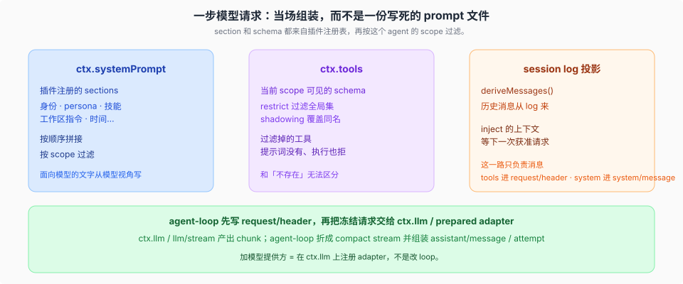
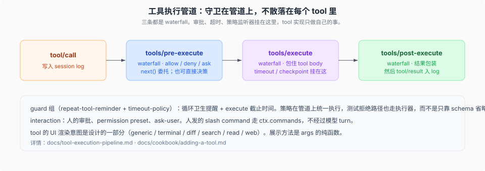

# Tools, prompt, LLM · 模型可见面

## 一句话

模型每一步看见的东西由插件注册表**当场组装**：`ctx.systemPrompt` 的 section，加上 `ctx.tools` 里当前 scope 可见的 schema，历史则从 session log 投影。请求经 `ctx.llm` 的 adapter 流出；工具调用走三条 waterfall 管道。

这一层是「模型可见面」。它依赖 [session log 与 scope](../session-and-loop/00-map.md)。

## 一步请求从哪来



三股汇合：

1. **Prompt sections** — 插件往 `ctx.systemPrompt` 注册片段（身份、persona、工作区指令、时间……），按顺序、按这个 agent 的 scope 过滤后拼起来。
2. **Tool schemas** — `ctx.tools` 里该 scope chain 仍可见的工具。全局层和祖先层按远到近合并，chain 上的 `restrict` 过滤这份继承面，当前 agent 自有层最后覆盖或补充——delegation 注册进子代理 own-layer 的是它的 structured-output tool，这条豁免专门保住它（`packages/core/tools/src/index.ts:1131`）。被过滤的工具在提示词和执行中都表现为不存在。
3. **历史** — `deriveMessages()` 从 surface 投影。`inject` 的材料等下一次获准请求，获准后写成 `user/message`。图像以 durable attachment 引用进 content block，不把 inline base64 留在日志里；请求序列化时才把 durable 图像解析成 provider 的 file id（DeepSeek Files API 优先，失败回退 base64 data URL），并受每请求图像字节/数量上限约束。`llm-deepseek` 的 `DeepSeekFileStore` 按 `variantId` 索引复用已上传文件，带过期与配额回收；provider 拒绝 file id 时 invalidate 该映射并在同一请求重试一次。413 映射为 `INVALID_REQUEST`。PTC 模式子工具若返回 image block，会在本次 `run_code` 结束之后 `deferContext` 成一条 user message，而不是嵌在父 tool 结果里。

> **图像编码管线**：上游 #2676 引入了统一的 encoding ladder（`attachment-local` 的 `encoding.ts`、`normalization.ts`、`compression-limiter.ts`、`request-image.ts`）。`saveImage` 返回 canonical ref 与 source facts。Alpha 感知编码：透明通道走独立 quality ladder。`read_image` 上报降采样后的尺寸与坐标比例。`llm/llm` 的 `content.ts` 支持多模态 image 内容装配。

组装完成后，loop 先把生效的模型配置与 tools 写入 `request/header`，system 文本经 `SystemPromptProjection` 派生为 `system/message` surface node，再分派请求。因此普通 section 可以动态计算，不需要单独新增事件类型；可重建的是它实际进入请求的结果。

面向模型的文字从**模型视角**写：提示词、schema、结果、诊断里只有任务相关概念，没有 UI、传输、实现词汇。

加模型提供方：在 `ctx.llm` 上注册 adapter。官方 DeepSeek adapter 的 thinking effort 是 `off` / `low` / `high` / `max`（省略默认 `high`）；`off` 在线上发 `thinking.type: disabled`，其余发同名 `reasoning_effort`。加面向模型的能力：在 `ctx.tools` 上注册，它的 schema 会自动加入组装。都不必改 loop。

llm 配置面在 rc.1 收紧两处（PR #3403）：provider profile 的 `headers` 在 resolve 时按 Fetch `Headers` 语义校验，非法字段名/值载入即拒（`packages/llm/llm-pi-ai/src/config.ts:385` 的 `assertValidHeaders`，由 `resolveProfiles` 逐 profile 调用）；model discovery 新增 `StoredModelDiscoveryProfile`（部署 headers + 惰性 `resolveApiKey`，`packages/llm/llm-pi-ai/src/discovery.ts:252-256`），探测请求携带已配置路由的 headers，不再裸探测打 401（`packages/llm/llm-pi-ai/src/index.ts:243-262`）。

## 工具执行管道



```text
tool/call（入 log）
  → tools/pre-execute     allow / deny / ask；next() 委托下游
  → tools/execute         包住 tool body；timeout 也挂在这
  → tools/post-execute    包装结果
tool/result（入 log）
```

参数在进入 `pre-execute` 前已经解析、记录并冻结；这条事件只作 `allow` / `deny` / `ask` 决策，不改写参数。监听器调用 `next()` 表示委托下游，也可以直接返回自己拥有的决定。`tools/execute` 是 around-dispatch，timeout 和 checkpoint 包住 tool body。守卫在管道上统一执行，不散落在每个 tool 里。

和人相关的两条容易混：

- **审批 / permission / ask-user** 挂在 interaction 与这条管道上，仍然是模型 turn 的一部分。
- **人敲的 slash command** 走 `ctx.commands`，**不经过模型 turn**。那是另一个平面，见 [surfaces](../surfaces/00-map.md)。

tool 的 UI 渲染意图是设计的一部分，一开始就要定：`generic` / `terminal` / `diff` / `search` / `read` / `web`（`packages/core/tools/src/presentation.ts:54,85,111,217,282,356`）。展示方法是 `args` 的纯函数。

## 源码入口

| 路径 | `ctx` key | 角色 |
|------|-----------|------|
| `packages/core/system-prompt/` | `ctx.systemPrompt` | section 与 schema 组装 |
| `packages/core/tools/` | `ctx.tools` | 作用域注册表 + 守卫管道 |
| `packages/llm/llm/` | `ctx.llm` | 消息/流词汇 + adapter seam |
| `packages/llm/llm-deepseek/` | | DeepSeek provider |
| `packages/guard/` | | 循环卫生、execute 截止时间 |
| `packages/interaction/` | | 审批、permission、ask-user |
| [`docs/tool-execution-pipeline.md`](../../docs/tool-execution-pipeline.md) | | 管道 |
| [`docs/cookbook/adding-a-tool.md`](../../docs/cookbook/adding-a-tool.md) | | 加 tool |
| [`docs/cookbook/adding-an-llm-adapter.md`](../../docs/cookbook/adding-an-llm-adapter.md) | | 加 adapter |

## 机制级正文

| 文件 | 内容 |
|------|------|
| [`01-section顺序与前缀.md`](./01-section顺序与前缀.md) | `order` 约定、complete section、KV 前缀 |
| [`02-管道审批timeout与chunk.md`](./02-管道审批timeout与chunk.md) | `tools/*` 与 `approval/request`；stream 入 log、message 进 surface；ReplayEnvelope；PTC 图像 defer |

入口如何投影同一条流：[`../surfaces/00-map.md`](../surfaces/00-map.md)。
