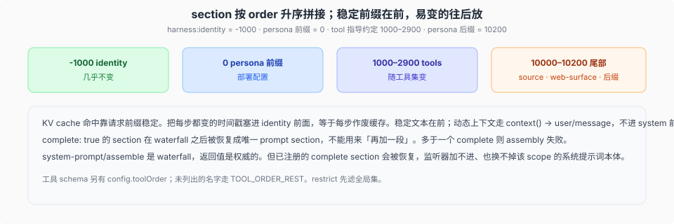

# Prompt section 顺序与前缀稳定

源码核验入口：`packages/core/system-prompt/src/index.ts`。

模型每一步的 system 文本是注册表当场拼的。顺序就是 KV cache 能不能命中前缀的机械原因。

## 谁在拼

`SystemPrompt.section` / `context` / tool-schema provider 都走 `dsh-scope` 的层。全局层之后按 scope parent chain 从远到近合并，同名由最近层覆盖。重复名或非有限 `order` 抛。登记和卸都会 `emit('system-prompt/change')`（不过滤：全局变化影响每个 scope）。

内置（构造时，与选哪个 loop 无关）：

- `harness:identity`，`SECTION_ORDERS.HARNESS_IDENTITY = -1000`（可用 config 关掉，注册在 `packages/core/system-prompt/src/index.ts:420-425`，name 在 `:421`）
- `deployment:persona-prefix`，`SECTION_ORDERS.DEPLOYMENT_PERSONA_PREFIX = 0`（`packages/core/system-prompt/src/index.ts:123,174,427`），文本来自 `config.personaPrefix`（默认空串）
- `deployment:persona-suffix`，`SECTION_ORDERS.DEPLOYMENT_PERSONA_SUFFIX = 10200`（`packages/core/system-prompt/src/index.ts:153,177,433`），文本来自 `config.personaSuffix`（默认空串）；它刻意排在全部可复用指令之后

工具包自己登记 `tool:bash` 这类跨调用指导，主体约定 1000–2900：`SECTION_ORDERS` 里 `TOOL_BASH` 1000、`TOOL_PWSH` 1010、…、`TOOL_REPORT` 2900（`packages/core/system-prompt/src/index.ts:121-154`）；`tool:bash` 实际经 `getSectionOrder('TOOL_BASH')` 注册（`packages/shell/tool-bash/src/index.ts:237`）。负 order 只剩 `HARNESS_IDENTITY`（-1000）一个，`DEPLOYMENT_PERSONA_PREFIX` 是 0，500–900 是模式与文件引用等约定（`PLAN_POLICY` 500、`TEAM_POLICY` 600、`PTC_ONLY` 800、`FILE_REFERENCE` 900），从 1000 起是工具指导，其后 `TOOLS_SDK` 5000、`DELIVERABLE_FILE_REFERENCES` 9000、`STRUCTURED_OUTPUT` 9900 仍是可复用指令；**环境事实（`HARNESS_SOURCE` 10000、`WEB_SURFACE` 10100）与 persona 后缀（10200）刻意排在全部可复用指令之后**，因为它们逐机器/逐用户不同，放在前面会让本可共享的前缀在开头就分叉。

## 为什么前缀要稳

提供方 KV cache 按请求前缀匹配。每步都变的东西（时钟、随机提示）若插到 identity 前面，等于每步作废缓存。约定：

- `-1000` 附近：产品身份，几乎不变。
- `0`：部署 persona 前缀，随 profile 变，不随每一步变；`10200` 的 persona 后缀也随 profile 变，但刻意排在环境事实之后。
- `1000–2900`（另有 `TOOLS_SDK` 5000、`DELIVERABLE_FILE_REFERENCES` 9000、`STRUCTURED_OUTPUT` 9900）：工具指导，随 **restrict / 本 agent 可见工具集** 变——换工具集本来就会换前缀。
- `10000+`：环境事实。`HARNESS_SOURCE` 10000（Harness checkout 路径）、`WEB_SURFACE` 10100（本机 Web URL）逐机器不同，`DEPLOYMENT_PERSONA_SUFFIX` 10200 逐 profile 不同，放在可复用指令之后，避免本来可共享的前缀在开头就分叉。
- `systemPrompt.context()`（如 `approval:policy` order 115、`sandbox:policy`）**不进 system 前缀**。loop 的 `RuntimeContextProjection` 把 `joinContextSections` 收成 `user/message` 快照，拼进下一次获准 enter；政策切换因此不打乱 KV 前缀。这不是 `agent.inject()`。

`config.toolOrder` 排 schema 名字；未列出的走保留名 `TOOL_ORDER_REST`。provider 返回这个保留名会让 assembly 失败。

## `complete` 与 waterfall

`system-prompt/assemble` 是 waterfall，返回值是权威的。但带 `complete: true` 的 section：assembly 仍跑完 waterfall（好让 tools / contexts / variables 被解析），然后**恢复**这一段为唯一 prompt section。监听器加不进、也换不掉该 scope 的系统提示词本体。多于一个有效 complete → assembly 失败。

信号只控制这一次显式 assembly，监听器不得留下来控制后续 turn。

## 和模型可见不变量的交接

拼出来的 system 字符串是 surface 节点 0（事件 `system/message`），完整 tool schemas 与生效的模型配置写进 `request/header`。重建某次历史请求时，在该请求开始流出前的日志前缀中取最后一份完整快照，不需要重新运行当时的插件树；消息历史仍由同一前缀的 surface 投影。header 的 reason 集合仍是 `'initial' | 'resume' | 'change' | 'series'`，但 `change` 现在只意味着 config 或 tools 变了：prompt 变化在不 capable 的 route 上是「替换 node 0 + 紧随一条 `series` header」（若 header 自身也变了，则是带 `startsSeries` 的 `change`），capable route 上则是 append 一个新节点，可能根本不产生 header；新 loop 实例面对已有 header 事件时是 `'resume'`。section 可以在每次 assembly 时重新计算，但进入模型的结果必须先落进 surface 与 header 这份可重建表示。细节见 [`03-system-prompt作为surface节点.md`](./03-system-prompt作为surface节点.md) 与 [`04-in-history提示词替换.md`](./04-in-history提示词替换.md)。
