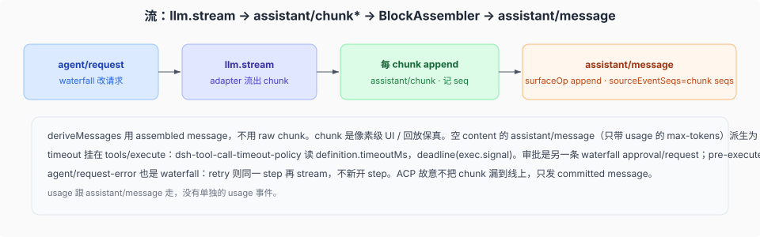

# 工具管道、审批、timeout，以及 chunk 如何入 log

> 基线 `47f943859bef60e4160492346772ded9b24f765a`。`packages/core/tools/src/index.ts` 事件、`packages/guard/timeout-policy/`、`packages/interaction/user-approval/`、`packages/core/agent-loop/src/agent.ts` `step()`。

介绍篇画了三条 waterfall。这篇钉监听器挂在哪，以及流式 chunk 怎样变成两条不同的 log 事件。



## 三条 `tools/*` 加上一条 `approval/*`

```text
tool/call（log）
  tools/pre-execute     → PreToolDecision：allow | deny | ask
  tools/execute         → 真正 dispatch；timeout 包在这
  tools/post-execute    → 包装 / 替换结果
tool/result（log，surface）
```

都是 waterfall，必须 `next()`。scope 过滤：agent-scoped 监听器只收到该 agent 的调用。

`pre-execute` 默认 inner 是 allow。`ask` 没有审批支持 → 否决。异步门必须看 `exec.signal`；注册表在它们结算后复核取消，但**不丢弃**它们的 promise。

审批本身是另一条 seam：`ctx.approval` + waterfall `approval/request`。审计事件 `approval/asked` / `approval/decided` / `approval/policy` 都是 **log-only**，不进 `deriveMessages`。模型从 runtime-context 快照和 tool result 得知结果，不从审批事件本身。缺 answerer fail-closed。

hooks（Claude Code / Codex 桥）把外部 permission 决策映射成 `pre-execute` 的 allow/deny/ask。人点的 slash command 走 `ctx.commands`，不进这条管道。

## timeout 挂在 `tools/execute`

`dsh-tool-call-timeout-policy`：读 `ctx.tools.get(name, agent)?.timeoutMs`。未声明则 `next()`。有则 `deadline(exec.signal, timeoutMs)`。超时返回模型可见的失败结果，不是抛给 loop 当基础设施错误。

`timeoutMs` 在 `defineTool` 时声明，必须是正有限数。这是 **tool 调用**预算。shell 的 foreground `timeoutMs` 是 **进程**预算。一次 bash 可能两边都有。

`tools/execute` 包装只许改 `exec.signal`，调用身份不可变。注册表在 body 前重新融合原来的 caller signal，替换不能摘掉取消。包装器仍须恢复自己的 signal 并达到 quiescence。

`tools/post-execute`：抛错的 tool 也作为 error 进入这条链。caller 取消在结算后只替换「已接受的成功结果」。

还有 `tools/code-dispatch-log`：只改 `run_code` 子调度写入 log 的副本（spill 预览），程序已经拿到完整值，模型也看不见这段。

## chunk → message

默认 loop 的 `step()`：

1. `agent/request` waterfall 得到冻结请求。
2. `preparedCall?.stream(request) ?? ctx.llm.stream(request)`。
3. 每个 `StreamChunk`：`session.append('assistant/chunk', { turn, step, chunk })`，seq 推进数组。
4. `BlockAssembler.push(chunk)`。
5. finish 若 error/aborted：`agent/request-error` waterfall；`retry` 则 **同一 step** 再 stream。
6. `createAssistantMessage` 从 assembler blocks + provider/model/replayState。
7. `assistant/message`，`surfaceOp: 'append'`，`sourceEventSeqs: chunkSeqs`。`usage` 有则跟这条走，没有单独 usage 事件。

`deriveMessages` 折叠 message，不折叠 chunk。UI 若要打字机效果，读 chunk；模型下一请求读 assembled message。空 content（只带 usage 的 max-tokens）派生为 null。

ACP 故意不把 chunk 漏到线上，只发 committed message 的非空文本块。SDK JSON-RPC 相反：每条耐久事实都 `session.event`。见 [`../surfaces/02-acp与jsonrpc.md`](../surfaces/02-acp与jsonrpc.md)。
