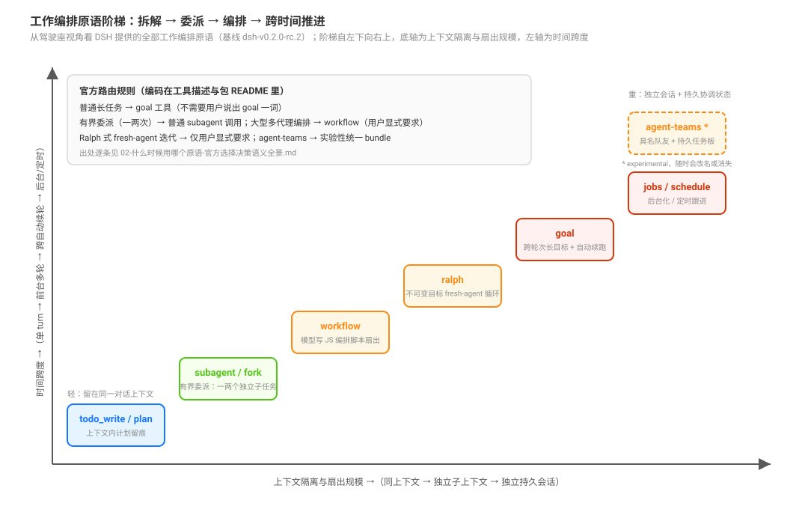

# Work Orchestration Primitives Ladder · 工作编排原语阶梯

产品源码基线：`639ed015397290b3745d163aafe02ffee4aa3f84`（`dsh-v0.2.0-rc.2`）；本专题结论与该 commit 的项目树一致。

## 一句话

ruofei 说「这个其实是一个 agent harness 今后的一个趋势，我们要好好充分利用一下 DSH 这个能力」。本专题从**驾驶座视角**（harness 的使用者，不是插件开发者）回答一个家族问题：**DSH 给了哪些把工作拆解、委派、编排、推进到完成的原语？各自保证什么、隔离什么？什么时候用哪个？怎么组合？**

外部叙事常把 DSH 描绘成「Captain 规划 + Kahn 入度队列 + Reviewer 门禁」的中心化 Task DAG 调度引擎。源码真相是：**没有这样的中心引擎**——DSH 提供的是一组**可组合的编排原语阶梯**，模型按任务的时间跨度与隔离需求自选，组合权重显式编码在每个工具的描述文本与包 README 里（证据见 [`02-什么时候用哪个原语-官方选择决策语义全景.md`](./02-什么时候用哪个原语-官方选择决策语义全景.md)）。

## 阶梯总表

| 原语 | 包 | 一句话语义 | 上下文隔离 | 时间跨度 |
|------|----|-----------|-----------|---------|
| `todo_write` | `packages/todo/tool-todo/` | 上下文内计划留痕：多步工作列清单，琐碎单步跳过 | 同上下文 | 单 turn |
| plan mode | `packages/plan/plan-mode/` | 计划先行：先出方案、用户批准后执行 | 同上下文 | 单 turn |
| `subagent` / `subagent_fork` | `packages/subagent/tool-subagent/` | 有界委派：一两个自包含任务交给独立子代理 | 独立子上下文 | 一次性（one-shot / continuable） |
| `workflow` | `packages/workflow/tool-workflow/` | 模型写 JS 编排脚本扇出子代理（`agent`/`pipeline`/`parallel`/`phase`） | 沙箱 PTC 进程 | 前台等待 / 后台 job |
| `ralph` | `packages/workflow/tool-ralph/` | 不可变目标的 fresh-agent 前台循环，轮间只传有界报告 | 每轮全新子代理 | 前台多轮 |
| `goal`（`create_goal`/`update_goal`/`get_goal`） | `packages/goal/tool-goal/` | 跨轮次长目标 + idle 自动续跑（Goal Round Driver） | 同会话跨轮 | 跨自动续轮 |
| `jobs`（后台化 + `job_output`/`job_kill`/`job_list`） | `packages/jobs/tool-jobs/` | 任意工作后台化，随时收结果、可取消 | 后台 job | 异步 |
| schedule | `packages/schedule/schedule/` | 定时跟进（optional bundle，随装随用） | — | 定时触发 |
| agent-teams * | `packages/experimental/agent-team/` 家族 | Lead + 具名队友 + 持久消息 + 共享任务板 | 独立持久会话 | 持续协作 |

\* experimental：无稳定合同承诺，随时可能改名或消失。

## 默认挂载状态

阶梯上每一级在 shipped 组合里的开/关，是「充分利用 DSH」的第一手事实：谁开箱即用、谁要显式打开，全部落在 `packages/bundle/base/cordis.patch.yml` 与 optional bundle 清单里。

| 原语 | 默认状态 | 出处 |
|------|---------|------|
| `todo_write` | base 挂载，`allowParallelInProgress: true` | `packages/bundle/base/cordis.patch.yml:430`-`433` |
| plan mode | base 挂载（plan-mode 行含 plan-mode 行为段注入） | `packages/bundle/base/cordis.patch.yml:322` |
| `subagent` | base 挂载：`provider: spawn`、`backgroundMode: continuable` | `packages/bundle/base/cordis.patch.yml:370`-`375` |
| `subagent_fork` | base 挂载：`provider: fork`、`backgroundMode: one-shot`；fork 不选模型，让 provider/model 与父级一致、继承历史仍符合 KV Cache 前缀复用条件（注释明说） | `packages/bundle/base/cordis.patch.yml:377`-`388` |
| `workflow` | base 挂载，执行链 `workflow-ptc`（`provider: spawn`）→ `ptc-runtime-node` | `packages/bundle/base/cordis.patch.yml:390`-`398` |
| `ralph` | base 挂载但 **`disabled: true`**（完成是 worker 自报而非独立评估，默认关；overlay 行可恢复，`subagentProvider: spawn`、`maxRounds: 64`） | `packages/bundle/base/cordis.patch.yml:441`-`452` |
| goal 三件套 + `/goal` | base 挂载（`goal`、`goal-round-driver`、`command-goal`、`tool-goal`） | `packages/bundle/base/cordis.patch.yml:313`-`320`、`436` |
| jobs | base 挂载（`jobs-local` 服务 + `tool-jobs` 工具） | `packages/bundle/base/cordis.patch.yml:88`、`275` |
| schedule | 不在 base：experimental optional bundle | `packages/boot/app-boot/src/profile.ts:217` |
| agent-teams / auto-review | 不在 base：experimental optional bundle（`OPTIONAL_BUNDLES` 四成员） | `packages/boot/app-boot/src/profile.ts:213`-`218` |

goal 的状态机与 Round Driver 深挖在 [`../agent-loop/00-map.md`](../agent-loop/00-map.md)；subagent 的 seam 与多后端在 [`../capability-seams/03-subagent后台与产品provider.md`](../capability-seams/03-subagent后台与产品provider.md)；agent-teams 的机制在 [`../experimental/02-agent-teams.md`](../experimental/02-agent-teams.md)。本专题拥有的是**跨原语的统一视角**：阶梯位置、选择决策、组合模式。

## 问题登记

本专题按问题驱动登记，不承诺覆盖未列出的问题。已回答：

| 问题 | 结论页 |
|------|--------|
| 阶梯全景：DSH 有哪些工作编排原语，各在什么位置？ | 本页 |
| 模型写的 workflow 编排脚本在什么进程里跑、能调用什么钩子、失败如何结算？ | [`01-workflow-模型编写的JS编排脚本与子代理扇出机制.md`](./01-workflow-模型编写的JS编排脚本与子代理扇出机制.md) |
| 官方对「什么时候用哪个原语」给了什么明文语义？原语之间怎么互相路由？ | [`02-什么时候用哪个原语-官方选择决策语义全景.md`](./02-什么时候用哪个原语-官方选择决策语义全景.md) |
| subagent / subagent_fork：委派隔离了什么、fork 继承什么、one-shot 与 continuable 差在哪、控制面边界规则？ | [`03-subagent与subagent-fork-有界委派的隔离继承与continuable控制面.md`](./03-subagent与subagent-fork-有界委派的隔离继承与continuable控制面.md) |
| ralph：轮间到底传什么、固定脚本锁死什么、四种终局怎么结算、为什么长任务分裂成 goal 与 ralph 两策略？ | [`04-ralph-fresh-agent循环的轮间传递与固定脚本机制.md`](./04-ralph-fresh-agent循环的轮间传递与固定脚本机制.md) |
| goal 的驾驶座用法：objective 怎么写、轮预算怎么定、终结纪律、`/goal` 命令面、resume 与 disarmed 语义？ | [`05-goal-驾驶座用法-objective写法轮预算与终结纪律.md`](./05-goal-驾驶座用法-objective写法轮预算与终结纪律.md) |
| jobs / schedule：后台作业平台的保证（id/owner/first-wins/通知经济学）、四个 producer、六选择器时序与交付形态？ | [`06-jobs与schedule-后台作业平台与定时跟进的时间平面.md`](./06-jobs与schedule-后台作业平台与定时跟进的时间平面.md) |
| agent-teams 的驾驶座用法：启用代价（组合互斥表）、Lead 工作流、POLICY 协作纪律、数字上限？ | [`07-agent-teams-驾驶座用法-启用代价Lead工作流与协作纪律.md`](./07-agent-teams-驾驶座用法-启用代价Lead工作流与协作纪律.md) |
| 组合模式：归属链、深度预算、四条通知通道、五个协同形态与跨模式收尾纪律？ | [`08-组合模式-归属链深度预算通知通道与收尾纪律.md`](./08-组合模式-归属链深度预算通知通道与收尾纪律.md) |

已登记待挖（页面按「深潜不预先写」惯例，挣到再写、按到达顺序编号）：

| 问题 | 计划页 |
|------|--------|
| 对照外部叙事：Captain/Kahn DAG、`dsh rollback --task`、KV Cache 看板的源码真相 | 09 |

## 阅读路径

先读本页建立阶梯全景，再按五个入口深入：想知道「这个任务该用哪个原语」直接进 [`02`](./02-什么时候用哪个原语-官方选择决策语义全景.md)；想理解最重的那级原语（workflow）的完整机制进 [`01`](./01-workflow-模型编写的JS编排脚本与子代理扇出机制.md)；想知道委派到底隔离/继承了什么、continuable 子代理怎么续怎么停进 [`03`](./03-subagent与subagent-fork-有界委派的隔离继承与continuable控制面.md)；想知道 ralph 轮间传什么、为什么长任务分成两种策略进 [`04`](./04-ralph-fresh-agent循环的轮间传递与固定脚本机制.md)；想知道 goal 怎么用好（objective 写法、预算、终结纪律）进 [`05`](./05-goal-驾驶座用法-objective写法轮预算与终结纪律.md)；想知道后台作业平台的保证、完成通知何时打断你、定时提醒怎么交付进 [`06`](./06-jobs与schedule-后台作业平台与定时跟进的时间平面.md)；想知道 agent-teams 启用要付出什么组合代价、Lead 怎么带队进 [`07`](./07-agent-teams-驾驶座用法-启用代价Lead工作流与协作纪律.md)；想把原语叠起来用（归属链/深度预算/通知通道/收尾纪律）进 [`08`](./08-组合模式-归属链深度预算通知通道与收尾纪律.md)。

## 源码入口

| 路径 | 角色 |
|------|------|
| `packages/todo/tool-todo/` | `todo_write` 工具：上下文内计划留痕 |
| `packages/plan/plan-mode/` | 计划模式：方案先行、批准后执行 |
| `packages/subagent/tool-subagent/` | `subagent` / `subagent_fork` 两个模型可见工具 |
| `packages/subagent/subagent-in-process-driver/` 等 | 委派的多后端（进程内 / ACP / Claude Code / Codex / SDK），见 capability-seams 专题 |
| `packages/workflow/workflow/` | 编排引擎：脚本钩子、schema 校验、失败结算 |
| `packages/workflow/tool-workflow/` | `workflow` 模型工具与 Config（`toolName`、`maxResultChars`） |
| `packages/workflow/workflow-ptc/` | PTC 执行 provider：fresh Node 进程 + 沙箱策略 |
| `packages/workflow/tool-ralph/` | `ralph` 工具：fresh-agent 循环 |
| `packages/goal/tool-goal/` | `create_goal` / `update_goal` / `get_goal` |
| `packages/goal/goal-round-driver/` | idle 自动续轮（深挖见 agent-loop 专题） |
| `packages/jobs/tool-jobs/` | 后台 job 的模型可见面 |
| `packages/schedule/schedule/` | 定时跟进（optional bundle） |
| `packages/experimental/agent-team/` 家族 | 实验性具名团队（深挖见 experimental 专题） |
| `packages/bundle/base/cordis.patch.yml` | 阶梯默认挂在哪些 bundle 里 |
