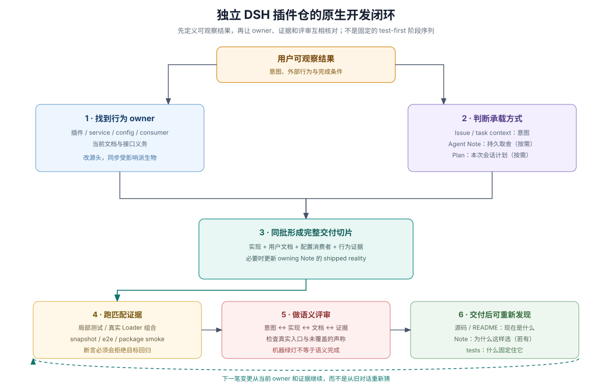
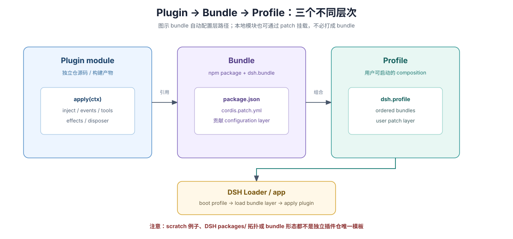
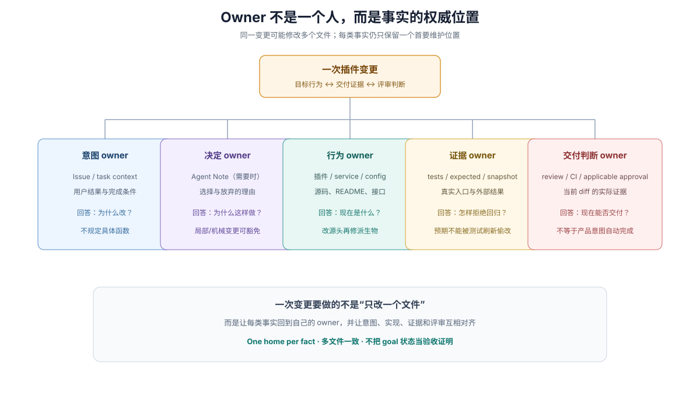
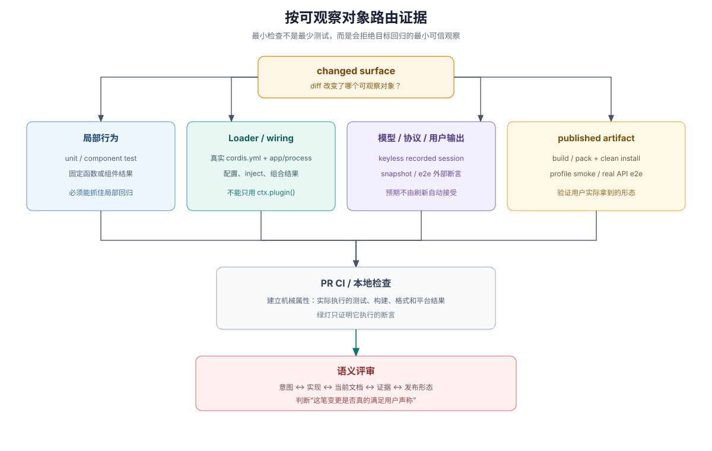
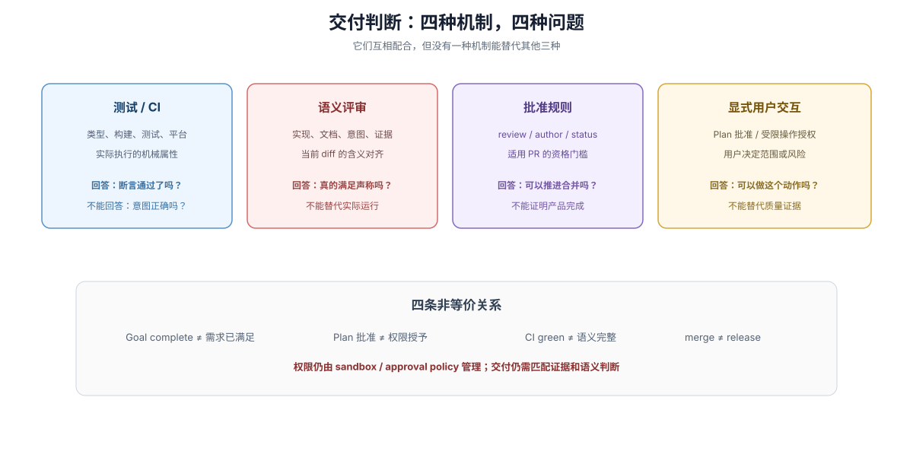

# DSH 原生开发流程：owner、证据与交付判断

## 这卷解决什么问题

新建独立 DSH 插件仓后，最容易出现的不是不会写 `apply(ctx)`，而是不知道怎样把用户意图、插件实现、配置组合、测试资产和交付判断连成一条可复查的链。本卷给出一张 DSH-native 的总地图：哪些事实由谁拥有，哪种测试能证明什么，以及为什么“goal 完成”或“CI 变绿”都不能单独代表插件已经完成。

这是一种依据 DSH 源码、文档、规则、测试和 Skills 归纳出的开发模型，不是 DSH 官方宣布的方法名，也不是独立插件仓必须复制的主仓库制度。本卷自行解释起步所需概念；`repo-harness` 与 `sdlc-reference` 分别提供仓库参与机制和主仓精确规则的可选深入阅读，不是前置材料。正文区分 DSH 运行时机制、DSH 主仓要求和面向独立插件仓的建议；独立仓自行决定治理规则与验证适配。

## 本页导航

- [四个层次](#一页总览四个层次不要混成一件事)：运行时、仓库、发布物与治理。
- [开发闭环](#dsh-native-闭环)：外部结果、owner、条件性记录、完整交付、验证与评审。
- [注意事项](#最重要的注意事项)：goal、mock、录制刷新、invariant、loop 修改与主仓制度。
- [第一笔交付](#从新仓库开始)：从当前仓库判断是否已经具备继续开发的基础。

第一次遇到 `owner`、`HMR`、`bundle`、`profile`、`oracle` 或 `real composition` 时，先看[术语与心智模型](./02-terms-and-mental-models.md)。本页用这些词组织流程，不假设读者已经熟悉 DSH 开发生态。

## 一页总览：四个层次不要混成一件事

独立插件开发同时面对四个层次。运行时接口回答“插件怎样被 Loader 加载”；仓库结构回答“源码、依赖和文档怎样组织”；发布形态回答“用户安装什么”；治理规则回答“谁评审、哪些检查必须通过、什么条件允许发布”。DSH 的插件作者文档主要定义运行时接口和可用组合机制，独立插件仓需要为自己的仓库结构、发布形态和治理规则指定 owner。Plugin、bundle、profile 的分层见[术语页的组合分发部分](./02-terms-and-mental-models.md#二怎样组合与分发)。

新仓库的具体起步路径见 [新建独立 DSH 插件仓](./01-new-plugin-repository.md)，其中区分运行时接口、仓库结构、发布形态和治理规则。

图中的三层分别回答不同问题：Plugin 是运行时模块，bundle 是可分发的配置层，profile 是用户启动的组合。它们不规定独立插件仓必须采用哪种源码目录；详细词义见[术语页的组合分发部分](./02-terms-and-mental-models.md#二怎样组合与分发)。

| 层次 | 主要问题 | DSH 能直接提供什么 | 独立插件仓仍需自己决定什么 |
|---|---|---|---|
| 运行时接口 | `apply(ctx)` 怎样加载、依赖怎样注入、资源怎样清理？ | Cordis plugin、`inject`、`ctx.effect()`、Loader 组合 | 插件自己的 service、event、config 和错误合同 |
| 仓库结构 | 源码、测试、文档、构建产物放在哪里？ | DSH 的 package、docs、tests 组织范例 | 独立仓、monorepo、vendor/submodule、workspace 边界 |
| 发布形态 | 用户安装 package、bundle 还是 profile 配置？ | plugin、bundle、profile 的现有组合机制 | 发布物、自包含要求、兼容范围和升级路径 |
| 治理规则 | 谁评审、哪些检查是门槛、怎样决定发布？ | DSH 主仓库的规则可作为参考 | 自己的 Issue、review、CI、release 和安全审批 |

**能加载 ≠ 有行为证据 ≠ 能安装 ≠ 已获交付批准。** 这四个结果必须分别被观察和记录。

## DSH-native 闭环

### 1. 先定义外部结果

从用户能观察到的结果开始，而不是从“我要改哪个文件”开始。描述触发条件、用户看到或得到的结果、失败时的行为和完成条件；实现者再根据 owner 路由选择源码位置。这样 review 可以判断外部行为，而不会被预先指定的函数名限制。

Issue 或直接任务上下文可以承载意图。它们回答“为什么改”和“怎样算完成”，但不拥有当前 API、测试实现或长期设计理由。独立插件仓不必复制 DSH 的 Issue 模板，只需让自己的任务入口能表达可观察结果。

### 2. 找到行为和事实的 owner

Owner 不是固定的人员职位，而是某类事实的权威维护位置，或某项运行时职责的实际拥有者。这里的 owner 不是默认指某个“负责人”；术语页的 [owner 解释](./02-terms-and-mental-models.md#owner归属与权威来源)区分了事实来源、行为实现、测试资产和人的项目职责。找到 owner 后，应修改源头并同步受影响的消费者、文档或派生物，而不是在第二处复制一份容易漂移的事实。

| 要确认的事实 | 首要维护位置 | 交付时核对什么 |
|---|---|---|
| 为什么改、外部结果是什么 | Issue 或 task context | 实现与证据是否回答原始意图 |
| 为什么采用当前方案、放弃什么 | owning Agent Note（需要时） | 记录是否对应实际交付的持久取舍 |
| 当前行为与使用义务是什么 | 插件源码、类型、JSDoc、README | 文档是否描述现在的行为 |
| 哪个场景固定住行为 | tests、expected output、recorded session | 目标回归出现时断言是否会失败 |
| 交付有哪些实际验证结果 | PR Testing/Proof、CI 或仓库自己的交付记录 | 证据是否针对当前 diff 和当前 head |

DSH 的“一个事实一个家”不等于“一次 feature 只能改一个文件”。代码、用户文档、配置消费者和测试分别表达实现、使用义务、组合关系和行为证据；完整交付要求它们保持一致。

### 3. 条件性使用 Issue、Agent Note 和 Plan

Issue、Agent Note 和 Plan 不是每笔变更都必须依次经过的阶段。Issue 或 task context 承载意图；只有当代码、测试和现有文档无法表达长期取舍时，才需要 owning Agent Note；Plan Mode 用于本次会话的计划和用户批准交互，计划可以变化，也不会成为交付后的当前行为合同。

机械或局部编辑可以不写 Agent Note。需要 Note 时，`proposed` 记录仍待评审的决定，`implemented` 记录已经交付的现在式决定；不要把旧计划或 acceptance checklist 留在 implemented Note 中冒充当前事实。精确规则见 [Agent Note 生命周期](../sdlc-reference/01-agent-note-lifecycle.md) 与 [Plan 与 sandbox](../sdlc-reference/03-plan-and-sandbox.md)。

### 4. 形成完整的垂直切片

完整切片不是“代码加一个绿测试”，而是把这笔变更影响到的实现、用户文档、配置消费者、行为证据和必要的决定记录一起考虑。切片边界由用户行为和真实入口决定，不由文件数量决定。

DSH 的本地检查策略又要求验证保持聚焦：选择会为当前回归失败的最小可信检查，不要用重复全套测试替代 changed-surface 判断。独立插件仓可以不复制 DSH 主仓库的 CI 矩阵，但不能因为仓库较小就跳过公开入口的组合验证。证据路由见 [Gates 与 local checks](../sdlc-reference/04-gates-and-local-checks.md)。

> Every behavior change needs the narrowest available test or purpose-built check that would fail for its regression.
>
> — DSH [pre-push checks Skill](https://github.com/deepseek-ai/deepseek-harness/blob/dsh-v0.2.0-rc.2/.agents/skills/dsh-pre-push-checks/SKILL.md#select-relevant-evidence)

### 5. 让测试观察真实对象

测试层按观察对象分工，不是固定的 test-first 顺序。局部测试验证函数或组件行为；真实 Loader 组合测试验证配置、依赖注入和 app/process 入口；snapshot 固定模型、协议或用户可见输出；e2e 重新读取文件或命令结果；真实 API 测试验证外部模型与服务。每层只能证明自己实际断言的属性。

DSH 主仓测试政策对产品可见插件要求 non-unit real composition，而不是只用手工 `ctx.plugin(...)` 的单元套件：从 Loader 和应用入口启动，仅 mock 外部服务或非确定性输入，从模型请求、持久状态或用户可见输出断言结果。每个非平凡（non-trivial）的模型、协议或用户可见变化还必须在同一 PR 中新增或更新 keyless recorded-session scenario；真实组合测试不能自动替代这项录制场景义务。独立插件仓建议采用这两项验证原则，并自行建立适用的测试入口；调整场景或测试层时应说明观察对象、替代证据及未覆盖之处，不把适配说成 DSH 主仓的可选规则。具体政策见 DSH [Testing policy](https://github.com/deepseek-ai/deepseek-harness/blob/dsh-v0.2.0-rc.2/docs/testing.md)。

测试资产还需要独立的预期来源。Recorded-session 的场景 owner 负责记录或刷新选中的 Session，共享引用只读且无环；工作区结果由独立的 `workspace.expected/` 作为 oracle，录制或刷新过程不能顺手改写它。否则测试可能只证明“工具重新生成了自己的答案”，而不是证明插件对外产生了正确结果。参见 DSH [snapshot ownership](https://github.com/deepseek-ai/deepseek-harness/blob/dsh-v0.2.0-rc.2/snapshots/AGENTS.md)。

### 6. 验证用户实际安装的形态

源码 checkout 能加载，不代表构建产物、package manifest、依赖声明和 bundle 安装都能工作。只要插件通过 package 或 bundle 分发，就应在干净 profile/config 中安装构建或打包后的产物，运行至少一个可观察 smoke，并确认发布物不依赖仓库中没有随包交付的路径。

如果插件声明支持多个 DSH 版本，应在自己的仓库记录已验证的版本范围，并在范围变化时执行兼容验证。不要把 peer dependency 的范围写成未经测试的兼容承诺，也不要把 DSH 主仓当前的发布矩阵直接当作独立插件的覆盖证明。

### 7. 用语义评审完成交付判断

这里的 oracle、real composition 和 semantic review 都是有边界的术语，不是“测试通过”的同义词；分别见[术语页的验证部分](./02-terms-and-mental-models.md#四怎样验证与判断完成)。真实入口与独立 oracle 的选择见上面的证据路由图。测试、snapshot、CI 和 approval 规则各自建立机械属性；语义评审判断实现、当前文档、持久取舍和证据是否真的符合用户意图。

测试/CI、语义评审、批准规则和显式用户交互回答不同问题。Plan Mode 不执行权限限制，Goal 的 `complete` 也不是需求认证；merge 还不等于 release。评审者可以是具备上下文的人或 agent。机器全绿只说明它执行的断言通过，批准分数只说明适用的批准门槛满足；二者都不能自动证明产品目标、用户体验或未覆盖的声称已经完成。

交付记录应列出外部行为、影响面、实际运行的命令及结果，并明确未执行的检查。review 要重新读取当前 diff、当前测试预期和当前文档，不沿用旧 head 的结论。独立插件仓可以采用自己的 PR、reviewer 和合并规则；DSH 主仓的 Issue policy、Project lifecycle、weighted approval 和 release workflow 不会自动继承。

## 最重要的注意事项

### 不要把 goal 当验收系统

Goal 保存同一会话的目标并帮助工作续接。Goal 变为 `complete` 只说明运行时目标状态被更新，不提供独立的产品完成证明。插件完成度仍由外部结果、匹配测试、发布形态验证和语义评审共同判断。

### 不要只做 mock-only 测试

手工创建 plugin context 可以快速固定局部逻辑，但无法证明 Loader 配置、依赖注入、发布入口和应用组合成立。只要能力对用户可见，就要补真实组合或解释为什么该路径不适用。

### 不要把录制刷新当成接受新行为

刷新 snapshot 或 Session 只是更新测试资产。接受用户可见行为变化仍需要由变更意图、独立预期和语义评审明确决定；record/refresh 不应自动改写独立 workspace oracle。

### 不要为了“符合形式”添加空 invariant

只有当两个独立观察可能分叉时，runtime invariant 才有价值。检查 service 存在、插件 metadata、effect 或固定示例的空 invariant 不能证明行为正确，反而会增加维护成本。DSH 的 invariant 规则应按实际可分叉关系判断。

### 不要未经扩展点确认就改 agent loop

DSH 的 standing order 是新行为优先落在 documented extension points；改变 `agent-loop` 需要同时更新架构文档和对应证据。独立插件首先应确认 service、event、tool、preset、bundle 或 client injection 等已有扩展路径，再评估是否真的需要 host 变更。

### 不要复制 DSH 主仓制度作为默认答案

DSH 主仓的 GitHub Project、Issue metadata policy、weighted approval、平台 CI 和 release workflow 服务于 DSH 自己的仓库。独立插件仓可以借鉴它们的原则，但必须为自己的规模、团队和发布风险定义适用的 owner 与门禁。

## 从新仓库开始

先用 DSH [首次插件指南](https://github.com/deepseek-ai/deepseek-harness/blob/dsh-v0.2.0-rc.2/docs/user/develop/basic/index.md)建立最小可加载模块，按任务读取 [Cordis 教程](https://github.com/deepseek-ai/deepseek-harness/blob/dsh-v0.2.0-rc.2/docs/cordis-tutorial/index.md) 与 [插件作者入口](../repo-harness/09-plugin-author-entry.md)，再为独立仓逐步补齐自身的 package/config、真实组合测试和用户可见预期。插件以本地模块加载、配置 bundle 发布和仓库如何组织是不同层次，不能由运行时插件示例推出唯一仓库模板。

一个合理的第一笔交付是：一种可观察行为、一个明确的行为 owner、一条真实 Loader 组合路径、一个在回归时会失败的证据，以及一份能解释当前使用方式的 README。完成后，新参与者应能从当前仓库回答“现在是什么、为什么这样选、什么固定住它、怎样证明发布物可用”。

## 相关入口

- [新建独立 DSH 插件仓](./01-new-plugin-repository.md)：从最小可加载插件走到真实组合、打包安装和评审证据。
- [Development Harness](../repo-harness/00-index.md)：如何找到 DSH 的 AGENTS、Skills、扩展点和运行时查询。
- [SDLC Reference](../sdlc-reference/00-index.md)：Agent Note、Issue/PR、Plan、evidence、review、approval 与 release 的精确条件。
