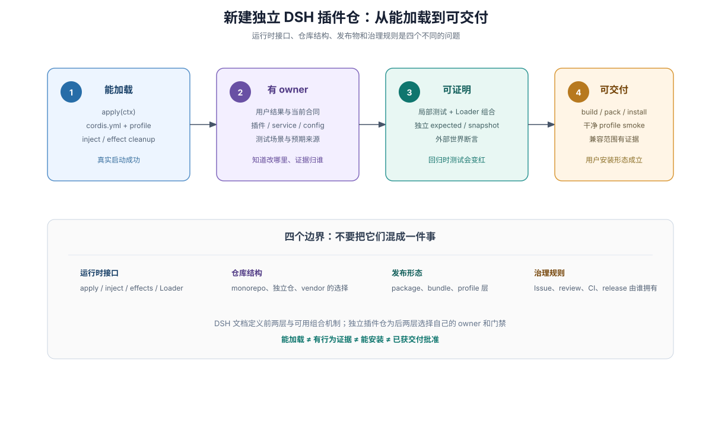
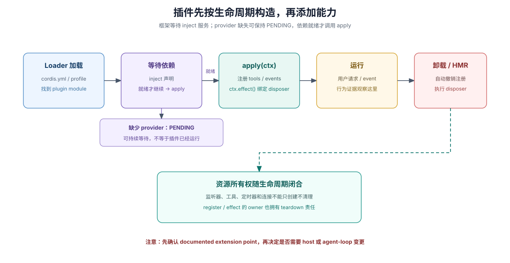

# 新建独立 DSH 插件仓

## 目标

本页给刚建立的独立 DSH 插件仓一个可验证的起点。它不要求采用特定 monorepo 模板、Git 平台、审批规则或发布自动化。先建立最小可加载插件，再按将要承诺给用户的行为补齐实现 owner、真实组合、独立预期与发布验证。

这张图是建立能力的顺序，不是要求每次修改都重走所有步骤。每一项都要有可观察结果：Loader 确实加载了插件、行为 owner 可以找到、独立证据能拒绝回归、用户的安装形态能运行。第一次遇到 Loader、owner、独立 oracle 或 smoke 等词时，先查阅[术语与心智模型](./02-terms-and-mental-models.md)。

## 1. 选择仓库边界

先区分三个问题：插件运行时如何加载、发布物如何交付、源码仓库如何组织。DSH 的官方最小插件是导出 `apply(ctx)` 的 TypeScript module；本地开发可通过 `cordis.yml` 引入模块。若需要安装配置 bundle，DSH 的 bundle/profile 机制另有定义。模块可加载不代表源码必须放入 DSH monorepo，也不代表 bundle 必须是唯一发布形态。

独立仓只需在源码、构建产物、依赖与配置之间有清楚的 owner。是否 vendor/submodule pin DSH、peer dependency 如何声明、workspace 如何划分，应由可复现的安装与发布验证决定，不由教程中的 scratch 目录决定。DSH 的插件仓组织选项与取舍需要另行评估；不要把 DSH 内部 `packages/` 拓扑复制成默认答案。

## 2. 建立最小可加载插件

从 DSH [Your first plugin](https://github.com/deepseek-ai/deepseek-harness/blob/dsh-v0.2.0-rc.2/docs/user/develop/basic/index.md) 开始：导出 `apply(ctx)`，通过 `cordis.yml` 把本地模块挂入真实 profile。若插件依赖其他 Cordis service，声明 `inject`；若它注册监听器、工具、定时器或其他资源，按 DSH 规则让注册跟随 plugin lifecycle 清理，需要显式释放的资源使用 `ctx.effect()` disposer。

生命周期要在添加能力时就闭合：`inject` 声明所需服务，依赖就绪后才能加载插件；经 `ctx` 注册的能力跟随插件卸载清理，额外创建的定时器、连接等资源通过 `ctx.effect()` 返回 disposer。重新加载后不应出现重复监听、残留定时器或旧连接。它不仅是资源管理问题，也决定热重载和组合测试是否可信。

配置也需要 owner：部署方会改变的选择由插件 Config 定义与验证。错误配置、模块解析失败和已经可判定的缺失引用应在最早可解析时点明确失败；不要用硬编码常量代替用户配置，也不要静默跳过已确定出错的功能。`inject` 等待尚未就绪的 provider 则是合法的 `PENDING` 状态，provider 可能稍后加载，不能保证立即报错。启动 smoke 应确认目标插件实际激活并产生结果，发现非预期等待时核对 provider 与组合配置。规则来源见 DSH [根级开发规则](https://github.com/deepseek-ai/deepseek-harness/blob/dsh-v0.2.0-rc.2/AGENTS.md)与 [PENDING 诊断](https://github.com/deepseek-ai/deepseek-harness/blob/dsh-v0.2.0-rc.2/docs/cordis-tutorial/06-composition-and-hmr.md#diagnosing-a-plugin-that-never-loads)。

再按需要读 DSH [Cordis 教程](https://github.com/deepseek-ai/deepseek-harness/blob/dsh-v0.2.0-rc.2/docs/cordis-tutorial/index.md)：先掌握生命周期与 effects，再读实际使用的 service、event、config、composition 与 HMR。不要在尚未确认官方扩展点前复制 harness 内部实现或修改 agent loop。

## 3. 为第一个用户行为指明 owner

选一个用户可观察、范围较窄的行为作为第一笔交付。记录行为由哪个插件、service 或 config 项拥有；配置输入在哪里定义与验证；对用户承诺的行为在哪里说明；该行为的独立预期由哪个测试场景维护。说明应回答用户结果，不提前锁定实现细节。

仓库内每类当前事实保留一个权威位置，其他页面链接回去。持久技术取舍只有在代码、测试和现有文档无法解释时才需要决策记录。计划可以用于本次实施协作，但不是跨 feature backlog，也不是交付后当前行为的权威来源。

## 4. 用真实组合与独立预期建立证据

插件单测用于固定局部行为；它们不能证明真实 Loader 会加载预期配置、依赖注入正确或发布产物能被用户安装。DSH 主仓对产品可见插件要求 non-unit real composition：由 Loader 加载配置，通过 app/process 入口组合插件，仅 mock 外部服务或非确定性输入，并从模型请求、持久状态或用户可见输出来断言结果。独立插件仓建议采用这项原则，为自己的公开行为建立真实加载与执行路径；测试入口由该仓库维护，不自动继承主仓基础设施。

DSH 主仓对每个非平凡（non-trivial）的模型、协议或用户可见变化，要求在同一 PR 中新增或更新 keyless recorded-session scenario，不能仅以单测、真实 API e2e 或决定记录替代。独立仓建议保留可重复的组装后输出证据，并可按自身运行入口与测试能力适配场景；适配时说明替代证据和未覆盖之处，不把主仓要求改述为可选项。

若测试验证工作区或文件副作用，预期结果应是独立 oracle，不能在刷新录制输出时被自动改写。测试 owner 维护场景，改变预期行为则由变更评审明确接受新结果。DSH 的一手依据见 [Testing policy](https://github.com/deepseek-ai/deepseek-harness/blob/dsh-v0.2.0-rc.2/docs/testing.md)；[测试策略参考](../sdlc-reference/04-gates-and-local-checks.md)是可选的精确规则查阅入口。

## 5. 验证用户实际安装的形态

源码 checkout 测试不能替代构建与打包验证。若插件通过 npm package 或 DSH bundle 分发，应在干净 profile/config 中安装构建或打包后的产物，确认入口、依赖声明、配置和资源都存在，并至少运行一次可观察 smoke。若插件支持多个 DSH 版本，应在仓库中声明已验证的版本范围，并对范围变化执行兼容验证；不要把未经验证的版本写成兼容承诺。

这些检查服务于插件自己的发布合同，不要求复制 DSH 主仓库全部发布 workflow、平台矩阵或 approval score。独立仓的发布步骤和安全条件由该仓库自己拥有。

## 6. 将证据交给评审

每个交付说明列出外部行为、影响面、实际运行的检查及结果；未执行的检查明确标为未执行。评审者将实现、用户文档、独立预期与当前证据对齐，判断检查是否真的观察了用户承诺。机器绿灯只证明其执行的断言通过；批准状态只证明适用的批准规则满足，二者都不替代行为评审。

插件仓可以依自己团队规模选择 pull request、reviewer 和合并策略。DSH 主仓库的 Issue policy、Project lifecycle、加权批准积分不是 DSH 插件 runtime 的要求，也不自动适用于独立仓库。

## 入口

- DSH [首次插件指南](https://github.com/deepseek-ai/deepseek-harness/blob/dsh-v0.2.0-rc.2/docs/user/develop/basic/index.md)：创建并挂载本地插件、依赖声明与 cleanup。
- DSH [Cordis 教程](https://github.com/deepseek-ai/deepseek-harness/blob/dsh-v0.2.0-rc.2/docs/cordis-tutorial/index.md)：插件 lifecycle、service、event、config 与 composition。
- [DSH 插件作者入口](../repo-harness/09-plugin-author-entry.md)：官方作者文档层次、bundle/profile 关系及外部仓库适用边界。
- [DSH 原生开发模型](./00-index.md)：owner、证据、评估与完成判断之间的关系。
- [精确流程参考](../sdlc-reference/00-index.md)：按问题查找 Agent Note、证据路由、review 与发布条件。
