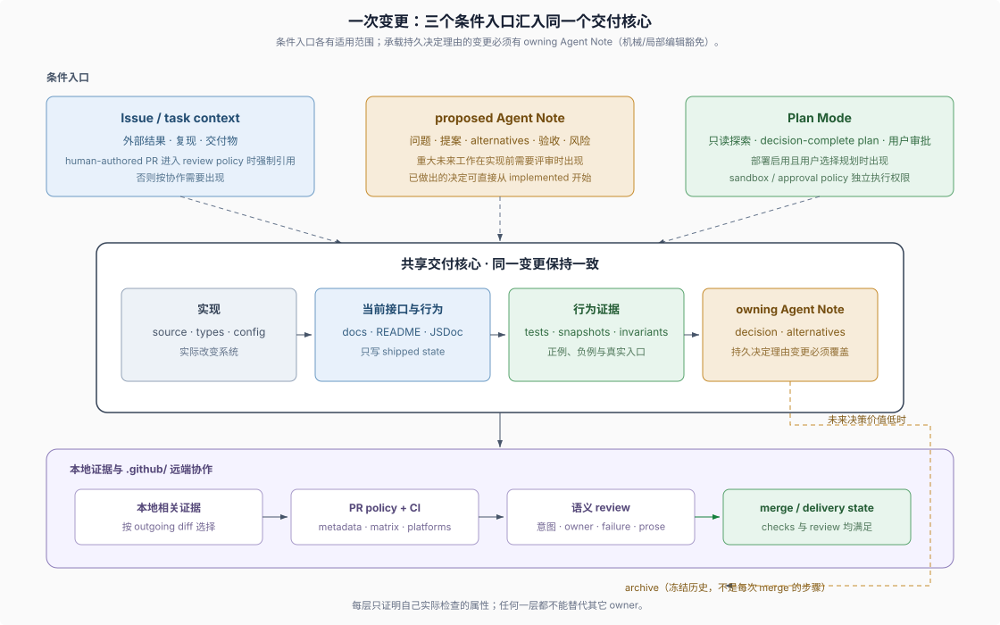

# SDLC Reference · 精确机制与例外流程

## 什么时候读这里

这里是 SDLC Reference（软件开发生命周期的精确参考），面向需要核对 DSH 主仓精确条件、内部状态或少见流程的读者。各页支持按问题查找，不要求从 `01` 顺序读到 `12`。独立插件仓可以参考这些机制，但不因使用 DSH runtime 就继承主仓的 Issue、Project、批准、CI 或发布制度。

本目录直接回答“具体由哪个文件执行”“边界条件是什么”“失败后怎样处理”，不要求先阅读其它卷。需要关系综合时可选读 [DSH 原生开发模型](../native-development-model/00-index.md)。

本卷从 DSH 一手规则归纳出三条组织立场，不依赖另一份教程，也不把它们命名为 DSH 官方方法：

1. **agent 是一等参与者**：规则让初次参与的 coding agent 能找到状态、条件和证据。对应 Agent Note 生命周期（`01`）、意图入口与非 Issue 意图载体（`09`）、git 历史能证明什么（`08`）。
2. **可机械判断的规则接入可执行检查**：policy 定义判断，workflow 定义远端执行，不能据此宣称全部语义规则都可自动验证。对应 trusted policy 与 workflow 拆分（`02`）、gates 与检查路由（`04`）、双语 pairing 与文档门禁（`05`）、加权批准实现（`10`）。
3. **每类事实有权威维护位置**：本卷的 owner 指拥有相应事实或职责的位置，不是统一的人类职位。对应 Note 与 Plan 的分工（`01`、`03`）、文档归属（`05`）、评审职责（`06`）、发布 lane 归属（`11`）、agent 契约资产的原文归属（`12`）。

本目录拥有 DSH 变更流程的精确条件、状态与例外。必要概念由本卷对应页解释；[Development Harness 专题](../repo-harness/00-index.md)可选用于深入理解仓库结构、Skills 与运行时查询，不是本卷的阅读前提。

## 参考目录

| 页面 | 适用问题 | 新手阶段可以暂时忽略 |
|---|---|---|
| [`01-agent-note-lifecycle.md`](./01-agent-note-lifecycle.md) | proposed、implemented、rejected、archived 的转换、supersession（取代关系）与冻结 triplet | sidecar hash、完整取代条件 |
| [`02-issue-pr-lifecycle.md`](./02-issue-pr-lifecycle.md) | trusted policy（可信策略）、Project lifecycle（项目生命周期）、CI workflow 和 Dependabot | policy 函数条件、runner/job 拆分 |
| [`03-plan-and-sandbox.md`](./03-plan-and-sandbox.md) | `plan/mode` event、pending transition（待提交转换）和审批时序 | session log payload、pre-step 时机 |
| [`04-gates-and-local-checks.md`](./04-gates-and-local-checks.md) | outgoing scope（待推送范围）、focused coverage（聚焦覆盖率）和远端矩阵 | exact base、job topology |
| [`05-prose-doc-standards.md`](./05-prose-doc-standards.md) | 文档 owner、双语 pairing（配对）和 VitePress projection（站点投影） | generator 与 manifest 细节 |
| [`06-review-and-human-role.md`](./06-review-and-human-role.md) | 高风险 semantic review、findings 和 review 状态失效 | 生命周期、安全与真实入口清单 |
| [`07-push-merge-stacked-prs.md`](./07-push-merge-stacked-prs.md) | branch rewrite（分支改写）与 Stacked Pull Requests（依赖式 PR 栈） | GraphQL stack membership、partial landing |
| [`08-example-web-seam.md`](./08-example-web-seam.md) | git 历史能够证明和不能证明哪些流程事实 | 历史 commit 与现行格式差异 |
| [`09-intake-and-work-items.md`](./09-intake-and-work-items.md) | 意图从哪里进来：外部 Discussions 边界、Issue 模板、Project 生命周期、标签分工与非 Issue 意图载体 | policy 函数细节、模板演进史 |
| [`10-approval-gate.md`](./10-approval-gate.md) | merge 的真实门槛：weighted approval 加权批准、`/delegate` 积分转移与 branch rules | blame 分类器、委托的完整状态机 |
| [`11-release.md`](./11-release.md) | merge 之后怎样上线：三条 release 序列、bump 与 tag、rehearsal 与 publish 分离、各发布 lane | registry 三态参数、Desktop/Python 细节 |
| [`12-agent-contract-evidence.md`](./12-agent-contract-evidence.md) | agent 看见的请求、可回放会话、外部世界，以及测试怎样推动同一笔变更、为何不规定先写测试 | 代际文件名、invariant 的逐条失败条件 |

按生命周期找页：意图入口读 `09`；决定、计划与实现读 `01`–`05`；agent 契约证据读 `12`；评审读 `06`；依赖栈与落地读 `07`；批准门禁读 `10`；发布上线读 `11`；历史证据的边界读 `08`。

## 使用方式

按问题进入一篇对应 reference；页面末尾的“证据入口”链接到 owning source、policy、workflow、skill 或 Agent Note；需要判断固定基线中的仓库事实时，以这些来源为准。
