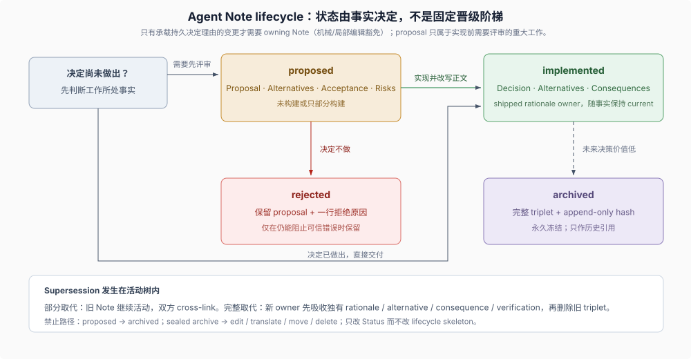

# Reference 01 · Agent Note lifecycle（生命周期）

## 一句话

Agent Note 保存代码和当前文档无法承载的 rationale（决定理由）与 alternatives（放弃的备选方案）。**拥有 Note 的义务只覆盖承载持久决定理由的变更**——机械或局部编辑（含局部 UI 呈现与交互）明确豁免；Note 不必从 `proposed/` 开始，也不会在实现后自动进入 archive（归档）。（0008 复核注记：上游把 note 创建标准收窄为「durable decision rationale」并显式豁免机械/局部编辑，本页旧表述「每个非平凡变更都要」已随之修正。）

> Add or update an Agent Note in the same PR only for lasting decision rationale that code, tests, and existing documentation do not explain. [...] Mechanical or local edits, including local UI presentation and interaction changes, are exempt.
>
> — DSH [`.agents/notes/README.md` 的 “When to write one”](https://github.com/deepseek-ai/deepseek-harness/blob/dsh-v0.2.0-rc.2/.agents/notes/README.md#when-to-write-one)。这段原文同时建立“只有持久决定理由才需要 owner Note”和“implemented 不必经过 proposed”两个条件。

## 1. 先决定从哪里开始

| 当前事实 | 动作 |
|---|---|
| 重大工作尚未构建，决定需要先评审 | 在 `proposed/<class>/` 新建 Note |
| 决定已经做出并随当前变更交付 | 直接在 `implemented/<class>/` 新建 Note |
| 现有 Note 已拥有同一个决定 | 更新 owner，不创建重复 Note |
| 新决定只部分取代旧决定 | 保留双方并交叉链接，更新仍然有效的事实 |
| 新决定完整取代旧决定 | 新 owner 吸收所有独有 rationale、alternative、consequence、verification 和 coverage gap 后，旧 implemented Note 才可删除 |

“承载持久决定理由的变更必须有 Note”约束的是**决定覆盖**，不是要求每次先写 proposal。

## 2. 路径同时编码状态和类别

活动树使用 `{lifecycle}/{class}/yyyy-mm-dd-topic-title.md`：

- `lifecycle` 是 `proposed/`、`implemented/` 或 `rejected/`；低未来价值的 implemented triplet 另行移动到冻结的 `archived/` 树；
- `class` 是 `feature`、`bug-fix`、`simplification`、`architecture`、`process` 或 `testing`；
- 日期是主题首次提出的日期，不是实现或归档日期。

分类是 `scripts/agent-note-tree.ts` 中的封闭集合，门禁拒绝未知目录。`refactor` 不在集合中；不增加能力的删除或收缩归 `simplification`。

路径树本身就是工作清单：仓库刻意不设集中式 `INDEX.md`（历史上的生成索引已被移除，理由由 no-index Agent Note 拥有），读者按 lifecycle/class 目录浏览或全库搜索；Note 之间的交叉引用只用相对 Markdown 链接，不用裸文字或编号。

> Cross-references between Agent Notes use relative markdown links [...] — never bare prose or numbers — so they are mechanically checkable and survive moves between folders. The active lifecycle tree is the working inventory: browse its lifecycle/class folders or search the repository. Do not add a centralized `INDEX.md`; the no-index Agent Note owns the rationale.
>
> — DSH [`.agents/notes/README.md` 的 “Layout and naming”](https://github.com/deepseek-ai/deepseek-harness/blob/dsh-v0.2.0-rc.2/.agents/notes/README.md#layout-and-naming)。相对链接让引用可被机械检查，也让 Note 在 lifecycle 目录间移动后链接仍然有效；目录树代替索引，避免第二份会漂移的清单。

## 3. 三个 lifecycle 状态与一个冻结存放地

| 位置 | 内容 | 读者怎样使用 |
|---|---|---|
| `proposed/` | 未完成或仅部分完成的重大未来工作 | 评审问题、方案、验收和风险，不能当成已交付功能 |
| `implemented/` | 已交付决定及其替代方案和后果 | 作为当前 rationale owner，并随路径、名称、默认值和机制保持 current |
| `rejected/` | 被否决的提案及一行拒绝原因 | 仅在仍能阻止一个可信错误时保留 |
| `archived/` | 未来决策价值低的 implemented 历史快照 | 只作历史引用，永久冻结，不是当前权威 |

`Status:` 值只有三种，且与所在目录互相校验；`archived/` 不是第四种状态——归档保留 `Status: implemented`、只在其下插入 `Archived:` 行，且只有 implemented Note 能进入。`proposed → rejected` 冻结提案；`proposed → implemented` 必须改写成已交付事实；`implemented → archived` 只在未来决策价值低时发生。Proposed Note 永不归档，过时提案应转 rejected；rejected Note 失去防错价值后删除完整 triplet。

## 4. 文件格式让状态转换可检查

`pnpm run verify-agent-note-format` 是 `doc-sync` 的一部分，强制：

- 前三行是 `# Agent Note: <title>`、空行、`Status: <status>`，且 status 与目录一致；
- body 以 `## Problem` 开头；
- proposed 使用 `## Proposal / ## Alternatives considered / ## Acceptance criteria / ## Risks`；
- implemented 使用 `## Decision / ## Alternatives considered / ## Consequences`，拒绝 proposal-era 的 `Proposal / Plan / Migration plan / Acceptance criteria` 标题；
- rejected 保留提案体，拒绝结论写在 `Status:` 行；
- 每个活动 Note 都有 `## Alternatives considered`，只有规则生效前且无法重建 alternatives 的 Note 可使用固定 grandfather 注释。

强制备选有明确目的：仓库把“没有记录它击败了什么”的决定视为会重新引发争论的失败模式，备选只能记录、不能编造。

> A decision recorded without what it beat invites re-litigation — the failure Agent Notes exist to prevent. Alternatives are recorded, never invented.
>
> — DSH [`.agents/notes/README.md` 的 “Alternatives considered — mandatory”](https://github.com/deepseek-ai/deepseek-harness/blob/dsh-v0.2.0-rc.2/.agents/notes/README.md#alternatives-considered--mandatory)。Agent Note 的存在理由是防止重新开讼：每篇 Note 固定携带“为什么不是另一条路”，让后续参与者从已知理由开始，而不是重新提出已被击败的方案。

格式门禁只证明结构满足规则，不证明决定正确、替代方案真实或 shipped facts 与代码一致；这些仍需语义 review。

## 5. `proposed → implemented` 是正文改写

移动和改写必须在同一变更完成：

- `Proposal` 改成现在式 `Decision`；
- acceptance 与 risks 中仍有维护价值的事实进入 `Consequences` 或现在式 `Testing / Verification`；
- 删除迁移计划和未来时态，记录实际交付内容；
- 同一 diff 更新源码、当前文档和行为证据。

只修改路径和 `Status:` 会让未来计划伪装成当前事实，因此格式 gate 和 code review 都检查这次改写。

## 6. supersession 与 archive 是两种不同收敛

Supersession 判断“哪个活动 Note 继续拥有决定”；archive 判断“一个已完成决定是否仍值得留在活动语料”。新建 Note 时要主动搜索相同决定、机制和被拒替代方案：完整取代才允许合并 owner，部分取代保持双方活动并交叉链接。这一步是子树常设指令规定的硬性动作——每新增一篇 Note 都触发 supersession check，完整取代要收敛的 implemented triplet 在同一个 PR 内归档：

> Every new Agent Note triggers a supersession check. Search the active tree for older notes covering the same decision or mechanism, classify any full or partial supersession with dsh-archive-agent-notes, and archive every qualifying implemented triplet in the same PR. Keep partial supersessions active and cross-linked.
>
> — DSH [`.agents/notes/AGENTS.md`](https://github.com/deepseek-ai/deepseek-harness/blob/dsh-v0.2.0-rc.2/.agents/notes/AGENTS.md)。取代检查不是事后清理：它与新决定同 PR 发生，完整取代随即收敛到新 owner，活动树不积压被取代的旧决定。

Archive 只移动完整 `.md`、`.zh.md`、`.i18n.yaml` triplet，在两种语言的 status 下插入相同 `Archived: YYYY-MM-DD`，重录 sidecar，并修复活动 prose 的入站链接。`verify-archived-agent-notes` 把归档内容写入 append-only hash manifest；封存后不得编辑、翻译、移动或删除。

`dsh-archive-agent-notes` 在这里拥有具体的保留、归档与删除判断；Skill 为什么适合承载这类情境化流程、又为什么不能替代格式 gate，见 [Development Harness 的 Skills 章节](../repo-harness/03-skills-as-procedural-memory.md)。

## 证据入口

- DSH [`.agents/notes/README.md`](https://github.com/deepseek-ai/deepseek-harness/blob/dsh-v0.2.0-rc.2/.agents/notes/README.md)：生命周期、分类、统一正文结构、完整取代与归档条件。
- DSH [`.agents/notes/AGENTS.md`](https://github.com/deepseek-ai/deepseek-harness/blob/dsh-v0.2.0-rc.2/.agents/notes/AGENTS.md)：新增 Note 触发 supersession check 的子树常设指令。
- DSH [no-index Agent Note](https://github.com/deepseek-ai/deepseek-harness/blob/dsh-v0.2.0-rc.2/.agents/notes/implemented/process/2026-07-19-remove-generated-agent-note-index.md)：活动树为什么不设集中索引。
- DSH [implemented Note 子树规则](https://github.com/deepseek-ai/deepseek-harness/blob/dsh-v0.2.0-rc.2/.agents/notes/implemented/AGENTS.md)：implemented Note 如何随已交付路径、名称和机制保持当前。
- DSH [archived Note 子树规则](https://github.com/deepseek-ai/deepseek-harness/blob/dsh-v0.2.0-rc.2/.agents/notes/archived/AGENTS.md)：归档 triplet 的冻结与 seal 约束。
- DSH [`dsh-archive-agent-notes` skill](https://github.com/deepseek-ai/deepseek-harness/blob/dsh-v0.2.0-rc.2/.agents/skills/dsh-archive-agent-notes/SKILL.md)：何时保留、归档或删除 Note 的判定流程。
- DSH [统一格式 Agent Note](https://github.com/deepseek-ai/deepseek-harness/blob/dsh-v0.2.0-rc.2/.agents/notes/implemented/process/2026-07-05-uniform-agent-note-format.md)：为什么三种活动 lifecycle 使用一套可检查格式。
