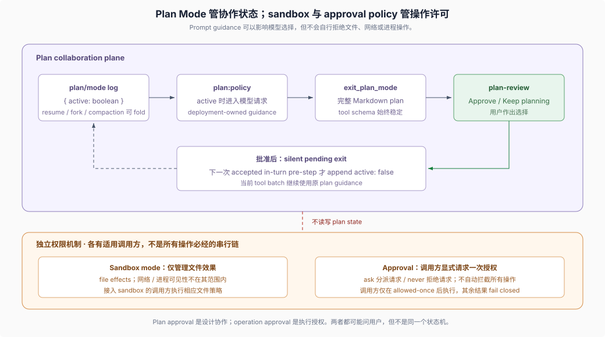

# Reference 03 · Plan Mode 的状态与权限分工

## 一句话

Plan Mode（计划模式）是可选、按 agent 记录的协作状态：激活时把 deployment-owned guidance（部署提供的引导文本）加进模型请求，`exit_plan_mode` 把完整计划交给用户审批。它不限制文件或命令；sandbox mode（沙箱模式）约束文件系统效果，approval policy（审批策略）处理调用方显式发起的具体动作请求，两者均独立于 plan state。

> Plan mode is soft guidance. Sandbox mode and approval policy enforce restrictions independently; neither reads or writes plan state, so deployments configure them separately.
>
> — DSH [`docs/subsystems/plan.md` 的开篇定义](https://github.com/deepseek-ai/deepseek-harness/blob/dsh-v0.2.0-rc.2/docs/subsystems/plan.md)。这句话直接划开计划协作状态与强制权限机制。

## 1. 三个机制不能合并理解

| 机制 | 拥有什么 | 不拥有 |
|---|---|---|
| Plan Mode | `plan/mode` 日志状态、`plan:policy` prompt section、`exit_plan_mode`、`/plan` | 文件/网络/进程权限 |
| Sandbox mode | 已接入 sandbox 的操作可产生的文件系统效果范围 | 计划正文、设计认可、网络访问与进程可见性 |
| Approval policy | 调用方显式审批请求的答复策略：`ask` 委派答复链，`never` 直接拒绝 | plan state、计划质量，以及所有操作的自动发现或拦截 |

Plan guidance 可以要求 agent 只读探索，但文字要求本身不阻止写入。部署需要硬限制时，应配置文件效果约束，并确认相关调用方实际接入执行机制。调用方通过 `ctx.approval.request()` 请求具体动作授权，只在 `allowed-once` 时执行该次动作；拒绝、取消或无可用答复均停止执行。Approval 不是覆盖所有网络、进程或外部状态操作的全局监控层，也不要求每个操作依次经过 sandbox 与 approval。

## 2. coding preset 定义计划质量

`packages/bundle/web-app/presets/ptc.patch.yml`（0.1.7 线起 shipped preset 由 bundle 携带）给 `dsh-plan-mode` 的 `section`（激活时渲染为 `plan:policy` prompt section）要求：

- 先只读探索，不改文件、不运行会重写文件的 formatter/codegen、不提交；
- 计划包含目标与成功标准、按 subsystem 分组的修改、public API/schema/data-flow 变化、失败与边界、测试、验收和显式假设；
- 详细到另一位工程师可以实现，而无需重新作设计决定；
- 实现期 task list 不替代完整计划；完整计划必须通过 `exit_plan_mode` 提交；
- review channel 不可用或用户选择继续计划时，不退出 plan mode。

这些是该 deployment 的 prompt 要求，不是 `dsh-plan-mode` 包硬编码的通用计划模板；包只要求配置的 section 是合法非空字符串。

## 3. 状态来自 session log

`plan/mode` 的 payload 只有 `{ active: boolean }`，最后一个记录值就是状态；`ctx.planMode` 通过可选注册的 `plan` projection unit 读取它，registry、`plan` key 或 `turnBoundary` key 缺失时第一次依赖访问显式失败。因为状态整体来自日志，resume、fork 和 compaction 可以恢复已提交状态，客户端从同一个 projection 观察 `{ active, pending }`。

运行中的状态选择先保持 pending，在下一次被 downstream 接受的 in-turn `agent/pre-step` 才追加到日志；agent idle 时可以立即追加。选择本身不强制继续 turn，所以最后一个 pre-step 之后的 pending 状态可能等到下一 turn；进程在追加前退出会丢失这段 process-local pending selection。

计划正文**不在 `plan/mode` event 中**。它是 `exit_plan_mode` 的 tool input；Plan Mode 只拥有激活状态和 review 交互，tool call 怎样进入会话记录由 tools/session 机制拥有。

## 4. `exit_plan_mode` 的审批时序

工具始终注册，使进入和离开 Plan Mode 不改变模型看到的 tool schema。执行时它要求 calling agent、active plan mode，以及以 `#` 标题开头的非空 Markdown plan，然后通过 `ctx.userQuestions` 发出 `plan-review`：

1. 用户选择 `Approve` 后返回 `{ approved: true }`，并记录一个 silent pending exit；
2. pending exit 在下一次 accepted in-turn pre-step 才写成 `plan/mode { active: false }`；
3. 当前 tool batch 的其余部分仍受原 plan guidance；工具结果会明确告知转换时机；
4. `Keep planning` 或自定义反馈作为失败 tool call 把意见返回模型；
5. 缺少 interaction channel 或 review 期间 service reload 也失败并保持 plan mode。

用户还可以通过 `/plan off` 直接选择退出。这个用户命令和 plan review 都不同于 agent 自行绕过审批。

## 5. 在分布式规格中的位置

Plan 是一次会话内、面向即将实施工作的可审批对象；Agent Note 是仓库内、面向未来维护者的决定记录。Plan 可以包含尚未稳定的文件级步骤，implemented Note 只保留交付决定、替代方案与后果。两者可能来自同一个设计过程，但不能互相替代。

## 证据入口

- DSH [Plan subsystem](https://github.com/deepseek-ai/deepseek-harness/blob/dsh-v0.2.0-rc.2/docs/subsystems/plan.md)：`plan/mode` event、service、command 与工具的公开语义。
- DSH [Plan Mode package README](https://github.com/deepseek-ai/deepseek-harness/blob/dsh-v0.2.0-rc.2/packages/plan/plan-mode/README.md)：durable state、pending selection、review exchange 和已知限制。
- DSH [Plan Mode implementation](https://github.com/deepseek-ai/deepseek-harness/blob/dsh-v0.2.0-rc.2/packages/plan/plan-mode/src/index.ts)：event 提交和 `exit_plan_mode` 审批时序的实际实现。
- DSH [coding preset](https://github.com/deepseek-ai/deepseek-harness/blob/dsh-v0.2.0-rc.2/packages/bundle/web-app/presets/ptc.patch.yml)：当前 deployment 提供给模型的 plan guidance，而不是包级通用模板。
- DSH [Sandbox subsystem](https://github.com/deepseek-ai/deepseek-harness/blob/dsh-v0.2.0-rc.2/docs/subsystems/sandbox.md)：访问限制由谁执行。
- DSH [Approval subsystem](https://github.com/deepseek-ai/deepseek-harness/blob/dsh-v0.2.0-rc.2/docs/subsystems/approval.md)：具体动作请求、`ask`/`never` 策略、一次性结果与调用方 fail-closed 义务。
