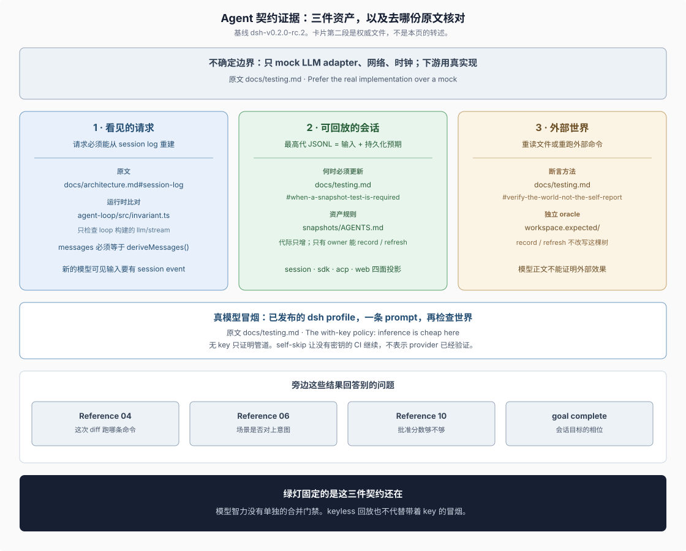
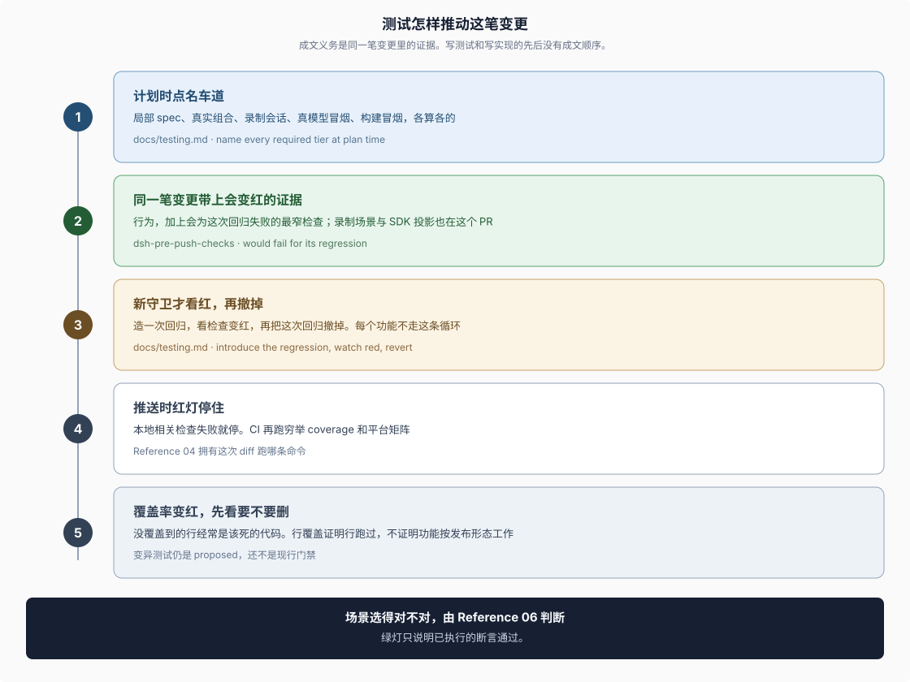
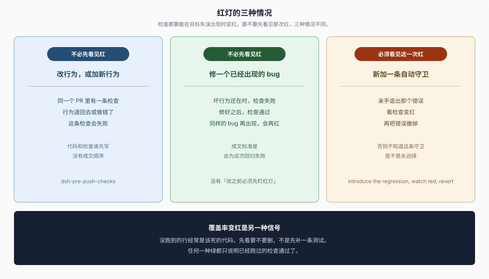

# Reference 12 · Agent 契约证据

## 一句话

DSH 验收 agent 时固定三件资产：它看见的请求、可回放的会话、独立于自述的外部世界。绿灯说明这三件契约还在。模型智力没有单独的合并门禁。行为要改，同一笔变更里就要有一条会为这次回归变红的检查；写测试和写实现的先后，仓库没有成文顺序。本页每条规则都标出 `dsh-v0.2.0-rc.2` 上的权威原文。

DSH 原文把这个参与者叫做 agent，把进模型的内容叫做 model-visible，把冻住的一次行为叫做 recorded-session。本页用这三个词组织条件，不另起一套评估术语。

## 本页读法

先看验的是什么，再看一笔变更怎样带上证据，最后看谁有权说完成。三张图各答一个问题，正文不把同一张图再说成第二份清单。

| 问题 | 本节 | 图 |
|---|---|---|
| 模型占哪一段，下游什么必须是真的 | [§1](#1-模型只占不确定边界) | — |
| 三件资产各固定什么，原文在哪 | [§2](#2-三件资产) | [agent-contract-evidence.svg](./figures/agent-contract-evidence.svg) |
| 一笔变更按什么顺序带上证据 | [§3](#3-一笔变更怎样带上证据) | [test-drives-the-change.svg](./figures/test-drives-the-change.svg) |
| 改行为、修 bug、新守卫，要不要先看见红 | [三种情况](#三种情况) | [three-red-cases.svg](./figures/three-red-cases.svg) |
| 真模型冒烟证明哪一段 | [§4](#4-真模型冒烟证明哪一段) | — |
| 绿灯、语义评审、批准分数、goal complete 各建立什么 | [§5](#5-完成判断仍分属不同位置) | 推动顺序图的底栏指向这里 |
| 要核对的事实去哪份原文 | [§6](#6-按图索骥) | — |

本页拥有三件资产的条件、例外和原文位置，并按上面这张表组织。[Reference 04](./04-gates-and-local-checks.md) 拥有「这次 diff 跑哪条命令」。[Reference 06](./06-review-and-human-role.md) 拥有语义评审是否判断场景对上了意图。[Reference 10](./10-approval-gate.md) 拥有批准分数。独立插件仓可以借用这三件资产的分工，并自己建立测试入口；主仓的 CI 矩阵不会因此变成插件仓的制度。

## 1. 模型只占不确定边界

> Mock only the expensive or non-deterministic boundary (LLM adapter, network, clock); keep everything downstream real.
>
> — DSH [`docs/testing.md` 的 “Prefer the real implementation over a mock”](https://github.com/deepseek-ai/deepseek-harness/blob/dsh-v0.2.0-rc.2/docs/testing.md#prefer-the-real-implementation-over-a-mock)。允许 mock 的只有 LLM adapter、网络和时钟。

边界下游是交付物。政策点名的样板 `makeBridgeHarness()` 挂上真的 loop、session store、tool registry 和 JSONL 持久化，唯一的 mock 是脚本化的 `MockAdapter`。手写的替身只能证明桥在搬运字节。

产品可见插件还要走真实 Loader：用测试专用 `cordis.yml` 从 Loader 和应用或进程入口启动，只 mock 外部服务或非确定输入，再断言 model-visible 请求或日志、持久状态、或用户可见输出。手搭 `ctx.plugin(...)` 不算这条证据。原文在 [`docs/testing.md` 的 “Test the real entry path”](https://github.com/deepseek-ai/deepseek-harness/blob/dsh-v0.2.0-rc.2/docs/testing.md#test-the-real-entry-path) 和 [`packages/AGENTS.md`](https://github.com/deepseek-ai/deepseek-harness/blob/dsh-v0.2.0-rc.2/packages/AGENTS.md)。

## 2. 三件资产

图上三张卡片是 agent 侧要固定的契约。卡片下面的真模型冒烟在 [§4](#4-真模型冒烟证明哪一段)。Reference 04、06、10 和 goal complete 回答别的问题，条件在 [§5](#5-完成判断仍分属不同位置)。

### 看见的请求

> **Model-visible means logged.** A runtime invariant checks model requests are reconstructable from the log. New model-visible inputs require session events.
>
> — DSH [`docs/architecture.md` 的 “Session log”](https://github.com/deepseek-ai/deepseek-harness/blob/dsh-v0.2.0-rc.2/docs/architecture.md#session-log)。会话日志是模型所见上下文的来源；新的模型可见输入必须先成为 session event。

运行时比对住在 [`packages/core/agent-loop/src/invariant.ts`](https://github.com/deepseek-ai/deepseek-harness/blob/dsh-v0.2.0-rc.2/packages/core/agent-loop/src/invariant.ts)。它挂在 `llm/stream` 上，只检查 loop 构建的请求：`options.messages` 必须等于该会话的 `deriveMessages()`，模型、温度、最大 token、stop 和 tools 必须等于日志折叠出的 `request/header`。对不上就失败。非 loop 构建的请求不走这条比对。

### 可回放的会话

> a top-level scenario's highest recorded parent generation supplies user input and model replay, then serves as the expected persisted result.
>
> — DSH [`docs/testing.md` 的 Snapshot 层](https://github.com/deepseek-ai/deepseek-harness/blob/dsh-v0.2.0-rc.2/docs/testing.md#tiers)。选中的最高代 JSONL 同时提供用户输入、模型回放和预期的持久化结果。

> Every non-trivial model-, protocol-, or human-visible change adds or updates a keyless recorded-session scenario in the same PR; package, e2e, mock-only, and rationale evidence does not replace the assembled transcript.
>
> — DSH [`docs/testing.md` 的 “When a snapshot test is required”](https://github.com/deepseek-ai/deepseek-harness/blob/dsh-v0.2.0-rc.2/docs/testing.md#when-a-snapshot-test-is-required)。包测试、e2e、纯 mock 和决定记录都不能代替这份组装后的转录。

资产规则的家是 [`snapshots/AGENTS.md`](https://github.com/deepseek-ai/deepseek-harness/blob/dsh-v0.2.0-rc.2/snapshots/AGENTS.md)，共享存储和 profile adapter 的家是 [`packages/test-support/session-snapshot/README.md`](https://github.com/deepseek-ai/deepseek-harness/blob/dsh-v0.2.0-rc.2/packages/test-support/session-snapshot/README.md)。现行条件：

- 这棵树只收「提交的 session JSONL 既是回放输入、又是预期持久化输出」的测试。不由录制会话驱动的 expected output 留在所属 app、package 或 script 的 `tests/expected/`，命令走 `test:expected`、`test:web` 或 `test`。
- Headless、SDK、ACP、Web 分别住在 `snapshots/session/`、`snapshots/sdk/`、`snapshots/acp/`、`snapshots/web/`。Web 渲染可以显式借用另一场景的 canonical session。进程从 `dsh` 和已发布 profile 启动。
- 同一角色可以留下多代。replay、record、refresh 选择数字最大的一代。record 和 refresh 写下带版本名的新输出，不重命名、不删除已提交的代。只有 owner 能 record 或 refresh 选中的角色。共享引用只读、无环，并指向 owner 选中的父代。
- 模型转录变了用 `test:snapshot:record`；回放输入仍有效用 `test:snapshot:refresh`。两条都会产生 diff，diff 都要审阅。`test:snapshot` 本身只回放、不写。
- agent-loop、session-lifecycle 或 `SessionEventMap` 的变更要同时更新两套 SDK 投影：`snapshots/sdk/` 拥有 TypeScript，[Python runtime CI 的决定记录](https://github.com/deepseek-ai/deepseek-harness/blob/dsh-v0.2.0-rc.2/.agents/notes/implemented/process/2026-09-06-master-only-platform-ci.md) 拥有 `scripts/snapshots/python-sdk-single-exe/`。

Keyless 表示回放验证不需要 API key。它不表示首次录制不需要 key，也不表示真模型已经验证过。真模型冒烟的范围在 [§4](#4-真模型冒烟证明哪一段)。

### 外部世界

> An e2e assertion re-runs the command or re-reads the file externally; a keyword probe on the agent's own output lets a cheating agent pass.
>
> — DSH [`docs/testing.md` 的 “Verify the world, not the self-report”](https://github.com/deepseek-ai/deepseek-harness/blob/dsh-v0.2.0-rc.2/docs/testing.md#verify-the-world-not-the-self-report)。断言重跑命令或重读文件。探测 agent 自己输出里的关键词，会放一个会自报的 agent 通过。声称未改动的文件要字节级相同。

会改工作区的录制场景把完整结果提交在 `workspace.expected/`。原文同一处写着：record 和 refresh 永不改写这棵树；模型正文和工具回执文本不能证明外部效果。`snapshots/AGENTS.md` 把这棵树称为 independent oracle：场景设置 `workspace.final: true`，空结果只用被忽略的 `.empty` 标记。

## 3. 一笔变更怎样带上证据

§2 回答证据固定什么。本节回答一笔变更怎样把证据带上：计划时点名落在哪一层，同一个 PR 里要有一条会为这次回归失败的检查。仓库没有把「先写失败测试、再写实现、再重构」写成必经顺序。

### 推动顺序

图上五步是交付顺序。第 3 步只在新守卫上要求先看见红。第 4 步的命令选择由 [Reference 04](./04-gates-and-local-checks.md) 拥有：本地相关检查失败就停止并修复，不能把 CI 当作试运行；CI 再跑穷举 coverage 和平台矩阵。底栏的语义评审由 [§5](#5-完成判断仍分属不同位置) 拥有。

> New capability seams and lifecycle or transcript variants name every required tier at plan time.
>
> — DSH [`docs/testing.md` 的 “When a snapshot test is required”](https://github.com/deepseek-ai/deepseek-harness/blob/dsh-v0.2.0-rc.2/docs/testing.md#when-a-snapshot-test-is-required)。新的 capability seam、生命周期或转录变体，在计划时点名每一层需要的测试。

根 [`AGENTS.md` 的 Conventions](https://github.com/deepseek-ai/deepseek-harness/blob/dsh-v0.2.0-rc.2/AGENTS.md#conventions) 用同一句话落地：Plan unit, e2e, and snapshot coverage。点名的是车道：局部 spec、真实组合、录制会话、真模型冒烟、构建冒烟，各算各的。点名的不是先提交一个红灯测试。录制场景的代际、owner 和两套 SDK 投影，条件在 [可回放的会话](#可回放的会话)。

> There is no universal local baseline beyond the hooks. Every behavior change needs the narrowest available test or purpose-built check that would fail for its regression; add broader checks only for surfaces the diff actually reaches.
>
> — DSH [`dsh-pre-push-checks` 的 “Select relevant evidence”](https://github.com/deepseek-ai/deepseek-harness/blob/dsh-v0.2.0-rc.2/.agents/skills/dsh-pre-push-checks/SKILL.md#select-relevant-evidence)。这条检查在目标回归出现时会失败。hooks 之外没有一份人人都要先跑完的本地基线。

推送前先解析 outgoing diff，再跑拥有这块行为的 Vitest 文件或聚焦测试名。文档、可见输出、构建产物和真 provider 各走自己的车道。

### 三种情况

不熟悉这条流程时，先看红灯落在哪一种情况。三种情况共用本节开头的标准：检查要能在目标失误出现时变红。它们要不要先看见那次红，各不相同。

| 你在做的事 | 怎样才算有证据 | 要不要先看见红 |
|---|---|---|
| 改一块已有行为，或加上一个新行为 | 同一个 PR 里有一条检查。这个行为退回去或做错了，检查会失败 | 不必。代码和检查谁先写，没有成文顺序 |
| 修一个已经出现的 bug | 坏行为还在时检查会失败，修好后通过。同样的 bug 再出现，检查会再红 | 成文标准是「会为这次回归失败」。没有另写「改代码之前必须先盯着红灯」 |
| 新加一条会自动失败的守卫，例如门禁或专门挡住某类错误的断言 | 亲手造出那个错误，看检查变红，再把错误撤掉 | 必须亲眼看见这一次红。否则不知道这条守卫是不是永远绿 |

第三行的原文把对象限定在新的机械守卫，不是每个功能的开发循环：

> A guard only guards if the regression fails it. [...] prove it: introduce the regression, watch red, revert.
>
> — DSH [`docs/testing.md` 的 “Test the real entry path”](https://github.com/deepseek-ai/deepseek-harness/blob/dsh-v0.2.0-rc.2/docs/testing.md#test-the-real-entry-path)。造一次回归，看检查变红，再把这次回归撤掉。

覆盖率变红不属于这三种情况。它不回答「要不要先看见红」，而回答「没跑到的那一行还该不该留」：

> An uncovered line is often dead code the gate flags for deletion, not a missing test to bolt on. Line coverage is necessary, never sufficient — it proves lines ran, not that the feature works as shipped.
>
> — DSH [`docs/testing.md` 的 Coverage gate](https://github.com/deepseek-ai/deepseek-harness/blob/dsh-v0.2.0-rc.2/docs/testing.md#tiers)。没覆盖到的行经常要删。行覆盖证明行跑过，不证明功能按发布形态工作。

用变异测试逼「断言必须能杀死错误」仍是 [`2026-06-11-mutation-testing`](https://github.com/deepseek-ai/deepseek-harness/blob/dsh-v0.2.0-rc.2/.agents/notes/proposed/testing/2026-06-11-mutation-testing.md)，`Status: proposed`。它还不是现行门禁。

## 4. 真模型冒烟证明哪一段

> We are DeepSeek — do not ration real-API tests. A no-key test proves plumbing; only a with-key run proves the agent works against a real model. [...] Self-skip keeps secretless CI and keyless contributors unblocked; it is not a cost signal.
>
> — DSH [`docs/testing.md` 的 “The with-key policy”](https://github.com/deepseek-ai/deepseek-harness/blob/dsh-v0.2.0-rc.2/docs/testing.md#the-with-key-policy-inference-is-cheap-here)。无 key 证明管道。有 key、启动已发布的 `dsh` profile、发送一条 prompt、再检查世界，才证明 agent 对着真模型工作。self-skip 不是成本信号，也不能写成 provider 已经验证。

最高价值的形态是冒烟：启动已发布 profile，发一条 prompt，检查世界。政策要求覆盖写文件、多轮、工具使用和流中取消。这条证据回答「产品对着真模型还能工作」。它不产生智力分数，也不代替 [可回放的会话](#可回放的会话) 里的 keyless 组装转录。两条都要时，各自保留自己的观察对象。

## 5. 完成判断仍分属不同位置

| 观察 | 它建立的事实 | 权威位置 |
|---|---|---|
| 三件资产为绿 | 请求可重建、选中的转录仍匹配、外部世界与独立 oracle 一致 | [§2](#2-三件资产) |
| 真模型冒烟通过 | 已发布 profile 对着真模型完成了所断言的那次检查 | [§4](#4-真模型冒烟证明哪一段) |
| semantic review | 实现、文档和所选场景是否对上任务意图 | [Reference 06](./06-review-and-human-role.md) 与 [`dsh-code-review`](https://github.com/deepseek-ai/deepseek-harness/blob/dsh-v0.2.0-rc.2/.agents/skills/dsh-code-review/SKILL.md) |
| weighted approval | 适用的批准分数是否达到门槛 | [Reference 10](./10-approval-gate.md) |
| goal 的 `complete` | 这一会话里那个长期目标的持久相位变成 complete | [`docs/subsystems/goal.md`](https://github.com/deepseek-ai/deepseek-harness/blob/dsh-v0.2.0-rc.2/docs/subsystems/goal.md#identity-and-lifecycle) 与 [`packages/goal/goal/README.md`](https://github.com/deepseek-ai/deepseek-harness/blob/dsh-v0.2.0-rc.2/packages/goal/goal/README.md) |

Goal 服务保存一个跨 turn 的完成目标。相位 `complete` 回答这个目标发生了什么。包说明写明：这个包存储 goal 状态，不负责排程；继续运行的许可留在进程内，不是持久事实。因此把 goal 标成 complete，并不建立上面三件资产，也不代替语义评审。

## 6. 按图索骥

下表跟着本页顺序走。先打开权威原文，再用对应小节对照条件和例外。链接都钉在 `dsh-v0.2.0-rc.2`。

| 要核对的事实 | 权威原文 | 本页位置 |
|---|---|---|
| 只 mock LLM adapter、网络、时钟 | [`docs/testing.md` · Prefer the real implementation over a mock](https://github.com/deepseek-ai/deepseek-harness/blob/dsh-v0.2.0-rc.2/docs/testing.md#prefer-the-real-implementation-over-a-mock) | [§1](#1-模型只占不确定边界) |
| 产品可见插件的真实组合 | [`docs/testing.md` · Test the real entry path](https://github.com/deepseek-ai/deepseek-harness/blob/dsh-v0.2.0-rc.2/docs/testing.md#test-the-real-entry-path)、[`packages/AGENTS.md`](https://github.com/deepseek-ai/deepseek-harness/blob/dsh-v0.2.0-rc.2/packages/AGENTS.md) | [§1](#1-模型只占不确定边界) |
| 模型看见的请求必须能从日志重建 | [`docs/architecture.md` · Session log](https://github.com/deepseek-ai/deepseek-harness/blob/dsh-v0.2.0-rc.2/docs/architecture.md#session-log) | [看见的请求](#看见的请求) |
| loop 请求与日志派生结果的比对实现 | [`packages/core/agent-loop/src/invariant.ts`](https://github.com/deepseek-ai/deepseek-harness/blob/dsh-v0.2.0-rc.2/packages/core/agent-loop/src/invariant.ts) | [看见的请求](#看见的请求) |
| 何时必须在同一 PR 更新录制场景 | [`docs/testing.md` · When a snapshot test is required](https://github.com/deepseek-ai/deepseek-harness/blob/dsh-v0.2.0-rc.2/docs/testing.md#when-a-snapshot-test-is-required) | [可回放的会话](#可回放的会话) |
| 代际、owner、共享引用、workspace oracle | [`snapshots/AGENTS.md`](https://github.com/deepseek-ai/deepseek-harness/blob/dsh-v0.2.0-rc.2/snapshots/AGENTS.md) | [可回放的会话](#可回放的会话)、[外部世界](#外部世界) |
| 录制存储与 profile adapter | [`packages/test-support/session-snapshot/README.md`](https://github.com/deepseek-ai/deepseek-harness/blob/dsh-v0.2.0-rc.2/packages/test-support/session-snapshot/README.md) | [可回放的会话](#可回放的会话) |
| 重读外部世界，而不是探测 agent 自述 | [`docs/testing.md` · Verify the world, not the self-report](https://github.com/deepseek-ai/deepseek-harness/blob/dsh-v0.2.0-rc.2/docs/testing.md#verify-the-world-not-the-self-report) | [外部世界](#外部世界) |
| 计划时点名测试车道，不规定先写测试 | [`docs/testing.md` · When a snapshot test is required](https://github.com/deepseek-ai/deepseek-harness/blob/dsh-v0.2.0-rc.2/docs/testing.md#when-a-snapshot-test-is-required)、[`AGENTS.md` · Conventions](https://github.com/deepseek-ai/deepseek-harness/blob/dsh-v0.2.0-rc.2/AGENTS.md#conventions) | [推动顺序](#推动顺序) |
| 每笔行为变更要有会为这次回归失败的最窄检查 | [`dsh-pre-push-checks` · Select relevant evidence](https://github.com/deepseek-ai/deepseek-harness/blob/dsh-v0.2.0-rc.2/.agents/skills/dsh-pre-push-checks/SKILL.md#select-relevant-evidence) | [推动顺序](#推动顺序) |
| 改行为、修 bug、新守卫要不要先看见红 | [`dsh-pre-push-checks` · Select relevant evidence](https://github.com/deepseek-ai/deepseek-harness/blob/dsh-v0.2.0-rc.2/.agents/skills/dsh-pre-push-checks/SKILL.md#select-relevant-evidence)、[`docs/testing.md` · Test the real entry path](https://github.com/deepseek-ai/deepseek-harness/blob/dsh-v0.2.0-rc.2/docs/testing.md#test-the-real-entry-path) | [三种情况](#三种情况) |
| 新守卫必须亲眼变红再撤掉回归 | [`docs/testing.md` · Test the real entry path](https://github.com/deepseek-ai/deepseek-harness/blob/dsh-v0.2.0-rc.2/docs/testing.md#test-the-real-entry-path) | [三种情况](#三种情况) |
| 未覆盖的行经常是待删除的代码 | [`docs/testing.md` · Tiers](https://github.com/deepseek-ai/deepseek-harness/blob/dsh-v0.2.0-rc.2/docs/testing.md#tiers) | [三种情况](#三种情况) |
| 变异测试仍是提案 | [`2026-06-11-mutation-testing`](https://github.com/deepseek-ai/deepseek-harness/blob/dsh-v0.2.0-rc.2/.agents/notes/proposed/testing/2026-06-11-mutation-testing.md) | [三种情况](#三种情况) |
| 这次 diff 选哪条本地命令 | [Reference 04](./04-gates-and-local-checks.md)、[`dsh-pre-push-checks`](https://github.com/deepseek-ai/deepseek-harness/blob/dsh-v0.2.0-rc.2/.agents/skills/dsh-pre-push-checks/SKILL.md) | [推动顺序](#推动顺序) |
| 有 key 的冒烟与 self-skip 的含义 | [`docs/testing.md` · The with-key policy](https://github.com/deepseek-ai/deepseek-harness/blob/dsh-v0.2.0-rc.2/docs/testing.md#the-with-key-policy-inference-is-cheap-here) | [§4](#4-真模型冒烟证明哪一段) |
| 分层、coverage、snapshot、Web 各证明什么 | [`docs/testing.md` · Tiers](https://github.com/deepseek-ai/deepseek-harness/blob/dsh-v0.2.0-rc.2/docs/testing.md#tiers) | [§2](#2-三件资产)、[§4](#4-真模型冒烟证明哪一段) |
| 场景是否对上意图 | [Reference 06](./06-review-and-human-role.md) | [§5](#5-完成判断仍分属不同位置) |
| 批准分数 | [Reference 10](./10-approval-gate.md) | [§5](#5-完成判断仍分属不同位置) |
| goal complete 保存的是什么 | [`docs/subsystems/goal.md`](https://github.com/deepseek-ai/deepseek-harness/blob/dsh-v0.2.0-rc.2/docs/subsystems/goal.md#identity-and-lifecycle)、[`packages/goal/goal/README.md`](https://github.com/deepseek-ai/deepseek-harness/blob/dsh-v0.2.0-rc.2/packages/goal/goal/README.md) | [§5](#5-完成判断仍分属不同位置) |

## 证据入口

- DSH [`docs/testing.md`](https://github.com/deepseek-ai/deepseek-harness/blob/dsh-v0.2.0-rc.2/docs/testing.md)：分层、mock 边界、外部世界断言、真实入口、录制义务、计划时点名车道、看红再撤，以及 with-key 政策的家。
- DSH [`dsh-pre-push-checks`](https://github.com/deepseek-ai/deepseek-harness/blob/dsh-v0.2.0-rc.2/.agents/skills/dsh-pre-push-checks/SKILL.md#select-relevant-evidence)：行为变更要有会为这次回归失败的最窄检查。
- DSH [`AGENTS.md` · Conventions](https://github.com/deepseek-ai/deepseek-harness/blob/dsh-v0.2.0-rc.2/AGENTS.md#conventions)：计划 unit、e2e 和 snapshot 覆盖。
- DSH [`docs/architecture.md` · Session log](https://github.com/deepseek-ai/deepseek-harness/blob/dsh-v0.2.0-rc.2/docs/architecture.md#session-log)：model-visible means logged。
- DSH [`agent-loop` invariant](https://github.com/deepseek-ai/deepseek-harness/blob/dsh-v0.2.0-rc.2/packages/core/agent-loop/src/invariant.ts)：loop 构建的请求与日志派生结果的比对。
- DSH [`snapshots/AGENTS.md`](https://github.com/deepseek-ai/deepseek-harness/blob/dsh-v0.2.0-rc.2/snapshots/AGENTS.md)：代际、owner、共享引用和 `workspace.expected/`。
- DSH [`session-snapshot` README](https://github.com/deepseek-ai/deepseek-harness/blob/dsh-v0.2.0-rc.2/packages/test-support/session-snapshot/README.md)：共享存储规则与 profile adapter。
- DSH [`dsh-goal` README](https://github.com/deepseek-ai/deepseek-harness/blob/dsh-v0.2.0-rc.2/packages/goal/goal/README.md)：goal 状态的存储范围。
