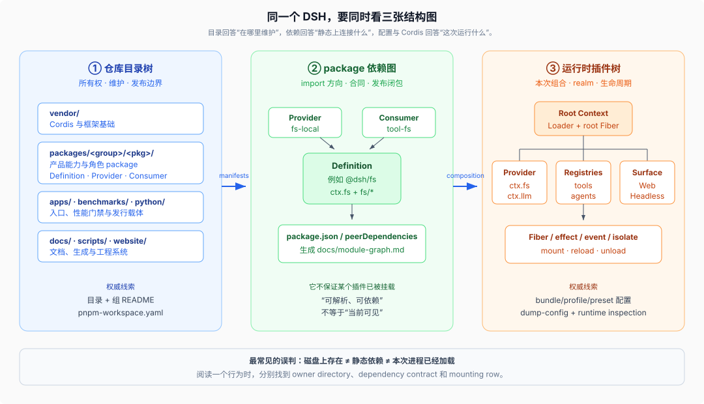

# 01 · 先分清三棵树

源码核验基线：DeepSeek Harness `0.1.0-rc.5`，commit `47f943859bef60e4160492346772ded9b24f765a`。

## 为什么目录越看越乱

很多项目的磁盘目录、依赖结构和运行时对象大致同构：打开 `services/foo`，它被主程序 import，然后启动时总会存在。DSH 刻意不维持这种同构，因为产品能力通过 Cordis 插件动态组合，同一个 package 可以存在于仓库和依赖闭包里，却不出现在某次运行；同一 Definition 也可以在不同 profile 中接上不同 Provider。

因此，“DSH 的结构”至少包含三棵树：



## 第一棵：仓库目录树

仓库目录树是人的维护地图。它表达代码所有权、发布边界和资料层级：

```text
vendor/                 Cordis 框架与基础库
packages/<group>/<pkg>  产品 package
apps/                   最终可执行入口
examples/               可运行组合叶子
native/                 原生 launcher 家族
python/                 Python SDK 与 runtime 发行物
docs/ + website/        权威文档与站点投影
scripts/                生成器与仓库门禁
```

目录树不回答“本次运行加载了什么”。`packages/e2b/fs-e2b` 在仓库里存在，只说明项目维护这个 Provider；默认本地 profile 是否加载它，要看组合配置。

目录树也不完整表达 import 方向。`tool-fs` 和 `fs-local` 同处 `packages/fs/`，但两者都围绕 `fs` Definition 演化，Consumer 不应为了本地实现去依赖 `fs-local`。这要看第二棵图。

## 第二棵：package 依赖图

依赖图由各 package 的 `package.json` 形成。DSH 将 `peerDependencies` 作为 package 间规范运行时依赖信号，生成的 [`docs/module-graph.md`](../../docs/module-graph.md) 汇总整张图。

依赖图主要回答：

- 哪个 package 拥有调用者使用的类型与服务合同。
- Consumer 是否错误依赖具体 Provider。
- 一个 bundle 或 app 的发布闭包需要携带哪些 package。
- Host 与 Client 编译面分别会拉入哪些声明合并和运行时代码。

典型方向是：

```text
tool-fs ───────→ fs
fs-local ──────→ fs
fs-sandbox ────→ fs + sandbox
base bundle ───→ 具体插件 package 的发布闭包
```

这里的箭头表示静态依赖，不表示运行时必然调用，更不表示 Cordis 服务已经可见。`tool-fs` 的包可以安装在磁盘上，但如果配置没有挂载它，就不会向 `ctx.tools` 注册任何工具。

## 第三棵：运行时插件树

运行时插件树由 Cordis Loader 根据 entry list 建立。对产品 profile 来说，entry list 从空根开始，由 bundle patch、profile patch、home patch、`--patch` overlay 按顺序合成；每一行选择插件名、配置、禁用状态、group 和 isolate。

它回答的是动态问题：

- 本次进程究竟挂了哪个模型 Provider、文件系统 Provider、持久化后端和入口插件。
- 一个服务在 root realm 还是某个 isolate realm 中可见。
- 哪些工具只对某个 agent preset 可见。
- HMR 或配置更新时哪条 Fiber 会卸载、重建并撤销贡献。
- 同一个 package 是否挂载了多次、分别带什么配置。

这棵树不能从 `package.json` 单独推导，因为 profile、用户 patch 和运行平台都能改变结果。产品提供 `dsh --profile <name> --dump-config` 查看合成后的配置；dump 与 boot 共用 patch 算法，但 dump 不创建 Context 或启动插件。

## 三棵树怎样连接

连接关系可以简化为：

```text
仓库目录
  └─ package.json / exports / workspace membership
       └─ package 依赖图与可解析插件集合
            └─ bundle + profile + overlays 选择其中一部分
                 └─ Loader 创建运行时 Fiber / Context / service / event / effect
```

目录决定“在哪里维护”，依赖决定“静态上允许连接什么”，配置决定“这次连接什么”，Cordis 生命周期决定“这些连接何时存在”。

## Web 还有第二套客户端插件树

`dsh web` 的 Host 是 Node 进程中的 Cordis 树，包含 session、agent、Provider、API gateway 和 HTTP server。浏览器不是简单加载一个静态 React 单体；`apps/web/src/main.ts` 启动 `@deepseek-ai/dsh-client-web`，后者根据 Host 推送的 client entry graph 建立浏览器侧模块系统和 Cordis 插件树，再让 `ui-*` package 向 slots 和 client services 注册贡献。

因此 Web 阅读时至少要标明自己位于哪一边：

| 平面 | 典型目录 | 主要状态 |
|------|----------|----------|
| Host / Node | `packages/host/`、`packages/api/` 的 Host 面、产品 capability packages | Agent、Session、Provider、HTTP/RPC 服务 |
| Client / Browser | `packages/client/`、`packages/api/` 的 Client 面、`apps/web` | Client object services、slots、React UI 插件 |

两边通过类型化 Remote/RPC 与事件投影连接，不共享同一个 JavaScript Context 对象。`apps/web` 很薄，是因为客户端装配逻辑也被拆回可复用的 `packages/client/*`。

## 典型误判

| 看到的现象 | 错误推断 | 正确检查 |
|------------|----------|----------|
| `packages/llm/llm-deepseek` 存在 | 每次运行一定用 DeepSeek Provider | 看有效 profile 的 adapter rows 与 route 设置 |
| `apps/cli` 依赖很多 package | CLI 入口直接实现所有能力 | 看 bundle/profile 配置实际挂载哪些插件 |
| `tool-fs` 依赖 `fs` | 工具自带本地文件系统 | 看运行时哪个 Provider 注册 `ctx.fs` |
| Web 页面有某个组件 package | 页面启动时一定展示它 | 看 client entry graph、插件激活和 slot contribution |
| bundle 的 package 依赖某插件 | bundle 自己执行该插件行为 | 看 `cordis.patch.yml` 插入的 row；行为仍属于目标插件 |

## 阅读时的固定动作

每当遇到一个 package，按以下顺序问：

1. 它在仓库哪个 group，谁拥有这个领域？
2. 它的 `package.json` 依赖哪些 Definition、Provider 或基础设施？
3. 哪个 bundle、profile、preset 或 example 挂载它？
4. 它注册哪个 `ctx` key、事件、工具或 UI slot？
5. 这个贡献属于 root、Host、Client，还是某个 agent scope / isolate realm？

只要这五问分别作答，目录、依赖和运行时就不会再混成一团。

## 核验入口

- [`pnpm-workspace.yaml`](../../pnpm-workspace.yaml)
- [`docs/module-graph.md`](../../docs/module-graph.md)
- [`docs/architecture.md`](../../docs/architecture.md)
- [`apps/cli/src/profile-boot.ts`](../../apps/cli/src/profile-boot.ts)
- [`packages/client/web/README.md`](../../packages/client/web/README.md)
- [`_digested/composition/00-map.md`](../../_digested/composition/00-map.md)
- [`_digested/cordis-runtime/00-map.md`](../../_digested/cordis-runtime/00-map.md)
