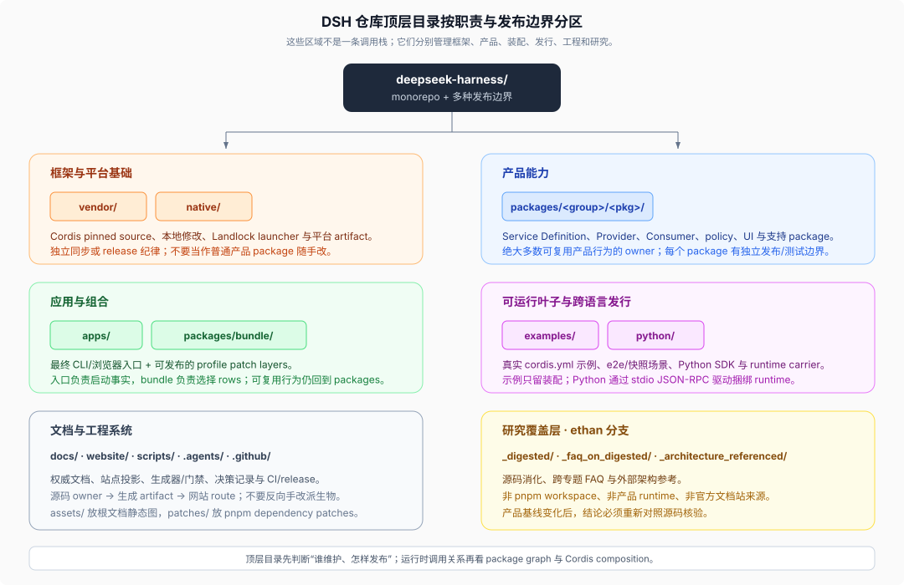

# 02 · 顶层目录按什么边界划分

源码核验基线：DeepSeek Harness `0.1.0-rc.7`，commit `99f6f02fecdb7dff40c3fbc9470f5907c29f74ca`。

## 总图



顶层目录主要表达维护、构建和发布边界，而不是一条从底到顶的运行时调用栈。`vendor/`、`packages/`、`apps/` 之间确实存在基础到应用的方向，但 `docs/`、`scripts/`、`examples/` 和研究目录是围绕产品工作的其它平面。

## 产品与框架源码

| 目录 | 拥有什么 | 不拥有什么 | 阅读入口 |
|------|----------|------------|----------|
| `vendor/` | 钉住的 Cordis、Loader、Include、HMR 及基础库源码；上游 commit 与本地修改清单 | DSH 产品能力；普通第三方 npm 依赖 | [`vendor/README.md`](../../vendor/README.md) |
| `packages/` | `@deepseek-ai/dsh-*` 产品和支持 packages；Service、Provider、Consumer、策略、UI、bundle | 最终产品 bin；根示例的运行配置 | [`packages/README.md`](../../packages/README.md) |
| `apps/` | 最终应用入口：发布的 `dsh` CLI 与浏览器 Vite entry | 可复用能力实现；完整业务模块 | [`apps/cli/README.md`](../../apps/cli/README.md)、`apps/web/src/main.ts` |

`vendor/` 被纳入 pnpm workspace，因为 DSH 要从源码构建并发布自己重命名后的 Cordis 框架层；但它仍保持单独的 upstream manifest、同步流程和本地修改日志。不要像普通 `packages/` 代码一样顺手重构它。

`packages/` 是主产品层。绝大多数功能修改最终落在这里，但准确落点仍由能力所有者和角色决定，不是看到一个功能就新建 group。

`apps/cli` 的职责是解析启动模式、组合 profile、提供进程级启动事实和收敛 shutdown；`apps/web` 只寻找 DOM mount point 并启动 client shell。入口保持薄，才能让 JSON-RPC、ACP、Headless 与 Web 复用相同的产品 packages。

## 组合与可运行叶子

| 目录 | 角色 | 关键区别 |
|------|------|----------|
| `packages/bundle/` | 可发布、可安装的 profile patch 层 | 位于 `packages/`，因为 bundle 自身也是 npm package |
| `packages/examples/` | 可复用的 demo bundle packages | 是 package 层的参考装配，不是最终运行目录 |
| 根 `examples/` | 真正可运行的 `cordis.yml` 叶子、fixtures、快照与 e2e 场景 | 整个根 `examples` 作为一个 pnpm workspace member，不逐叶构建发布 |

`packages/examples/agent-spine-demo` 可以被多个示例复用；`examples/headless-agent/cordis.yml` 才是一个可直接启动的组合叶子。前者解决“复用哪段装配”，后者解决“这次 demo 从哪个配置启动”。

根 `examples/` 不应沉淀可复用业务逻辑。若一个 demo 中出现可复用实现，应提取回 `packages/`，让 package 获得自己的合同、测试、覆盖率和发布边界。

## 跨语言与平台发行

| 目录 | 角色 | 为什么不放进普通 `packages/` |
|------|------|------------------------------|
| `native/` | Landlock 自限制 launcher 的原生源码与三-package npm 家族 | 有独立平台矩阵、native artifact 和 release workflow |
| `python/` | Python SDK 与捆绑 DSH runtime 的发行载体 | 使用 Python packaging；SDK 通过 stdio JSON-RPC 驱动 runtime |

`native/landlock-run` 仍加入根 pnpm workspace，以便 Harness consumer 与 launcher 合同在同一仓库联调；它的 release 边界仍独立。`python/sdk` 是 Python package，`python/sdk-runtime` 同时承担 Python runtime carrier 与 pnpm deploy-root manifest 的角色。

## 文档、站点与工程系统

| 目录 | 拥有什么 | 典型误读 |
|------|----------|----------|
| `docs/` | 架构、subsystem reference、cookbook、用户文档、生成目录、postmortem | 误以为所有 package 细节都应复制到架构页 |
| `website/` | `website/docs.ts` publication manifest、VitePress 配置和站点资产 | 误以为网站 route 下有另一份权威 Markdown |
| `scripts/` | 生成器、校验器、构建和发布脚本、fixtures/snapshots | 把生成文件手改，而不是修改 owner 或 generator |
| `.agents/` | Agent Notes 与仓库专用 skills | 把决策理由写进当前行为 reference，或把 archived note 当现行合同 |
| `.github/` | CI、release、issue/PR policy 与模板 | 把 CI workflow 当成本地日常命令清单 |
| `assets/` | 根文档使用的少量静态图片 | 通用前端资产仓；产品 UI 资产应由所属 package/app 管理 |
| `patches/` | pnpm `patchedDependencies` 的补丁 | vendored source；真正 vendored 代码在 `vendor/` |

文档实行“一事实一归属”。高层架构只说明顺序、职责和扩展点；类型与事件语义属于 `docs/subsystems/`；package 消费合同属于 package README；生成 catalog 由 scripts 从源码再生；网站只投影这些来源。

## Workspace 与非 Workspace

[`pnpm-workspace.yaml`](../../pnpm-workspace.yaml) 是 pnpm 实际成员清单，主要包括：

```text
vendor/*
packages/*/*
native/landlock-run
native/landlock-run/packages/*
apps/*
website
examples
python/sdk-runtime
```

这份清单透露了几个设计选择：

- `packages/` 必须保持两级 `group/package`，workspace glob 才能统一发现。
- 根 `examples/` 是一个 dependency-resolution root，不是把每个 example 变成发布 package。
- Python SDK 本身由 Python 工具管理，只有 runtime carrier 进入 pnpm 部署闭包。
- `docs/`、`scripts/`、`.agents/` 和研究目录不是独立 workspace package，但可由根脚本消费。

## 构建配置为什么都在根

根 `tsconfig.base.json`、`tsconfig.host.json`、`tsconfig.client.json`、`tsdown.config.ts`、Vitest configs 和 `package.json` scripts 共同协调整个 monorepo。它们不是产品运行时模块，而是构建图的控制面。

TypeScript 特别区分 Host 与 Client 两个 compiler face。普通 package 只加入一个 aggregate；这是因为两边可能对同名 Cordis Context key 做不同声明合并，不能把所有项目压成一个 TypeScript Program。package 自己的 `tsconfig.json` 保持编译边界，根 aggregate 只组合 project references。

构建时先由 TypeScript 在每个 package 的 `lib/types` 产生中间 JS/声明，再由 tsdown 输出发布 runtime 到 `lib/`；静态测试和 gates 通过 tsconfig paths 读 `src/`。所以读实现从 `src/` 开始，验证发布行为才去看构建后的 `lib/`。

## 研究覆盖层

| 目录 | 用途 | 产品地位 |
|------|------|----------|
| `_digested/` | 从源码重建机制主线 | 非产品、非官方文档、非 workspace |
| `_faq_on_digested/` | 跨消化材料与源码回答二次问题 | 非产品、非运行时 |
| `_architecture_referenced/` | 外部或独立架构分析的本地参考 | 仅参考，结论需回到当前源码核验 |

这三处属于 `ethan` 分支的研究工作面。它们可以引用产品源码和官方文档，但不能反过来成为产品实现的隐式权威；同步产品基线后，应按研究索引重新核验受影响结论。

## 快速定位规则

| 你在找什么 | 首先去哪里 |
|------------|------------|
| 一个服务合同、工具或 Provider | `packages/<owner-group>/` |
| `dsh` 命令怎么启动 | `apps/cli/` |
| Web 页面最初从哪里挂载 | `apps/web/`，随后进入 `packages/client/` |
| 默认启用哪些插件 | `packages/bundle/*/cordis.patch.yml` 与 profile/preset config |
| 一个可运行组合 | 根 `examples/` |
| 一个类型或事件的权威说明 | `docs/subsystems/` 或生成 catalog |
| 架构决策为什么这样做 | `.agents/notes/implemented/`，但先找当前文档/源码合同 |
| 生成或校验某份文档/目录 | `scripts/` |
| Python 用户怎么驱动 DSH | `python/sdk/` |
| 原生 sandbox launcher | `native/landlock-run/` |

## 核验入口

- [`pnpm-workspace.yaml`](../../pnpm-workspace.yaml)
- [`docs/development.md`](../../docs/development.md#typescript-project-layout)
- [`vendor/README.md`](../../vendor/README.md)
- [`native/README.md`](../../native/README.md)
- [`python/README.md`](../../python/README.md)
- [`examples/AGENTS.md`](../../examples/AGENTS.md)
- [`website/docs.ts`](../../website/docs.ts)
