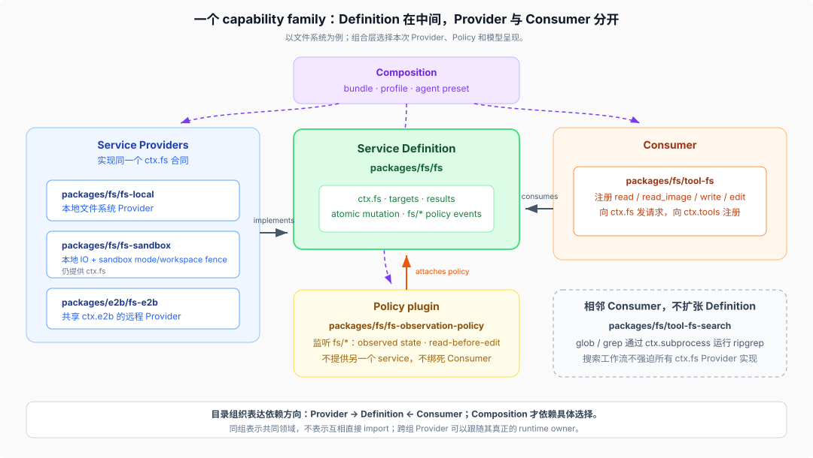

# 03 · `packages/` 的角色语法

源码核验基线：DeepSeek Harness `dsh-v0.1.2-rc.1`，commit `a66e4702047846cdaa10c66c9d3df3951f5ea70d`。

## 先把六个层级分开

DSH 从源码维护单元走到活运行时，要经过六个不同层级：

| 层级 | 它是什么 | 例子 |
|------|----------|------|
| group | 仓库中的领域归属，不是运行时对象 | `packages/fs/` |
| package | npm workspace、依赖和发布单元，可以导出一个或多个插件 | `@deepseek-ai/dsh-fs-local` |
| plugin | 可由 Cordis 加载的函数或类，定义一次行为和生命周期 | `LocalFileSystem` |
| entry row | `cordis.yml` 中一次带稳定 id、插件引用和 config 的挂载声明 | `fs-local` row |
| Fiber | Cordis 为一次插件挂载创建的运行时实例，拥有 lifecycle state、effects、inject 与父子关系 | Host tree 中活跃的 `LocalFileSystem` Fiber |
| Context / realm | Context 是插件运行和解析服务的作用域；entry 的 `isolate` 可为具体 service 建立本地或具名 realm | Host Context 中 `fs` 的 entry-local realm |

因此，“package 已安装”只说明模块可解析，“配置里有 entry row”只说明它被声明挂载；只有相应 Fiber 激活后，插件的 effects 与 service 才进入那个 Context realm。一个 package 可以导出多个插件，同一个 plugin 也可以由多条 entry row 挂载成多个 Fiber，不能用目录树代替运行时插件树。

## 两级目录分别回答什么

`packages/<group>/<pkg>/` 不是单纯为了避免一个目录下文件太多：

- `<group>` 回答“哪个领域拥有这个能力或产品平面”。
- `<pkg>` 回答“这个可发布、可替换、可独立测试的单元扮演什么角色”。

组 README 是第一入口。它应当列出组内 package、职责和 `ctx` key；根 [`packages/README.md`](../../packages/README.md) 只列 group 与整体依赖原则，避免维护一份重复的 package 细节目录。

## 一条 capability family 的典型构成



| 角色 | 负责什么 | 常见命名线索 |
|------|----------|--------------|
| Service Definition | 服务接口、请求/结果类型、事件、配置合同、`ctx` key | 领域裸名，如 `fs`、`llm`、`subprocess`、`web` |
| Service Provider | 实现 Definition，在 Context 中提供服务或注册 backend | `-local`、`-sqlite`、`-deepseek`、`-e2b`、`-worker-thread` |
| Consumer | 把能力呈现给模型、命令、UI 或另一应用层 | `tool-*`、`command-*`、`ui-*`，或语义明确的消费 package |
| Policy / Adapter | 通过事件、wrapper 或注册表改变执行策略 | `*-policy`、`*-retry`、`guard/*`、观察/审批插件 |
| Composition | 选择一组具体插件与默认配置 | `bundle/*`、demo bundle、profile/preset Cordis 配置 |

命名只是导航线索，不是自动分类器。最终以 group README、package README、`package.json` 依赖、`src/index.ts` 的注册行为和配置中的挂载位置为准。

## 为什么必须拆角色

如果 `tool-fs` 直接 new 本地文件系统，那么模型工具、路径语义、本地 IO、远程 E2B、sandbox policy 和 UI 展示会绑定在一个 package。替换为远程 Provider 时，要么复制工具，要么在工具内部堆部署分支。

当前拆分让依赖方向变成：

```text
Provider ──implements──→ Definition ←──consumes── Consumer
                              ↑
                         Policy listens/wraps

Composition chooses Provider + Policy + Consumer
```

Definition 位于中间，Provider 和 Consumer 都朝它依赖；Composition 可以依赖具体实现，因为它的职责正是做部署选择。这个方向是“扩展插件依赖 Service Definition，不依赖具体 Provider”的目录化表达。

## 文件系统家族逐项看

| Package | 角色 | 运行时贡献 |
|---------|------|------------|
| `packages/fs/fs` | Definition | `ctx.fs`、文件目标/结果类型、`fs/*` 策略事件 |
| `packages/fs/fs-local` | Provider | 本地 `FileSystem` 实现 |
| `packages/fs/fs-sandbox` | Provider | 基于本地 IO 与 sandbox policy 的写入 fence |
| `packages/e2b/fs-e2b` | 跨组 Provider | 共享 E2B remote runtime 的远程文件系统 |
| `packages/fs/fs-observation-policy` | Policy | 通过 `fs/*` 监听器执行 observed-state、read-before-edit、version guard |
| `packages/fs/tool-fs` | Consumer | 向 `ctx.tools` 注册 `read`、`read_image`、`write`、`edit` |
| `packages/fs/tool-fs-search` | 相邻 Consumer | 通过 `ctx.subprocess` 运行 packaged ripgrep；不扩张 `ctx.fs` 合同 |

这里有两个重要细节。

第一，Provider 可以跨 group。`fs-e2b` 放在 `packages/e2b/`，因为它与 `subprocess-e2b` 共同依赖并共享 `ctx.e2b` 的远程执行世界；“谁拥有运行时”比“最终提供哪个 service key”更能解释它的维护归属。

第二，相关功能不一定塞进 Definition。搜索依赖实际进程和 ripgrep 工作流，所以 `tool-fs-search` 消费 `ctx.subprocess`，而不是强迫所有文件系统 Provider 实现通用 grep。Definition 只保留当前 Consumer 共同需要的能力。

## `core/` 为什么不是大内核

`packages/core/` 拥有产品 API spine：

| Package | 角色 |
|---------|------|
| `scope` | per-agent scoped registration 原语 |
| `session` | 活的 append-only session log 与 store |
| `system-prompt` | prompt section 与 tool schema 组装注册表 |
| `tools` | scoped tool registry 与执行管道 |
| `agent` | `Agent` 接口、活注册表与 `agent/*` 事件 |
| `agent-default-model` | 无 session 选择时的部署默认模型 |
| `agent-loop` | 实现 `Agent` 合同的默认具体驱动 |

“core”表示稳定主干 API 与默认驱动共同位于这一领域，不表示所有插件必须 import `agent-loop`，也不表示新功能应该修改它。UI、hook、工具与入口依赖 `agent` 合同；只有改变 turn、step、inbox 或持久事件语义时才需要触碰 loop，并同步架构说明。

## `core/session` 与 `session/` 为什么分开

这是目录中最容易误判的一对：

```text
packages/core/session
  活的内存 Session / SessionStore / SessionEventMap / surface projection

packages/session/*
  persistence seam + JSONL（世代寻址）+ 格式迁移包组
  projection registry + cache + stats
  title service + model providers
  telemetry service + OTEL backend
```

`core/session` 是 agent spine 必须依赖的交互事实模型，但“把它存到哪里”“怎样做查询投影”“是否生成标题或遥测”可以独立演化和替换，所以进入相邻的 `session/` capability family。持久化后端现在只有 JSONL：`session-persistence-jsonl` 每个 Session 保留不可变的规范世代文件并独占发布后继世代，`session-format` 与 `session-format-v0-to-v1` / `v1-to-v2` / `v2-to-v3` 加生成的 `session-format-catalog` 组成格式迁移包组；SQLite **持久化**后端已不存在，SQLite 现在只在查询侧的 `session-query/session-query-sqlite`（FTS5 索引）。`session-query/` 再单独成组，因为查询 corpus、SQLite FTS 和模型查询工具的消费者与持久化内部实现不同。

## Host、Client、API 与 Typert

Web GUI 不是一个 `frontend/` 加一个 `backend/` 大目录，而是多个职责组：

| Group | 所有权 |
|-------|--------|
| `host/` | Node 侧 HTTP server、静态前端服务、Host-only capability（`webserver`、`frontend-static`、`directory-picker*`、`plugin-inventory`、`open-in-app`） |
| `client/` | 浏览器 Cordis shell、connection、object services、slots、资源模型与 `ui-*` 插件 |
| `api/` | Host/Client 共用的 Remote/BFF 与 RPC gateway 机制 |
| `typert/` | 类型图生成、artifact loading 与 runtime registry |
| `apps/web` | 最薄浏览器 entry，调用 `AppWebEntry` |

这种拆法把“传输”“业务 Remote”“浏览器模块加载”“具体 UI 功能”分开。读一个 UI 时，不能只停在 React component；还要沿 Remote 或 session projection 找到 Host 侧事实来源。

`apps/` 这一层另有 `apps/desktop`（Electron 壳）与 `apps/desktop-host`（私有 host），两者都不带 `bin`、也不从 `dsh --profile` 启动，而是复用 `dsh-base + dsh-web-app` 与同一份前端产物；见 [`_digested/surfaces/03-桌面入口.md`](../../_digested/surfaces/03-桌面入口.md)。`client/` 在 0.1.5-rc.1 也已不只“壳 + slots”：`ctx.resources` / `useResource` 构成内容寻址的资源模型，`ui-dockkit` 是平台静态模块而非 Loader row，右栏、file-upload 与 open-in-app 都在这一组，见 [`_digested/surfaces/04-客户端资源模型与右栏.md`](../../_digested/surfaces/04-客户端资源模型与右栏.md)。

## 一个普通 package 的内部结构

以 `packages/fs/tool-fs` 为例：

```text
package.json
README.md / README.zh.md / README.i18n.yaml
src/
  index.ts
  invariant.ts
  read.ts / write.ts / edit.ts / ...
tests/
  *.spec.ts
  fs-tools.e2e.ts
tsconfig.json
```

各文件的阅读优先级：

1. `README.md`：它声称自己是什么、配置什么、模型看见什么、有哪些限制。
2. `package.json`：npm 名称、exports、peer dependencies、普通 dependencies、是否声明 `dsh.bundle`。
3. `src/index.ts`：插件/Service 入口、`inject`、注册点、Config schema。
4. `src/types.ts`：只有 package 真正拥有独立类型词汇时才存在；按仓库规则不放 runtime code。
5. `src/invariant.ts`：可选加载的关系检查，不替代主实现的边界验证。
6. `tests/`：行为与 real-composition 证据；测试不藏在 `src/__tests__`。
7. `tsconfig.json`：所属 compiler face 与 workspace project references。

## 依赖声明透露什么

DSH package 中有两类依赖需要分开读：

- `peerDependencies` 通常表达同一 Harness 运行时中与其它 workspace package 的合同关系，也是生成 module graph 的规范信号。
- `dependencies` 通常携带真正需要打进发布闭包的第三方库或直接运行依赖；具体 package 仍需结合 manifest 判断。

不要只看源码 import 猜架构。Cordis 插件可以通过 service injection 与事件交互，静态 import 只连接类型和合同；实际 Provider 可能由配置在另一处挂载。

## 什么时候应该新建 package

适合拆 package 的信号：

- 一个 Provider 可以被另一个实现替换，并有独立配置、平台依赖或发布闭包。
- Consumer 可以在不改变 Definition/Provider 的情况下启用、禁用或换呈现方式。
- 一组行为有独立生命周期，卸载时需要整体撤销贡献。
- Host 与 Client 或不同发布物不能安全共享同一编译/运行依赖。
- 角色会独立演化，拆开能删除反向依赖或部署分支。

不适合拆 package 的信号：

- 只是为了把几个私有 helper 移出一个目录。
- 新接口只有一个内部调用者，没有当前替换者或 Consumer 证据。
- 拆完后仍必须锁步修改、锁步发布、锁步挂载，且没有清晰所有权差异。
- 只是测试方便；优先调整内部 seam，而不是把私有细节抬成公共 package。

## 核验入口

- [`packages/README.md`](../../packages/README.md)
- [`packages/core/README.md`](../../packages/core/README.md)
- [`packages/fs/README.md`](../../packages/fs/README.md)
- [`packages/session/README.md`](../../packages/session/README.md)
- [`packages/client/README.md`](../../packages/client/README.md)
- [`docs/capability-seams.md`](../../docs/capability-seams.md)
- [`_digested/capability-seams/00-map.md`](../../_digested/capability-seams/00-map.md)
