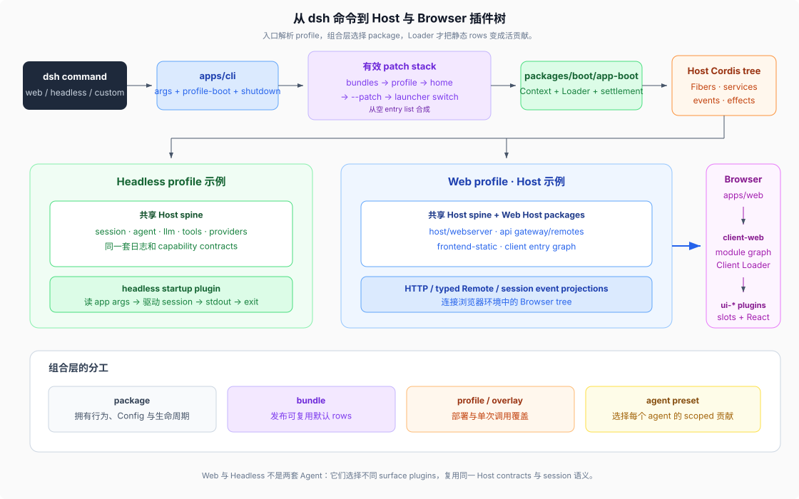

# 04 · 从入口和配置看目录怎样变成运行时

源码核验基线：DeepSeek Harness `dsh-v0.1.5-rc.1`，commit `183f08e9c6dde7e36cd2318eaee70b0da08fb35e`。

## 总链路



DSH 的应用不是在 `main()` 中手写 `new SessionService()`、`new ToolRegistry()` 和全部 Provider。应用入口先解析“要启动哪个 profile”，再把配置层交给共享 boot，Cordis Loader 最终建立插件树。

```text
apps/cli/src/bin.ts
  → parseDshArgs()
  → profile-boot.ts
  → packages/boot/app-boot
  → new Context() + Loader
  → mount composed Cordis entry list
  → app plugin owns process lifetime / surface
```

## `apps/cli` 拥有什么

`apps/cli` 发布 `@deepseek-ai/dsh` 和 `dsh` bin。它拥有：

- launcher 参数语法与模式分派。
- profile 初始化、解析和 patch 层顺序。
- 启动时环境、命令参数与安装路径等进程事实。
- SIGINT/SIGTERM、fail-loud 与有界 shutdown。
- `plugin` 子命令对 profile 依赖和 bundle list 的管理。
- `--dump-config` / `--dump-default-config` 的入口。

它不拥有模型调用、session 语义、文件系统工具、Web UI 业务组件或持久化实现。这些都在 `packages/` 中，由 profile 选择。

`apps/cli/src/bin.ts` 使用动态 import，只加载当前模式的 runner。profile 模式进入 `profile-boot.ts`；plugin 管理进入 `plugin.ts`；dump 进入 `dump-config.ts`。

## `packages/boot` 拥有什么

`packages/boot/app-boot` 是可复用的 Host 启动胶水，负责：

- 创建 Cordis `Context`。
- 安装 Loader。
- 在任何配置树 entry 挂载前运行 host `prepare`。
- 挂载根 Include 与 patches。
- 等待 Loader settlement，检查 entry 是否激活。
- 启动失败时处置部分 Context，并保留准确失败阶段。

`packages/boot/cmdline` 则把 app arguments 作为 Context service 提供给被挂载的 app plugin。它们属于 package 层，因为 CLI、测试或其它 bin 可以复用这些合同；`apps/cli` 只负责把本次进程的值送进去。

## profile、bundle 与 patch 的层次

一个 profile 目录包含自己的 `package.json`、空根 `cordis.yml` 和用户 `cordis.patch.yml`。有效树按以下顺序从空 entry list 合成：

```text
bundle 1 patch
bundle 2 patch
...
profile cordis.patch.yml
$DSH_HOME/cordis.patch.yml
--patch overlay 1
--patch overlay 2
launcher hard switch（例如 telemetry opt-out）
```

后层可以配置、禁用或替换前层用稳定 `id` 插入的 row。bundle 的 `package.json` 通过 `dsh.bundle.patch` 指向自己的 `cordis.patch.yml`；profile 的 `dsh.profile.bundles` 决定 bundle 顺序。

`dsh-base` 提供模型 adapter、核心 registries、持久化、sandbox/approval 与大量基础插件，但不安装可选的 Codex / Claude Code provider；它们是独立 Profile Bundle，用 `dsh plugin --profile <name> add` 装进 profile 并 restart，agent preset 再决定是否露出对应 tool 行。其余四个 shipped application 各有自己的 bundle：`dsh-web-app` 增加 Web Host/Client 组合，`dsh-headless` 增加一次性 runner，`dsh-sdk-app` 与 `dsh-sdk-minimal` 承载 SDK 的两种组合，`dsh-acp-app` 承载 ACP server。bundle 只声明 rows 和默认 config，真正行为仍由 row 指向的 package 拥有。Web 把 shipped `ptc` preset 显示成 PTC mode，preset id 就是 `ptc`。

## `dsh web` 怎样跨目录

可以把 Web 路径拆成 Host 和 Client：

### Host

```text
dsh web
  → apps/cli（web 是 profile alias）
  → base + web-app bundles
  → packages/boot/app-boot
  → Host Cordis tree
       core/session + agent + providers
       packages/host/*
       packages/api/* Host face
       frontend-static serves apps/web/dist
```

### Client

```text
apps/web/src/main.ts
  → @deepseek-ai/dsh-client-web
  → Host 推送 client entry graph
  → browser module system + Cordis Loader
  → packages/client/ui-* 向 slots 注册
  → React shell 展示 session / tool / settings 等投影
```

`apps/web` 只有薄入口和 Vite build，是因为浏览器 shell、connection、runtime、slots 和 UI feature 都需要作为可测试、可组合的 client packages 存在。Host 与 Client 通过 gateway/connection/Remote 和 session event 投影通信。

## `apps/desktop` 怎样跨目录

桌面是唯一不经 `dsh` CLI 的产品入口，它的链路从 Electron 主进程开始：

```text
Electron 主进程（apps/desktop）
  → 单实例锁；独占 $DSH_HOME/profiles/desktop 与 $DSH_HOME/desktop/**
  → spawn 捆绑的上游 Node.js，跑 apps/desktop-host/lib/index.js
       → packages/boot/app-boot 的 boot()
       → base + web-app bundles + config/desktop.cordis.patch.yml overlay
       → Host Cordis tree（禁用 web-startup / webserver / web-runtime / client-hmr / open-in-app / ui-open-in-app / directory-picker，改用 directory-picker-native 与 ui-directory-picker-native）
       → connection.createSharedFetchHandler('/api') + clientModules.fetchBundle
       → @deepseek-ai/dsh-web-frontend/dist 资产
  请求帧 fd3 / 响应帧 fd4 / 生命周期走 Node IPC
  → dsh-app:// 与 __DSH_TRANSPORT__.openStream → /.dsh/remote-stream（NDJSON）
```

它不装 `packages/host/webserver`，因为壳自己就是那个 server：`dsh-app://` 把请求编成分帧字节交给 host 子进程，host 再交给同一套 Connection 处理。所以上一节的 Host 半边几乎整体复用，换掉的只有端口、WebSocket mux 和前端静态服务那一层；`dsh --profile desktop` 被 `apps/cli/src/args.ts:68-71` 显式拒绝，CLI 不是它的启动面。完整机制见 [`_digested/surfaces/03-桌面入口.md`](../../_digested/surfaces/03-桌面入口.md)。

## `dsh --profile headless` 怎样跨目录

```text
dsh --profile headless "task"
  → apps/cli
  → base + headless bundles
  → Host Cordis tree
       same core/session/agent/tool/provider spine
       headless startup plugin reads app args
       creates/drives one session
       prints selected result
       requests bounded app exit
```

Headless 不是另一套 agent implementation。它换的是组合和入口 surface，仍复用 `ctx.agents`、session log、LLM adapter 与工具 registries。

## Host composition 与 agent preset

Web profile 还把“进程级能力”和“某个 agent 可见的贡献”分开：

| 平面 | 放什么 | 例子 |
|------|--------|------|
| Host composition | 进程 singleton、Provider、持久化、sandbox/approval、模型 route、跨 session registry | `ctx.fs` Provider、session persistence、subagent registry |
| Agent preset | 某类 agent 的 persona、prompt sections、tool contributions、真正 agent-owned 的 isolated service | `tool-fs`、`tool-bash`、plan-mode realm |

base bundle 可以先插入全局工具，web-app bundle 再禁用其中部分全局 rows，shipped agent preset 以 scoped contribution 重新挂载工具。于是同一 Host 可以让不同 session 选择不同 agent preset，而不复制进程级 Provider 和持久化服务。

一个 preset 若要发布 service，必须处于合适的 `isolate` realm；否则它会把本应 per-agent 的实例发布到 root realm，与其它 preset 或 session 冲突。仅向 scope-aware registry 注册工具或 prompt section 的插件通常不需要独立 service realm。

## bundle、profile、preset、example 的区别

| 名称 | 选择范围 | 存放位置 | 是否可发布 |
|------|----------|----------|------------|
| bundle | 一组可复用默认 Host/app rows | `packages/bundle/*` 或第三方 npm package | 是 |
| profile | 一次部署使用的有序 bundles 与用户覆盖 | `$DSH_HOME/profiles/<name>`；模板由 app 提供 | 用户部署状态 |
| home patch | 所有 profile 共用的机器级覆盖 | `$DSH_HOME/cordis.patch.yml` | 否 |
| `--patch` | 单次调用的最高优先级 overlay | 任意用户文件 | 否 |
| agent preset | 一个 session/agent 的 scoped composition | app shipped roots 或用户 preset roots | 可随部署/插件分发 |
| shipped overlay | 随产品出货的一份可选组合叶子 | `apps/cli/config/examples/<name>/cordis.yml` | 产品资产，永不进默认 profile |

顶层 `examples/` 与 `packages/examples/` 都已退役；要读“一份完整组合长什么样”，现在看 `apps/cli/config/examples/` 的四个 overlay 目录（`cordis`、`github-review`、`mcp-memory`——内含 `engram` / `mcp-reference-memory` / `memorix` 三份——与 `schedule`），或 `packages/preset/agent-presets/presets/*/agent.cordis.yml` 的 preset 根。

## 为什么 `--dump-config` 很重要

只读 bundle 文件无法知道用户 profile、home patch 和命令行 overlay 之后的结果。`dsh --profile <name> --dump-config` 使用与 boot 相同的 patch 算法合成配置，但不会创建 Context 或运行插件，适合回答：

- 某个 row 最终是否存在或被禁用。
- 某个 Provider 的实际 config 是什么。
- 用户 patch 是否成功覆盖 bundle 默认值。
- 两个 bundle 对同一稳定 row id 的作用顺序。

dump 仍不是活插件图：它只合成 entry rows，不执行插件生命周期、不等待 inject、不观察运行时 HMR，也不证明 service 成功发布。要确认活关系，还需启动、日志、runtime inspect 或相应 invariant/test。

## 配置问题应该从哪里读

按以下顺序：

1. package README 与 `Config` schema：这个插件允许配置什么。
2. [`docs/config-catalog.md`](../../docs/config-catalog.md)：生成的全仓配置引用。
3. bundle patch：产品默认值和 row id。
4. profile/home/overlay：部署如何改默认值。
5. `dsh --dump-config`：最终静态合成。
6. 插件 `inject` 与 runtime：何时激活、在哪个 realm 可见。

## 核验入口

- [`apps/cli/src/bin.ts`](../../apps/cli/src/bin.ts)
- [`apps/cli/src/profile-boot.ts`](../../apps/cli/src/profile-boot.ts)
- [`apps/cli/README.md`](../../apps/cli/README.md)
- [`apps/desktop/README.md`](../../apps/desktop/README.md)
- [`apps/desktop-host/config/desktop.cordis.patch.yml`](../../apps/desktop-host/config/desktop.cordis.patch.yml)
- [`packages/boot/app-boot/README.md`](../../packages/boot/app-boot/README.md)
- [`packages/bundle/README.md`](../../packages/bundle/README.md)
- [`packages/bundle/base/cordis.patch.yml`](../../packages/bundle/base/cordis.patch.yml)
- [`packages/bundle/web-app/cordis.patch.yml`](../../packages/bundle/web-app/cordis.patch.yml)
- [`packages/client/web/README.md`](../../packages/client/web/README.md)
- [`_digested/composition/01-boot-时序.md`](../../_digested/composition/01-boot-时序.md)
