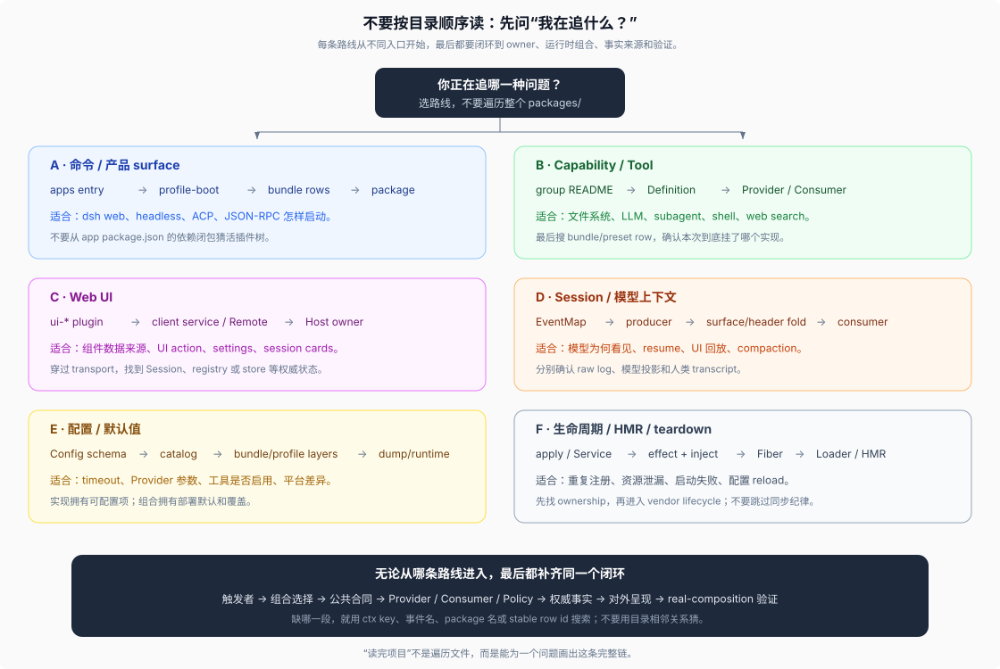

# 05 · 用什么路线读 DSH

源码核验基线：DeepSeek Harness `0.1.0-rc.5`，commit `47f943859bef60e4160492346772ded9b24f765a`。

## 不要从 `packages/` 第一项顺序读到最后一项

DSH 的 package 数量多，按目录字母顺序阅读会失去运行时关系。更有效的方法是先选一个具体问题，再在“入口、组合、合同、实现、事实流、呈现、验证”之间建立一条闭环。



## 15 分钟建立全局坐标

1. 看根 [`AGENTS.md`](../../AGENTS.md) 的 repository layout，只识别顶层区域。
2. 看 [`docs/architecture.md`](../../docs/architecture.md) 的章节顺序：Cordis → profiles/bundles → core → events → turn → session → seams → extension points。
3. 看 [`packages/README.md`](../../packages/README.md)，只记 group 与角色，不背所有 package。
4. 打开 [`docs/module-graph.md`](../../docs/module-graph.md)，知道静态依赖有生成图，不需要靠猜。
5. 打开 [`packages/bundle/base/cordis.patch.yml`](../../packages/bundle/base/cordis.patch.yml)，感受“一个产品默认组合”如何引用 package。

完成后，你应能回答：产品能力大多在 `packages/`，入口在 `apps/`，默认装配在 bundle/profile，Cordis 在 `vendor/`，可运行参考在根 `examples/`。

## 路线 A：从一个命令或产品 surface 往里读

适合问题：“`dsh web` 到底启动了什么？”“Headless 为什么能复用同一套 agent？”

```text
apps/cli/src/bin.ts
  → args.ts 识别模式
  → profile-boot.ts 组合 layers
  → packages/boot/app-boot
  → packages/bundle/<profile layers>/cordis.patch.yml
  → entry row 指向的 package README + src/index.ts
  → surface-specific tests
```

关键搜索：

```sh
rg -n "id: <row-id>|name: '@deepseek-ai/dsh-<package>'" packages/bundle apps/cli/config examples
rg -n "export async function boot|mountRootInclude" packages/boot/app-boot/src
```

先看 row 的 `id`、`name`、`disabled`、`config` 和 group/isolate，再进入实现。不要从 `apps/cli/package.json` 的庞大依赖列表推断本次运行树。

## 路线 B：从一个 capability 或工具横向读

适合问题：“文件读写由谁实现？”“怎样换成 E2B？”“审批发生在哪？”

```text
packages/<group>/README.md
  → Definition README / types / service key
  → Provider README / implementation
  → Consumer README / tool schema or command
  → policy events / wrappers
  → bundle / preset / example mounting rows
  → integration + real-composition tests
```

以 `tool-fs` 为例：

1. [`packages/fs/README.md`](../../packages/fs/README.md) 给出角色表。
2. `packages/fs/fs` 定义 `ctx.fs` 和 `fs/*`。
3. `fs-local`、`fs-sandbox`、`e2b/fs-e2b` 是 Provider 选择。
4. `tool-fs` 注册模型工具并调用 `ctx.fs`。
5. `fs-observation-policy` 监听 `fs/*`，不是工具硬编码的本地策略。
6. base bundle、web-app bundle和 agent preset 决定 Host/provider 与 per-agent tool 的实际挂载。

常用搜索：

```sh
rg -n "provide\('fs'|super\(ctx, 'fs'|ctx\.fs" packages/fs packages/e2b
rg -n "declare module '@deepseek-ai/cordis'|fs/" packages/fs
rg -n "@deepseek-ai/dsh-tool-fs|@deepseek-ai/dsh-fs-" packages/bundle apps/cli/config examples
```

## 路线 C：从 Web UI 往 Host 事实读

适合问题：“这个 React 卡片的数据从哪来？”“一个 UI 操作最终改了哪条 session 或 service？”

```text
apps/web/src/main.ts
  → packages/client/web
  → packages/client/ui-<feature>
  → client runtime / slots / Remote consumer
  → packages/api/remotes + gateway 或 legacy apiproxy
  → Host owner package
  → session event / service mutation
```

具体步骤：

1. 在 `packages/client/README.md` 找 UI feature owner。
2. 在该 package 看它向哪个 slot 注册、依赖哪个 client object service 或 Remote。
3. 搜 Remote method/type 在 `packages/api/`、`packages/host/` 或 capability owner 的 Host 端实现。
4. 找 authoritative state：Session log、registry、settings store、workspace service，而不是只停在 DTO。
5. 查看 `apps/web/tests` 的 assembled behavior；package unit test不能单独证明 Host/Client 接线。

Web 有独立 Client Cordis tree，看到相同 `ctx` key 时先确认当前文件属于 Host 还是 Client compiler face。

## 路线 D：从 session 事件或模型上下文读

适合问题：“模型为什么看见这段内容？”“UI 为什么能回放？”“resume 从哪里恢复？”

```text
packages/core/session/src/types.ts
  → 事件 producer（session.append）
  → surface / request-header projection
  → agent-loop request assembly
  → persistence / transcript / UI / telemetry consumers
```

固定检查：

- 事件是 surface 还是 log-only。
- 谁生产、何时 append、是否要求 `flush`。
- `deriveMessages()` 是否投影它，还是由 `request/header` 重建。
- compaction replacement 是否只改变未来 surface，而保留 raw log。
- 读取者遇到未知 required event 会如何处理。

权威索引是生成的 [`docs/persistence-catalog.md`](../../docs/persistence-catalog.md) 和 [`docs/event-producer-consumer.md`](../../docs/event-producer-consumer.md)，机制解释见 [`_digested/session-and-loop/`](../../_digested/session-and-loop/00-map.md)。

## 路线 E：从配置值读

适合问题：“这个默认 timeout 从哪来？”“为什么换 profile 后工具没了？”

```text
package Config schema
  → generated config catalog
  → bundle row default
  → profile / home / --patch override
  → dump-config
  → runtime inject / resolve / activation
```

常用搜索：

```sh
rg -n "interface Config|const Config|export .*Config" packages/<group>/<pkg>/src
rg -n "id: <row-id>|name: '<package-name>'" packages/bundle apps/cli/config examples
pnpm dsh --profile <name> --dump-config
```

不要在 `run()` 内找隐式 `?? default` 作为配置入口；仓库约定默认解析由拥有它的实现显式完成，部署可调项应进入 validated Config。

## 路线 F：从生命周期或 HMR 问题读

适合问题：“为什么 reload 后监听器重复？”“谁拥有这个 disposer？”“启动失败后为何仍有资源？”

```text
package src/index.ts 的 apply / Service constructor
  → ctx.effect / ctx.on / ctx.provide / registry.register
  → owning Fiber and inject dependencies
  → vendor/cordis lifecycle implementation
  → Loader / Include / HMR transaction
  → teardown and real-composition tests
```

先读 [`docs/defensive-patterns.md`](../../docs/defensive-patterns.md) 和 [`_digested/cordis-runtime/`](../../_digested/cordis-runtime/00-map.md)，再进入 `vendor/cordis/src/fiber.ts`。`vendor/` 有独立同步与本地修改纪律，不能因为问题最终落到 Cordis 就绕过 `vendor/README.md` 直接改。

## 判断修改应该放哪里

| 修改目标 | 首选落点 |
|----------|----------|
| 改一个 capability 的公共请求、结果或服务方法 | 拥有 Definition 的 package，并同步当前 Consumers |
| 新增另一种后端 | 同一 owner group 或真正拥有共享 runtime 的跨组 Provider package |
| 新增模型工具 | owner group 的 `tool-*` Consumer；注册到 `ctx.tools` |
| 新增执行策略、审批或观察 | 能覆盖所有调用路径的 capability event / executor / policy plugin |
| 改 turn、step、inbox、request 或持久日志义务 | `core/agent` / `core/agent-loop` / `core/session` 的明确 owner；同步 architecture |
| 新增 Web UI feature | `packages/client/ui-*`；Host API 和 authoritative state 回到各自 owner |
| 改产品默认启用项或默认 config | `packages/bundle/*` 或 profile/preset composition，不塞进实现分支 |
| 改 CLI grammar、profile 解析或进程 shutdown | `apps/cli`，可复用 boot 合同回到 `packages/boot` |
| 新增可运行演示 | 根 `examples/`；可复用逻辑先提取到 `packages/` |
| 新增跨 package 测试基础设施 | `packages/test-support/` 或 `scripts/`，取决于是否是 runtime package |
| 更新官网页面 | 修改权威 `docs/`/README，再更新 `website/docs.ts` 投影 |

## 两个完整练习

### 练习 1：解释 `dsh web` 为什么能换文件系统 Provider

1. 从 `apps/cli/src/bin.ts` 确认 web 是 profile 启动。
2. 从 profile/bundle 找 base 与 web-app layers。
3. 从 base row 找到 `fs-sandbox`，从 web-app/preset 找到工具的全局禁用与 scoped 重挂载。
4. 从 `packages/fs/README.md` 区分 Definition、Provider、Policy、Consumer。
5. 确认 `tool-fs` 依赖 `ctx.fs`，不 import `fs-sandbox`。
6. 得出替换点：部署替换 Provider row，工具 schema 与 policy 可以保持不动；若换到 E2B，还要让 filesystem 与 subprocess 共享同一 remote runtime owner。

### 练习 2：解释 Web 对话为什么不直接依赖 `agent-loop`

1. 从 `apps/web` 进入 `packages/client/web` 与 `ui-conversation`。
2. 找 client session/object service 与 connection。
3. 沿 Remote/session events 到 Host 的 `ctx.agents`、session projection 和 log。
4. 对照 `packages/core/agent` 与 `agent-loop`：前者拥有公共 Agent 合同，后者是默认驱动。
5. 得出替换半径：新 loop 仍履行 Agent、session log 与 `agent/*` 义务时，Client 不需要知道私有 loop 方法。

## 阅读完成的判断标准

不要以“看完多少目录”为完成标准。对一个问题能画出以下链，才算真正读通：

```text
入口或触发者
  → 组合选择
  → 公共合同
  → Provider / Consumer / Policy
  → authoritative state 或 session event
  → 对外呈现
  → real-composition 验证
```

如果链上缺了一段，优先用 `ctx` key、事件名、package 名和 stable row id 搜索，不要用文件夹相邻关系猜调用关系。

## 核验入口

- [`docs/architecture.md`](../../docs/architecture.md)
- [`docs/module-graph.md`](../../docs/module-graph.md)
- [`docs/config-catalog.md`](../../docs/config-catalog.md)
- [`docs/event-producer-consumer.md`](../../docs/event-producer-consumer.md)
- [`packages/README.md`](../../packages/README.md)
- [`apps/cli/src/profile-boot.ts`](../../apps/cli/src/profile-boot.ts)
- [`_digested/00-index.md`](../../_digested/00-index.md)
