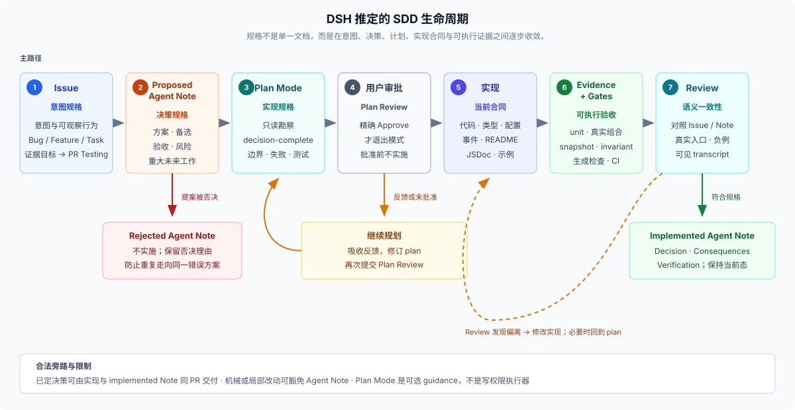

# Answer · DSH 的 SDD：分层规格、生命周期与可执行验收

产品源码核验基线：DeepSeek Harness `0.1.0-rc.5`，commit `47f943859bef60e4160492346772ded9b24f765a`。

## 结论先行

仓库没有正式宣称“我们使用 SDD”，也没有一套单文件 spec 或标准 SDD 工具链。能够从一手材料稳定推出的是：DSH 把一次非平凡变更的**意图、设计决定、实现计划、公开合同和验收证据**分别放进最合适的权威载体，再通过审批、评审、测试、快照、运行时 invariant、生成器和 CI 让这些记录相互约束。

因此，DSH 的做法更接近一套为 coding agent 优化的**分层规格开发**：先把仍需选择的设计写成可评审提案，把实现计划写到另一位工程师无需再做设计决定的程度，再让代码、类型、文档和可执行证据共同落实它；交付后又把提案改写成现在时态的已交付决定，避免长期维护一份已经过期的未来式 spec。

主路径、反馈环和合法旁路可以画成：

这不是每次改动都严格经历的强制流水线，但它是仓库制度、产品 Plan Mode 和多个历史样本共同指向的主模型。

## Spec 实际分成六层

| 层 | 主要载体 | 回答的问题 | 约束方式 |
|----|----------|------------|----------|
| 意图规格 | GitHub Issue | 要改变什么可观察结果，怎样算完成 | Feature、Bug、Task 模板要求验收条件；Feature 另问用户或模型可见变化与测试证据 |
| 决策规格 | proposed Agent Note | 为什么这样设计，什么方案输了，接受什么风险 | 固定的 `Problem`、`Proposal`、`Alternatives considered`、`Acceptance criteria`、`Risks` 结构 |
| 实现规格 | Plan Mode 提交的 plan | 哪些子系统、API、schema、数据流、失败路径和测试要改 | 先只读勘察；`exit_plan_mode` 要求完整 Markdown 计划并取得用户明确批准 |
| 当前合同 | 类型、配置 schema、事件声明、README、JSDoc、architecture/subsystem 文档 | 调用方和实现方现在必须遵守什么 | strict TypeScript、生成目录、类型等价、README/JSDoc 与文档同步检查 |
| 行为规格 | 单元测试、真实组合测试、keyless snapshot、浏览器快照、real-API e2e、runtime invariant | 真实入口和外部可见行为是否满足要求 | 测试矩阵、每文件覆盖率、负例、日志重建、快照 diff 和真实 API smoke |
| 工程规则 | `AGENTS.md`、专用 skills、脚本与 CI | 任何变更都不能破坏哪些仓库级约束 | 能机械检查的规则变成非零退出命令；语义边界由 review 承担 |

这种分层符合仓库的“一项事实只有一个权威归属”规则。Agent Note 不应复制完整 API，README 不应复制生成目录，architecture 不应保存每个 package 的细节，测试也不替代设计理由。所谓 spec 不是把所有事实塞进一个文件，而是让每类事实进入能够长期维护和检查它的载体。

## 一次变更可能怎样走完整流程

### 1. 先定义可观察结果

当前 [Feature Issue 模板](../../.github/ISSUE_TEMPLATE/feature.md)要求一句话预期结果、验收条件、用户或模型可见变化和测试证据；[Bug 模板](../../.github/ISSUE_TEMPLATE/bug.md)要求复现、实际结果、预期结果、环境和验收条件；[PR 模板](../../.github/pull_request_template.md)要求进入评审的非 Draft 人类 PR 关联同仓库 Issue，并列出变更与验证。

这一层故意不先规定内部类名或函数列表。它先固定外部结果和完成标准，让后续设计可以变化，但不能丢掉最初要解决的问题。

### 2. 对重大未来工作先写决策提案

[Agent Note 规则](../../.agents/notes/README.md)规定，每个非平凡变更都要在同一 PR 新增或更新至少一份 Agent Note。较大的未来工作从 `proposed/` 开始，正文必须描述问题、提案、真正考虑过的替代方案、可观察的验收条件和风险；分类目录还区分 feature、bug-fix、simplification、architecture、process 和 testing。

这里的关键不是文档数量，而是先消除会显著改变实现的设计歧义。替代方案强制记录，意味着 coding agent 不能只给出“一个可行写法”，还要说明为什么没有选择其他有吸引力的方向。

### 3. Plan Mode 把提案细化成可执行计划

DSH 自己的 coding-agent preset 把 Plan Mode 规则写进系统提示。它要求先用只读搜索、阅读和静态分析了解真实仓库，不得在计划阶段修改文件；最终计划必须包含目标和成功标准、按子系统分组的修改、公开 API/schema/数据流变化、边界和失败模式、测试、验收条件与显式假设，并详细到另一位工程师无需再做设计决定即可实现。相同规则见 [`code` preset](../../apps/cli/config/agent-presets/code/agent.cordis.yml)和 [`standard` preset](../../apps/cli/config/agent-presets/standard/agent.cordis.yml)。

[`dsh-plan-mode`](../../packages/plan/plan-mode/README.md)不只显示一段提示词。`exit_plan_mode` 会把完整计划提交到 `plan-review` 交互，只有用户选择精确的 `Approve` 才退出；选择继续规划或给出反馈时，agent 必须留在 Plan Mode 修改计划。Plan Mode 状态写进 session log，因此 resume 和 fork 可以恢复；但 README 也明确说明它是 soft guidance，真正的写权限仍由 sandbox 和 approval policy 独立执行。

### 4. Spec 按 DSH 的能力结构展开

现有消化材料说明，DSH 不是一个 loop 加 tools 数组，而是运行时插件树与耐久 session log 的组合；新行为通常挂到已有扩展点，而不是直接修改 loop（见 [`system/00-map.md`](../../_digested/system/00-map.md)）。一项可替换能力还必须同时考虑 Service Definition、Service Provider 和 Consumer 三个角色（见 [`capability-seams/00-map.md`](../../_digested/capability-seams/00-map.md)）。

所以一份真正 decision-complete 的 DSH spec，通常至少要决定这些问题：

1. 哪个 package group 和插件拥有该行为，是否形成完整 capability seam。
2. public API、配置 schema、事件、wire/on-disk 格式和 branded id 是否变化。
3. 运行时组合由哪个 bundle/profile/preset 行选择，Provider 与 Consumer 是否处于正确 realm。
4. 模型可见的新输入如何写入 session log，是否能从日志重建；提示词、tool schema、结果和诊断实际呈现什么。
5. 注册、HMR、卸载、取消、并发和失败路径由谁拥有，怎样 fail loud。
6. UI render intent、真实入口、单元测试、e2e 和 snapshot 各自覆盖哪条验收路径。

这也是为什么 DSH 的 SDD 不适合压缩成“先写 PRD，再生成代码”。架构把一个用户行为分散到 Definition、Provider、Consumer、composition、session 记录和 presentation，spec 必须先把这些所有权与跨包义务说清楚。

### 5. 把可检查的规格变成可执行证据

[质量门禁 Agent Note](../../.agents/notes/implemented/process/2026-06-11-quality-gates.md)直接说明：代码库主要由 coding agents 开发，agent 对强制 gate 的遵循明显好于纯文字约定，因此每条可机械检查的 `AGENTS.md` 承诺都应有一个失败时非零退出的命令。根 [`AGENTS.md`](../../AGENTS.md)进一步要求，把可机械检查的 invariant 接入顶层 gate，并证明每条变更过的验收路径会拒绝一个无效案例。

`pnpm run doc-sync` 是这一原则在文档侧的集中入口，不是把 Markdown 上传到网站。它通过 [`scripts/run-gates.ts`](../../scripts/run-gates.ts)串联源码投影目录的新鲜度、导出 JSDoc、Markdown 链接、Agent Note 分类与格式、类型等价、翻译配对、文档预算和网站构建等检查；任一项不一致都会非零退出。对这套 SDD 推断而言，它说明 DSH 会把“实现、当前合同与说明必须同步”变成自动化验收，而不是只依靠 reviewer 记住规则。

[测试政策](../../docs/testing.md)把行为证据分成多层：单元测试优先覆盖合同回归、边界、错误、事件顺序、并发和清理；CI 使用每文件 100% coverage，但明确承认 coverage 不等于功能正确；产品可见插件要通过真实 Loader 和 app/process 组合；模型、协议或人类可见的非平凡变化要在同一 PR 更新真实可运行示例的 keyless snapshot；provider 行为另有 real-API e2e。

因此，验收条件不会停留在 Note 的清单里。它会被分配给最能证明它的机制：类型错误由编译器拒绝，格式漂移由生成器拒绝，非法运行时关系由 invariant 拒绝，外部可见输出由 snapshot 固定，真实 provider 由 with-key smoke 验证。

### 6. Review 对照 spec，交付后改写 spec

[dsh-code-review](../../.agents/skills/dsh-code-review/SKILL.md)要求 reviewer 验证实现是否符合 PR 和 Agent Note，检查两侧接口、模型实际看见的内容、真实入口、负例、持久状态和所需验证证据；当 PR 实现 proposed Agent Note 时，还要在同一 diff 把它移动并改写为 implemented。

这个改写很关键。`proposed/` 使用未来式的 Proposal、Acceptance criteria 和 Risks；`implemented/` 必须用现在时态的 Decision 和 Consequences 描述实际交付，并禁止继续保留提案阶段标题。实现发生修正时，Note 记录最终交付而不是原始愿望；没有实施的提案进入 `rejected/`，只有仍能阻止有吸引力错误方向的拒绝理由才长期保留。

所以 DSH 的 spec 不是冻结的上游文档。它在实现前承担选择与验收，在实现后转换为当前决策与验证事实；精确 API 和行为继续由代码、类型、README、生成文档与测试各自拥有。

## Git 历史支持这套重建

git 历史中能看到真实的生命周期迁移，而不只是当前规则：

| 例子 | 提案阶段 | 收束结果 |
|------|----------|----------|
| Plan Mode | `2602270669f1739aab3e721142914297636ef0f8` 新增 session/plan mode 提案，随后多次补充设计 | `5a8e3a14ee97112d647a2cc7d9694f433ab62cdb` 将 Note 移到 implemented，并在后续提交继续按实现修正 |
| Web capability seam | `a4091daa3d7bf3f9f9a958969ae45878e57e5d83` 先提出完整 seam | `d01f5f73b7866b457f00ffbe60b78af39273fc7a` 实现并把 Note 从 proposed 移到 implemented |
| 删除 durable step boundaries | 当前 [`rejected` Note](../../.agents/notes/rejected/simplification/2026-06-20-drop-durable-step-boundaries.md)保留提案和验收条件 | 提案被明确拒绝，因为 `step/start` / `step/end` 对修复、invariant 和检查仍有价值 |
| Dynamic workflows | `1d43ea3cd5c09880dcbf3fbfbe3b90777a00d094` 在实现提交中直接新增 implemented 记录 | 说明“已经做出的决策”可以随实现落为 implemented，并非所有工作都机械地先有 proposed 文件 |

这组历史同时支持两个结论：proposal-first 在重大工作中真实存在；它又不是所有变更的绝对前置条件。

## 为什么它特别适合 coding agent

1. **降低上下文丢失。** Issue 固定目标，Agent Note 固定理由与取舍，Plan 固定本次实现决定，代码和测试固定精确合同；agent 换轮次或换实现者时，不必从 commit 对话重新猜设计。
2. **减少开放设计问题。** Plan Mode 明确要求另一位工程师可以直接实现，这会把 coding 阶段从“边写边定架构”收窄为“执行已评审决定，并在发现事实冲突时回到 spec”。
3. **把弱约定变成强反馈。** 类型、tests、snapshots、generators 和 CI 能立即拒绝偏离；这比希望每个 agent 记住数百条 prose 规则可靠。
4. **让插件化改动完整落地。** capability seam、composition、session log 和 presentation 的检查项迫使 spec 覆盖完整行为，而不是只实现一个局部函数。
5. **允许快速纠正。** 预发布立场不保留兼容 shim；当 spec 证明旧基础不对时，可以同步改代码、格式、测试、文档和引用，再让旧格式大声失败。

## 不能从仓库推出什么

- 不能说 DSH 官方采用了某个名为 SDD 的标准方法；仓库没有这项自我声明。
- 不能把研究目录对 OpenSpec 的一次对照当成产品采用证据。[`_digested/00-index.md`](../../_digested/00-index.md)明确选择按 Harness 自己的主轴组织材料，而产品树中没有 OpenSpec workflow 或 schema。
- 不能说每个变更都先写正式 spec。规则允许已经做出的决策直接从 implemented Agent Note 开始，纯机械或局部改动也豁免。
- 不能说它严格 TDD。测试和验收必须规划并落地，但没有证据要求所有实现先经历 red-green-refactor。
- 不能把 Agent Note 当成唯一真相。它拥有理由、取舍和当前决策，精确类型、配置、事件、输出与测试仍各有自己的权威来源。
- 不能说所有规则都有自动门禁。非平凡变更是否需要 Note 由 review 进行语义判断，Plan Mode 本身也是 guidance 而非权限执行器。
- 不能把 implemented Note 当作最初 spec 的原样归档。它必须按实际交付重写；若要研究原始计划，需要查看 git 历史或仍处于 proposed/rejected 的记录。

## 最接近的描述

如果要用一句比“SDD”更精确的话描述它，可以说：**以 Agent Note 保存设计决定，以 Plan Review 批准实施，以代码合同和多层验证约束结果的分层规格开发；交付后把未来式提案改写为当前事实，并把可机械检查的规则接入门禁。**

这句话是对仓库事实的综合，不是项目官方术语。逐条一手证据与历史命令见 [`research.md`](./research.md)。
