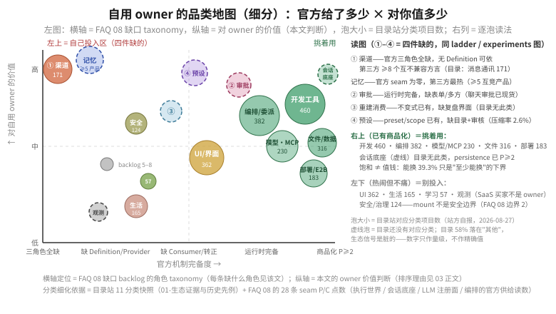

# 03 · 把市场信号读成"自己最缺"：owner 最值得投入的几类

读图：**左上（价值高 × 官方缺）= 四件缺的**（①渠道 ②审批形状 ③可重建消费 ④可复用预设），外加无编号但同样高价值的**记忆**——最热的泡全在左上。**右上（已有商品化）= 挑着用**，不用你投入。**左下 = 热闹但不是 owner 的赛场**。横轴位置来自 [FAQ 08](../08_plugin-seam-maturity/answer.md) 缺口 taxonomy（每条缺哪些角色），纵轴是本文判断；气泡大小 = 目录站对应分类项目数（站方自报，2026-08-27，见 [01-生态证据](./01-生态证据与历史先例.md)）。

## 四类逐个展开

1. **渠道 / 通知**——人不在场，决策也在场。FAQ 08 缺口 1：官方三角色全缺、第三方已拼出 ≥8 个互不兼容方言；且目录站的"消息通讯"分类（171 项）在官方无任何渠道 seam 时就已经出现（[01-生态证据](./01-生态证据与历史先例.md)）。所以对 owner 就是"没有官方版，只能自己拼第三方"——这同时是 [实验 A](./05-自证实验.md) 的直接需求信号。
2. **记忆**——跨会话不用把自己的上下文重讲一遍。FAQ 08 缺口 2：官方 seam 为零而第三方最热（≥5 个互竞产品：EverOS、MemOS、ReMe、memsearch、OpenViking），owner 的体感是"别让我每次都重讲一遍完整上下文"。
3. **审批形状**——危险操作一张"请签字"，比跳出 CLI 用眼睛盯强。FAQ 08：运行时完备但表单 / 多方编排不完整（多 answerer 顺序今天不支持，见 [user-approval README](../../packages/interaction/user-approval/README.md)）。注意差异化不在聊天窗口本身——"从聊天审批"已是竞争现货（NanoClaw / n8n / Temporal），现货里没有的是"成对 ask/decide 审计 + fail-closed + 整请求可重建"。
4. **可复用工具包**——把我验证过的一串操作打成 persona / 预设，下次直接复用，这是"可复用"那层落到工具包的具体形态（[实验 C](./05-自证实验.md)）。

## "最值得的几类"和"四件缺的"是什么关系

两个清单不完全重合，是**两把尺子**：

- "最值得的几类"按 **owner 每天的体感痛点**排：渠道、记忆、审批形状、可复用工具包；
- "四件缺的"（[04](./04-阶梯与四件缺.md) 的对照表）按 **官方缺的板块**排：①渠道 ②审批形状 ③可重建消费 ④可复用预设。

交集是渠道、审批形状、可复用。**记忆与可重建消费互补**：一个管"别重讲上下文"（往前看），一个管"复盘真过程"（往后看）——记忆的官方缺口深到连 Definition 都没有（只能等官方立 seam 或用第三方整包），可重建消费则已有日志不变式、只缺界面。品类地图里记忆不带编号、③ 可重建带编号，就是这个原因。

## 生态 / 市场：附件，不是你的生意

对自用 owner，第三方生态（awesome 列表、目录站、Koishi 先例）的意义是**别人替你踩过的路**——下载、复用、按需装，而不是自己从零搭。正因为你不卖、也不再办市场，商店 / 目录里"要不要做支付、要不要给开发者分成"这类取舍不是你的问题，那是另一个题。

生态只回答一件事：哪些方向被证明有用（他人真的去做了）、哪些还没有，而没长的正是 FAQ 08 缺口区里官方自建的那几类。另，Koishi/Cordis 这一轮验证的是"插件生态能长出可复用组件"这一件事，不是"有人肯为治理付钱"——后者不在本项目范围（时间线与证据见 [01-生态证据](./01-生态证据与历史先例.md)，其顶部的 ecosystem-timeline 图把"生态是附件"一眼画完）。
