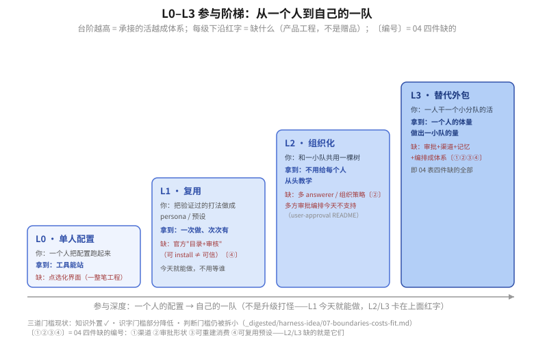

# 04 · 从一个人到自己的一队：L0–L3 阶梯与四件缺

读图：台阶越往右越高 = 从"工具能站"到"一个人的体量干一小队的量"；每级台阶的**下沿红字是"缺什么（产品工程）"**——L1 今天就能做，L2 / L3 缺的都在下面四件缺的表里（〔编号〕与之对应）。

## L0–L3 参与阶梯

| 档 | 你 | 你拿到 | 缺（产品工程） |
|---|---|---|---|
| L0 单人配置 | 一个人 | 工具能站 | 点选化界面把识字门槛降（preset / 权限 / plugin 可视化）——这是一整笔工程，不是赠品 |
| L1 复用 | 把自己验证过的打法做成 persona / 预设 | 一次做、次次有 | 官方"目录 + 审核"（不要把"可 install"与"可信"混为一谈）〔④〕 |
| L2 组织化 | 你和一小队共用一棵树 | 不用给每个人从头教学 | 多 answerer / 组织策略〔②〕 |
| L3 替代外包 | 一人干一个小分队 | 一个人的体量做出一小队的量 | 审批 + 渠道 + 记忆 + 编排成体系〔①②③④〕 |

三道门槛的现实状态（知识外置、识字门槛部分降低、判断门槛仍被拆小）见 [`harness-idea/07`](../../_digested/harness-idea/07-boundaries-costs-fit.md)。

读这张表的要点：**阶梯不是升级打怪**——L1 的 persona 今天就能做（不用等谁）；L2 / L3 卡住你的，正是下面四件缺的里的产品工程。

## 四件缺的（已有机制 / 缺 / 对 owner 的作用 / 不装则）

| 板块 | 已有（机制） | 缺 | 对 owner 的作用 | 不装则 |
|---|---|---|---|---|
| ① 渠道 | apiproxy 把审批 wire 派发到浏览器、审计 id 认领完备（[api-proxy](../../packages/api/remotes/src/index.ts)） | 官方 IM answerer 全缺 | 人在与不在场，决策都在场 | 只能从 ≥8 个第三方方言里拼一个 |
| ② 审批形状 | fail-closed、成对、取消（[README](../../packages/interaction/user-approval/README.md)） | 表单 / 多选项渲染、多 answerer 顺序语义 | 从"你同意吗"变成"请确认这几件事" | GUI 层离官方最近，个人没得选 |
| ③ 可重建消费 | 日志重建不变式 + 版本纪律 | 导出 / 检索 / 复盘界面 | 你不光存，还能复盘"这段真过程" | 只能读原始 session log |
| ④ 可复用预设 | preset / scope restrict（[capability-seams/03](../../_digested/capability-seams/03-subagent后台与产品provider.md)） | 官方目录 + 签名 / 审核 | 一次配好，多人 / 多项目复用 | 只能靠 git 各自剪一半 |

编号 ①②③④ 与 [品类地图](./03-品类与生态信号.md)、[阶梯图](./figures/ladder.svg)、[实验卡](./05-自证实验.md)共用，四张图互相对得上。注意这四个都是"缺的板块"清单——**记忆**不在其中不是因为它不缺，而是它缺得更深（官方 seam 为零，连 Definition 都没有，见 [03](./03-品类与生态信号.md) 的两把尺子）。
