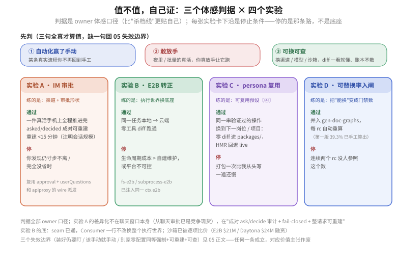

# 05 · 三个自证判据与四个实验（判据换成 owner 视角）

读图：上面三块是"值不值"的**体感判据**；下面四张卡是能把判据跑成事实的实验，每张卡下沿是**停止条件**——停的是那条路，不是底座。判据全部 owner 口径，比"杀档线"更贴自己。

## 三个能"自我验证"它值不值的判据

- **自动化赢了手动**：装了它，某条真实流程你不再回到手工——这一条为真，就值。
- **敢放手**：确实有夜里 / 批量 / 你不在场盯着的真活，你会真放手让它跑。
- **可换可查**：换渠道 / 换模型 / 换沙箱，diff 你一看就懂，账本不散。

## 四个实验（判据换成 owner 视角）

| 实验 | 通过（owner 判据） | 停 |
|---|---|---|
| A 用一个 IM 的审批（复用 approval + userQuestions） | 一件真活在手机上全程推进完，且 `asked/decided` 成对可重建、重建耗时 <15 分钟（注明会话规模） | 你发现自己仍寸步不离 / 完全没省时 |
| B E2B 转正 | 同一任务本地→云端零工具 diff 跑通 | 生命周期成本 > 自建维护或平台不可控 |
| C persona 复用 | 同一串验证过的操作，换到下一个岗位 / 项目零 diff 进 `packages/`，HMR 回退 live | 打包一次比我从头写一遍还慢 |
| D 可替换率入闸 | 并入 gen-doc-graphs，每 rc 自动重算（第一版 39.3% 已手工算出，见 [FAQ 08](../08_plugin-seam-maturity/answer.md)） | 连续两个 rc 没人参照这个数 |

两个实验的地基提醒：

- **A 的差异化不在聊天窗口**：从聊天里审批已是竞争现货，现货里没人做的是"成对 ask/decide 审计 + fail-closed + 整请求可重建"（证据见 [01-生态证据](./01-生态证据与历史先例.md) 的竞争窗快照）；
- **B 的 seam 已通**：`fs-e2b` 与 `subprocess-e2b` 注入同一 `ctx.e2b`，Consumer 一行不改换整个执行世界——差的是生命周期、模板、部署平台；E2B $21M、Daytona $24M 融资后，沙箱已是被逐项比价的商品（[FAQ 08](../08_plugin-seam-maturity/answer.md) 缺口 4）。

## 三个会让这几个价值失效的边界

- 我装好仍要时刻盯着 / 手动更快 —— 那就不算生产力；
- 某条实际流程，手动更便宜 / 更稳 —— 那条就该手动，别硬自动化；
- 别的工具自带同等的"强制 + 可重建 + 可查"且零配置 —— 那差异化就只剩插件树，成又一个 agent 壳。

任何一条成立，对应的价值主张作废——这不是失败，是省下了错的钱：该手动的那条流程继续手动，底座只保留真正赢过手动的那些活。
