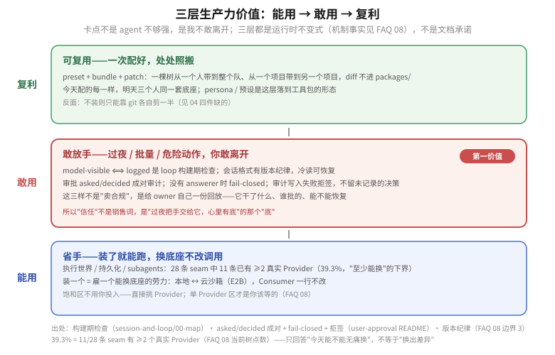

# Answer 09 · 对自用 owner 的价值：敢放手 + 省手 + 可复用的生产力底座

> 视角先钉死：owner = 自己用的人 / 小团队，**不卖软件、不开市场、不卖给合规行业**——这不是"生意"题，是"我的生产力"题。机制事实全部挂在 [FAQ 08](../08_plugin-seam-maturity/answer.md) 的 seam 点数上；外部证据只作附件（[01-生态证据](./01-生态证据与历史先例.md) 只给证据不下判断，原始检索在 [research.md](./research.md)）。

读图：自下而上**能用 → 敢用 → 复利**；中间层加粗，因为"生产力最卡的不是 agent 不够强，是我不敢离开"。三层全是机制不变式，不是文档承诺。

## 一句话

DSH 不是"卖平台给开发者 / 卖给企业"的生意，而是让**一个自己用的人 / 一个小团队敢把一个真活交给一台能按需加装、能换件、能复盘、危险动作要签字的 agent**。

三句话把价值收紧：

1. **敢放手**——它干过的每一件模型可见的事都能从日志重建，审批成对、无人可答就失败关闭，会话格式有版本纪律。这些是运行时不变式，不是文档承诺（机制见 [FAQ 08](../08_plugin-seam-maturity/answer.md) 边界 3 与 [`session-and-loop/00-map`](../../_digested/session-and-loop/00-map.md)）。
2. **省手**——执行世界（shell/fs/subprocess）、会话标题与 subagents 这些簇已有 ≥2 个 Provider 可无痛替换（全树 29 条 seam 共 12 条，见 [FAQ 08](../08_plugin-seam-maturity/answer.md) 的 NEW 基线读数）：装一个等于雇一个能换底座的劳力，换本地 / 云沙箱都不用改调它的代码。
3. **可复用**——preset + bundle + patch 把一棵树从一个人带到整个队、从一个项目带到另一个项目，diff 不进 `packages/`。今天一个人用，明天三个人同一套底座。

一句话说穿：**"everything is a plugin" 对自用者的意思不是建插件市场，而是我的工具链是一棵我能按需加装、能换件、能复制的树，而不是别人替我定死的一个盒子。** 下面每一条都挂在机制事实或验证实验上，不写售卖叙事——这不是一个卖软件的题。

## 阅读顺序

生产力最卡的地方往往不是 agent 不够强，而是**我不敢放手——agent 干得再快，我一步都不敢离开**。敢放手靠三条不变式（这些是 DSH 本身的内生能力，不是第三方插件自带的东西）：

- model-visible ⟺ logged 是 loop 构建期检查，不是文档里的承诺（[`session-and-loop/00-map`](../../_digested/session-and-loop/00-map.md)）；
- 审批是成对的 `asked/decided` 审计事件；没有 answerer 时 **fail-closed** 到 `unavailable`，绝不静默放过；审计写入失败会拒签，而不是返回一笔未记录的决策（[`user-approval` README](../../packages/interaction/user-approval/README.md)）；
- 会话格式有版本纪律，冷读可恢复（[`session-and-loop/00-map`](../../_digested/session-and-loop/00-map.md) 的持久化与格式世代段，机制见 [`04-格式世代与迁移`](../../_digested/session-and-loop/04-格式世代与迁移.md)）。

这三样不是拿来"卖合规"，而是**给 owner 自己一份回放**——"它干了什么、谁批的、能不能恢复"。所以"信任"不是一个销售词，是"我过夜把手交给它，心里有底"的那个"底"。

## 三层生产力收益（owner 自己，不是"买单客户"）

| 层 | 你（owner）拿到什么 | 机制底色 |
|---|---|---|
| 省手 | 装了就能跑，换底座不改调用 | 执行世界（shell/fs/subprocess）、会话标题与 subagents 的 5 条 seam 可无痛换（全树 29 条共 12 条，FAQ 08） |
| 敢放手 | 过夜 / 批量 / 危险动作也有把握 | 审批成对 + fail-closed + 可重建（见上） |
| 可复用 | 一个人 → 一队、换项目 → 换业务照搬 | preset + bundle + plugin，diff 不进 `packages/` |

## 一张图记住结论

1. **渠道 / 通知**——人不在场，决策也在场。FAQ 08 缺口 1：官方三角色全缺、第三方已拼出 ≥8 个互不兼容方言。所以对 owner 就是"没有官方版，只能自己拼第三方"。
2. **记忆**——跨会话不用把自己的上下文重讲一遍。FAQ 08 缺口 2：官方 seam 为零而第三方最热，owner 的体感是"别让我每次都重讲一遍完整上下文"。
3. **审批形状**——危险操作一张"请签字"，比跳出 CLI 用眼睛盯强。FAQ 08：运行时完备但表单 / 多方编排不完整（多 answerer 顺序今天不支持，见 [user-approval README](../../packages/interaction/user-approval/README.md)）。
4. **可复用工具包**——把我验证过的一串操作打成 persona / 预设，下次直接复用，这是"可复用"那层落到工具包的具体形态。

## 生态 / 市场：附件，不是你的生意

对自用 owner，第三方生态（awesome 列表、目录站、Koishi 先例）的意义是**别人替你踩过的路**——下载、复用、按需装，而不是自己从零搭。正因为你不卖、也不再办市场，商店 / 目录里"要不要做支付、要不要给开发者分成"这类取舍不是你的问题，那是另一个题。

生态只回答一件事：哪些方向被证明有用（他人真的去做了）、哪些还没有，而没长的正是 FAQ 08 缺口区里官方自建的那几类。另，Koishi/Cordis 这一轮验证的是"插件生态能长出可复用组件"这一件事，不是"有人肯为治理付钱"——后者不在本项目范围（见 [01-生态证据](./01-生态证据与历史先例.md)）。

## 从一个人到自己的一队（L0–L3 参与阶梯）

| 档 | 你 | 你拿到 | 缺（产品工程） |
|---|---|---|---|
| L0 单人配置 | 一个人 | 工具能站 | 点选化界面把识字门槛降（preset / 权限 / plugin 可视化）——这是一整笔工程，不是赠品 |
| L1 复用 | 把自己验证过的打法做成 persona / 预设 | 一次做、次次有 | 官方"目录 + 审核"（不要把"可 install"与"可信"混为一谈） |
| L2 组织化 | 你和一小队共用一棵树 | 不用给每个人从头教学 | 多 answerer / 组织策略 |
| L3 替代外包 | 一人干一个小分队 | 一个人的体量做出一小队的量 | 审批 + 渠道 + 记忆 + 编排成体系 |

三道门槛的现实状态（知识外置、识字门槛部分降低、判断门槛仍被拆小）见 [`harness-idea/07`](../../_digested/harness-idea/07-boundaries-costs-fit.md)。

## 四件缺的（已有机制 / 缺 / 对 owner 的作用 / 不装则）

| 板块 | 已有（机制） | 缺 | 对 owner 的作用 | 不装则 |
|---|---|---|---|---|
| 渠道 | Remote 层把审批 wire 派发到浏览器（[remotes](../../packages/api/remotes/src/index.ts)）、`asked/decided` 按 id 配对由运行时不变式机械断言（[user-approval invariant](../../packages/interaction/user-approval/src/invariant.ts)） | 官方 IM answerer 全缺 | 人在与不在场，决策都在场 | 只能从 ≥8 个第三方方言里拼一个 |
| 审批形状 | fail-closed、成对、取消（[README](../../packages/interaction/user-approval/README.md)） | 表单 / 多选项渲染、多 answerer 顺序语义 | 从"你同意吗"变成"请确认这几件事" | GUI 层离官方最近，个人没得选 |
| 可重建消费 | 日志重建不变式 + 版本纪律 | 导出 / 检索 / 复盘界面 | 你不光存，还能复盘"这段真过程" | 只能读原始 session log |
| 可复用预设 | preset / scope restrict（restrict 语义见 [`session-and-loop/00-map`](../../_digested/session-and-loop/00-map.md)；subagent 侧见 [`capability-seams/03`](../../_digested/capability-seams/03-subagent后台与产品provider.md)） | 官方目录 + 签名 / 审核 | 一次配好，多人 / 多项目复用 | 只能靠 git 各自剪一半 |

## 三个能"自我验证"它值不值（比"杀档线"更贴 owner 自己）

- **自动化赢了手动**：装了它，某条真实流程你不再回到手工——这一条为真，就值。
- **敢放手**：确实有夜里 / 批量 / 你不在场盯着的真活，你会真放手让它跑。
- **可换可查**：换渠道 / 换模型 / 换沙箱，diff 你一看就懂，账本不散。

## 四个实验（判据换成 owner 视角）

| 实验 | 通过（owner 判据） | 停 |
|---|---|---|
| A 用一个 IM 的审批（复用 approval + userQuestions） | 一件真活在手机上全程推进完，且 `asked/decided` 成对可重建、重建耗时 <15 分钟（注明会话规模） | 你发现自己仍寸步不离 / 完全没省时 |
| B E2B 转正 | 同一任务本地→云端零工具 diff 跑通 | 生命周期成本 > 自建维护或平台不可控 |
| C persona 复用 | 同一串验证过的操作，换到下一个岗位 / 项目零 diff 进 `packages/`，HMR 回退 live | 打包一次比我从头写一遍还慢 |
| D 可替换率入闸 | 并入 gen-doc-graphs，每 rc 自动重算（第一版 39.3% 已手工算出，NEW 基线复点为 41.4%，见 [FAQ 08](../08_plugin-seam-maturity/answer.md)） | 连续两个 rc 没人参照这个数 |

## 三个会让这几个价值失效的边界

- 我装好仍要时刻盯着 / 手动更快 —— 那就不算生产力；
- 某条实际流程，手动更便宜 / 更稳 —— 那条就该手动，别硬自动化；
- 别的工具自带同等的"强制 + 可重建 + 可查"且零配置 —— 那差异化就只剩插件树，成又一个 agent 壳。

## 边界与对称（自用也不默认豁免）

- **审计是对称的**：同一张日志也记录 DSH 官方自己的行为——出了事故你能先复盘，才敢依赖。
- **不跟企业观测 / 合规工具挣同一个品类**：LangSmith / Langfuse 这类插桩式观测/回放工具，买家是开发团队与合规部门——那不是我的赛场。自用 owner 只跟"手动盯 / 另一个 agent / 该不该放手"比。DSH 的 loop 强制不变式 + 审批成对 + fail-closed（[FAQ 08](../08_plugin-seam-maturity/answer.md) 边界 3）是"敢放手"的底座，不是拿去跟某个观测产品正面刚。
- **审计有成本**：每新增一个 model-visible 输入都要 `SessionEventMap` + 重建规则，日志体积与重建耗时随会话涨——装的多，背的账就多（FAQ 08 边界 3）。
- `plugin_manager`（0.1.7 线起接替退役的 `cordis_define`/`cordis_run`）不是安全边界："能自动 install" 和 "可信"是两件事。
- 生态是附件：Koishi 只验证"能长出可复用组件"，不验证"企业肯为治理付钱"——后者不在本题。
