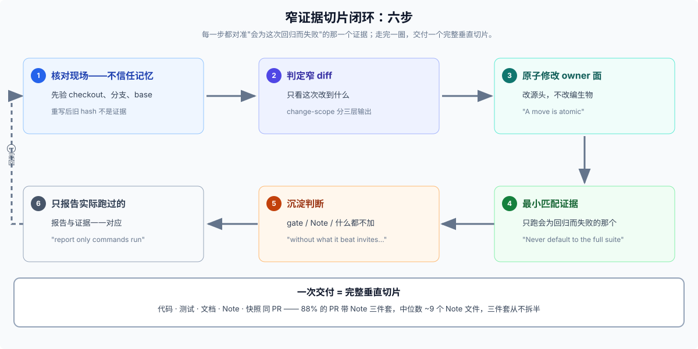
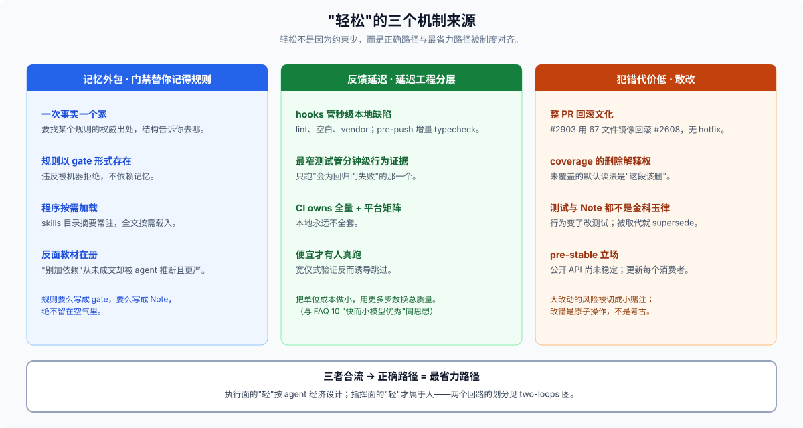
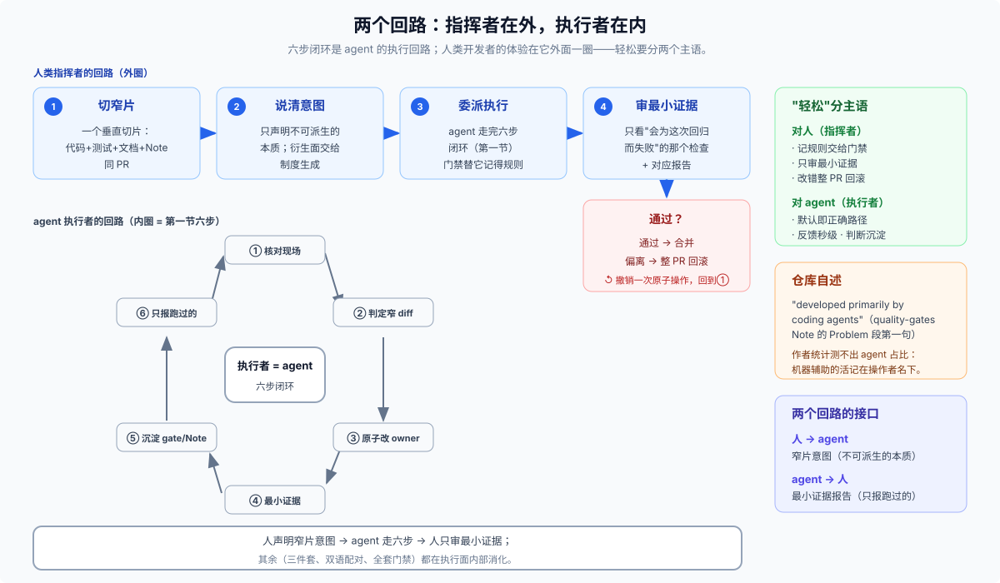

# Answer · 窄证据切片闭环：DSH 最自然的开发习惯，以及"轻松"从哪来

基线：制度与文档以 checkout `08b582ea02` 为准；git 量化取自 `upstream/master` tip `0a53fb55be`（0.1.2-alpha.2）最近 100 个 PR landing merge。三路调查的原始材料见 [research.md](./research.md)。

## 结论先行

DSH 支持很多开发习惯——spec-first、TDD、plan-first、全量验证仪式、goal 续轮长跑都装得下——但它最自然、阻力最小、被制度反复强化的那一个，可以概括成一个闭环：**核对现场 → 判定窄 diff → 原子修改 owner 面 → 跑"会为这次回归而失败"的最小证据 → 把新判断沉淀为门禁或 Agent Note → 只报告实际跑过的检查**。每次交付是一个完整垂直切片：一个 PR 同时携带代码、测试、文档、Note、快照预期。本 FAQ 把它命名为**窄证据切片闭环（narrow-evidence slice loop）**。

而"驾驭它写东西非常轻松、愉悦"的体感，根源不是约束少——恰恰相反，DSH 是约束密度极高的仓库。轻松来自**正确路径与最省力路径被制度性对齐**：忘了规则没关系，门禁会替你记得；验证文档没关系，每次要跑的检查只有一两个；改错了没关系，整个 PR 原样回滚，不需要外科手术。下面三、四、五节展开这三个机制来源；第六节用历史检验；第七节回答"为什么写工具/写插件也轻松"；第八节给代价与边界。

值得先记录方法：这个问题本可以从 FAQ 02（spec 分层）或 10（goal/plan 三根）顺推，但那些是先入为主的输入——02 曾经把"SDD"当成前提，事后证明 DSH 官方从未如此自称（[02 answer 的"不能从仓库推出什么"](../02_spec-driven-development/answer.md)）。本篇的结论是从 skills 语料、git 历史、运行时默认行为三路独立重建的，最后才与那些输入对位。

## 第一节 闭环本身：六步

**第 1 步：核对现场，不信任记忆。** 所有 skills 的共同开场是先确认 checkout、分支、活着的 base，再谈任何判断：`pnpm --silent run change-scope --base <verified-base-ref>`，且"The command never guesses or fetches a base"（[dsh-pre-push-checks](../../.agents/skills/dsh-pre-push-checks/SKILL.md)）。被重写过的分支之后，"commit hashes and inline-comment anchors from before the rewrite are not current evidence"。这条习惯的根是仓库的认识论（见第七节）：**任何先前叙述——自己的、别人的、三小时前的——都不是权威**。

**第 2 步：判定窄 diff。** 只看本次改动真正触达的行为面。change-scope 输出的 JSON 按 committed/staged/untracked 分层，review 与 push 共用同一份"这次改了什么"的事实（[dsh-code-review](../../.agents/skills/dsh-code-review/SKILL.md) 第一步也是先跑 change-scope，"before reading the diff"）。

**第 3 步：原子修改 owner 面。** 改源头，不改编生物："Edit the owning source or scenario first, then regenerate the artifact"（[dsh-prose-standard](../../.agents/skills/dsh-prose-standard/SKILL.md)）；"Generated catalogs are never hand-edited; if the fact belongs there, change the generator's source"（[dsh-doc-standards](../../.agents/skills/dsh-doc-standards/SKILL.md)）；移动是原子的（"A move is atomic"）。同时，写下的每个字都以"HEAD 处的无会话读者"为唯一视角——[dsh-trim-cot-leakage](../../.agents/skills/dsh-trim-cot-leakage/SKILL.md) 的一句测试："could a reader at HEAD, with no access to any session transcript, PR thread, or uncommitted draft, resolve every reference and verify every claim?" 禁止叙述自己的工作过程。

**第 4 步：最小匹配证据。** 这是最能定义这个习惯的一步。"There is no universal local baseline beyond the hooks. Every behavior change needs the narrowest available test or purpose-built check that would fail for its regression"（pre-push-checks）；"Never default to the full suite or repeat a passing check for commit or push"（根 [AGENTS.md](../../AGENTS.md)，原文限定 commit/push 场景）；甚至明令禁止重复劳动："do not run typecheck immediately before pushing solely to duplicate the pre-push hook"。coverage 也可以按文件显式圈定范围（vitest `--coverage.include` 指到单个源文件）。hooks 本身被刻意保持极窄：pre-commit 只做 staged lint/空白/vendor 清单，pre-push 只跑增量 typecheck（[development.md](../../docs/development.md) 的 Git integrations 一节，理由明说："the hooks intentionally do not run tests, snapshots, documentation checks, builds, or hygiene"）。

**第 5 步：沉淀——二选一，或者什么都不加。** 新产生的判断只有两个合法去处：机械可查的，做成失败时非零退出的 gate（"Every mechanically checkable AGENTS.md promise gets a command that exits non-zero"，[quality-gates Note](../../.agents/notes/implemented/process/2026-06-11-quality-gates.md)）；语义判断的，写成 Agent Note（"Every non-trivial change MUST add or update at least one Agent Note in the same PR"，[Agent Note 规则](../../.agents/notes/README.md)，且 Alternatives considered 强制："A decision recorded without what it beat invites re-litigation"）。两个都不够格的，就什么都不加——accretion 是被点名防的敌人：文档有字数预算（超限走 relocate→condense→raise，[docs/AGENTS.md](../../docs/AGENTS.md)），Note 有归档校准（"word count and age are discovery aids, never archive criteria… Do not archive toward a quota"，[dsh-archive-agent-notes](../../.agents/skills/dsh-archive-agent-notes/SKILL.md)）。

**第 6 步：只报告实际跑过的。** "report only commands run"（AGENTS.md）；"Report pending checks as pending"（pre-push-checks）；"Report the inspected scope, clear changes, deliberate keeps, deferred cases, and checks actually run"（prose-standard）。报告与证据一一对应，不多说，不少说。

这六步就是每个 `dsh-*` skill 反复展开的同一个骨架——仓库共 10 个 `dsh-*` skill，各自是它在某个场景（push 前、review 时、写 prose、找简化、归档、落地栈、双语流程）上的实例化；其中 dsh-translate-docs 仅限用户显式调用（docs/AGENTS.md），开发习惯闭环的语料分析以其余 9 个为对象。

## 第二节 "轻松"的来源一：记忆外包——门禁替你记得规则

人类开发者最大的负重是记忆：几百条约定、哪些门禁、哪些历史教训。DSH 把这份负重从（人或 agent 的）脑子里搬进了三类外部结构：

- **一次事实一个家**："Each fact has one home: the tier whose job it is; elsewhere, link there"（docs/AGENTS.md tier 表）。要找任何规则的权威出处，结构本身告诉你去哪。
- **规则以 gate 形式存在**：quality-gates Note 的原话是整个仓库最有自我意识的一句——"Agents follow enforced gates far more reliably than prose conventions, and 'a lot of work' is not a cost argument when agents do the labor"（:11）。规则不依赖记忆，违反它的行为会被机器拒绝。
- **程序按需加载**：skills 目录摘要常驻，全文只在任务匹配时经 `skill` 工具载入（两层披露，见 [research.md](./research.md) 运行时部分）。过程性知识也是"外包"的。

反面教材同样在册：依赖政策 Note（[2026-07-26-dependencies-over-hand-rolling](../../.agents/notes/implemented/process/2026-07-26-dependencies-over-hand-rolling.md)）复盘发现，一条从未写下的"别加依赖"规则被 agent 从代码模式里**推断**了出来，且"stricter than anyone decided"。仓库对"agent 会从模式里猜规则"这一性质有自觉，所以答案不是"多提醒"，而是：规则要么写成 gate，要么写成 Note，绝不留在空气里。

记忆外包的直接体感就是"轻松"：你不需要记住约定，你只需要让检查跑一遍。忘了会痛，但痛在秒级、带明确诊断信息，而不是在 review 或 CI 端爆出迟到半小时的模糊失败。

## 第三节 "轻松"的来源二：反馈延迟被刻意压到最小

闭环第 4 步不是道德姿态，是延迟工程。分层是明确的：hooks 管秒级本地缺陷，"narrowest available test" 管分钟级行为证据，"CI owns exhaustive coverage and the platform matrix"（AGENTS.md）。一次典型迭代的最小反馈是：改两三个文件 → 跑 owning 的 vitest 文件或 doc-sync → 秒到分钟级出结果。

这个设计里藏着一个对 agent 经济学的直白理解：agent 跑测试没有"无聊成本"，但 wall clock 和 token 是真金白银；把反馈收窄到"会为这次回归而失败的那一个检查"，单次迭代成本就被压到最低——而迭代成本低，人才（和 agent）会真的去跑，规矩才守得住。宽仪式性验证反而会诱导跳过。这与 FAQ 10 论证"快而小的模型优秀"是同一个思想在开发层的投影：**把每一步的单位成本做小，然后用更多步数换总质量**。

还有一层：验证本身便宜。"We are DeepSeek — do not ration real-API tests. A no-key test proves plumbing; only a with-key run proves the agent works against a real model"（[testing.md](../../docs/testing.md) 的 with-key policy）——连"真实模型验证"都不设配额。

## 第四节 "轻松"的来源三：敢改——犯错的代价被结构性调低

第三个体感来源最少被明说，但证据最硬：

- **整 PR 回滚文化**：git 历史里 merged slice 被 revert 时是整个切片反向——代码、测试、快照、Note 三件套、文档目录一起退（如 #2903 `577bb71418` 回滚 #2608 的全部六个面），没有 patch-forward hotfix 的模式。改错了，撤销是一次原子操作，不是考古。
- **coverage gate 的删除解释权**："An uncovered line is often dead code the gate is correctly flagging for deletion, not a missing test to bolt on"（testing.md 的 coverage gate 节）。100% 覆盖率在这里的默认读法是"这段代码该删"，不是"这段代码该补测"。
- **tests are not golden truth**："Tests describe behavior, not correctness. Change obsolete behavior with its tests"（AGENTS.md）；Note 也不是金科玉律——被取代就 supersede、被归档就冻结（"archived notes are frozen history, never current authority"）。
- **pre-release 立场**：没有外部消费者，所以"rename or repackage freely and update every reference together"，删兼容 shim 换正确地基（AGENTS.md 开篇）。

这四条合起来的效果：仓库不供奉任何已有代码。新人（或新 agent）进场不需要"先读懂全部再动手"——窄 diff + 原子回滚 + 可重生成的目录，意味着大改动的风险被切成了一堆小赌注。**"敢改"才是"轻松"最深的那个来源**：轻松不是没有风险，而是风险被结构吸收了。

## 第五节 为什么"写东西"本身也轻松：声明本质，其余派生

上面说的是开发流程；把范围缩小到"在 DSH 上写一个工具/插件"，同样的哲学换了个出口。看 [adding-a-tool](../../docs/cookbook/adding-a-tool.md) 的最小定义：一个 `defineTool` 声明了名字、schema、`execute`、`render` 之后，以下全部免费获得——args 类型化并在执行前自动验证；schema 自动流入 system prompt 组装；effect 式注册，dispose fiber 即注销；Code Mode 免费可达（"Code Mode reaches your tool for free"，生成的类型从同一 schema 推导）；UI 卡片由一个声明的 render intent（`generic`/`terminal`/`diff` + `locations`）派生，且是 `args` 的纯函数、重放安全。

写的人在两种情况下（在仓库内开发 DSH、在仓库上写扩展）都只写一样东西：**不可派生的本质**。其余义务在仓库内由 gate 派生，其余能力在仓库面由 harness 派生。"生成物永不手编"（doc-standards）是同一原则的第三面：能从源头推导的，永远不维护第二份。诚实边界也要讲：声明之外仍有 DSL 表达不了、必须手检的约束（非空串、正数、跨字段规则——adding-a-tool.md 的 execute contract 明列），且契约面本身有 90 余行宽度；它不免费，而是"由 harness 执行、由 agent 消化、人只需在读契约时过一遍"。

## 第六节 历史检验：这个习惯是真的，还是文档自我美化

git 量化（upstream/master 最近 100 个 PR landing merge）给了强支持：

- **88%** 的 PR 含 `.agents/notes/` 改动，**96%** 含测试，**86%** 含 docs/README，**90%** 含 src（按 merge-base 口径即 PR 真实足迹独立复现为 88/94/86/90，测试类 94 与 96 之差是计数定义噪音）。Note 文件数的众数是 3 个（= 一个新三件套），中位数 ≈9（即“典型 ~3 个三件套”）；.md/.zh 对在 100 个 PR 中从不拆半（0 例）。例外恰好是制度豁免类：1 文件机械修复（#2760，25 行）、CI-only PR（#2798 仍带 2 个 Note 三件套与 spec 测试）。
- 工作流 Note 自带引入 commit（"adopt native GitHub stack workflow" `9a07380c23`），merge-forward checkpoint 密度约 1.8 次/PR，整 PR revert 常态化——**文档就是历史的转写**，不是愿望清单。
- 作者身份几乎全是人（top: Tianyi Cui 5475 commits、Yichen Jiang 1680、imccyu 1556），Co-authored-by 仅 4 例。但这条证据**不能**用来反驳"这套流程只对 agent 可行"：quality-gates Note 的第一句自述就是 "This codebase is developed primarily by coding agents"，且本仓库惯例是"机器辅助的活记在操作者名下"（research 第二路）——作者身份因此测不出人手与 agent 的占比，它最多证明"人在落地 PR"。正确的读法是分工论：执行面（跑检查、写三件套）按 agent 经济设计，指挥面（切窄片、审最小证据、整 PR 回滚）才是人类开发者的体验所在——见第八节修正。
- 诚实的分歧也要记录：文档把 stacked-PR 写成统一工作流，但历史里并存三种实践——lettered worktree 系列（apire-a…f）、编号 native stacks（agent-profiles-1…8）、以及占多数的普通独立 `fix/`/`feat/` PR。习惯是真实且被实践的，但不是每一个 PR 都走满全部仪式；制度允许简单问题用简单路径。

## 第七节 与 02/10 对位：纠正一个因果倒置，指出同一条认识论

**对 FAQ 02/06（spec-driven）**：分层规格的静态结论站得住，但如果读成"DSH 先写 spec 再实现"，因果就反了。native 顺序是：**证据与门禁先行，spec 感是闭环的沉淀物**——gate 住了的事实进文档与生成目录，选择记录进 Note，行为钉进快照；"spec"从未作为上游文档存在，它是六步闭环运行足够多圈之后，从外部看起来的形状。02 自己其实已经触到这一点（"并非所有变更都机械地先有 proposed 文件"），本 FAQ 把它从脚注升格为结论。

**对 FAQ 10（goal/plan 三根，10_v4flash-user-notes）**：那篇解释的是运行时体感。本篇发现的是同构现象的深层根源：goal 轮提示词对模型宣告"权威只属于 workspace、工具结果与持久会话状态，模型三小时前的自述没有权威地位"（FAQ 10 的 04-goal-plan-small-model.md:26 所引 goal 轮提示词），trim-cot-leakage 对开发者宣告"HEAD 处的无会话读者必须能验证每一个 claim"，pre-push-checks 对所有人宣告"不信任记忆，核对现场"。这是**同一条认识论在运行时与开发时两个平面上的投影**：模型（或人）的自述永远不是权威，权威只在外部可验证状态里。所以"核对现场、窄证据、原子切片"不是被规定的习惯，而是在这个认识论下**唯一自洽的行事方式**——这就是"最 DSH native"的确切含义。

顺带：委派 spine（FAQ 10 的 05-other-roots.md）与这个习惯的关系是"同源不同层"——委派把任务切小，窄证据把验证切小，两者共享"单位成本最小化"的取向，但前者是运行时能力，后者是开发制度，互不依赖。

## 第八节 代价与边界

- **gate 语料本身是要维护的代码**：quality-gates Note 的 Consequences 明说（"The gates themselves are code to maintain"）。闭环每沉淀一条规则，未来的每个 PR 都多付一点合规成本。
- **垂直切片有宽度税**：双语文档三件套（.md + .zh.md + .i18n.yaml）加上生成目录更新，对小改动是重仪式——88% 切片率的另一面是每个切片要动中位数 ~9 个 Note 文件（众数 3 个 = 一个新三件套）。
- **闭环只约束它覆盖的面**：本目录（`_faq_on_digested/`）就活在产品门禁之外——文件刻意不叫 `README.md`（躲开双语配对门禁），自带一个只查编码/换行/链接的 [verify.mjs](../verify.mjs)。值得注意的是连这个研究语料也把"最小检查"带了进来——这个习惯的传染性，本身就是它自然程度的旁证。
- **六步闭环是执行者的回路，指挥者的回路在它外面**：本 FAQ 的六步描述的是在此仓库里干活的 agent 的默认路径；人类开发者的体验是它的上一层——切一个窄片、把意图说清、让 agent 走完六步、只审"会为这次回归而失败"的最小证据、错了整 PR 回滚。quality-gates Note 第一句自述 "This codebase is developed primarily by coding agents"，六步闭环本身就是按"agent 执行、人指挥与审查"分工设计的。所以"轻松"要分清两个主语：对 agent 是默认路径即正确路径；对人是"不用记规则、不用跑全套、改错可原子回滚、每笔交付只需审最小证据"——它对人省力的部分在指挥与审查面，不在执行面。

- **它明确不优先的习惯**：spec-first 大文档（02 已论证无自我声明）、red-green-refactor 全员强制、全量验证 ritual、兼容 shim、手工维护生成目录。这些都能做，但每个都逆着制度的纹理。

## 最接近的一句话

**DSH 最自然的开发习惯是窄证据切片闭环：核对现场、判定窄 diff、原子修改 owner 面、跑会为这次回归而失败的最小证据、把新判断沉淀为 gate 或 Note、只报告实际跑过的——每笔交付是一个带测试、文档、Note、快照的完整垂直切片。"轻松愉悦"不是因为约束少，而是因为正确路径与最省力路径被制度对齐了：记忆在门禁里，反馈在秒级，错误可以原子回滚，而写的人只需声明不可派生的本质。**
