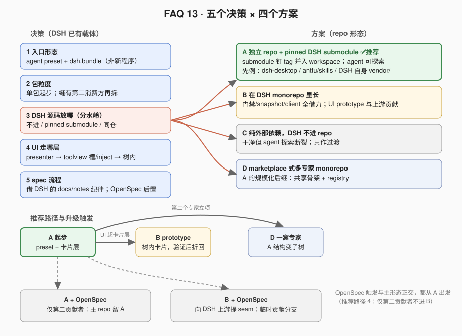
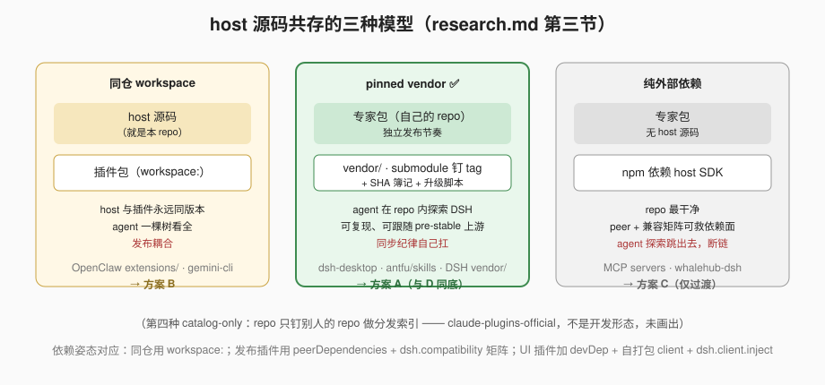

# Answer 13 · 领域专家 DSH 插件的 repo 组织：五个决策、四个方案、一条推荐路径

## 一句话答案

专家插件的 repo 不是"一个目录怎么摆"的问题，而是五个决策的组合：**入口形态**（DSH 已有答案：preset + bundle，不要新程序）、**包粒度**（单包起步）、**DSH 源码放哪**（pinned submodule 进 repo）、**UI 走哪层**（卡片层免费、面板层走 `dsh.client.inject`）、**spec 流程**（先借 DSH 的 docs-as-contract 纪律）。四个 repo 方案是这五个决策的不同取值组合；推荐**方案 A（独立 repo + pinned DSH submodule）为长期形态**，方案 B 留给 UI prototype 和上游贡献，方案 C 只作过渡，方案 D 是 A 的规模化后继。

## 决策 1 · 入口形态：preset + bundle，DSH 已经回答了

专家需要的"自己的工具、提示词、技能、隔离上下文"恰好是 agent preset 的定义：一个 `agent.cordis.yml` 目录，会话挂上它就运行它的工具/prompt sections/skills，其他会话不受影响（`ctx.agentPresets`，见 `packages/preset/README.md`）。可插拔性由 bundle 层承担：package.json 的 `dsh` 字段声明 `dsh.bundle.patch`（+ Web UI 时 `dsh.client.inject`），装进任何 profile。**不需要新的可执行入口**——DSH 的五入口（CLI/Web/Desktop/ACP/SDK）共用 `ctx.agents` spine，专家是这棵树上的组合物，不是第六个入口。

这不是本 FAQ 的发明，是整个第三方生态的事实契约：[research.md](./research.md) 核实的四个第三方插件（dsh-im、dsh-market、dsh-routing-suite、chatnode-wechat）全部用 `dsh.bundle.patch: "./cordis.patch.yml"` + `dsh plugin add`，awesome 列表的收录规则也是这两条。

## 决策 2 · 包粒度：单包起步，缝出现第二消费方再拆

DSH 的 capability seam 语法（Definition / Provider / Consumer）是**演化目标**不是起步要求。生态证据：90%+ 的第三方插件是单包 repo。DSH 自己的纪律也反对预防性拆分——拆分只在角色独立演化时发生；FAQ 08 的判据更直接：Provider 与唯一 Consumer 同包 = 还没有市场。方案 A/D 树里的 `flows / tools / pack` 三个薄包**不是 seam 角色拆分**：依据是发布边界——pack 是唯一发布载体（自包含），flows/tools 是它背后的内部实现包；哪怕收成一个包（生态主流的单包形态）也成立。seam 级拆分（立自己的 Definition、允许别的 Consumer）等某条缝真的有第二个消费方再做。

## 决策 3 · DSH 源码放哪：四个方案的分水岭

这是"coding agent 能不能在 repo 内探索 DSH"的开关，也是四个方案的根本差异：

| 方案 | DSH 源码 | 一句话 |
|---|---|---|
| [A 独立 repo + pinned submodule](./option-a-standalone-with-pinned-dsh.md) ✅推荐 | submodule 钉 tag，并入 pnpm workspace | agent 探索 + 可复现 + 独立发布；生态已有完整先例（dsh-desktop、antfu/skills、DSH 自己的 `vendor/`） |
| [B 在 DSH monorepo 里长](./option-b-in-dsh-monorepo.md) | 就是 DSH repo | 借力最大（门禁/snapshot/client），但身份变成"改 DSH"；留作 UI prototype 与上游贡献通道 |
| [C 纯外部依赖](./option-c-external-dependency-only.md) | 不进 repo | 最干净但核心诉求不成立；只作过渡 |
| [D marketplace 式 monorepo](./option-d-marketplace-monorepo.md) | 同 A | 一窝专家 + 共享骨架 + registry；A 的规模化后继，非竞争者 |

生态已收敛出开发型 repo 的三种共存模型——**pinned vendor**（A）、**同仓 workspace**（B）、**纯外部依赖**（C）——另有不做开发的 catalog-only 分发形态（见 [research.md 第三节](./research.md)与下图）。选择依据就一条：**公开 API 仍 pre-stable，专家必须能低成本跟随上游**——pinned vendor 用 tag + SHA 簿记（antfu/skills 的 `GENERATION.md` 纪律）把跟随成本压到最低，且不放弃 agent 探索。

## 决策 4 · UI 表达：分层认领，不要一步到顶

- **卡片内表达**（免费层）：工具的 `presentCall`/`presentResult` card render intent + `presentationMeta`——纯函数、可 replay、零 client 依赖，任何 host UI 自动渲染（`docs/cookbook/adding-a-tool.md`）。专家的大部分 UI 需求应压在这一层。
- **独立 UI 面**（注入层）：`dsh.client.inject` + 自带打包的 client 模块。曾以为这是树内专属，第三方实证推翻了它：dsh-market（tsdown）与 dsh-im（esbuild）都在独立 repo 里把自己的 Web 面注入 web profile，DSH client 包只作 devDependency。
- **树内定制**（方案 B 独占）：直接改 client 卡片组件、client-modules 深度组装。只在 B 里做，且做完要评估能否折回前两层。

## 决策 5 · spec 流程：先借 DSH 的，OpenSpec 留触发条件

DSH 的原生开发环（FAQ 11 结论：这是它"最自然"的习惯）搬到专家 repo 零依赖可用：根 `AGENTS.md`（常驻规则 + 布局 + 命令表）、`docs/` = 当前合同、`notes/` = 决策记录、行为测试 + 少量 snapshot。OpenSpec 的增量在显式的变更提案生命周期（`openspec/changes/` 的 proposal/design/tasks），触发条件：第二个贡献者进场，或要向 DSH 上游提 seam（那时方案 B 也一起上场）。

## 依赖与兼容纪律（从生态失败样本里学）

- `@deepseek-ai/cordis` 与用到的 `@deepseek-ai/dsh-*` 作 **peerDependencies**（dsh-market 姿态）；拒绝 chatnode-wechat 的精确钉死（pre-stable API 下每次上游同步都逼发版）。
- expert-pack 声明 **`dsh.compatibility` 版本矩阵**（dsh-im 姿态），测试覆盖矩阵里的每个 DSH release。
- 自包含：发布产物不得引用 repo 内 vendor/ 或共享目录（Claude Code 缓存安装的硬规则，`dsh plugin add` 的装包模型同理会奖励自包含）。
- 测试走**真实安装形状**：源码 checkout 直跑之外，必须 `npm pack` → `dsh plugin add` 装进干净 profile 再跑一遍（OpenClaw 文档明示源码测试会掩盖依赖错误）。
- 同步 `vendor/dsh` 用 SHA 簿记（submodule 钉 tag + 记录文件 + 升级脚本），不裸漂。

## 推荐路径

1. **第 0 天**：按方案 A 起 repo；专家全部行为压在 preset + bundle + 卡片层；`AGENTS.md` 写清入口链与 `vendor/dsh` 簿记。
2. **UI 需求超出卡片层**：先试 `dsh.client.inject`；注入点不够再进方案 B 长树内卡片，验证后折回。
3. **第二个专家立项且要复用骨架**：升方案 D（A 的结构原样变成子树）。
4. **向 DSH 上游提 seam 或引入第二贡献者**：方案 B + OpenSpec 一起上。

每个方案的完整目录树、装法、取舍表与市场背书见各自文件（各自的"开发过程差异"一节只写形态带来的增量）；**插拔、调试、驱动 coding agent 与 DSH 推荐流程的共享细节**收敛在 [dev-loop.md](./dev-loop.md)，**官方安装的 DSH 与插件开发的隔离**（双 home）在 [dual-home-isolation.md](./dual-home-isolation.md)；全部外部证据与 URL 在 [research.md](./research.md)。
