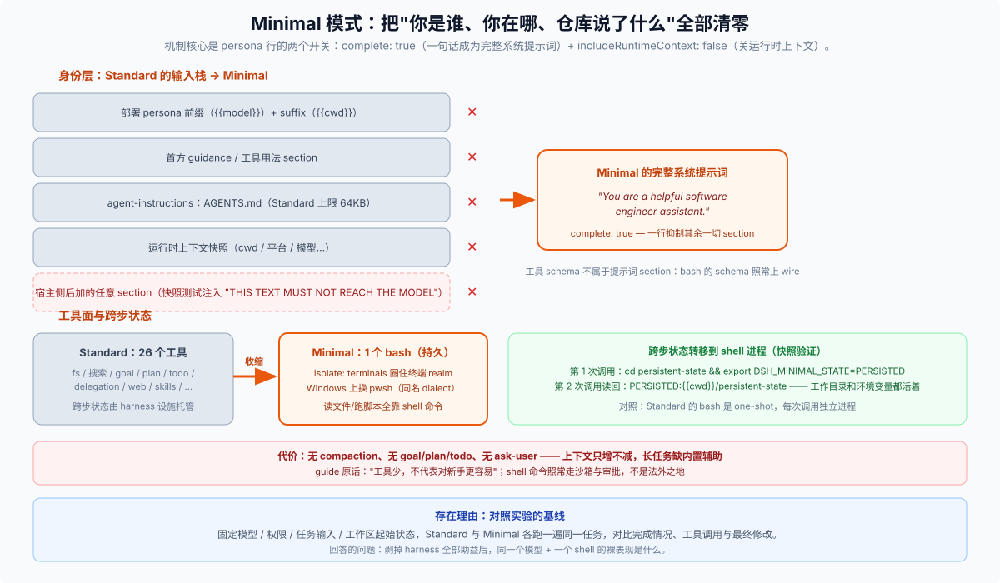

# Minimal 模式分篇 · 一句话身份 + 一个持久 shell，其余全部清零



## Minimal 到底"极简"掉了什么？

[`minimal.patch.yml`](../../packages/bundle/web-app/presets/minimal.patch.yml) 是四份里最短的，快照测试把它的全部行为钉死了（[`apps/web/tests/minimal-preset.snapshot.ts`](../../apps/web/tests/minimal-preset.snapshot.ts)）：

```text
prompt: "You are a helpful software engineer assistant."
tools:   ["bash"]        // Windows 上是 pwsh
goalCommand: false
// 且：无 runtime-context user message、preset scope 无 fs / compaction 服务
```

减法清单（对照 standard）：无 fs 工具（read/edit/write/glob/grep 全无，读写靠 shell 命令）、无 jobs、无 skills、无 goal、无 plan mode、无 compaction、无 delegation、无 ask-user、无 todo、无 web、无 present、无 plugin-manager、**无 `agent-instructions`（AGENTS.md 不进上下文）**。GUI guide 的措辞："仅提供一个持久 Shell 工具，并使用固定系统提示词……不加载 Skills、计划、上下文压缩，也不注入标准运行时上下文"（[`guide-locales.ts`](../../packages/client/ui-agent-preset/src/client/guide-locales.ts)）。

## `complete: true` 到底抑制了什么？

这是 Minimal 最特殊的机制点。`dsh-persona` 是 scope-only 的行（挂进 preset 时遮蔽部署级 persona），它的 `complete` 字段语义是"**让 prefix 成为完整系统提示词，抑制 suffix 和其他所有 section**"（[`packages/preset/persona/src/index.ts`](../../packages/preset/persona/src/index.ts)）。快照测试直接验证了这层排斥是彻底的：测试先在全局注册了一个 `THIS TEXT MUST NOT REACH THE MODEL` 的额外 section，再断言模型的系统提示词**只有那一句话**——不但部署级 persona 被遮蔽，任何宿主侧后加的提示词 section 一概进不来。

配套的 `includeRuntimeContext: false` 调 `ctx.systemPrompt.suppressRuntimeContext()`，关掉动态运行时上下文快照；快照里同时断言日志中不存在 `source.kind === 'runtime-context'` 的 `user/message` 事件。也就是说：**身份（你是谁）、位置（你在哪）、仓库约定（AGENTS.md）三个输入全部清零**。注意工具 schema 不属于系统提示词 section——`bash` 的 schema 照常上 wire。

## 终端为什么是"持久"的？

Minimal 用的是一个 `isolate: terminals` 的组，装 `dsh-terminal` + `dsh-terminal-bash` + `dsh-tool-bash-persistent`：状态跨调用保持的持久 shell，工具名就叫 `bash`（[`packages/shell/tool-bash-persistent/src/index.ts`](../../packages/shell/tool-bash-persistent/src/index.ts)）。Windows 侧有个实现细节：`persistent-pwsh` 底下其实还是 `dsh-terminal-bash`，只是配了 `shellDialect: pwsh`——方言切换是配置而不是换组件。快照验证：第一次调用里 `cd persistent-state && export DSH_MINIMAL_STATE=PERSISTED`，**后一次调用**读回 `PERSISTED:{{cwd}}/persistent-state`——工作目录和环境变量都活着。这与 standard 的 one-shot `dsh-tool-bash`（每次调用独立进程）形成对照：极简模式把"跨步状态"从 todo/goal/plan 这些 harness 设施，交还给 shell 自己的进程状态。代价是 guide 里点破的那句：**"缺少管理长任务的内置辅助能力；工具少，不代表对新手更容易"**——没有 compaction，长任务的上下文只增不减。

## 它存在的理由是什么？

对照实验的基线。guide 的定位语："适合作为实验和对照测试的基线"，用法是把**模型、权限、任务输入、工作区起始状态**固定，Standard 与 Minimal 各跑一遍，对比完成情况、工具调用与最终修改（[`guide-locales.ts`](../../packages/client/ui-agent-preset/src/client/guide-locales.ts)）。机制上它回答的问题是：把 harness 的全部助益剥掉后，同一个模型 + 一个 shell 的裸表现是什么。它仍不是法外之地：shell 命令照常走 tool pipeline 的沙箱与审批。

## 和 `sdk-minimal` 是什么关系？（名字撞车）

没有关系，是两个层面（[`../_digested/runtime-profiles/00-map.md`](../../_digested/runtime-profiles/00-map.md)、[`../_digested/runtime-profiles/04-sdk-minimal.md`](../../_digested/runtime-profiles/04-sdk-minimal.md)）：

| | `minimal` agent preset | `sdk-minimal` runtime profile |
|---|---|---|
| 层面 | 会话级：Web 里新建任务选的模式 | 进程级：`dsh --profile sdk-minimal` 启动什么树 |
| 决定什么 | 这个 Agent 的工具与提示词 | 整个进程装哪些插件（独立树，不叠 base） |
| 谁消费 | Web/Desktop 的模式选择器 | SDK 嵌入方 |

顺带一并分清：`cordis` 是 preset id，"Creator mode / 创造模式"是它的显示名（[`locales.ts`](../../packages/client/ui-agent-preset/src/client/locales.ts)）；`PTC` 是呈现模式名，不是 preset id（preset id 就是 `ptc`）。
