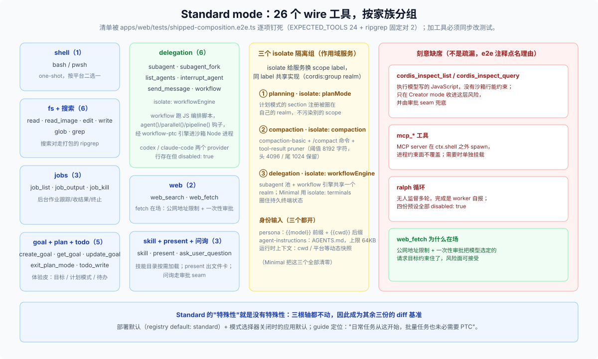

# Standard 模式分篇 · 没有特殊性的基线，本身就是一份契约

## Standard 在四份预设里是什么位置？

三重默认：部署默认（registry `default: standard`）、模式选择器关闭时的应用默认、guide 推荐的日常入口（"日常编程、文件处理和资料整理可以从这里开始……批量任务并不必须使用 PTC"）。机制上它三根轴都不动——不换呈现、不换身份、不碰扩展——所以它的价值是**当 diff 基准**：其余三份预设的每一行差异都以它为原点，且它的产出目录被 e2e 逐项钉死（见下）。

## 26 个 wire 工具怎么分组？

[`shipped-composition.e2e.ts`](../../apps/web/tests/shipped-composition.e2e.ts) 的 `EXPECTED_TOOLS`（24 个）+ 固定在场的 ripgrep 对（`glob`/`grep`，走打包的 `@vscode/ripgrep` 二进制，与宿主无关）= **26 个**。按家族：

| 家族 | 工具 | 备注 |
|---|---|---|
| shell（1） | `bash` / `pwsh` | one-shot，按平台二选一（`!!js` 条件禁用） |
| fs + 搜索（6） | `read` · `read_image` · `edit` · `write` · `glob` · `grep` | 搜索对始终在场，断言为固定成员 |
| jobs（3） | `job_list` · `job_output` · `job_kill` | 后台作业跟踪 / 收结果 / 终止 |
| goal + plan + todo（5） | `create_goal` · `get_goal` · `update_goal` · `exit_plan_mode` · `todo_write` | "体验皮"：目标 / 计划模式 / 待办 |
| delegation（6） | `subagent` · `subagent_fork` · `list_agents` · `interrupt_agent` · `send_message` · `workflow` | codex / claude-code 两个 provider 行存在但 `disabled: true` |
| web（2） | `web_search` · `web_fetch` | fetch 在场有专门理由（见下） |
| 其他（3） | `skill` · `present` · `ask_user_question` | 技能目录 / 文件卡 / 走审批 seam 的问询 |

这份清单是**活契约**：给 standard 加任何工具都必须同步改 `EXPECTED_TOOLS`，e2e 逐项比对组装后的 wire 目录。

## 哪些工具刻意不在场？为什么？

同一份 e2e 的注释把三组缺席点名为 deliberate, not incidental：

- **`cordis_*`**（`cordis_inspect_list` / `cordis_inspect_query`）——执行模型写的 JavaScript，**没有沙箱行能约束**；只在 Creator mode 有意识收进这层风险（[creator-mode.md](./creator-mode.md)）。
- **`mcp_*`**——MCP server 在 `ctx.shell` 之外 spawn，进程约束面不覆盖；需要时单独挂载。
- **`ralph`**——无人监督多轮循环，完成是 worker 自报；四份预设全部 `disabled: true`。

反例同样是契约的一部分：**`web_fetch` 在场**，因为公网地址限制 + 一次性审批把模型选定的请求目标约束住了——"在场/缺席"的判据是约束面是否闭合，不是功能喜好。

## 三个 isolate 组各自圈住什么？

（`isolate` 语义：给服务换 scope label，同 label 共享实现；见 [answer.md 第一节](./answer.md)。）

1. **`planning` · `isolate: planMode`**——计划模式的 section 注册圈在自己的 realm，进入/退出 plan mode 不影响别的 scope 的提示词面。
2. **`compaction` · `isolate: compaction, toolResultPruner`**——`compaction-basic` + `/compact` 命令 + tool-result pruner（阈值 8192 字符，头 4096 / 尾 1024 保留）。
3. **`delegation` · `isolate: workflowEngine`**——subagent 池与 workflow 引擎共享一个 realm；workflow 跑的 JS 编排脚本经 `workflow-ptc` 引擎进沙箱 Node 进程（[`packages/workflow/workflow-ptc/README.md`](../../packages/workflow/workflow-ptc/README.md)）。Minimal 的 `isolate: terminals` 是同一机制的第四个用例。

## 身份输入有哪些？（Minimal 清零前的"满配"）

persona 前缀 `{{model}}` + 后缀 `{{cwd}}`；`agent-instructions` 注入 AGENTS.md（上限 64KB）；运行时上下文动态快照。三个都开着——这就是 Minimal 那张剥层图的"before"状态。

## 什么时候选它？

guide 的定位就是默认入口：日常编码、文件工作、研究都从这开始；它也能写脚本批量处理文件。PTC 改变的只是工具调用方式，不是能力的有无——这句官方措辞本身就是"Standard 是能力全集参照"的注脚。
