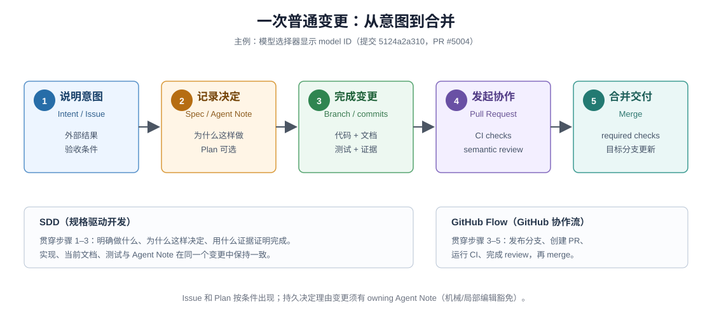

# 答案：DSH 把一次变更拆成可发现的事实与证据

## 先回答：这里究竟在解释什么？

这里不是通用 SDLC 教材，也不是 DSH 自称采用的 SDD 或路线图。它回答的是：在 DSH 这个真实仓库里，怎样让人或 coding agent 找到一次变更所需的事实，并让规则、证据与协作状态各自有可核对的来源。可观察到的三个特点是：

1. **知识要能被新参与者发现。** 写代码、查证据、做评审的可能是人，也可能是没参与过这个仓库的 coding agent；`AGENTS.md`、包 README 和决策记录提供公开入口。
2. **规则要能执行和失败。** 双语配对、Issue/PR 元数据、评审要求和 CI 调度分别由门禁、policy 脚本与 workflow 承载，不只写在说明文字里。
3. **不同事实要回到合适的维护位置。** 意图和验收放在 Issue 或任务上下文；持久决定理由放在 Agent Note；当前行为放在源码、README 或 JSDoc；回归证据由测试、snapshot、真实入口、负例和 review 共同提供；交付状态由 GitHub 记录。这是维护位置和证据职责，不是 DSH 宣布的“acceptance owner”本体论。

## 这些页面怎样回答问题

写给已经知道 git 可以提交代码、但不熟悉 DSH 开发方式的读者，包括没有参与过这个仓库的 coding agent。读完后，你应能回答：任务意图在哪里、当前行为由谁维护、何时需要持久决定记录、哪些证据共同覆盖改动面、哪些状态只能从 GitHub 查询。页面之间可以按问题跳转，不规定 test-first 或其它固定的串行顺序。

贯穿本教程的 DSH（DeepSeek Harness）是一个仍在活跃维护的开源 agent harness 仓库：TypeScript 单仓库（monorepo），由插件组成，管理 agent 会话、工具执行、沙箱、终端与 Web/Desktop 图形界面。你不必先了解它的产品功能——涉及的机制都会在出现时解释，并附上可核对的链接。

DSH 没有正式声明采用一套名为 Spec-driven Development（SDD，规格驱动开发）的方法。本文只用“意图、决定、当前行为和证据分开维护”来描述可观察机制；GitHub Flow 则说明分支、Pull Request、CI、review 与 merge 怎样形成远端协作状态。

## 贯穿案例

全教程跟着**一笔真实交付**走：模型设置列表的呈现修复——选择器每行显示原始 model ID（等宽字体），悬停显示模型名称。提交 `5124a2a310`（PR #5004），7 个文件、+15/−14：组件与样式、组件测试、Web e2e（端到端测试）、双语 README 及配对记录（[01](./01-follow-a-change.md) 有逐文件链接）。

这笔修改没有新增 Agent Note（DSH 放在 `.agents/notes/` 的决策记录文档；此处因局部呈现豁免），正好演示**不需要 Note 的完整小交付**；[02](./02-specs-and-decisions.md) 用另一笔真实修改——包管理器 pnpm 的子进程长期占用 profile lock（配置目录的写锁）——对照**为什么需要 Note**。一正一反，比抽象地说“Note 有时可选”更能阻止机械建档。

教程不伪装历史：任务描述从已交付行为重建（教学重建）；PR #5004 当时的 Issue、CI、review 与 merge 状态不在 git tree 里，涉及处标注 `需查 GitHub`，不补造。

## 用五步理解普通变更

1. **说明意图。** 在 Issue 或任务上下文中写清外部结果和验收条件。
2. **记录决定。** 持久决定理由变更新增或更新 Agent Note（机械/局部编辑豁免）；需要先评审实施计划时可以使用 Plan Mode（计划模式）。两者都是条件入口，不是必经站。
3. **完成变更。** 在分支上同时更新代码、当前文档和能抓住回归的测试或其它 evidence（验证证据）。
4. **发起协作。** Push 分支并创建 PR；GitHub workflow 运行 CI，reviewer 检查自动化无法判断的语义。
5. **合并交付。** Required checks 和 review 状态满足后 merge；主分支成为新的当前状态。

## 按问题查找

下面五页围绕同一历史案例，各自回答一个问题；可从最接近当前任务的一页开始：

| 章节 | 读完能回答 |
|---|---|
| [`01-follow-a-change.md`](./01-follow-a-change.md) | 一笔具体变更交付了什么、每步证据在哪里 |
| [`02-specs-and-decisions.md`](./02-specs-and-decisions.md) | 六类事实各归哪里；什么时候需要 Agent Note |
| [`03-github-flow.md`](./03-github-flow.md) | 本地与 push 后分别谁拥有证据；模板、CI、policy 怎样长成代码 |
| [`04-implementation-and-evidence.md`](./04-implementation-and-evidence.md) | 变更面怎样对应证据；红灯对照怎样做 |
| [`05-review-and-merge.md`](./05-review-and-merge.md) | 自动检查、语义评审、用户决定各管什么；合并后知识在哪 |

## 与相邻目录的分工

- **本 FAQ**：跨页面综合一次真实变更的事实位置、证据边界与协作状态；
- [Development Harness 专题](../../_dsh_plugin_agent_ready_development/repo-harness/00-index.md)：仓库**怎样帮助 agent 参与**——AGENTS.md、Notes、Skills、gates 怎样共同工作；
- [SDLC Reference](../../_dsh_plugin_agent_ready_development/sdlc-reference/00-index.md)：查**精确条件**、状态与例外流程。

页面按问题提供入口；概念首次出现时正文会给出英文与中文解释，后文保留可搜索的英文名称。需要查 policy 时进入 Reference，不在本页堆叠完整术语表。

## 怎样阅读 DSH 引用

正文先给出完整解释，再把 DSH 链接（钉版在固定基线 `580646c14f`（dsh-v0.2.0-rc.2）的绝对 URL）作为一手证据；关键规则摘录为 blockquote 并标明出处。证据分三层标注：`已在提交观察`（git tree 可核对）、`现行规则要求`（DSH 今天的规则文件）、`需查 GitHub`（只有远端记录能回答）。

## 一句话记忆

**规格管“变更应该成为什么”，GitHub Flow 管“变更怎样安全到达主分支”；每类事实住进自己的 owner，合并后仍可再次发现。**

返回 [FAQ 总入口](../00-index.md)，或进入 [Development Harness](../../_dsh_plugin_agent_ready_development/repo-harness/00-index.md)。
