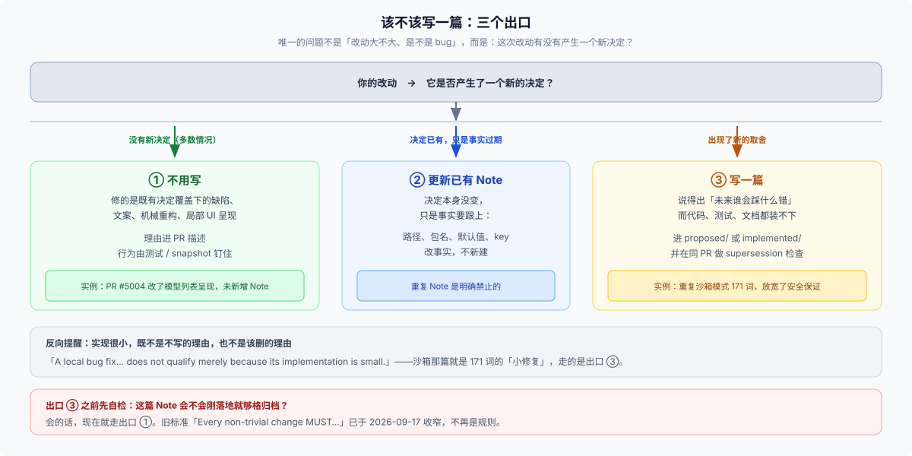

# 01 · 该不该写一篇

**第 1 步，先回答这个。** 多数改动不需要 Note——写是例外。

## 先想清楚它防的是什么

这一页的判据只有在你知道**它在防什么**的时候才好用。四种失败，按代价从高到低：

| 失败 | 长什么样 |
|---|---|
| **重新开讼** | 新人提出一个明显净赚的改动，不知道半年前已经被否过——于是论证要重走一遍 |
| **合理化倒推** | 只看到代码「现在这样」，猜一个理由，然后按猜的理由去改 |
| **幽灵约束** | 一段没人敢动的代码，因为没人知道它在防什么 |
| **考古负担** | 想知道为什么，得翻 git log、PR、issue 和几个人的记忆 |

**你的改动要不要写 Note，判据就是：不写的话，这四种里哪一种会发生、会不会真的发生？** 都不会，就不写。展开见 [04 背后的思考](./04-why-this-design.md)。

## 结论：默认不写

**写 Agent Note 是例外，不是流程关口。** 大多数改动——包括大多数 bug 修复——根本不到这里：

- 2026-09-18 之后的一个月里，新增 Agent Note 约 **110 篇**，同期非合并提交约 **914 个**；
- `bug-fix` 是正式类目（implemented 侧 63 篇）。让代码回到既有决定之内，走出口 ①；这次修复改变或补上了一条决定，走出口 ③。

真正的问题从来不是「改动大不大」「是不是 bug」，而是：

> **这次改动有没有产生一个新决定？**

## 三个出口

拿着你的改动对一遍，三条路选一条：

| 出口 | 判据 | 动作 |
|---|---|---|
| **① 不用写**（默认） | 没有新决定：修的是既有决定覆盖下的缺陷、文案、机械重构、局部 UI 呈现 | 直接改，理由进 PR 描述；行为由测试钉住 |
| **② 更新已有 Note** | 决定已经存在，只是事实要跟上（改了路径、包名、默认值、key） | 改那篇 Note 的事实部分，**不新建** |
| **③ 写一篇** | 出现了一个**新的、未来有人会踩的取舍**，而代码、测试、现有文档都装不下它 | 写 |

出口 ③ 的判据可以压成一句话，它就是规则原文：

> Add or update an Agent Note in the same PR only for lasting decision rationale that code, tests, and existing documentation do not explain.

再具体一点，问自己：**我能不能指出一个未来维护者会犯的具体错误？** 能，就走 ③。

## 三个真实例子

### 出口 ③：改动很小，但它放宽了一条安全保证

[`implemented/feature/2026-09-16-sandbox-same-mode.md`](../../.agents/notes/implemented/feature/2026-09-16-sandbox-same-mode.md)（171 词）

`approveEscalation` 在请求的模式已经生效时直接返回——几行改动。但如果不写，下一个人看到「重复请求危险模式却不拒绝」，**很可能会把它当成权限校验的漏洞补上**。它命中了「未来会有人踩」，因为这次改动**动了既有决定的边界**，还顺带记下了部分取代关系：

> This partially supersedes the non-widening rejection in the sandbox decision (`2026-07-06-sandbox.md`); its confinement and per-call approval decisions remain active.

### 出口 ③：一条看不出规律的长期约定

[`implemented/process/2026-09-22-workspace-release-ranges.md`](../../.agents/notes/implemented/process/2026-09-22-workspace-release-ranges.md)（232 词）

为什么 `workspace:*` 和 `workspace:~` 混着用？因为发布节奏不同（DSH 包共用一个产品发布，vendor 与 native 各自独立）。没有这篇 Note，下一个人只会看到一堆看不出规律的范围符号，然后按直觉统一它们。

### 出口 ①：DSH 自己一次没写 Note 的合格交付

提交 `5124a2a310`（PR #5004，7 个文件、+15/−14）改了模型设置列表的呈现——选择器显示 model ID、悬停显示名称——**没有新增 Agent Note**。它是局部 UI 呈现改动，理由进 PR 描述就够，行为由组件测试和 e2e 钉住。

这个反例比抽象地说「有时可以不写」有用得多：**它演示了一次完整、合格、但不需要 Note 的交付。** 你完全可以是这一次。

## 明确豁免：机械与局部编辑

规则原文的豁免很具体：

> Mechanical or local edits, including local UI presentation and interaction changes, are exempt.

局部 UI 改动默认走出口 ①：文案、间距、颜色、图标、状态指示、布局、可见性条件。但**UI 代码不是一张空白豁免**：

> Changes involving persistence, protocols, permissions, cross-component state ownership, or shared interaction rules still use the lasting-value test above.

碰到持久化、协议、权限、跨组件状态归属或共享交互规则，就回到三个出口重判。一个校准例子：去掉一个冗余的状态点、同时保留转换指示——理由能放进 PR 描述、测试能抓住行为，走出口 ①。

### 反向也要记住

**「实现很小」既不是不写的理由，也不是该删的理由。** 规则在归档侧写得最清楚，同一句话适用：

> A local bug fix, performance change, new capability, or substantive behavior decision does not qualify merely because its implementation is small.

沙箱那篇就是 171 词的「小修复」，它走了出口 ③。

## 先检查出口 ②，再考虑 ③

**仓库里已经有一篇 Note 拥有这个决定吗？** 有就更新它，不要新建。重复 Note 是明确禁止的——[`dsh-find-simplifications`](../../.agents/skills/dsh-find-simplifications/SKILL.md) 专门写了「do not create duplicate notes to preserve candidate counts」。

一个自检：**这篇 Note 会不会刚落地就够格归档？** 会的话，现在就走出口 ①。

## 不写 Note 时，理由放哪

| 内容 | 归宿 |
|---|---|
| 这次改了什么、为什么这么改（一次性） | PR 描述 |
| 系统现在做什么 | 源码、JSDoc、package README、docs |
| 什么行为被钉住了 | 测试、snapshot |
| 打算以后做什么 | Issue（`#N owns the follow-up` 在任何表层都是持久引用） |
| 为什么会这样设计、放弃了什么 | **Agent Note** |

这张表是判据的另一种说法：**只有当最后一行是唯一能装下它的地方时，才走出口 ③。**

## 关于「新标准 vs 旧标准」

今天的门槛是 2026-09-17 提交 `730bcc7c85`（"require lasting rationale before creating agent notes"）改出来的。改之前是一句更粗暴的话：

> Every non-trivial change MUST add or update at least one Agent Note in the same PR.

旧判据「变更非平凡」无法执行——任何改动都能论证自己非平凡，结果是每个行为变更都机械建档。新标准明确写了：行为变化、用户可见性、文件数量、新增测试**本身都不构成理由**；普通变更理由写进 PR 描述，当前行为写进它既有的文档。

> 如果你在别处看到 "Every non-trivial change MUST…"，那是收窄之前的历史引文，不是现行规则——它以提交 `730bcc7c85` 为准。

## 证据入口

- [`.agents/notes/README.md` § When to write one](../../.agents/notes/README.md)：门槛、豁免、重复与更新、完全取代的合并条件。
- [`.agents/notes/README.md` § Archiving and deletion](../../.agents/notes/README.md)：为什么「实现很小」不是判据。
- 提交 `730bcc7c85`（2026-09-17）：把「非平凡变更必须写」改写成「只有持久决定理由才写」。
- 提交 `5124a2a310`（PR #5004）：一次完整、合格、不需要 Note 的交付。

---

*基线：工作树 `caf78ed639`，2026-10-08 实测；门槛相关的规则原文见 [`.agents/notes/README.md`](../../.agents/notes/README.md)。*
