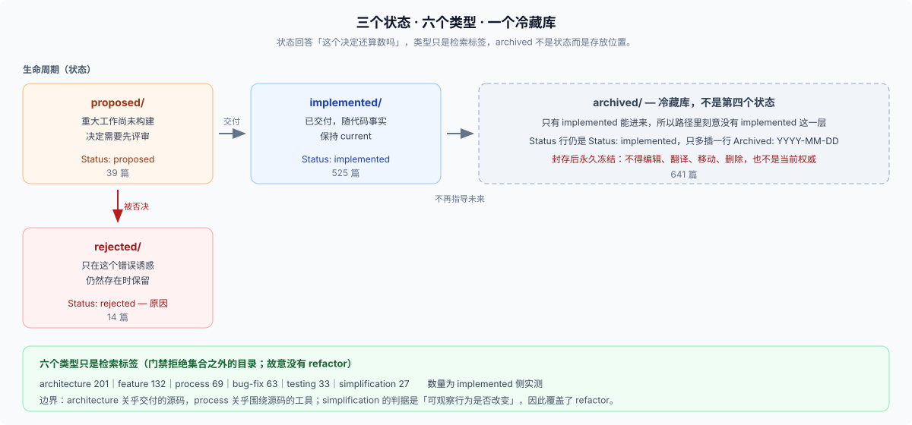

# 04 · 背后的思考：为什么是这套制度

**想明白为什么这么做时读这一页。** 制度在防什么失败，以及为什么值得。

## 一句话：它在防「同一个坑踩两次」

整套制度只服务一个目的：

> **一个已经被讨论过、被否决过、或者被慎重选择过的决定，不应该在半年后被重新提出一遍。**

没有 Note 的世界里，这个失败有四种形态：

| 失败形态 | 具体长什么样 | 制度里对应哪一件 |
|---|---|---|
| **重新开讼** | 新人提出一个明显净赚的改动，不知道半年前已经被否过 | `## Alternatives considered` 强制 + `rejected/` |
| **合理化倒推** | 只看到代码「现在这样」，猜出错误的理由，然后按猜的理由改 | `## Decision` 记录真实理由与代价 |
| **幽灵约束** | 一段没人敢动的代码，因为没人知道它在防什么 | `## Problem` 不看解决方案也能懂 |
| **考古负担** | 想知道为什么，得翻 git log、PR、issue、几个人的记忆 | `.agents/notes/` 有唯一 owner |

四种里最贵的是第一种，因为它会**重复消耗**：每一次重新提出，都要重新走一遍当初的论证。

## 两个约束决定了全部形态

Note 的格式不是美学选择，是这两个约束推出来的：

### 约束一：主要读者是 agent，不是人

`.agents/notes/AGENTS.md` 开头就写明身份：

> Agent Notes are effectively RFCs written by agents: durable proposals and decision records that preserve rationale, alternatives, consequences, and required verification.

读者是 agent 这件事有个直接后果：**散文约定不可靠，机械可检查的结构才可靠。** 这不是猜测，是同仓库一条已交付决定里的实测结论：

> Agents follow enforced gates far more reliably than prose conventions, and "a lot of work" is not a cost argument when agents do the labor.

（出处：[`implemented/process/2026-06-11-quality-gates.md`](../../.agents/notes/implemented/process/2026-06-11-quality-gates.md)）

于是整套制度被**切成两半**：

| 判断性质 | 归属 | 例子 |
|---|---|---|
| 机械可检查 | **门禁**，会以非零退出码失败 | 头部格式、必需章节、类型目录名、禁用标题 |
| 需要判断 | **skill 与 code review** | 保留还是删除、备选方案写得真不真、风险折没折进后果 |

这就是为什么你找不到一个「怎么写 Agent Note」的 skill：**能机械化的部分被门禁接管了**，剩下的部分才需要人和 agent 的判断。三层分工见 [07](./07-where-skills-add-requirements.md)。

### 约束二：语料会长期增长

一千多篇之后（当前活跃 578、归档 641），两个问题必然出现：**找不到**，和**信噪比恶化**。这解释了为什么要有封闭的类型集合、要有归档、要有删除——它们都是检索问题，不是官僚问题。

## 为什么状态是三个而不是两个

「已交付」和「没交付」两个状态看起来就够了。第三个——`rejected/`——存在的唯一理由是**防止重新开讼**：

> Keep a rejected note only while it prevents a plausible mistake; otherwise delete its complete triplet.

被否决的提案值得留档，当且仅当**它落选的那个诱惑仍然存在**。真实例子：

[`rejected/simplification/2026-07-26-builtin-timer-promises-for-hand-rolled-sleeps.md`](../../.agents/notes/rejected/simplification/2026-07-26-builtin-timer-promises-for-hand-rolled-sleeps.md) 记录的是「用手写的、可取消的 `setTimeout` 包装，换掉 `node:timers/promises` 内置版本」。这个提案**看起来明显是净赚**——删掉大约 10 行手写代码，换上标准库。它输掉的理由只有一句话能说清：

> vitest's fake clock does not intercept `node:timers/promises`, so the swap costs deterministic fast tests for ~10 deleted lines

没有这篇 Note，下一个做清理的人会**再一次**提出这个改动，并且再一次花时间发现同一件事。这就是「防止一种合理的错误」。

反过来，一旦那个诱惑消失了，Note 就该删：

> delete streaming workflow progress through tool calls — 972 words: its ACP/UI premise is obsolete

972 词也照样删——**篇幅不是判据**。

> 关键区别：被否决的提案**永远不归档**。归档是给已交付决定用的；过时的提案要么转 `rejected/`，要么删掉。

## 为什么有六个类型

六个类型是**封闭集合**——[`scripts/agent-note-tree.ts`](../../scripts/agent-note-tree.ts) 拒绝任何不在这份名单里的目录，该错误随 `verify-agent-note-classification` 与格式门禁一起失败。它们的职责只有一个：**把检索范围从一千篇缩到几十篇**。

| 类型 | 覆盖范围 | implemented 侧数量 |
|---|---|---|
| `architecture` | 关于**交付源码**的结构性决策：包之间怎么关联、运行时词汇是什么 | 201 |
| `feature` | 面向用户或模型的新能力 | 132 |
| `process` | 代码**周边**的工具、政策或工作流——门禁、包管理器、vendoring | 69 |
| `bug-fix` | 修正缺陷，或弥补事故复盘暴露出来的缺口 | 63 |
| `testing` | 测试基础设施与策略 | 33 |
| `simplification` | 不增加能力的前提下，移除代码、行为或对外范围 | 27 |

最容易被追问的两条线：

- **`architecture` / `process` 的分界**：architecture 关乎我们交付的源码；process 关乎围绕源码的工具与工作流。
- **没有 `refactor`**：它和 `simplification` 重叠，而后者的判别标准「可观察行为是否改变」已经覆盖了它。**故意少一个类型，比多一个模糊的类型好。**

### 这六个类型是从哪来的

它们不是一开始就设计好的，而是**从旧的目录名快照下来的**。2026-08-11 的提交 `a767cd357f`（PR #2280，"docs: propose repository naming contract and rename ledger"）把当时的 Note 树**整体搬进了类型子目录**——同一次改动里，旧的顶层分区变成 `feature/`、`bug-fix/`、`simplification/`、`architecture/`、`process/`、`testing/`，并把这份名单写进了门禁和 README。

这解释了一个新人常见困惑：有些 Note 的类型看起来可以两说。分类从既有目录快照而来，边界案例是预期的。分类的作用是**缩小检索范围**。怎么选见 [03](./03-note-triplets-on-disk.md)；真的两可就选一个。新增类型要同时改门禁名单和 README，是一次刻意行为。

## 为什么禁用集中索引

有一条例外值得单独讲，因为它最能说明「读者是 agent」这个约束：

> structure: INDEX.md — centralized Agent Note indexes are forbidden; browse the lifecycle/class tree or search the repository

集中索引对人是便利，对 agent 是**陷阱**：它会漂移、会过期，而且一旦存在，读者就会相信它。目录名和检索是**自描述且不会过期**的——路径本身就是索引。这也是本组 FAQ 只在 [`answer.md`](./answer.md) 维护一份导航表的原因。

## `archived/` 为什么不算第四个状态

因为它**不是 Note 的状态，是它的存放位置**：

- 归档件的 `Status:` 行仍然是 `implemented`，只是在下面多插一行 `Archived: YYYY-MM-DD`；
- 只有 implemented 能进去——所以归档路径 `archived/{类型}/…` 里**刻意没有 `implemented` 这一层**；
- 进去以后**永久冻结**：不得编辑、翻译、重新格式化、更新、移动或删除，也不得当作当前行为的权威依据。

```text
.agents/notes/implemented/architecture/2026-…-….md   ← 活的：路径/名称变了要跟着改
.agents/notes/archived/architecture/2026-…-….md      ← 死的：封存时的快照，永不改动
```

规模说明它为什么必要：**归档 641 篇，活跃（`proposed` 39 + `implemented` 525 + `rejected` 14）578 篇**（2026-10-08 实测；本组 FAQ 只在本文与 [answer](./answer.md) 两处报数）。没有冷藏库，活跃树的信噪比会持续恶化。

## 三个状态、六个类型、一个冷藏库——合起来就是这张图



*这三个状态、六个类型由谁来判、谁来执行，见 [07](./07-where-skills-add-requirements.md) 的图。*

两条冻结规则：**`archived/` 里的东西永远不出来**；`rejected/` 一旦落定就不再移动——git 历史里 20 处相关改名全部是 `proposed/` → `rejected/`，没有一处反向。想重新提，就新写一篇 Note，并链接到那篇被否决的历史。

## 证据入口

- [`.agents/notes/AGENTS.md`](../../.agents/notes/AGENTS.md)：Note 的身份（agent 写的 RFC）与 supersession 检查要求。
- [`implemented/process/2026-06-11-quality-gates.md`](../../.agents/notes/implemented/process/2026-06-11-quality-gates.md)：「机械门禁优于散文约定」的实测结论。
- [`scripts/agent-note-tree.ts`](../../scripts/agent-note-tree.ts)：状态与类型的封闭集合、允许清单、`INDEX.md` 禁令；由两个门禁共同调用的共享模块。
- [`.agents/notes/README.md` 的 "Classification"](../../.agents/notes/README.md)：六个类型的定义与 architecture/process 分界。
- 提交 `a767cd357f`（2026-08-11）：把旧目录整体搬进类型子目录、确立这份名单的那次改动。
- [`dsh-archive-agent-notes`](../../.agents/skills/dsh-archive-agent-notes/SKILL.md)：保留 / 归档 / 删除的判定与校准例子（含字数作为反证的那几个案例）。

---

*基线：工作树 `caf78ed639`，2026-10-08 实测。*
