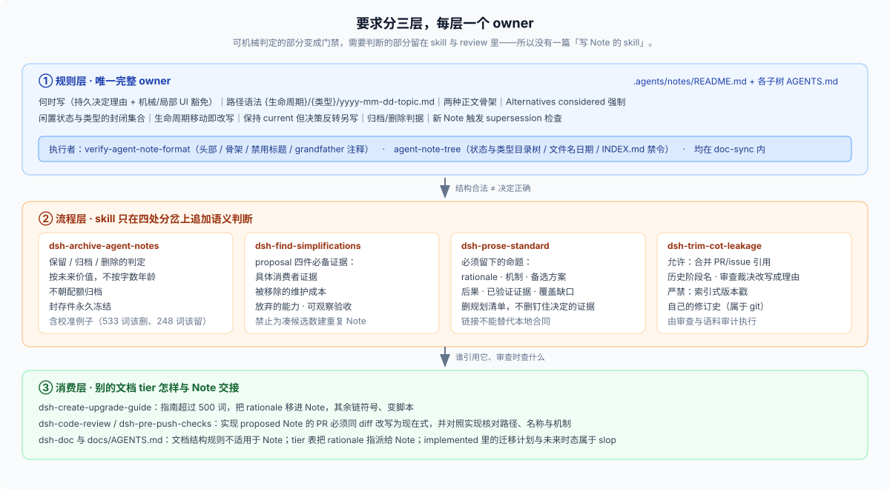

# 07 · 这些要求写在哪：完整溯源表

**需要核对原文时查这一页。** 每条要求的 owner 文件与行号。

## 结论

要求分三层，**每一层都有唯一的 owner**：

| 层 | 位置 | 拥有什么 | 谁执行 |
|---|---|---|---|
| 规则层 | [`.agents/notes/README.md`](../../.agents/notes/README.md) + 各子树 `AGENTS.md` | 何时写、路径语法、生命周期、正文骨架、Alternatives 强制、归档删除判据、移动改写 | `verify-agent-note-format` + `agent-note-tree`（`doc-sync` 内） |
| 流程层 | `dsh-archive-agent-notes`、`dsh-find-simplifications`、`dsh-prose-standard`、`dsh-trim-cot-leakage` | 语义判断：结构合法 ≠ 决定正确 | 人 / agent 的语义 review |
| 消费层 | `dsh-doc`、`dsh-code-review`、`dsh-pre-push-checks`、`dsh-create-upgrade-guide`、`docs/AGENTS.md` | 其他文档 tier 怎么引用 Note、review 查什么、rationale 溢出时倒在哪里 | review 与文档门禁 |

**`.agents/skills/` 里没有一份「写 Agent Note」的 skill，这是分工不是遗漏**：可机械判定的部分已经变成 gate，不需要 skill；需要判断的部分才留在 skill 与 review 里。这正是 [`quality-gates` Note](../../.agents/notes/implemented/process/2026-06-11-quality-gates.md) 记录的仓库立场。

## 流程层追加的四组要求

### 1. `dsh-archive-agent-notes` —— 保留、归档、删除的判定

唯一一篇真正关于 Note 的 skill。它追加的是**判据的语义部分**：按未来价值判断、字数与年龄只是发现手段、不朝配额归档、封存件永久冻结，并给出校准例子。详见 [05](./05-keep-archive-delete.md)。

它自己的一句话最准确：**「Word count and age are discovery aids, never archive criteria.」**

### 2. `dsh-find-simplifications` —— proposal 的四件必备证据

> A substantial proposal uses the mandatory note skeleton: `Problem`, `Proposal`, `Alternatives considered`, `Acceptance criteria`, and `Risks`. Include concrete consumer evidence, the removed maintenance cost, the capability given up, and observable acceptance conditions.

一项删除类提案必须回答四件事：**具体消费者证据、被移除的维护成本、放弃的能力、可观察的验收条件。**

同一处还有一条防重复的规则：**不要为了保留候选数量而创建重复 Note**——决定相同就更新既有 owner。

### 3. `dsh-prose-standard` —— 哪些命题必须留下

> **Agent Notes:** retain unique rationale, mechanisms, alternatives, consequences, shipped verification evidence, and named coverage gaps. Implemented Agent Notes state shipped reality in the present tense; remove planning checklists, not evidence of what pins the decision.

删的是规划清单，留的是「什么钉住了这个决定」的证据；同时要求**链接不能替代本地合同**（调用方需要的本地行为留在原地，rationale 才链接出去）。对照表见 [02](./02-what-goes-in-the-file.md)。

### 4. `dsh-trim-cot-leakage` —— 允许什么、严禁什么

**允许**：合并过的 PR 与 issue 引用在 Agent Note 与 postmortem 里是受认可的变更证据（其他 tier 不允许）；Note 的 change-story 章节可以使用历史阶段名（"the first cut shipped X"）；Alternatives-considered 是 Review 裁决的**受认可归宿**（去掉 reviewer 与轮次，保留理由）。

**严禁**：索引式版本戳（"this cut" / "v1" / "today"）在任何地方都禁用；Note 自身的修订史属于 git（"As of v5 of this note…" → "The loader validates manifests."）。

## 消费层：其他 skill 只在两处提到 Note

- `dsh-create-upgrade-guide`：升级指南超过 500 词时，多出来的文字不属于指南——链源码符号、**把 rationale 移进 Agent Note**、把重复机械步骤变成脚本（[`SKILL.md:44`](../../.agents/skills/dsh-create-upgrade-guide/SKILL.md)）。
- `dsh-code-review`：reviewer 必须验证 "Implemented Agent Notes match shipped reality"——实现了 proposed Note 的 PR 要在同一 diff 移动并改写为现在式，然后对照实现核对路径、名称与机制（[`SKILL.md:47`](../../.agents/skills/dsh-code-review/SKILL.md)）。
- `dsh-pre-push-checks`：只负责为 Note 相关改动挑最小证据集。
- `dsh-doc`：审计语料时读 Note 规则作为 owner；**作者顺序不适用于 Agent Note**——它们保留仓库定义的骨架；implemented 里的迁移计划与未来时态属于 slop 清单。

## 边界：`docs/AGENTS.md` 的三处提及

| 行 | 内容 |
|---|---|
| [`:7`](../../docs/AGENTS.md) | 文档结构规则**不适用**于 Agent Note（其他文档 tier 在适用范围内） |
| [`:40`](../../docs/AGENTS.md) | 写作规则一节仍要求「应用 Agent Note 创建标准」，机械/局部编辑豁免 |
| [`:72`](../../docs/AGENTS.md) | slop 清单点名 implemented Note 里的 spec-speak：`should`、迁移计划、验收清单 |

同时它的 tier 表把 rationale 明确指派给 Note（[`:25`](../../docs/AGENTS.md)），并要求文档里溢出的理由倒进 Note。

## 逐文件溯源表

| 文件 | 作用 | 层级 |
|---|---|---|
| [`.agents/notes/README.md`](../../.agents/notes/README.md) | 唯一完整规则：布局命名、分类、归档删除、创建门槛、文件格式、Alternatives 强制、生命周期移动、中文对侧 | 规则 |
| [`.agents/notes/AGENTS.md`](../../.agents/notes/AGENTS.md) | 子树常设指令：每篇新 Note 触发 supersession 检查，完整取代的 triplet 同 PR 归档 | 规则 |
| [`implemented/AGENTS.md`](../../.agents/notes/implemented/AGENTS.md) | 事实保持 current；不得重写决策；低未来价值时归档而非继续维护 | 规则 |
| [`archived/AGENTS.md`](../../.agents/notes/archived/AGENTS.md) | 封存件冻结；归档变更的允许动作清单；唯一授权的 seal 例外 | 规则 |
| [`scripts/verify-agent-note-format.ts`](../../scripts/verify-agent-note-format.ts) | 头部、骨架、禁用标题、Alternatives、grandfather 注释、遗留标记 | 门禁 |
| [`scripts/agent-note-tree.ts`](../../scripts/agent-note-tree.ts) | 封闭状态与类型目录树、文件名日期、`INDEX.md` 禁令 | 门禁 |
| [`dsh-archive-agent-notes`](../../.agents/skills/dsh-archive-agent-notes/SKILL.md) | 保留 / 归档 / 删除判定与校准例子；三件套与 manifest 机械步骤 | 流程 |
| [`dsh-find-simplifications`](../../.agents/skills/dsh-find-simplifications/SKILL.md) | proposal 骨架与四件必备证据；禁止重复 Note | 流程 |
| [`dsh-prose-standard`](../../.agents/skills/dsh-prose-standard/SKILL.md) | 必须保留的命题；规划清单 vs 验证证据；链接不替代本地合同 | 流程 |
| [`dsh-trim-cot-leakage`](../../.agents/skills/dsh-trim-cot-leakage/SKILL.md) | 允许的引用与历史阶段名；禁用的版本戳与修订史 | 流程 |
| [`dsh-doc`](../../.agents/skills/dsh-doc/SKILL.md) | Note 豁免作者顺序；implemented 的 slop 清单；语料审计读 owner | 消费 |
| [`dsh-code-review`](../../.agents/skills/dsh-code-review/SKILL.md)、[`dsh-pre-push-checks`](../../.agents/skills/dsh-pre-push-checks/SKILL.md) | review 检查 proposed Note 是否同 diff 改写；证据选择 | 消费 |
| [`dsh-create-upgrade-guide`](../../.agents/skills/dsh-create-upgrade-guide/SKILL.md) | 指南 rationale 溢出时移进 Note | 消费 |
| [`docs/AGENTS.md`](../../docs/AGENTS.md) | 结构规则不适用于 Note；tier 表（rationale → Note）；创建标准必须应用；spec-speak 反模式 | 边界 |

## 证据入口

- [`_faq_on_digested/19_dsh-native-development-process`](../19_dsh-native-development-process/answer.md)：一次变更里各层载体如何落位。
- [`_dsh_plugin_agent_ready_development/repo-harness/03-skills-as-procedural-memory.md`](../../_dsh_plugin_agent_ready_development/repo-harness/03-skills-as-procedural-memory.md)：Skill 为什么适合承载情境化流程、又为什么不能替代 gate。
