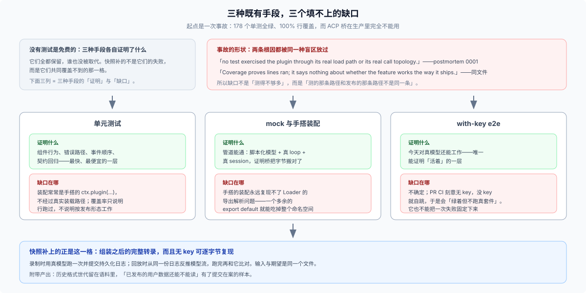

# 01 · 主仓为什么需要它：一个 178 个单测全绿、生产完全不能用的插件

## 一句话

因为**「组装后的完整转录」是一种没有替代品的证据形态**：单测证明组件行为、e2e 证明现在对真模型还能跑，但只有录制回放能固化「模型实际收到了什么、又落了什么盘」，并且让它在没有 API key 的 CI 里逐字节可复现。主仓把它定为强制条件，是因为它买到的东西别处买不到——不是因为它喜欢多一层测试。

## 起点是一次事故，不是一次设计

`dsh --profile acp` 的生产事故是本层的直接起因（[postmortem 0001](../../docs/postmortem/0001-acp-default-export-drops-inject.md)；它的教训被[快照层决策](../../.agents/notes/implemented/testing/2026-06-19-acp-snapshot-tests.md):9 直接引用）：

> The bridge was completely non-functional in production despite 178 green unit tests and 100% line coverage. — 同文件:13

两个独立 bug 藏在同一个报错串后面，而测试套件漏掉两者的原因是同一个：

> **no test exercised the plugin through its real load path or its real call topology.** — 同文件:91

覆盖率在这里不但没报警，反而是误导：

> Coverage proves lines *ran*; it says nothing about whether the feature works *the way it ships*. — 同文件:98

事故之后写下的问题陈述，把这一层要填的缺口讲得很清楚（[2026-06-19 快照层决策](../../.agents/notes/implemented/testing/2026-06-19-acp-snapshot-tests.md)）：

> Unit tests do not exercise the complete assembled-agent subprocess or its ACP automation wire, while real-API tests are nondeterministic and key-gated. — 同文件:9

> The tier needs the fidelity of a real run with the determinism of a fixture. — 同文件:11

**「真运行的保真度 + 夹具的确定性」**——这一句就是整层的设计目标。

## 为什么不能用当时已有的手段凑出来

这不是「没想到」的问题：几个显而易见的方案都被逐个否决过，理由都记录在案。

| 被考虑的方案 | 否决理由 | 出处 |
|---|---|---|
| 手写一份 `llm.json` 模型分片 | 复用真实会话日志让夹具成为**系统的真实产物**而不是手搭 mock，并且顺带当作行为期望值 | [2026-06-19 快照层决策](../../.agents/notes/implemented/testing/2026-06-19-acp-snapshot-tests.md):76 |
| HTTP 字节级录放（Polly / nock / MSW） | adapter 相关、对 SSE 流式很别扭、比被测对象低一层 | 同文件:78 |
| 从 `turn/end` 的事件里合成 throw / cancel | 会把 `llm-replay` 耦合到 loop 内部的收尾语义上；而且 `turn/end` 的 reason 是**有损的**（分不清「抛出的 401」和「finish-error」） | 同文件:79 |
| 每个场景再存一份 `session.expected.jsonl` | 对普通录制场景，两份规范化日志完全相同——重复的 oracle 不增加独立性 | [归档决策](../../.agents/notes/archived/testing/2026-06-20-remove-redundant-snapshot-log-expected-output.md):10 |
| 每个 header 类都复制两份 sidecar | 会在无关的类之间反复制造字节相同的文件 | [2026-06-19 快照层决策](../../.agents/notes/implemented/testing/2026-06-19-acp-snapshot-tests.md):80 |
| live 配置与 snapshot 配置各维护一份 | 125 行近乎复制，且会静默漂移；改成 overlay patch | [归档决策](../../.agents/notes/archived/testing/2026-07-04-single-source-acp-replay-config.md):10,22 |
| 把 session log 本身瘦身（用 hash 代替 header） | 违反可重建性约定 | [归档决策](../../.agents/notes/archived/testing/2026-07-06-pin-request-header-content-in-one-scenario.md):28 |
| 浏览器侧拦截 SSE（`route.fulfill`） | 无法流式 | [Web 快照车道决策](../../.agents/notes/implemented/testing/2026-07-24-web-gui-browser-e2e-lane.md):63 |
| 在 `DEEPSEEK_BASE_URL` 挂一个 mock HTTP provider | 会造出第二套夹具格式（手写 OpenAI SSE 字节脚本），并且会漂移 | 同文件:65 |

注意最后两条：**连「在浏览器里拦网络」和「挂个假 provider」都被否决了**，理由不是做不到，而是会引入第二套夹具格式与第二处需要维护的真相。

## 定下来的形状：一份文件，两个用途

最后确定的设计是（[2026-06-19 快照层决策](../../.agents/notes/implemented/testing/2026-06-19-acp-snapshot-tests.md):21）：

> One ordinary Session generation therefore serves as both replay source and behavioral expected output.

也就是：**真跑一次 → 把持久化的会话日志提交进仓 → 以后无 key 回放它**。回放时模型流不是另写的，而是从这个日志里**推导**出来的（`deriveReplayScript()` 把每个 `assistant/message` / `assistant/attempt` 的流展开成一次按位置的模型调用）；跑完之后的持久化结果又和这份日志比对。输入与期望是同一个文件，所以不存在「输入漂了期望没漂」的经典问题。

夹具存的是**投影**而不是字节录像：header 与事件 payload 全保留，顶层 `seq` / `time` 包络省略、回放时合成（[归档决策](../../.agents/notes/archived/testing/2026-08-18-session-snapshot-envelope-projection.md):10,18）。理由是本地插一个事件会让后面一大段的序号和时间全部重编号，产生大量与语义无关的 diff；而省略**运行时**持久化的包络则被否决（同文件:22）。

这条设计有个必须记住的代价，设计者自己写下来了：

> One recorded session serving as both replay input and expected output can reproduce a bad model script consistently. — [2026-08-24 语料决策](../../.agents/notes/implemented/testing/2026-08-24-session-log-snapshot-corpus.md):78

**同一个文件两用，会把「坏的模型脚本」一致地复现出来**——所以它必须与独立的世界状态断言、协议/UI 期望、真实模型录制配合，不能当唯一 oracle。这一点在后面几篇（尤其 [06](./06-bug-reproduction-playbook.md)）会再出现一次，因为插件仓自建夹具时同样继承这个性质。

## 它与「model-visible ⟺ logged」是同一条不变量

根 `AGENTS.md:138` 的规则是：

> **Model-visible ⟺ logged**: anything that reaches a model request must be reconstructable from the session log; a new model-visible input requires a session event.

完整表述在[可重建请求决策](../../.agents/notes/implemented/architecture/2026-07-05-reconstructable-requests.md):17：拿着日志、它引用的附件对象和钉住的代码版本，可以**逐字节**重建 loop 的每一次请求。

快照层是唯一端到端检验这条不变量的层。Web 车道的决策笔记直接点明了这层关系（[2026-07-24 Web 快照车道](../../.agents/notes/implemented/testing/2026-07-24-web-gui-browser-e2e-lane.md):59）：

> the session-log-as-fixture design goes one step beyond prior art along the axis this repo's model-visible ⟺ logged invariant makes natural.

反过来，header pin（把 `system-prompt.expected.md` 与 `tool-schemas.expected.json` 作为 sidecar 单独提交）存在的意义就是证明**发出去的到底是什么**：只有真夹具能钉住组装后的完整集合（[归档决策](../../.agents/notes/archived/testing/2026-07-06-pin-request-header-content-in-one-scenario.md):26），把 header 体积藏起来被否决正是因为违反可重建性（同文件:28）。

**实用推论：如果一个改动动了请求头，而没有任何夹具发生变化，那么要么这个改动对模型不可见，要么这条不变量破了。** 被人工审阅过的 sidecar diff 就是这个陷阱的报警器。

## 四个零件各管什么

| 零件 | 管什么 | 规则出处 |
|---|---|---|
| `snapshot.yml` | 封闭清单，只记「完成的 Session 重建不出来的事实」：profile、composition/header class、录制策略、平台、replay 例外、workspace 事实 | `docs/testing.md:14`；封闭 schema 在 `packages/test-support/session-snapshot/src/manifest.ts:201` |
| `workspace.expected/` | 独立的世界 oracle：会改工作区的场景提交完整终态树，**record 与 refresh 永不改写它** | `snapshots/AGENTS.md:15` |
| sidecar（prompt / schema） | 每个 header 类恰好一个可读 owner，避免几十条巨型单行 JSON 被反复重写 | [2026-07-06 归档决策](../../.agents/notes/archived/testing/2026-07-06-pin-request-header-content-in-one-scenario.md):10,14,16 |
| typed token | 保留关系的脱敏：`{{session:1}}`、`{{message:1}}`、`{{cwd}}`、`{{system}}`、`{{tools}}` | `snapshots/AGENTS.md:11` |

一条容易被忽略但很关键的纪律：**「Never redact arbitrary user or tool text merely because it resembles an identifier.」**（同处）——脱敏是为了消除内存地址级的噪声，不是为了方便。

## 没有它，哪些东西会失去唯一的守门人

1. **任何无 key 的组装转录信号都没有了。** PR CI 是刻意无 key、可 fork 的；`test:e2e` 没 key 就自跳，于是会「绿着但不跑真套件」（[real-API e2e 决策](../../.agents/notes/implemented/testing/2026-06-19-real-api-e2e-ci.md):11）。
2. **不确定性回到测试里。** 录制流是拿到「真运行保真度 + 确定性」的唯一办法；回放是按位置绑定的，且**一个场景只允许一条在飞的模型流**。
3. **持久化格式的回归失去样本。** 语料里保留着历史世代的会话，它们必须仍然能被当前读取器**恢复**（[released-format migration 决策](../../.agents/notes/implemented/architecture/2026-08-31-released-session-format-migrations.md):84 要求未列入拒绝清单的工件必须还原成功，并在还原成功后校验源字节未变）。
4. **模型实际收到什么，没有第二处能钉住。** 见上一节。
5. **成本回到每次运行。** 录制花真 API 配额——这正是 record / refresh 严格串行的原因（`vitest.snapshot.config.ts:63`）；另外只有 record 模式会读 `.env`（同文件`:33`），CI 强制只读回放（`docs/testing.md:15`）。
6. **重演事故 0001 那一类。**「包测试全绿、发布出去的产品是坏的」正是本层存在的理由；`docs/testing.md:55` 明确写了 package / e2e / mock-only / rationale 证据**都不能替代**组装转录。

## 规模（本工作树实测）

| 面 | 场景数 | 文件数 | 拥有的证据 |
|---|---|---|---|
| `snapshots/session/` | 122 | 739 | headless 一次性行为 |
| `snapshots/web/` | 55 | 302 | 同一 Session 旁的浏览器/ARIA 证据 |
| `snapshots/sdk/` | 24 | 171 | 持久控制（TypeScript SDK 投影） |
| `snapshots/acp/` | 9 | 58 | 自动化协议行为 |
| **合计** | **210** | **1271**（= 上面四行之和 1270 + 树根的 `snapshots/AGENTS.md`；另有 7 个符号链接：5 个跨 profile 的 prompt/schema 别名 + 2 个场景内的 `workspace/AGENTS.md`） | |

其中 444 个 `.jsonl`、32 份 `replay.override*.json`、56 份 `system-prompt.expected.md`、55 份 `tool-schemas.expected.json`。

## 这一篇要你记住的

- 主仓需要它，是为了买到**组装转录**这一种证据，而不是为了多跑一层测试。
- 它成立的前提是「真跑一次、提交日志、无 key 回放」——**夹具是产品的真实产物**，这是它区别于 mock 的根本。
- 它自己承认的残余风险是「一份文件两用会一致地复现坏脚本」，所以永远需要独立的世界 / 协议 / UI 断言作伴。
- 以上都是**主仓为什么需要**。这篇没有回答「插件仓需不需要」——那要先把「一份 `session.jsonl` 到底是什么」看清楚，见 [02](./02-what-a-trajectory-is.md)。
