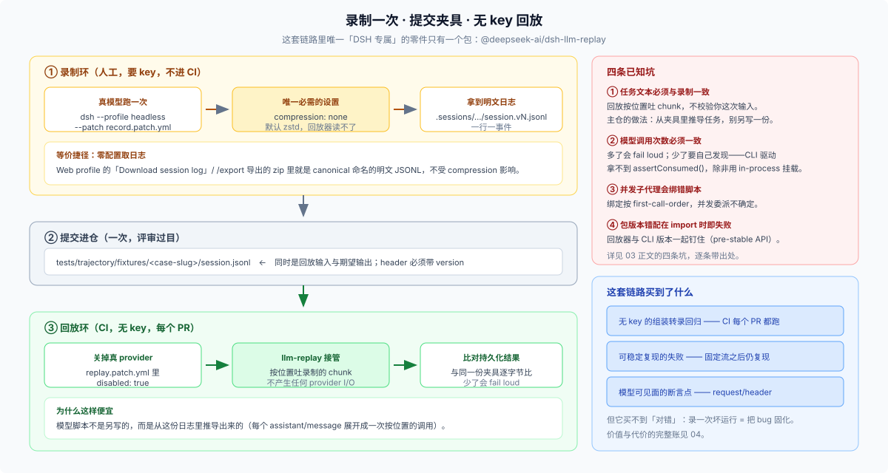

# 03 · 插件仓能不能用：三条硬证据与最小可用设置



## 一句话结论

**「插件仓完全不需要这个东西」是错的。** 错在把两件事当成了一个：

| | 顶层 `snapshots/` 语料 | 录制回放**机制** |
|---|---|---|
| 是什么 | 主仓集中维护的 210 个场景 + 语料治理规则 | 一个已发布的 npm 插件：读会话日志、按位置回放模型流 |
| 归属 | DSH 主仓所有，外部仓无法贡献 | **任何人可装、可挂、可自带夹具** |
| 插件仓 | 搬不走，也不该搬（见 [04](./04-what-its-worth.md)） | **能用**，价值与代价见 [04](./04-what-its-worth.md) |

所以正确的说法是：**插件仓不该复刻主仓的语料治理，但完全可以用同一套回放机制，做一份属于自己的小 trajectory 语料。**

## 三条硬证据

### 证据一：回放器是发布在 npm 上的普通插件

```text
@deepseek-ai/dsh-llm-replay   latest: 0.0.1-rc.1   next: 0.2.0-rc.2
```

`next` 通道就是本基线 `dsh-v0.2.0-rc.2`。同族的 `@deepseek-ai/dsh-session-snapshot` 同样发布（`next: 0.2.0-rc.2`），但它 `import vitest`，只能在 vitest run 内使用——**插件仓真正需要的是前者**。

### 证据二：它是最普通的 function 插件形态

```ts
export const name = 'llm-replay'
export const inject = ['llm']
export interface Config { … }
export function apply(ctx: Context, config: Config = {}): void
```

具名导出、无 default export、声明 `inject: ['llm']`——**和任何一个插件挂载方式完全相同**（`packages/test-support/llm-replay/src/index.ts:1125`、`:1126`、`:1192`）。它进 `cordis.yml` 就是一行 `name: '@deepseek-ai/dsh-llm-replay'`。

### 证据三：它接受**未经投影的原始运行日志**

这是最关键的一条。夹具每一行要么都带持久化包络（`seq` / `time`），要么都不带——**不允许混用**（`packages/test-support/llm-replay/src/index.ts:200`、`:259`）：

```ts
const currentKind = hasSeq ? 'complete' : 'projected'
if (bodyKind !== undefined && currentKind !== bodyKind) {
  throw new Error(`session snapshot line ${lineNumber} cannot mix projected and complete body rows`)
}
```

主仓提交的夹具是 **projected**（省略包络，为了 diff 干净）；但你直接拿一份真实的 **complete** 日志，回放器照样接受。**换句话说：录制这一步不需要任何 DSH 内部工具——它就是「真跑一次，把日志文件留下」。**

不过「留下日志」有三个具体前提，都不是默认满足的：

1. **从持久化 root 直接取文件时，必须关掉压缩。** 会话日志**默认是 Zstandard 压缩的**（`packages/session/session-persistence-jsonl/README.md:48`：`compression` 默认 `'zstd'`），而回放器只会 `readFileSync` 后按 JSON 逐行解析（`packages/test-support/llm-replay/src/index.ts:773`）——**它读不了 `.zstd`**。所以这条路要配 `compression: 'none'`。另外「一个 root 只属于一种编码」，混放会被启动发现拒绝（同 README:104）。走 `/export` 那条路则不受这个设置影响。
2. **header 必须带显式的 `version`。** 无版本号的 header 会被拒（回放器要求非负整数版本）。
3. **夹具比运行时新是不行的。** 迁移是**向前**的：旧版本夹具能在新运行时里被就地升级后回放；反过来读不了。

第二条和第三条合起来说明一件事：**夹具是一个有版本的持久化资产**，不是随手一存的文件。但它比主仓宽松得多——你不需要 manifest、不需要 token 化、不需要世代目录。

## 最小可用设置

一个插件仓要跑通「录一次、无 key 重放」，只需要四样东西（目录形状与 [05](./05-plugin-repo-organization.md) 的推荐一致）：

```text
your-plugin-repo/
├── cordis.yml                                   # 你平时开发就有的配置：挂载你的插件
└── tests/trajectory/
    ├── record.patch.yml                         # 录制层：把日志写成不压缩的明文（全局一份）
    ├── replay.patch.yml                         # 回放层：关掉真 provider，改挂 llm-replay（全局一份）
    ├── README.md                                # 这套轨迹是什么、怎么录、怎么断言
    └── fixtures/<case-slug>/session.jsonl       # 一条轨迹一个目录（未投影的也可以）
```

**装一次回放器**（用 CLI 自带的插件管理，不手改 `node_modules`）：

```sh
dsh plugin --profile headless add @deepseek-ai/dsh-llm-replay@next
```

（`dsh plugin` 子命令把参数转发给 profile 目录里的 pnpm；见 `apps/cli/src/args.ts:188`，用法示例见同文件帮助文本里的 `dsh plugin --profile tui add <package>`。`next` 是发布通道名，见上文。）

**录制层** `record.patch.yml`——只做一件事：把持久化改成明文（照 `snapshots/acp/escalation-approved/cordis.yml` 的写法）：

```yaml
- id: session-persistence-jsonl
  name: '@deepseek-ai/dsh-session-persistence-jsonl'
  config:
    root: ./.sessions
    compression: none
```

```sh
dsh --profile headless --patch ./tests/trajectory/record.patch.yml "<任务文本>"
# 录完把 ./.sessions/<project>/<id>/session.vN.jsonl
# 拷成 tests/trajectory/fixtures/<case-slug>/session.jsonl
```

注意 overlay 的 `config:` 是**整个替换**而不是深合并（include 的补丁语义），所以录制层要把该插件需要的 config 键写全；今天 `session-persistence-jsonl` 的基础配置只有 `root` 一个键，将来若新增键，这一层也要跟着补。

**不想改配置的话，还有一条零配置的取日志路径**：Web profile 的会话头菜单「Download session log」或 `/export` 命令会导出一个 zip，里面是每个会话的 canonical 命名 JSONL（外加 `subagents/<id>/…`）。导出走的是持久化层读取后重新序列化（`readSessionLogText` → `serializeSessionLog`，`packages/session-query/session-log-export/src/archive.ts:148`），**所以拿到的一定是明文，不受 `compression` 设置影响**。

**回放层** `replay.patch.yml`（照主仓 `cordis.snapshot.yml` 的写法，例如 `snapshots/session/compaction-recovery/cordis.snapshot.yml`）：

```yaml
# 1) 关掉真实 provider，让回放适配器接管 llm/stream
- id: llm-deepseek
  name: '@deepseek-ai/dsh-llm-deepseek-api-key'
  disabled: true

# 2) 把回放器指到本仓的夹具
- insert:
    - id: llm-replay
      name: '@deepseek-ai/dsh-llm-replay'
      config:
        file: ./tests/trajectory/fixtures/<case-slug>/session.jsonl
```

跑起来：

```sh
dsh --profile headless --patch ./tests/trajectory/replay.patch.yml "<与录制时相同的任务文本>"
```

注意 `--patch` 是「在 profile 层之后叠加」（`apps/cli/src/args.ts:170`），所以它不改变你的日常配置，只在测试时叠一层。`file` 走的是普通 `readFileSync`（`packages/test-support/llm-replay/src/index.ts:773`），所以**相对路径按进程 cwd 解析**——从仓库根启动，或直接给绝对路径。

**四个已知坑，先说清楚**：

1. **任务文本必须和录制时一致。** 回放器是按位置吐 chunk 的，它不会去校验你这次输入的用户消息是否和录制一致。主仓的对策是**从夹具里推导任务**（`snapshots/AGENTS.md:7`：「derive the user task and replay script from that selected JSONL; do not duplicate them in an `input.json`」）。插件仓应照做：让驱动脚本从 `session.jsonl` 里读出那条 `user/message`，而不是在旁边再写一份。
2. **模型调用次数必须与录制一致。** 少了要能被发现，多了会 fail loud。CLI 驱动的方式拿不到 in-process 的 `assertConsumed()`（它只从 `installLlmReplay` 暴露，`packages/test-support/llm-replay/src/index.ts:1107`），所以插件仓要么用 in-process 挂载并在 teardown 断言，要么自己在测试里数一次模型调用。
3. **并发子代理会绑错脚本。** 一个父会话 + 顺序子会话按 first-call-order 绑定；**并发**的子会话会不确定地抢脚本——这是回放器自己声明的已知限制。
4. **包版本错配会在 import 时直接失败。** 回放器硬依赖 `dsh-session-format-catalog`，它必须与已安装的 `@deepseek-ai/dsh-session` 的 writer 版本一致（`packages/test-support/llm-replay/src/index.ts:42`）。DSH 的公共 API 是 pre-stable 的，所以插件仓要把回放器的版本和 CLI 版本**一起钉住**。

## `live` 还是 `authored`：录制来源的选择

主仓的 `snapshot.yml` 有一个 `recording` 字段，取值 `live` 或 `authored`（`packages/test-support/session-snapshot/src/manifest.ts:10`），而且 `authored` 的场景**永不被 record 覆盖**（`packages/test-support/session-snapshot/src/suite.ts:1307`）。这个区分对插件仓尤其重要：

| | `recording: live` | `recording: authored` |
|---|---|---|
| 来源 | 真跑一次采集 | 手写最小轨迹 |
| 优点 | 保真；是系统的真实产物 | 无隐私内容；最小；意图明确 |
| 缺点 | **含真实用户文本、文件内容、路径** | 需要你自己保证它「像真的」 |
| 适合 | 你自己的开发机轨迹、公开 demo | **从用户报告复现的 bug** |

**从用户那里拿到的日志不要直接提交进仓**——它含用户提示词与文件内容。主仓的「typed token 只替换身份、不脱敏任意文本」规则是为了保住可重建性（`snapshots/AGENTS.md:11`），那条规则的前提是语料本来就归主仓所有；外部仓面对用户数据时，正确做法是**据此手写一条最小 `authored` 轨迹**，只保留触发 bug 所需的事件。

## 一个必须说明的空白：这套用法没有官方文档

上面这些配置不是从某篇指南抄的，是**从源码和主仓夹具反推出来的**。核实过的事实是：

- `llm-replay` 在 `docs/` 里只出现在**生成的目录**中（`docs/config-catalog.md`、`docs/module-graph.md`、`docs/capability-seams.md`、`docs/event-producer-consumer.md`），没有一篇面向插件作者的说明；
- `docs/user/develop/` 与 `docs/cookbook/` 里**没有**任何一篇讲录制回放怎么用在插件上（`adding-a-tool.md` 等 cookbook 一篇都没提）；
- 唯一权威是包自己的 README（`packages/test-support/llm-replay/README.md`）与实现（`packages/test-support/llm-replay/src/index.ts`）。

**这不是「所以不能用」，而是「用之前要自己核对」**：本文给出的每个字段都能在源码里指出行号，但它们的组合方式（`--patch` 叠一层 + `file:` 指本仓夹具 + 断言写在自己的测试里）是本文综合出来的，不是主仓声明支持的用法。上游随时可能改动包边界；按 [reference.md](./reference.md) 的出处逐条复核。

## 这一篇要你记住的

- 机制可复用：**发布包 + 普通插件形态 + 接受原始日志**，三条都成立。
- 录制不需要 DSH 内部工具：**真跑一次、留下日志**就够了（但要从 root 取就得关压缩）。
- 最小设置是**四个文件加一条命令**，不是一套语料治理。
- 用用户日志前先想 `live` 还是 `authored`——**外部仓面对隐私，不能照抄主仓的脱敏政策**。
- 能用到什么程度、值多少，见 [04](./04-what-its-worth.md)。
