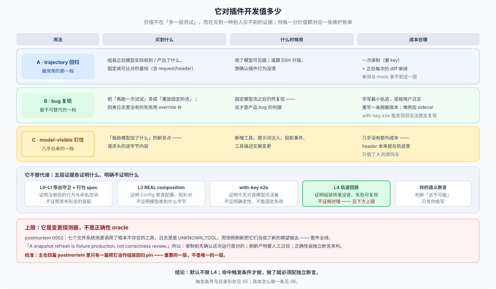

# 04 · 它对插件开发到底值多少：三样买到的东西、一条上限、一份代价

## 一句话

**它的价值不在「多一层测试」，而在「买到一种别人买不到的证据」：组装之后、模型真正看到和落盘的那份转录，并且能在无 key 的 CI 里逐字节复现。** 但这个价值有明确的上限和账单——上限是它只能告诉你「变了」，不能告诉你「对不对」；账单是维护一条有人重录、有人看 diff 的长期资产。

所以「值多少」的正确答案是分场景的，见下面三张账单。

## 一、三样买到的东西，三张账单

| 用法 | 买到什么 | 什么时候用 | 成本在哪 | 替代品能替代吗 |
|---|---|---|---|---|
| **A · trajectory 回归** | 「组装之后模型实际收到/产出了什么」的固定基线 | 改了模型可见面；或跟 DSH 升版想确认行为没漂 | 一次录制（要 key）+ 之后的 diff 审阅 | 单测、mock 都拿不到这一层 |
| **B · bug 复现** | 把「再跑一次试试」变成「重放固定的流」 | bug 固定流之后仍复现 → 是产品 bug | 手写最小轨迹或脱敏用户日志；难例要 override sidecar | with-key e2e 能发现但**不能稳定复现** |
| **C · model-visible 钉住** | `request/header` 就是「我给模型加了什么」的断言点 | 新工具、prompt 注入、投影事件、工具描述文案 | 几乎没有额外成本（header 已在轨迹里） | REAL composition 证明装配，不证明**发出去的字节** |

### A · trajectory 回归：把「一次真实运行」变成资产

`session.jsonl` 里是完整轨迹（见 [02](./02-what-a-trajectory-is.md)）。对插件作者，它解决三类问题：

- **「我的插件到底改了什么模型可见面？」** 跑一次，diff 两份 trajectory 的 `request/header`，比读代码可靠。
- **「升级 DSH 之后我的插件行为变了吗？」** 同一份轨迹在新版本上重放，比对结果——**这是主仓那套世代模型的私人缩小版**。
- **「用户报的现象我没法复现。」** 让他给你一段日志，重放它（脱敏要求见 [03](./03-what-a-plugin-can-reuse.md) 的 `live` / `authored` 一节）。

### B · bug 复现：固定流之后仍复现的，才是产品 bug

这是三样里**最不可替代**的一样。理由是判据本身就是回放给的：

- 固定模型流之后**仍复现** → 产品 bug，值得建轨迹；
- 固定模型流之后**不重现** → 是模型行为问题，轨迹帮不上，别浪费一条资产。

四类「日志里重建不出来」的失败（pre-2xx 抛 / post-2xx 抛 / 挂起 / 注入重试）由 `replay.override.json` 补——这四类恰恰是最难用 mock 稳定复现、又最容易在真实使用中出问题的。完整做法见 [06](./06-bug-reproduction-playbook.md)。

### C · model-visible 钉住：几乎白拿的一层

只要你的插件动过请求的任一部分，`request/header` 就是它的断言点。主仓的 pin 机制（`{{system}}` / `{{tools}}` + 两份 sidecar）是把体积搬去可审阅的位置；插件仓如果只有一两条轨迹，**直接保留 header 原文更省事**——反正 diff 也就那么几行。

## 二、它不替代谁：与其它证据层的分工

这是「值多少」最容易高估的地方。轨迹回放是[插件测试五台阶](../../_digested/test-strategy/08-plugin-testing.md)里最贵的一阶，**不是前面四阶的替代品**：

| 证据层 | 证明什么 | 明确不证明什么 |
|---|---|---|
| L0 导出守卫 | 真 Loader 不丢你的命名空间 | 任何运行时行为 |
| L1 行为 spec | 注册后的工具/服务行为、Config 分支 | 发布形态的装配 |
| L3 REAL composition | Config 是真配置；组装语义与实例拓扑 | 模型实际收到什么字节 |
| with-key e2e | **今天**对真模型还能工作 | 确定性（每次都是新采样） |
| **L4 轨迹回放** | 组装转录没变；失败可稳定复现 | **对错**（见下一节） |

一句话：**with-key e2e 证明「活着」，轨迹回放证明「没变」，两者互补、谁也替代不了谁。**

## 三、上限：它是**变更探测器**，不是**正确性 oracle**

这是主仓用一次真实的、**被快照套件放过**的回归换来的教训（[postmortem 0002](../../docs/postmortem/0002-js-expression-disabled-filesystem-tools.md)）：

> The snapshot suite passed because both outputs matched the refreshed fixtures; it proved deterministic replay of the regression rather than successful filesystem behavior. — 同文件:19

> The snapshot framework treated any deterministic transcript as valid behavior. — 同文件:34

> **A snapshot refresh is fixture production, not correctness review.** Semantic impossibilities such as a missing registered tool need assertions independent of the expected output. — 同文件:46

那次事故里，七个文件系统场景调用了根本不存在的工具，日志里是 `UNKNOWN_TOOL`，而**快照刷新把它们当成了新的期望输出**——套件全绿。原因和 [01](./01-why-dsh-needs-it.md) 提到的残余风险是同一个：

> One recorded session serving as both replay input and expected output can reproduce a bad model script consistently. — [2026-08-24 语料决策](../../.agents/notes/implemented/testing/2026-08-24-session-log-snapshot-corpus.md):78

**推论到插件仓**：如果你录制的是一次**已经坏了**的运行，你会把 bug 一致地固化下来，而且以后每次刷新都会继续为它背书。所以：

1. **录制之前先确认这次运行是对的**——用外部事实（文件真的写了吗？命令真的跑了吗？）验证，别信 agent 的自述；
2. **别让「刷新」变成「接受」**——刷新产物要人工过目；
3. 需要世界状态时，学主仓的 `workspace.expected/`：**提交一份独立于转录的终态树**，并让录制流程不许改写它（`snapshots/AGENTS.md:15`）。

**这一条决定了它的价值上限**，而且要说得再精确一点——回放能证明的是：

> 这份转录下的真实装配、循环、日志与已声明效果。

它**不**向模型发请求，因此**不**证明真实模型会遵守你新写的 persona 或 skill，也推不出任何未录制行为——「对今天的真模型还能工作」仍然归 with-key e2e 管。它是一台精密的「变了/没变」探测器，正确与否必须由你自己写的语义断言来判。主仓为此专门补了一条守卫——`dsh-session-snapshot` 拒绝把 `UNKNOWN_TOOL` 结果当成期望输出（`packages/test-support/session-snapshot/src/suite.ts:1347`）；**插件仓必须自己写这一层**，因为对你的插件来说「语义上不可能」长什么样只有你知道。

## 四、校准：主仓四篇 postmortem 里只有一篇用它当回归 pin

把主仓四篇 postmortem 摊开看，快照并不是万灵药：

| 事故 | 事后钉住它的回归面 | 是快照吗 |
|---|---|---|
| [0001](../../docs/postmortem/0001-acp-default-export-drops-inject.md) ACP 导出形态吃掉 `inject` | 真 Loader 子进程 e2e（`apps/cli/tests/profiles/acp/tests/acp.e2e.ts`，无需 key） | **否**——需要的是真子进程，不是回放会话 |
| [0002](../../docs/postmortem/0002-js-expression-disabled-filesystem-tools.md) `!!js` 让文件系统工具永久禁用 | `verify-cordis-config` 静态门 + 显式 overlay + `UNKNOWN_TOOL` 语义守卫 | **快照是共谋**，修的是守卫 |
| [0003](../../docs/postmortem/0003-web-agent-gui-feedback-loop.md) Web agent 用裸 Vite 糊弄验收 | 分层真路径 e2e（`apps/web/tests/vite-entry.e2e.ts` 等） | **否**——轨迹在这里是**事后取证的记录**，不是回归测试 |
| [0004](../../docs/postmortem/0004-landlock-partial-notice-misclassified-child-failures.md) Landlock 提示行被误判为沙箱失败 | 原生边界单测 + `snapshots/session/partial-landlock-child-failure/` | **是**——这条才是快照作为组装回归 pin 的样例 |

**四篇里只有一篇把快照当作组装回归 pin。** 但 0003 揭示了另一种价值：那条会话日志是复盘时**唯一能还原现场的证据**——trajectory 的**取证价值**，和它作为**回归测试的价值**，是两件事。插件仓同样两者都能用。

## 五、代价：搬不走的四样，加上你得自己安排的四件

### 搬不走的（结构性的，本来就属于主仓）

| 搬不走的 | 为什么 |
|---|---|
| 顶层 `snapshots/` 树的所有权 | 这棵树只放「以提交的会话 JSONL 为回放输入与期望输出」的测试；其他期望输出留在各自的 app / package / script 下（`snapshots/AGENTS.md:3`） |
| 「进程必须经 `dsh` CLI + shipped profile 启动」 | 不许新增应用入口、隐藏 CLI 模式或可执行场景驱动（`snapshots/AGENTS.md:5`） |
| 四面分工（headless / SDK / ACP / Web） | 它依赖主仓的四个 profile 各自拥有的行为证据（`docs/testing.md:14`）；插件仓通常只有一个入口 |
| corpus policy 与 corpus gate | 基线版本、保留角色上限（11）、V0 覆盖名单、多数派——这是给「一个仓库集中维护 210 个场景」用的配额制度（`scripts/session-snapshot-corpus-policy.ts:24`、`:25`、`:26`）；gate 只在 `test:snapshot` 里跑，并把 `*.snapshot.ts` 后缀保留给 7 个指定适配器 |
| `dsh-session-snapshot` 这个包 | 它 `import vitest`，**只能在 vitest run 内使用**（`packages/test-support/session-snapshot/src/index.ts:14`）——想复用得自己写驱动 |

**这不是「主仓小气」**：这些规则每一条都在解决「几百个场景、多个 owner、持续演进」带来的具体问题。一个只有三五条轨迹的插件仓照抄它们，得到的是没人维护的仪式。

### 你得自己安排的

- **录制花真钱。** 主仓的对策是 record / refresh 严格串行（`vitest.snapshot.config.ts:63`）、只有 record 读 `.env`（同文件`:33`）、CI 强制只读回放（`docs/testing.md:15`）。插件仓要自己定：轨迹多久重录一次、谁有权重录、重录的 diff 谁看。
- **夹具会随格式升版变成历史资产。** 好消息是回放器会在内存里把历史版本迁移到当前版本（`packages/test-support/llm-replay/src/index.ts:200`）；坏消息是主仓那套「加后继、不改前驱、保留世代」的政策**不适用于你**——你只有一条轨迹时，最省事的做法就是重录，而不是维护世代。
- **没有 `dsh session` 子命令可以查轨迹。** CLI 只注册了 `plugin` 一个子命令（`apps/cli/src/args.ts:188`）。可用的读取面是：Web 会话浏览器的会话头菜单「Download session log」或 `/export`（下载 `dsh-session-<id>.zip`，内部是 canonical 命名的 `.jsonl`）、模型侧工具 `session_search` / `session_event_search` / `session_trace` / `session_event_trace` / `session_event_read`、以及 `ctx.sessionQuery` 服务。**手工看的话，它就是 newline-delimited JSON，直接 diff 就行。**
- **并发子代理会绑错脚本。** 回放器按 first-call-order 把活会话绑到录制脚本上；如果你的插件涉及并发委派，这条轨迹不能当回归基线。

## 这一篇要你记住的

- 它买到的是**组装转录的确定性**，不是「更多测试」；三样用法各有一张账单。
- 它**不替代**前四阶证据，也不替代 with-key e2e——with-key 证明「活着」，它证明「没变」。
- **上限由 postmortem 0002 划定**：它是变更探测器，正确性判断必须由你的语义断言补上。
- 校准：四篇 postmortem 里只有一篇用它当回归 pin——**重要的一层，不是唯一的一层**。
- 代价分两半：语料治理搬不走（别抄），工程安排自己拍板（录制成本、世代、读取工具、并发）。

知道了价值与代价，接下来才是「那我到底建不建、怎么摆」——见 [05](./05-plugin-repo-organization.md)。
