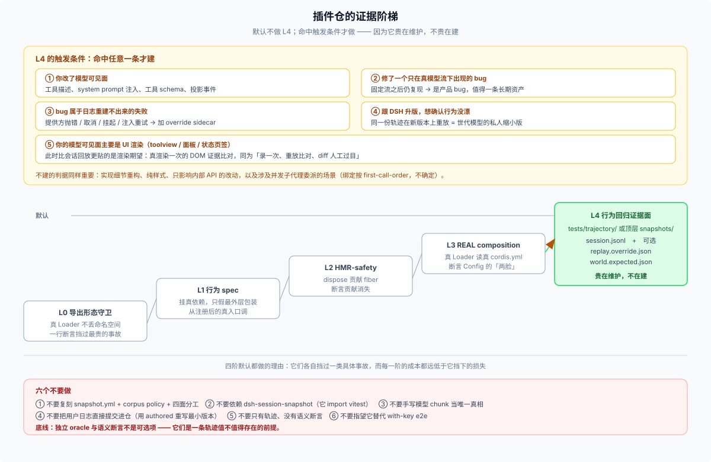

# 05 · 插件仓该怎么组织：一条按需启用的阶梯，而不是一棵照抄的树



## 一句话推荐

**不要复刻 `snapshots/` 这棵树，把轨迹当作测试目录下的一个自有子目录；默认不做，命中触发条件才做。** 前四阶证据（导出守卫 → 行为 spec → HMR → REAL composition）默认都做——其中 HMR 一阶只在你的插件确实向注册表贡献东西时才需要；第五阶「轨迹夹具」是**按需**的，因为它贵在维护（有人重录、有人看 diff），而不贵在建。

## 推荐阶梯

| 阶 | 证据 | 默认 | 成本 | 样板（主仓） |
|---|---|---|---|---|
| **L0** | 导出形态守卫：`expect('default' in mod).toBe(false)` + `unwrapExports` round-trip | **必做** | 一行断言 | `packages/lsp/tool-lsp/tests/load-path.spec.ts:14` |
| **L1** | 行为 spec：挂**真依赖服务**，只把最外层包装换成假体；从注册后的真入口调 | **必做** | 低 | `packages/todo/tool-todo/tests/tool-todo.spec.ts` |
| **L2** | HMR-safety：dispose 你的 fiber，断言贡献消失 | **必做**（有注册表贡献时） | 低 | `tool-todo/tests/projection.spec.ts` |
| **L3** | REAL composition：真 Loader 读临时 `cordis.yml` boot 你的插件，断言 Config 的**两脸**（模型可见措辞 + 接受行为） | **必做** | 中 | `tool-todo/tests/loader-composition.spec.ts` |
| **L4** | **轨迹夹具**：录制/手写一条 `session.jsonl`，无 key 回放比对 | **按需** | 中高（要维护） | `snapshots/session/deepseek-messages-invalid-tool-history/` |

L0–L3 的细节与为什么这么排，见 [_digested/test-strategy/08](../../_digested/test-strategy/08-plugin-testing.md) 的台阶模型和 [10 的检查单](../../_digested/test-strategy/10-plugin-testing-checklist.md)；本文只补 L4 的外部版本。

## L4 的触发条件（命中任意一条才建）

| 触发 | 为什么只有轨迹能覆盖 | 建什么 |
|---|---|---|
| 你改了**模型可见面**：工具描述、system prompt 注入、工具 schema、投影事件 | 只有真夹具能钉住「组装之后实际发出去的东西」（[01](./01-why-dsh-needs-it.md)） | 一条 **`live`** 轨迹 + 对 `request/header` 的断言 |
| 你修了一个**只在真模型流下出现**的 bug | 固定流之后仍复现 → 是产品 bug；这是唯一稳定的复现方式 | 一条 **`authored`** 轨迹 + 独立 oracle |
| bug 属于**日志重建不出来**的失败：提供方抛错 / 取消 / 挂起 / 注入重试 | 持久化的结算里根本没有这些信息 | `authored` 轨迹 + `replay.override.json`（见 [06](./06-bug-reproduction-playbook.md)） |
| 你在跟 DSH 版本升级，想确认插件行为没漂 | 同一份轨迹在新版本上重放 = 世代模型的私人缩小版 | 一条 `live` 轨迹 |

**不建的判据同样重要**：实现细节重构、纯 UI 样式、只影响内部 API 的改动、以及**涉及并发子代理委派**的场景（回放按 first-call-order 绑定脚本，并发会不确定——这是回放器自己声明的已知限制）。

## 目录形状（推荐）

```text
your-plugin-repo/
├── src/
├── cordis.yml                          # 你日常开发就有的配置
└── tests/
    ├── load-path.spec.ts               # L0
    ├── <plugin>.spec.ts                # L1
    ├── projection.spec.ts              # L2
    ├── loader-composition.spec.ts      # L3
    └── trajectory/                     # L4：命中触发条件才建
        ├── README.md                   # 每条轨迹：来源 / 触发什么 / 防什么 / 怎么重录
        ├── record.patch.yml            # 录制层 overlay：compression: none（见 03）
        ├── replay.patch.yml            # 回放层 overlay：关真 provider + 挂 llm-replay（见 03）
        ├── record.ts                   # 录制入口（要 key，人工跑，不进 CI）
        ├── replay.e2e.ts               # 无 key 回放 + 断言（进 CI）
        └── fixtures/
            ├── <feature-slug>/
            │   └── session.jsonl       # live：真跑一次留下
            └── <bug-slug>/
                ├── session.jsonl       # authored：手写的最小轨迹
                ├── replay.override.json  # 可选：抛 / 挂 / 重试
                └── world.expected.json   # 可选：独立于转录的外部事实
```

三条设计取舍：

- **`tests/trajectory/` 而不是顶层 `trajectories/`。** 它和其他测试同级，没人会误以为它是一套独立制度；主仓把语料放顶层是因为它有 210 个场景和多个 owner，你没有。
- **每条轨迹一个目录，`README.md` 说明意图。** 这是从主仓的 `snapshot.yml` 学来的最小替代——你不需要封闭 manifest 和门禁，但你需要「这条轨迹防什么」这句话，否则半年后没人敢删。
- **`world.expected.json` 是可选的、但很值。** 涉及文件系统/进程副作用的插件，一个 `{"confineCalls":1,"spawnCalls":0}` 式的计数器比任何转录文字都可靠（主仓样板：`snapshots/session/background-confinement-failure/workspace.expected/confinement-audit.json`）。

## 明确不要做的六件事

1. **不要复刻 `snapshot.yml` + corpus policy + 四面分工。** 那套是「一个仓库集中维护 210 个场景」的配额与所有权制度（[04](./04-what-its-worth.md)）。
2. **不要依赖 `@deepseek-ai/dsh-session-snapshot`。** 它 `import vitest`、面向语料级守卫；插件仓需要的是 `@deepseek-ai/dsh-llm-replay`（见 [03](./03-what-a-plugin-can-reuse.md)）。
3. **不要手写模型 chunk 当唯一真相。** 主仓明确否决过「手写 `llm.json`」，理由是这样夹具就不是系统的真实产物了（[01](./01-why-dsh-needs-it.md)）。手写应该只用于**最小复现场景**，不是常规做法。
4. **不要把用户日志直接提交进仓。** 用 `authored` 重写最小版本（[03](./03-what-a-plugin-can-reuse.md) 的 `live` / `authored` 一节）。
5. **不要只有轨迹、没有语义断言。** [04](./04-what-its-worth.md) 的事故就是「套件为回归背书」。
6. **不要指望它替代 with-key e2e。** 轨迹证明「组装转录没变」，不证明「对今天的真模型还能工作」。

## 和已有组织方案怎么衔接

- **[FAQ 13 专家插件 repo 组织](../13_expert-plugin-repo-organization/answer.md)** 回答的是「repo 放哪、DSH 源码怎么引、UI 怎么分层、spec 流程怎么走」；本篇是它没覆盖的一格：**测试证据里最贵的那一阶在外部仓怎么落地**。四个方案（A pinned submodule / B 树内 / C 纯外部 / D marketplace）都适用同一套 L0–L4 阶梯。
- **方案 B（长在 DSH monorepo 里）是一个例外**：如果你的插件最终要进主仓，那么 L4 应该**直接按主仓的形状写**——在 `snapshots/session/<你的场景>/` 下加场景、在 `cordis.snapshot.yml` 里用 patch 挂你的插件（主仓做法见 [08](../../_digested/test-strategy/08-plugin-testing.md) 台阶五与 [09](../../_digested/test-strategy/09-plugin-testing-playbook.md) 末节）。**过渡路径**是从 `tests/trajectory/` 的私有轨迹「翻译」成主仓场景，而不是把私有目录搬进去。
- **[_dsh_plugin_agent_ready_development](../../_dsh_plugin_agent_ready_development/README.md)** 讲的是独立插件仓如何沿用 DSH 的开发机制（意图 / owner / 证据 / 交付判断）；本篇可以看作它在**测试证据**这一格上的补充。

## 这一篇要你记住的

- **默认不做 L4**；命中四条触发条件之一才做。
- 目录是 `tests/trajectory/`，不是顶层语料树；一条轨迹一个目录 + 一页 README。
- 只依赖 `dsh-llm-replay`，不依赖 `dsh-session-snapshot`。
- 独立 oracle 和语义断言不是可选项——它们是这条轨迹值不值得存在的前提。
