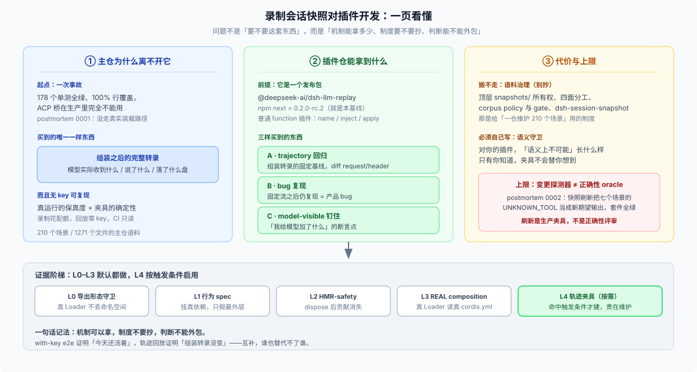

# 答案：先读哪一篇

## 一分钟版

**我原来的判断错了一半。** 「插件仓不需要这套东西」在**语料治理**上成立，在**机制**上不成立。

拆成三层看：

1. **主仓为什么需要它** —— 它买到的是「组装后的完整转录」这一种没有替代品的证据：模型实际收到了什么、说了什么、落了什么盘。起点是一次事故：一个 178 个单测全绿、100% 行覆盖、生产完全不能用的插件。
2. **插件仓能不能用** —— **能**。`@deepseek-ai/dsh-llm-replay` 是发布在 npm 上的普通插件（`next` 通道就是本基线 `0.2.0-rc.2`），它接受**未经投影的原始运行日志**。所以「真跑一次 → 留下 `session.jsonl` → 以后无 key 重放」这条路是通的。
3. **它对插件开发值多少** —— 值三样东西：**trajectory 回归**（组装转录的固定基线）、**bug 复现**（固定流之后仍复现的才是产品 bug）、**model-visible 钉住**（`request/header` 就是断言点）。但它有**一条上限和一份账单**：它是变更探测器、不是正确性 oracle（postmortem 0002 里快照套件曾为一次真实回归背书），而维护一条有人重录、有人看 diff 的长期资产要你自己安排。校准一下：**主仓四篇 postmortem 里只有一篇**把它当作组装回归 pin。

**所以推荐的答案不是「用」或「不用」，而是一条阶梯**：L0–L3（导出守卫 → 行为 spec → HMR → REAL composition）默认都做；**L4「行为回归证据面」（会话回放或渲染期望）按触发条件启用**，一个目录一个场景。落点不是并列选项：独立 agent 运营仓选顶层 `snapshots/` 证据面，`tests/trajectory/` 是它的降级形态；[05](./05-plugin-repo-organization.md) 的五条性质才是决定对错的东西。它**不是必需项，但也绝不是禁区**。

一句话记法：**机制可以拿，制度不要抄，判断不能外包。**

## 目录里都有什么

| 文件 | 种类 | 回答什么 |
|---|---|---|
| `question.md` | 入口 | 问题怎么冒出来的、结论先说、范围与基线 |
| `answer.md` | 入口 | 就是本页：一页图、一分钟版、阅读顺序、术语速查 |
| [01](./01-why-dsh-needs-it.md) | 正文 | **主仓为什么需要它**——事故起点、被否决的替代方案、与「model-visible ⟺ logged」的关系 |
| [02](./02-what-a-trajectory-is.md) | 正文 | **它到底是什么**——`session.jsonl` 的完整解剖、三种取用粒度、缺哪四类失败 |
| [03](./03-what-a-plugin-can-reuse.md) | 正文 | **插件仓能不能用**——三条硬证据、最小可用设置、四个坑、`live` / `authored` |
| [04](./04-what-its-worth.md) | 正文 | **值多少**——三张账单、与其它证据层的分工、上限（变更探测器 ≠ 正确性 oracle）、四篇 postmortem 校准、代价 |
| [05](./05-plugin-repo-organization.md) | 正文 | **该怎么组织**——L0–L4 阶梯、采用次序（六步）、触发条件、落点判决（形状二 > 形状一，方案 B 都不建）、五条不变量、六个不要做 |
| [06](./06-bug-reproduction-playbook.md) | 正文 | **bug 复现怎么做**——三档做法、override 的条目与文档形态、一个真实案例走查 |
| `reference.md` | 附录 | **全部出处**：每条结论对应的仓库路径、行号与实测口径；含「证据薄弱处」 |
| `figures/*.svg` | 素材 | 六张图，由对应页面嵌入（answer / 01 / 02 / 03 / 04 / 05 各一张） |

## 按什么顺序读

**按顺序读是最省力的路径**，每一步都为下一步铺垫：

| 顺序 | 读哪一篇 | 它回答的问题 |
|---|---|---|
| 1 | [01 主仓为什么需要它](./01-why-dsh-needs-it.md) | 这东西到底买到了什么？为什么别的手段填不上？ |
| 2 | [02 它是 trajectory 吗](./02-what-a-trajectory-is.md) | 一份录制里有什么、缺什么？我能按什么粒度取用？ |
| 3 | [03 插件仓能不能用](./03-what-a-plugin-can-reuse.md) | 我能不能用？最小设置长什么样？ |
| 4 | [04 值多少](./04-what-its-worth.md) | 值不值得？买了什么、付什么、上限在哪？ |
| 5 | [05 该怎么组织](./05-plugin-repo-organization.md) | 我到底该建还是不建？先建哪种？放哪更好？ |
| 6 | [06 bug 复现 playbook](./06-bug-reproduction-playbook.md) | 决定要建了，具体怎么做一条？ |
| — | [reference.md 全部出处](./reference.md) | 想核对原文、或想知道某个数字怎么数出来的 |

**只想知道「我要不要建」的话，读 03 + 04 + 05 就够了**（04 判断价值，05 的触发条件表是决策点）。01 和 02 是「为什么」与「是什么」；06 是动手时的手册。

## 术语速查

| 词 | 白话 |
|---|---|
| **snapshot（快照）** | 这里特指「录制会话回放」：真跑一次，把持久化的会话日志提交进仓，以后无 key 回放比对 |
| **trajectory** | 本文用它指 `session.jsonl` 这份完整轨迹：turn/step 边界、模型收到的请求头、模型流、每次工具调用与结果 |
| **fixture（夹具）** | 就是那份 `session.jsonl`；它同时是**回放输入**和**期望输出** |
| **projected / complete** | 夹具每一行要么省略 `seq`/`time` 包络（projected，主仓提交的形态），要么都带（complete，原始运行日志）——**不能混**。两种形态都接受 |
| **`replay.override.json`** | 补充 sidecar：表达日志里重建不出来的四类失败（pre-2xx 抛 / post-2xx 抛 / 挂起 / 注入重试）；条目三种、文档两种 |
| **`recording: live` / `authored`** | live = 真跑采集；authored = 手写最小轨迹（**不会被重新录制覆盖**） |
| **pin（header pin）** | 由某个场景独占拥有的 prompt / schema sidecar，避免几十条巨型 JSON 反复重写 |
| **`DSH_SNAPSHOT_FILE` / `_OVERRIDE` / `_CHILD_FILES`** | 回放器找夹具的环境变量；也可以用插件 `config` 的 `file` / `overrideFile` / `childFiles`（这是插件读的全部 env 面） |
| **`compression: 'none'`** | 从持久化 root 直接取日志时**必须**打开的设置：会话日志默认是 `zstd` 压缩的，而回放器只读明文 JSONL |
| **model-visible ⟺ logged** | 根 `AGENTS.md` 的不变量：任何到达模型请求的东西都必须能从会话日志重建 |
| **corpus policy** | 主仓的语料配额制度（基线版本、保留角色上限、V0 覆盖名单）——**插件仓不要抄** |
