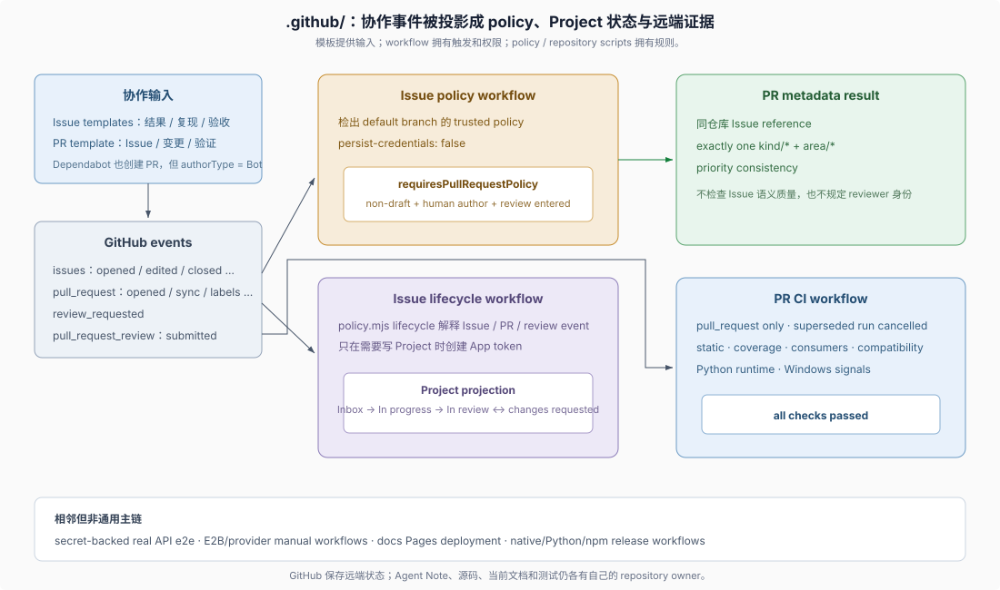

# Advanced 02 · `.github/` automation（仓库自动化）

## 一句话

`.github/` 是开发流程的远端执行面：模板收集意图，trusted policy（可信策略）校验进入 review 的 PR，lifecycle workflow（生命周期工作流）推进 Project 状态，PR CI 调用仓库脚本建立远端证据。它既不替代 Agent Note，也不决定实现细节。

> Decide whether the human-review policy applies to a PR: `return !isDraft && !automated && (reviewRequestCount > 0 || reviewCount > 0)`.
>
> — DSH [`.github/issue-management/policy.mjs` 的 `requiresPullRequestPolicy()`](../../.github/issue-management/policy.mjs)。这里的条件说明 policy 管的是“已经进入 review 的人类作者 PR”，不是所有 PR，也不是 reviewer 身份。



## 1. 模板固定协作输入

`.github/ISSUE_TEMPLATE/` 提供五种原生 Issue Type：`Idea / Feature / Bug / Research / Task`。Feature、Bug 和 Task 模板分别要求可观察结果、复现与预期，或明确交付物；共同重点是验收和测试证据，而不是内部类名或函数清单。

`.github/pull_request_template.md` 把同仓库 Issue 引用、变更摘要和验证命令放进 PR body。模板是写作入口，真正的强制范围由 policy 代码决定。

## 2. human-review policy 的精确条件

`requiresPullRequestPolicy()` 返回：

```js
const automated = authorType === 'Bot' || authorType === 'App'
return !isDraft && !automated && (reviewRequestCount > 0 || reviewCount > 0)
```

只有满足该条件时，`validatePullRequest()` 才要求：

- 至少引用一个同仓库 Issue；
- 恰好一个允许的 `kind/*`；
- 至少一个 `area/*`；
- 最多一个 `p0` 至 `p3`，解决型 PR 与所解决 Issue 的最高优先级一致；
- 不使用 legacy、未知 `kind/*` 或 Issue-only 的 `source/*` 标签。

这个名字容易产生两种误读。它约束的是**人类作者 PR 在进入 review 后的 metadata**，不表示每个 PR 都要有 Issue，也不规定语义 reviewer 必须是人。Draft、Bot 和 App PR 不进入这段校验；非平凡仓库变更仍独立受 Agent Note 规则约束。

## 3. policy workflow 使用默认分支的可信实现

`.github/workflows/issue-policy.yml` 监听 PR 打开、编辑、同步、重开、标签、ready、review request 和 review submit 等事件。Job 不执行 PR head 中的 policy，而是检出 repository default branch 的 `.github/issue-management/policy.mjs`，并禁用 checkout credentials 持久化。

这把“待校验输入”和“执行校验的代码”分开：PR 可以改变未来的 policy，但当前 run 使用默认分支的可信版本解释 PR metadata。

## 4. Issue、PR 与 Project 是事件驱动状态机

`.github/workflows/issue-lifecycle.yml` 把 Issue、PR 和 review 事件交给同一个 `policy.mjs lifecycle` 入口。配置中的状态顺序是：

```text
Inbox → Backlog → Ready → In progress → In review → Done / No action
```

核心自动转换是：Issue 打开进入 `Inbox`；解决该 Issue 的 PR 开始实施时推进到 `In progress`；`review_requested` 推进到 `In review`；由 lifecycle app 写入的 `In review` 收到 `changes_requested` 时退回 `In progress`；Issue 关闭原因决定 `Done` 或 `No action`。普通 approved/commented review 不创建可写 Project token，只有需要改变状态的事件才执行写入步骤。

这套自动化只推进自己拥有的转换，不覆盖所有手工 Project 决策。`Backlog`、`Ready` 等状态仍可由项目管理过程设置。

## 5. PR CI 消费仓库拥有的检查

`.github/workflows/ci.yml` 只监听 `pull_request`，新 head 会取消同一 ref 的旧 run。Workflow 负责 runner、权限、并发、缓存和 job 聚合；实际检查集合由 `package.json` 与 `scripts/run-gates.ts` 的顶层命令拥有。

当前拓扑把 Node 24 static、coverage、snapshot/artifact consumers、Node 兼容性、Python SDK/runtime 和 Windows 信号分开。`all checks passed` 聚合 required jobs；native Windows 是独立信号，`.github/AGENTS.md` 明确说明 Wine job 才是该聚合中的 blocking Windows check。完整检查路由见 [`04-gates-and-local-checks.md`](./04-gates-and-local-checks.md)。

真实 API e2e 使用独立 workflow 和 secrets 条件，E2B 与其它 provider e2e 还要求手动 dispatch。它们为适用变更提供真实 provider 证据，不是无凭据 PR CI 的通用替代。

## 6. 自动 PR 和发布流程属于相邻分支

Dependabot 按 npm、Python `uv` 和 GitHub Actions 三个 ecosystem 创建依赖 PR，并预置 `kind/dependency` 与 `area/infra`；Bot 作者身份使它不进入 human-review policy 的强制范围，但仍触发普通 PR CI。

文档部署、native/Python/npm release 和发布验证也住在 `.github/workflows/`。它们解释“合并后的产物怎样发布”，但不属于每次代码变更的 Issue → PR 主链；专题只在改动触及 built/release path 时把它们纳入相关证据。

## 证据入口

- DSH [`.github/AGENTS.md`](../../.github/AGENTS.md)：PR CI 中 Wine 与 native Windows 信号的阻塞关系。
- DSH [Issue templates](../../.github/ISSUE_TEMPLATE/) 与 [PR template](../../.github/pull_request_template.md)：作者被提示提供哪些意图、验收、Issue 关联和验证信息。
- DSH [Issue management policy](../../.github/issue-management/policy.mjs)：PR metadata 适用条件、Issue 校验和 Project 状态转换函数。
- DSH [Issue policy workflow](../../.github/workflows/issue-policy.yml)：哪些 PR 事件触发 policy，以及为什么检出默认分支的可信实现。
- DSH [Issue lifecycle workflow](../../.github/workflows/issue-lifecycle.yml)：哪些 Issue、PR 和 review 事件可以写 Project 状态。
- DSH [PR CI workflow](../../.github/workflows/ci.yml)：PR runner、权限、并发、job 依赖与 required 聚合。
- DSH [Dependabot configuration](../../.github/dependabot.yml)：自动依赖 PR 的 ecosystem 与预置 labels。
