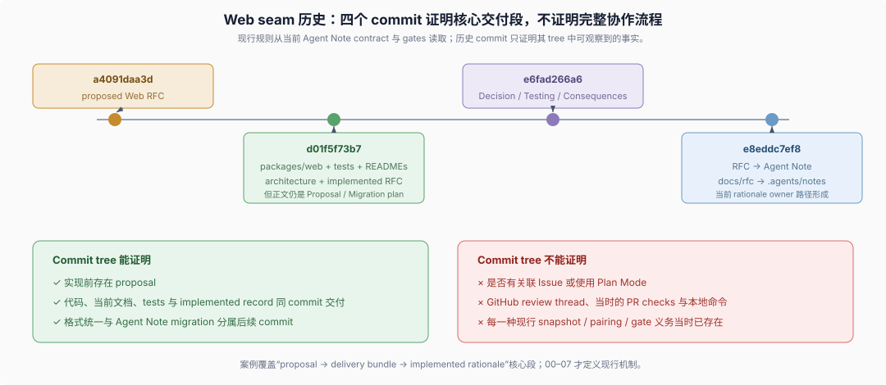

# Advanced 08 · Historical evidence（历史证据）的边界

## 一句话

Web capability seam（Web 能力 seam）的 git 历史直接证明了“提案 → 代码/文档/测试交付 + implemented 记录”这一核心段；它没有仓库内证据证明对应 Issue、Plan Mode、GitHub review 或当时运行的 checks，不能被当作现行全流程的完整样本。

> The model-facing API must stay stable while backends change. [...] Providers do not register tools. Providers register capabilities.
>
> — DSH Web capability seam Agent Note 的 [“Problem”](../../.agents/notes/implemented/architecture/2026-06-24-web-capability-seam.md#problem) 与 [“Decision”](../../.agents/notes/implemented/architecture/2026-06-24-web-capability-seam.md#decision)。这两句给出案例真正拥有的设计问题和已交付决定；git 历史只用来核对它在各 commit 中处于什么状态。



## 1. 四个 commit 各自提供什么证据

| commit | 可观察变更 | 能证明 |
|---|---|---|
| `a4091daa3d` | 新增 proposed Web seam RFC，并登记 proposed 索引 | 实现前存在一份仓库内提案 |
| `d01f5f73b7` | RFC 移到 implemented；新增 `packages/web/**`、tests、README，并更新 architecture/package map | 代码、当前文档、行为测试和 implemented 记录在同一 commit 交付 |
| `e6fad266a6` | 统一 RFC 格式，把 `Proposal/Tests/Risks` 改成 `Decision/Testing/Consequences` | 现行 implemented skeleton 的正文改写发生在独立格式变更中 |
| `e8eddc7ef8` | `docs/rfc/**` 迁到 `.agents/notes/**` 并改名 Agent Note | 当前记录路径和术语来自后续 corpus migration |

## 2. 实现 commit 还不符合现行 Note 格式

`d01f5f73b7` 确实把 proposed RFC 移到 implemented 并将 status 改为 implemented，但正文仍保留：

```text
## Proposal
## Tests
## Migration plan
## Risks
```

`e6fad266a6` 才把它改写成 implemented 记录的现在式 skeleton。现行 `verify-agent-note-format` 会拒绝只移动路径和 status 的做法；这个历史差异说明案例不能反推“当时已经执行现行规则”。当前规则应从 `.agents/notes/README.md` 和 verifier 读取。

## 3. 核心交付段的文件证据

`d01f5f73b7` 同时包含：

- `packages/web/web` 的 capability definition 与 tests；
- Exa、Perplexity 和 local fetch providers 的 source、README 与 tests/e2e；
- model-facing `tool-web` consumer 的 source、README、integration/load-path/tool tests；
- `docs/architecture.md` 与 `packages/README.md` 更新；
- proposed RFC 到 implemented RFC 的 move。

这组文件足以支持“交付 bundle 同时更新实现、当前文档、行为证据和决定记录”，但不能证明每一种现行 required evidence 都已经存在。例如现行 product-visible snapshot 义务、Agent Note triplet 和格式 gate 是别处拥有的当前规则。

## 4. 明确缺失的证据

| 流程问题 | 这个 git 样本能否回答 |
|---|---|
| 是否有 Issue 固定验收 | 不能；Issue 不在 repository git tree |
| 是否使用 Plan Mode | 不能；没有相关 session log |
| 是否经过 GitHub semantic review | 不能；review thread 不在 commit tree |
| push 前运行了哪些命令 | 不能；commit 不记录本地 command evidence |
| 哪些 CI jobs 通过 | 不能；需要对应 GitHub run 状态 |
| 是否完成代码、README、architecture、tests 和 decision record 的共同交付 | 能；同一 commit tree 可核对 |
| 当前 Web seam 的 authoritative rationale 在哪里 | 能；现行 Agent Note 路径可核对 |

## 5. 现行记录

当前文件位于 [`.agents/notes/implemented/architecture/2026-06-24-web-capability-seam.md`](../../.agents/notes/implemented/architecture/2026-06-24-web-capability-seam.md)，使用 `Agent Note` 标题、`Status: implemented`、`Decision`、`Testing`、`Alternatives considered` 和 `Consequences`。它是当前 rationale owner；旧 commit 只用于解释记录怎样到达现行位置。

## 复核命令

```sh
git show a4091daa3d -- docs/rfc/README.md docs/rfc/proposed/architecture/2026-06-24-web-capability-seam.md
git show --stat d01f5f73b7
git show d01f5f73b7:docs/rfc/implemented/architecture/2026-06-24-web-capability-seam.md
git show e6fad266a6:docs/rfc/implemented/architecture/2026-06-24-web-capability-seam.md
git show e8eddc7ef8 --name-status
```

## 证据入口

- DSH [当前 Web seam Agent Note](../../.agents/notes/implemented/architecture/2026-06-24-web-capability-seam.md)：现行 rationale、三角色职责、provider selection 和稳定 tool schema 决定。
- DSH [Agent Note 规则](../../.agents/notes/README.md)：当前 lifecycle 与 implemented 正文格式，用来解释历史文件为什么不能充当现行规范。
- DSH [Web packages](../../packages/web/)：Definition、Providers、Consumer、README 与 tests 的当前源码落点。
